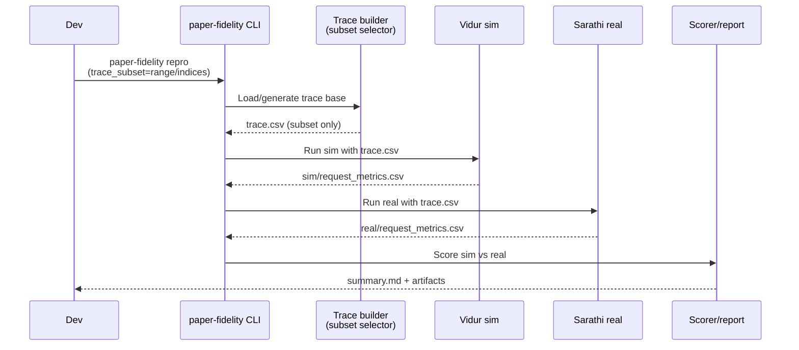

# Plan: Trace subset selection for paper-fidelity runs

> Archived: 2026-01-09 (completed, superseded, or no longer needed)

## HEADER
- **Purpose**: Add a trace subset feature so paper-fidelity workflows can process only a selected subset of requests (by index range `[begin,end)` or discrete indices) for both Vidur simulation and real inference.
- **Status**: Archived (done/no longer needed)
- **Date**: 2026-01-07
- **Archived**: 2026-01-09
- **Dependencies**:
  - `specs/002-reproduce-vidur-paper-fidelity/tasks.md` (paper-fidelity workflow scope and acceptance criteria)
  - `src/gpu_simulate_test/paper_fidelity/traces.py` (canonical trace schema + validation)
  - `src/gpu_simulate_test/cli/paper_fidelity.py` (trace generation + sim/real orchestration + capacity search)
  - `src/gpu_simulate_test/vidur_ext/sim_runner.py` (Vidur sim entrypoint consumes `trace.csv`)
  - `src/gpu_simulate_test/real_bench/backends/sarathi_paper_fidelity_backend.py` (Sarathi trace replay consumes `trace.csv`)
  - `configs/paper_fidelity/*.yaml` (Hydra config surface)
  - `tests/unit/test_paper_fidelity_trace.py` (trace unit tests)
  - `tests/manual/test_paper_fidelity_*_smoke.py` (paper-fidelity smoke runs)
- **Target**: Developers iterating on paper-fidelity and profiling workflows who need fast, targeted repro runs.

---

## 1. Purpose and Outcome

Success looks like:

- A user can specify a subset of trace rows via either:
  - **Index range**: `[index_begin, index_end)` (Python slicing semantics, end-exclusive), or
  - **Discrete indices**: a list like `[0, 3, 10, 42]` (only for **untimed** traces; see Q&A).
- `paper-fidelity trace` produces a `trace.csv` containing only the selected rows.
- `paper-fidelity repro` uses the same subset for **both**:
  - Vidur simulation (`sim/request_metrics.csv`), and
  - Real inference (`real/request_metrics.csv`) + dynamic capacity search runs (when enabled).
- Subsetting is deterministic and fails fast with actionable errors for invalid ranges/indices.
- For timed traces, range-subsetting rebases `arrived_at` so the first selected request starts at `0.0` (all other `arrived_at` values are offset by the same amount).
- Subsetting never mutates or overwrites the source trace inputs; it only affects the derived `trace.csv` written under the paper-fidelity output directories.

Non-goals:

- Subsetting by `request_id` (this feature is explicitly by row index, per request).
- Reordering trace rows (the subset preserves original order to keep `arrived_at` monotonic).

---

## 2. Implementation Approach

### 2.1 High-level flow

1. **Define a small “trace subset” config schema** in Hydra (default: no subsetting).
2. **Implement a single helper** (in `paper_fidelity/traces.py`) that:
   - Selects rows by `[begin,end)` for all trace types,
   - Selects rows by `indices` only for **untimed** traces (those where we will generate `arrived_at` inside the workflow),
   - Preserves original row order (sort indices ascending),
   - Validates bounds, uniqueness, non-empty result,
   - For timed traces with range selection: rebase `arrived_at` by subtracting the first selected row’s `arrived_at` so the subset starts at `0.0`,
   - Returns a new dataframe (no in-place mutation of the input), and callers always write outputs to a new `trace.csv` path (never back to the source file),
   - Re-validates the resulting trace (`arrived_at` monotonic, token bounds).
3. **Wire the helper into all trace producers**:
   - `paper-fidelity trace` output trace
   - `paper-fidelity repro` trace generation step
   - `paper-fidelity repro` dynamic capacity search base trace (so capacity and real replay run the same subset)
4. **Add tests**:
   - Unit tests for selection semantics + validation errors.
   - A small manual smoke override example for faster local runs.

### 2.2 Sequence diagram (steady-state usage)

---

## 3. Files to Modify or Add

- **`configs/paper_fidelity/repro.yaml`** Add a `trace_subset` block with defaults (kind=`all`).
- **`configs/paper_fidelity/trace.yaml`** Add a `trace_subset` block with defaults (kind=`all`).
- **`configs/paper_fidelity/scenario/llama2_7b_arxiv.yaml`** (optional) Add commented examples showing how to override subset for debugging (do not change defaults).
- **`src/gpu_simulate_test/paper_fidelity/traces.py`** Add `TraceSubsetSpec` (or equivalent) + `apply_trace_subset(df, ...)`.
- **`src/gpu_simulate_test/cli/paper_fidelity.py`** Thread `trace_subset` from Hydra config into:
  - `_run_trace(...)` (trace subcommand),
  - `_run_repro(...)` trace generation path,
  - dynamic `capacity_search` base trace creation (so capacity search uses the same subset).
- **`tests/unit/test_paper_fidelity_trace.py`** Add unit tests for subset selection (range, indices, error cases).
- **`specs/002-reproduce-vidur-paper-fidelity/quickstart.md`** (optional) Add one example command showing subset overrides for fast iteration.

---

## 4. TODOs (Implementation Steps)

- [ ] **Define config schema** Add a Hydra `trace_subset` section with `kind: all|range|indices`, plus `begin/end` and `indices` fields; document precedence rules and the constraint that `indices` is only valid for untimed trace sources (reject it for timed traces with an actionable error).
- [ ] **Implement subset helper** Add `apply_trace_subset(df, *, kind, begin, end, indices)` in `src/gpu_simulate_test/paper_fidelity/traces.py` with strict input validation and deterministic selection.
- [ ] **Integrate into `paper-fidelity trace`** Apply the subset after trace creation and before writing `trace.csv`.
- [ ] **Integrate into `paper-fidelity repro` (trace build)** Apply the subset to the generated trace used by both Vidur sim and Sarathi real runs.
- [ ] **Integrate into dynamic capacity search** Apply the subset once to the “base” trace before adding Poisson arrivals, so the full dynamic pipeline stays consistent.
- [ ] **Add unit tests** Cover:
  - range selection (begin=0, end=n, interior slices),
  - indices selection (sorted/unsorted input, duplicates),
  - rejecting indices selection for timed traces (actionable error),
  - timed-trace range selection rebases `arrived_at` to start at 0 (and preserves monotonicity),
  - invalid inputs (out of bounds, begin>=end, empty selection).
- [ ] **Add a manual example** Update one manual smoke test or quickstart snippet to show a safe subset override (e.g. first 32 requests) for fast local runs.

---

## 5. Questions and Answers

### Q: Is it subsetting the original trace (like `extern/tracked/vidur/data/processed_traces/arxiv_summarization_stats_llama2_tokenizer_filtered_v2.csv`) or subsetting the timed trace (those have `arrived_at`, generated in dynamic simulation)?

A: The subset is applied to the **canonical** `trace.csv` representation that paper-fidelity uses end-to-end, but the allowed subset modes depend on whether `arrived_at` is produced inside the workflow:

- If the trace source is **untimed** (length-only; e.g. `trace_source.kind=vidur_processed_lengths_csv`), the subset is applied **before** arrival-time generation so we select a subset of request rows (prefill/decode token counts), then generate `arrived_at` (static or Poisson) **for that subset**. Both `range` and `indices` are allowed here.
- If the trace source is **already timed** (e.g. `trace_source.kind=trace_csv` or `legacy_workload_dir`), only `range` is allowed. Discrete indices are rejected because selecting non-contiguous rows implicitly creates “time gaps”, and the correct behavior is ambiguous (keep gaps vs compress time vs rebase/renormalize). If you need discrete selection on a timed trace, pre-process the `trace.csv` outside this framework into a new, self-consistent timed `trace.csv`, then run with `trace_source.kind=trace_csv`.
- For timed traces, applying a `range` subset rebases `arrived_at` so the first selected request starts at `0.0`, and all following requests are offset by the same amount. This keeps inter-arrival gaps within the selected window unchanged while making the subset self-contained.
