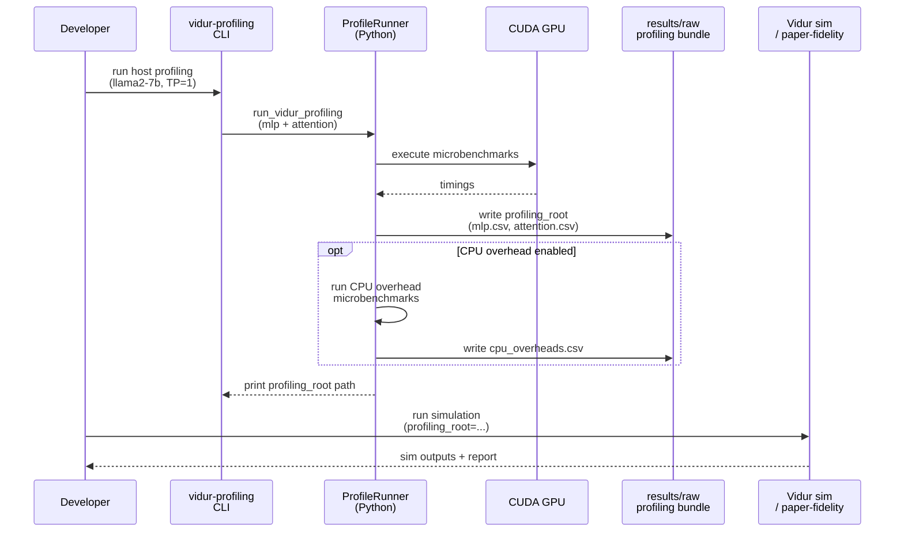

# Plan: Vidur host profiling for LLaMA2-7B

## HEADER

- **Purpose**: Produce Vidur-compatible *compute* profiling CSVs (MLP + attention) for `meta-llama/Llama-2-7b-hf` on the current machine’s GPU, using Sarathi-Serve–aligned settings, and store the curated bundle under `results/raw/vidur-profiling/` for reuse in simulations and sim-vs-real comparisons. Optionally support CPU overhead profiling, but keep it disabled by default to match the Vidur paper’s evaluation practice.
- **Status**: Done
- **Date**: 2026-01-07
- **Dependencies**:
  - `context/instructions/prep-dev-env.md`
  - `context/summaries/vidur-kb/about-vidur-gpu-simulator.md`
  - `context/summaries/vidur-kb/about-vendor-provided-data.md`
  - `context/plans/qa-plan-vidur-profiling-llama2-7b.md`
  - `extern/tracked/vidur/docs/profiling.md`
  - `extern/tracked/vidur/vidur/profiling/mlp/main.py`
  - `extern/tracked/vidur/vidur/profiling/attention/main.py`
  - `extern/tracked/vidur/vidur/profiling/cpu_overhead/main.py`
  - `src/gpu_simulate_test/vidur_ext/profile_runner.py`
  - `src/gpu_simulate_test/vidur_ext/profiling_bundle.py`
  - `src/gpu_simulate_test/vidur_ext/vidur_profiling_cpu_overhead_main.py`
  - `src/gpu_simulate_test/cli/vidur_profiling_bundle.py`
  - `configs/vidur_profiling/bundle.yaml`
  - `scripts/run_vidur_profiling_llama2_7b.sh`
  - `pyproject.toml`
  - `tests/manual/test_vidur_profiling_bundle_smoke.py`
- **Target**: Developers (including future maintainers) generating host-calibrated Vidur profiling bundles.

---

## 1. Purpose and Outcome

### 1.1 Task Summary

- Target model: `meta-llama/Llama-2-7b-hf` (single-GPU first: TP=1, PP=1).
- Generate Vidur compute profiling artifacts similar to `extern/tracked/vidur/data/profiling/compute/...` (MLP + attention), without requiring network profiling.
- Use Sarathi-Serve–aligned attention settings (e.g., explicit `--attention_backend`, decode/prefill selection, batch size range) and record all knobs in provenance.
- Write curated outputs to `output.dir` (required), and optionally write intermediate/debug outputs to `output.cache_dir` (optional; defaults to `<output.dir>/cache`).
- Provide a convenience runner (`pixi run vidur-profiling`) that chooses a timestamped `output.dir` under `results/raw/vidur-profiling/llama2-7b/<scheduler-name>/<run_id>/`.
- Optionally support CPU overhead profiling (scheduler/runtime overhead modeling) via config, but keep it disabled by default to match the paper.

### 1.2 Success Criteria

- A single command can produce a Vidur-compatible profiling root (`output.dir`) containing:
  - `data/profiling/compute/<device>/meta-llama/Llama-2-7b-hf/mlp.csv`
  - `data/profiling/compute/<device>/meta-llama/Llama-2-7b-hf/attention.csv`
  - `profiling_meta.json` recording the exact commands + environment snapshot.
- If CPU overhead profiling is enabled, it additionally contains:
  - `data/profiling/cpu_overhead/<network_device>/meta-llama/Llama-2-7b-hf/cpu_overheads.csv`
- The produced profiling root can be used as `scenario.vidur.profiling_root=...` for `paper-fidelity repro` or other Vidur simulation entrypoints, and the run succeeds without touching `extern/tracked/vidur/`.
- Intermediate outputs are treated as debug-only and live under `output.cache_dir` (default `<output.dir>/cache`, but can be set to any location like `tmp/...`).

---

## 2. Implementation Approach

### 2.1 High-level flow

1. Confirm the Pixi environment and CUDA are available (`torch.cuda.is_available()` must be `True`).
2. Reuse the existing Vidur profiling runner (`src/gpu_simulate_test/vidur_ext/profile_runner.py`) as the core microbenchmark executor.
3. Add a thin “bundle export” layer that:
   - Runs profiling with explicit, Sarathi-Serve–aligned knobs (attention backend, decode/prefill selection, batch size range).
   - Writes the *curated* profiling root into the required `output.dir` (`data/profiling/...` plus `profiling_meta.json`).
   - Writes intermediates (full profiling outputs) under `output.cache_dir` (defaults to `<output.dir>/cache`).
   - Optionally runs CPU overhead profiling if `profiling.cpu_overhead.enabled=true`.
4. Provide a dedicated CLI + Hydra config to standardize repeatability (so callers do not rely on “run from the right CWD”).
5. Add a bounded GPU manual smoke test that:
   - Runs profiling with `max_tokens` capped (e.g., 256).
   - Asserts `mlp.csv` and `attention.csv` exist under the created profiling root.
6. Document the new command and the output layout in the existing Vidur data notes.

### 2.2 Sequence diagram (steady-state usage)

---

## 3. Files to Modify or Add

- **`configs/vidur_profiling/bundle.yaml`**: Hydra config for the bundle exporter (`output.dir` required, `output.cache_dir` optional).
- **`src/gpu_simulate_test/cli/vidur_profiling_bundle.py`**: CLI entrypoint (Hydra-driven) that produces a profiling bundle and prints the profiling root path.
- **`src/gpu_simulate_test/vidur_ext/profiling_bundle.py`**: Bundle exporter (creates `profiling_meta.json`, stages curated CSVs).
- **`src/gpu_simulate_test/vidur_ext/profile_runner.py`**: Profiling runner (MLP + attention + optional CPU overhead) that stages a Vidur-compatible `data/profiling/...` tree.
- **`src/gpu_simulate_test/vidur_ext/vidur_profiling_cpu_overhead_main.py`**: Patched CPU-overhead profiling wrapper used by the runner.
- **`scripts/run_vidur_profiling_llama2_7b.sh`**: Convenience script that sets a timestamped `output.dir` under `results/raw/...` and invokes the CLI.
- **`pyproject.toml`**: Pixi task entrypoint (`vidur-profiling`).
- **`tests/manual/test_vidur_profiling_bundle_smoke.py`**: Manual smoke test for the bundle exporter (GPU required).
- **`context/summaries/vidur-kb/about-vendor-provided-data.md`**: Documents vendor data, output layout, and profiling workflows (compute/network/optional CPU overhead).

---

## 4. TODOs (Implementation Steps)

- [x] **Define bundle layout** Standardize `output.dir` contents (`data/profiling/...` + `profiling_meta.json`) and provide a convenience default layout via `scripts/run_vidur_profiling_llama2_7b.sh`.
- [x] **Add profiling knobs** Support attention knobs (backend, decode/prefill/both, batch size range, block size) and optional CPU overhead knobs in `VidurProfileInputs`.
- [x] **Implement bundle exporter** Implement the exporter that runs profiling, writes curated CSVs + `profiling_meta.json`, and uses `output.cache_dir` for intermediates.
- [x] **Add CLI command** Add `python -m gpu_simulate_test.cli.vidur_profiling_bundle` (Hydra-driven) to run bundle export.
- [x] **Add Pixi task** Add `pixi run vidur-profiling` as a convenience entrypoint (scripted output path).
- [x] **Add manual smoke test** Add a bounded GPU smoke test that validates `mlp.csv`, `attention.csv`, and `profiling_meta.json`.
- [x] **Document usage** Update vendor-data notes and the plan Q&A doc with output paths, knobs, and default behavior (compute-only by default; CPU overhead optional).
