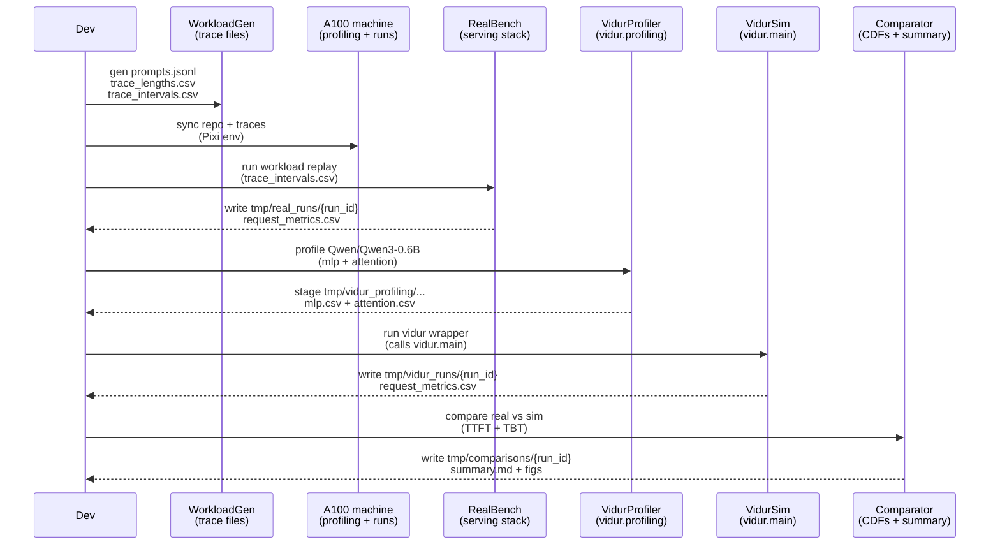

# Plan: Compare Vidur vs real Qwen3 A100 timing

## HEADER
- **Purpose**: Implement a reproducible workflow to (1) simulate Qwen3 inference timing on A100 via the Vidur Python package in the Pixi env and (2) compare Vidur’s latency distributions against real A100 timing under the same request-length + arrival process.
- **Status**: Draft
- **Date**: 2025-12-30
- **Dependencies**:
  - `context/hints/howto-compare-vidur-vs-real-qwen3-a100-timing.md`
  - `context/hints/howto-run-basic-vidur-simulation.md`
  - `context/instructions/prep-dev-env.md`
  - `pyproject.toml` (Pixi deps: editable `vidur`)
  - `extern/tracked/vidur/vidur/config/model_config.py` (model config patterns)
  - `extern/tracked/vidur/vidur/config/config.py` (CLI + predictor input file templates)
  - Optional (for system-level ground truth + CPU overhead profiling): `extern/tracked/sarathi-serve/`
- **Target**: Contributors running end-to-end simulator-vs-real comparisons and iterating on fidelity.

---

## 1. Purpose and Outcome

Success looks like:

- A single “workload spec” (prompt set → tokenized lengths + a deterministic arrival schedule) that can drive both (a) a real A100 benchmark run and (b) a Vidur trace-driven simulation.
- A Vidur run that works from repo root using the **installed editable `vidur` package** (via `pixi run ...`), without requiring `cd extern/tracked/vidur`.
- Standardized output artifacts for both sides:
  - **Real**: `tmp/real_runs/<run_id>/request_metrics.csv` with TTFT and per-token latencies (TBT).
  - **Vidur**: `tmp/vidur_runs/<run_id>/request_metrics.csv` (and plots/trace).
  - **Comparison**: `tmp/comparisons/<run_id>/summary.md` and CDF/percentile plots.

## 2. Implementation Approach

### 2.1 High-level flow

1. **Define the workload input format**
   - Store prompts (JSONL) and desired decode lengths.
   - Generate `trace_lengths.csv` with Vidur-required columns (`num_prefill_tokens`, `num_decode_tokens`).
   - Generate `trace_intervals.csv` (deterministic) so real + sim share identical arrivals (prefer trace intervals over “two independent Poisson draws”).

2. **Collect “real” timing on A100**
   - Run a serving stack (preferred: Sarathi-Serve for closest scheduler assumptions; fallback: a single-process `transformers` harness clearly labeled as such).
   - Drive it with the same `trace_intervals.csv` schedule and prompts.
   - Record per-request:
     - `arrival_ts`, `first_token_ts` → **TTFT** (arrival→first token)
     - token timestamps → **TBT / TPOT proxy** (inter-token delay distribution)
     - request metadata (prefill/decode tokens, prompt id, seed, precision, batch knobs)

3. **Make Vidur recognize `Qwen/Qwen3-0.6B` without modifying Vidur source**
   - Implement a local `BaseModelConfig` subclass for Qwen3-0.6B (values sourced from `models/qwen3-0.6b/source-data/config.json`).
   - Provide a small wrapper entrypoint that imports the subclass (registering it) and then calls `vidur.main.main()`.

4. **Generate Vidur profiling data for Qwen3 on A100 (one-time per model/SKU/topology)**
   - Use the installed package modules:
     - `python -m vidur.profiling.mlp.main --models Qwen/Qwen3-0.6B --num_gpus 1`
     - `python -m vidur.profiling.attention.main --models Qwen/Qwen3-0.6B --num_gpus 1`
   - Normalize outputs into a local profiling root (machine-local, not committed), e.g.:
     - `tmp/vidur_profiling/compute/a100/Qwen/Qwen3-0.6B/mlp.csv`
     - `tmp/vidur_profiling/compute/a100/Qwen/Qwen3-0.6B/attention.csv`
   - Optional (higher fidelity): add CPU overhead profiling (requires `sarathi` installed); otherwise start by running Vidur with CPU overhead modeling disabled.

5. **Run Vidur simulation from repo root**
   - Use the wrapper entrypoint (so the Qwen3 model config is available).
   - Use trace-driven lengths and intervals.
   - Point Vidur’s predictor input file templates at `tmp/vidur_profiling/...` via CLI flags (avoid relying on `./data/profiling/...` relative to CWD).
   - Write outputs to `tmp/vidur_runs/<run_id>/` via `--metrics_config_output_dir`.

6. **Compare distributions**
   - Parse:
     - Real: `request_metrics.csv` + token timestamp series (or derived per-token deltas).
     - Vidur: `request_metrics.csv` and the relevant timing series (TTFT proxy + decode token time proxy).
   - Generate:
     - Percentile tables (P50/P90/P99) for TTFT and per-token latencies.
     - CDF plots and a short discrepancy summary (shape differences + likely causes).

### 2.2 Sequence diagram (steady-state usage)

## 3. Files to Modify or Add

- **`src/gpu_simulate_test/vidur_ext/qwen3_model_config.py`** Add `BaseModelConfig` subclass for `Qwen/Qwen3-0.6B` (no changes inside `extern/tracked/vidur`).
- **`src/gpu_simulate_test/vidur_ext/run_vidur.py`** Wrapper entrypoint that imports local model configs, then calls `vidur.main.main()`.
- **`src/gpu_simulate_test/workloads/`** Modules for prompt+trace generation (lengths + deterministic arrival intervals).
- **`src/gpu_simulate_test/real_bench/`** Real benchmark client (and optional minimal server harness) that records TTFT + per-token timestamps to a standard CSV.
- **`src/gpu_simulate_test/analysis/compare_vidur_vs_real.py`** Comparison script: percentile tables + plots + summary markdown.
- **`pyproject.toml`** (Optional) Add Pixi editable dep for `sarathi` (`extern/tracked/sarathi-serve`) if CPU overhead profiling and/or Sarathi serving is selected as the real stack.
- **`context/hints/howto-compare-vidur-vs-real-qwen3-a100-timing.md`** Update commands to use `pixi run` + wrapper entrypoint, and document the local profiling root + run output locations.

## 4. TODOs (Implementation Steps)

- [ ] **Lock the comparison “slice”** Choose the initial fixed setup (A100 80GB, TP=1, PP=1, replicas=1, FP16 vs BF16, scheduler knobs) and document it in the runbook.
- [ ] **Define workload spec and schema** Decide the canonical files (e.g., `prompts.jsonl`, `trace_lengths.csv`, `trace_intervals.csv`) and the exact columns needed for real + sim ingestion.
- [ ] **Implement trace generator** Add a script/module that tokenizes prompts with the Qwen3 tokenizer at `models/qwen3-0.6b/source-data` and writes `trace_lengths.csv` plus deterministic `trace_intervals.csv`.
- [ ] **Add Qwen3 model config registration** Implement `Qwen/Qwen3-0.6B` as a `BaseModelConfig` subclass in-repo and a wrapper entrypoint that guarantees it is imported before Vidur parses CLI args.
- [ ] **Create profiling runner** Add a helper that runs `vidur.profiling.*` modules and stages outputs into `tmp/vidur_profiling/compute/a100/{MODEL}/(mlp|attention).csv`.
- [ ] **Decide CPU overhead strategy** Either (a) add/install `sarathi` and run Vidur CPU overhead profiling to produce the expected CSV layout, or (b) explicitly run Vidur with CPU overhead modeling disabled for the first comparison iteration.
- [ ] **Implement Vidur simulation runner** Add a wrapper script that runs Vidur from repo root with trace lengths/intervals and predictor input file templates pointing at `tmp/vidur_profiling/...`, writing to `tmp/vidur_runs/<run_id>/`.
- [ ] **Implement real benchmark runner** Add a client that replays the same intervals, collects TTFT + per-token timestamps, and writes `tmp/real_runs/<run_id>/request_metrics.csv`.
- [ ] **Implement comparison + reporting** Add an analyzer that loads both runs, computes percentile tables, renders CDFs, and writes `tmp/comparisons/<run_id>/summary.md`.
- [ ] **Run the first end-to-end experiment** Produce a first report, then iterate on alignment gaps (precision, early EOS/stop behavior, scheduler knobs, warmup handling).
