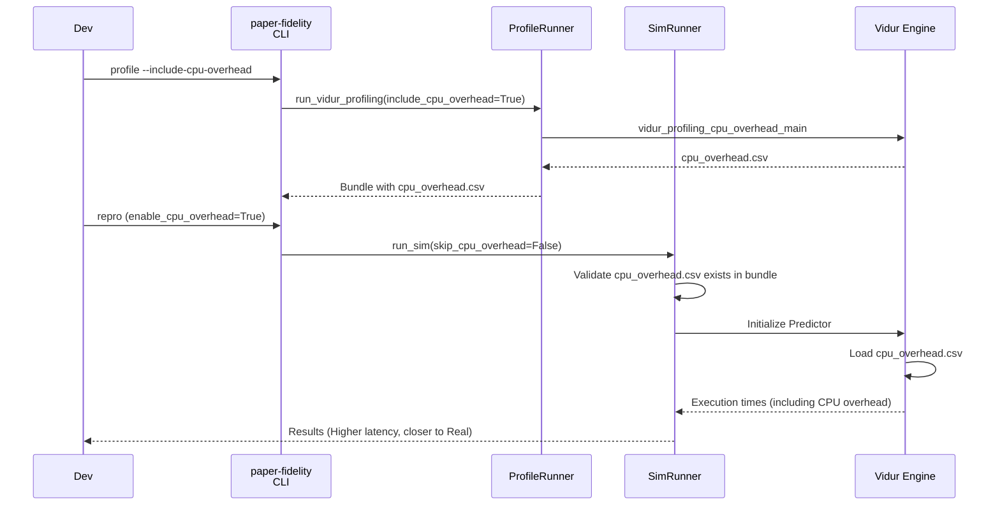

# Plan: Enable Vidur CPU Overhead Modeling

## HEADER
- **Purpose**: Enable CPU overhead profiling and modeling in the paper-fidelity workflow to reduce the simulation-vs-real fidelity gap for small models (e.g., LLaMA2-7B).
- **Status**: Draft
- **Date**: 2026-01-09
- **Dependencies**:
  - `context/issues/issue-vidur-sim-underpredicts-sarathi-real.md` (Problem statement and root cause)
  - `src/gpu_simulate_test/vidur_ext/profile_runner.py` (Existing profiling logic)
  - `src/gpu_simulate_test/vidur_ext/sim_runner.py` (Existing simulation logic)
  - `extern/tracked/vidur/vidur/config/config.py` (Vidur configuration reference)
- **Target**: Developers working on simulator fidelity and profiling.

---

## 1. Purpose and Outcome

Success looks like:

- **Profiling**: The `paper-fidelity profile` command can optionally run Vidur's CPU overhead profiler (`vidur_profiling_cpu_overhead_main`) and include the resulting `cpu_overhead.csv` in the generated profiling bundle.
- **Simulation**: The `paper-fidelity repro` (and `vidur-sim`) command can optionally set `skip_cpu_overhead_modeling=False`, allowing Vidur to use the profiled CPU overhead data.
- **Outcome**: A "gap reproduction" run for LLaMA2-7B using this new capability should show a reduced error rate (closer to the ~12% reported in the paper, down from ~25%), as CPU overheads are no longer zeroed out.

Non-goals:
- Optimizing Sarathi's actual CPU overheads (that is a separate performance engineering task).
- Enabling this by default for all models (we stick to the paper's default of skipping it unless explicitly requested for fidelity).

---

## 2. Implementation Approach

### 2.1 High-level flow

1.  **Profiling Update**:
    - Add a `--include-cpu-overhead` flag to `paper-fidelity profile`.
    - Update `profile_runner.py` to respect this flag, run the Vidur CPU overhead profiler, and stage the output to `data/profiling/cpu_overhead/...`.
    - Ensure `profiling_meta.json` records whether CPU overhead was profiled.

2.  **Simulation Update**:
    - Add a configuration option (e.g., `scenario.vidur.enable_cpu_overhead_modeling`) to the simulation configs.
    - Update `sim_runner.py` to map this config to Vidur's `skip_cpu_overhead_modeling` (inverted).
    - Add validation: If modeling is enabled, ensure the profiling root actually contains `cpu_overhead.csv`; fail fast if missing.

3.  **Verification**:
    - Run a full cycle: Profile (with overhead) -> Sim (with overhead) -> Compare with Real.

### 2.2 Sequence diagram (steady-state usage)

---

## 3. Files to Modify or Add

- **`configs/paper_fidelity/profile.yaml`**: Add `include_cpu_overhead: false` default.
- **`configs/compare_vidur_real/vidur/a100.yaml`** (and others): Ensure `skip_cpu_overhead_modeling` can be injected via Hydra.
- **`src/gpu_simulate_test/cli/paper_fidelity.py`**:
    - Expose `include_cpu_overhead` in `profile` command.
    - Expose `enable_cpu_overhead` in `repro` command (or derive from scenario config).
- **`src/gpu_simulate_test/paper_fidelity/profiling.py`**: Pass the flag to `profile_runner`.
- **`src/gpu_simulate_test/vidur_ext/profile_runner.py`**: Ensure `run_vidur_profiling` correctly triggers the CPU overhead profiler and copies the file.
- **`src/gpu_simulate_test/vidur_ext/sim_runner.py`**:
    - Read `skip_cpu_overhead_modeling` from config.
    - Add validation to check for `cpu_overhead.csv` if modeling is enabled.

---

## 4. TODOs (Implementation Steps)

- [ ] **Config Updates**
    - [ ] Add `include_cpu_overhead` to `configs/paper_fidelity/profile.yaml`.
    - [ ] Add `enable_cpu_overhead_modeling` to `configs/paper_fidelity/scenario/llama2_7b_arxiv.yaml` (default false).

- [ ] **Profiling Implementation**
    - [ ] Update `src/gpu_simulate_test/cli/paper_fidelity.py` to accept `--include-cpu-overhead`.
    - [ ] Update `src/gpu_simulate_test/paper_fidelity/profiling.py` to pass this flag to `profile_runner`.
    - [ ] Verify `src/gpu_simulate_test/vidur_ext/profile_runner.py` logic (already appears to support it, just needs testing/verification).

- [ ] **Simulation Implementation**
    - [ ] Update `src/gpu_simulate_test/vidur_ext/sim_runner.py` to accept `enable_cpu_overhead_modeling`.
    - [ ] Implement validation: if `enable_cpu_overhead_modeling` is True, check `profiling_root/data/profiling/cpu_overhead/...` exists.
    - [ ] Map `enable_cpu_overhead_modeling=True` -> `skip_cpu_overhead_modeling=False` in Vidur config.

- [ ] **Verification**
    - [ ] T001: Run `paper-fidelity profile --include-cpu-overhead` and verify `cpu_overhead.csv` is created.
    - [ ] T002: Run `paper-fidelity repro` with `enable_cpu_overhead_modeling=True` using the new bundle and verify it runs without error.
    - [ ] T003: Compare `request_execution_plus_preemption_time` from T002 vs a baseline run; T002 should be higher.

---

## 5. Q&A

**Q: Where will the cpu overhead profiling data stored?**
A: It will be stored in `data/profiling/cpu_overhead/{NETWORK_DEVICE}/{MODEL}/cpu_overheads.csv` within the generated profiling bundle (which itself lives under `results/raw/vidur-profiling/` or `tmp/` during generation).

**Q: Will you also do gpu profiling as well?**
A: Yes, **GPU profiling (MLP and Attention)** is already performed by default in the `paper-fidelity profile` command and will continue to be included. The implementation plan preserves the existing GPU profiling steps while enabling the optional CPU overhead step.
