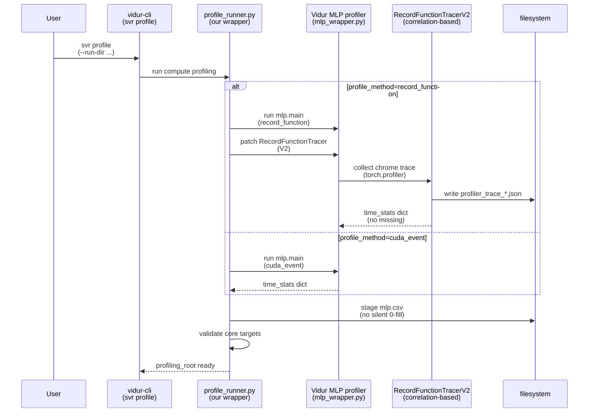

# Plan: Fix Vidur MLP profiling missing CUDA driver-launched kernels

## HEADER

- **Purpose**: Make Vidur MLP compute profiling robust when kernels are launched via CUDA driver APIs (`cuda_driver` / `cuLaunchKernel`), so `mlp.csv` no longer contains missing timings that get silently staged as `0.0` and bias simulation.
- **Status**: Draft
- **Date**: 2026-01-16
- **Dependencies**:
  - `context/issues/known/issue-vidur-mlp-profiling-misses-cuda-driver-kernels.md`
  - `src/gpu_simulate_test/vidur_ext/profile_runner.py` (staging + current `fillna(0.0)` behavior)
  - `src/gpu_simulate_test/vidur_ext/vidur_profiling_mlp_main.py` (Vidur profiling wrapper entrypoint)
  - `extern/tracked/vidur/vidur/profiling/utils/record_function_tracer.py` (current attribution logic; `cuda_runtime` only)
  - `extern/tracked/vidur/vidur/profiling/mlp/mlp_wrapper.py` (uses `RecordFunctionTracer`)
  - `extern/tracked/vidur/vidur/execution_time_predictor/sklearn_execution_time_predictor.py` (consumes `mlp.csv` targets)
- **Target**: Developers maintaining `vidur-cli` / paper-fidelity profiling pipelines and anyone validating sim-vs-real fidelity.

---

## 1. Purpose and Outcome

Success looks like:

1) Running `vidur-cli svr profile` (or `paper-fidelity profile`) produces a profiling root whose staged `mlp.csv` has **no missing (NaN/empty) values** for core compute targets (at least the `*.median` columns Vidur trains on).
2) The profiling pipeline no longer silently converts “missing measurement” into “0 ms” for core ops (no more unintentional underprediction).
3) When profiling still produces missing values (unexpected), the pipeline fails fast (strict mode) with a clear message and a remediation path (e.g., switching MLP profiling method).
4) A small unit test validates the new trace attribution logic for both `cuda_runtime` and `cuda_driver` launch paths.

## 2. Implementation Approach

### 2.1 High-level flow

1. Implement an improved record-function trace attribution algorithm that:
   - collects correlation ids from both `cuda_runtime` and `cuda_driver` “launch-ish” events under each `user_annotation`
   - sums durations of correlated GPU execution events (`cat == "kernel"`, plus `gpu_memset`/`gpu_memcpy` where relevant)
   - deduplicates correlation ids to avoid double-counting
2. Integrate the improved tracer into our profiling wrapper without editing the Vidur submodule:
   - monkey-patch `vidur.profiling.mlp.mlp_wrapper.RecordFunctionTracer` to the new implementation when `--profile_method record_function` is used
3. Add a config/flag surface to select MLP profiling method (`record_function` vs `cuda_event`) and record it in profiling provenance.
4. Tighten staging behavior in `profile_runner.py`:
   - stop blanket `fillna(0.0)` for all `time_stats.*` columns
   - validate core `*.median` targets; fail in strict mode if any are missing or “suspiciously zero-heavy”
   - allow explicit opt-in to “fill missing with 0” only for debugging (warn loudly)
5. Validate end-to-end with the known problematic case (LLaMA2-7B, A100, TP=1) and ensure the produced profiling root no longer exhibits missing→0 artifacts.

### 2.2 Sequence diagram (steady-state usage)

## 3. Files to Modify or Add

- **`src/gpu_simulate_test/vidur_ext/profile_runner.py`**: add `mlp_profile_method` plumb-through; remove blanket `fillna(0.0)`; add validation + clear errors.
- **`src/gpu_simulate_test/vidur_ext/vidur_profiling_mlp_main.py`**: apply monkey-patch when using `record_function`; optionally expose `--profile_method` defaults/notes.
- **`src/gpu_simulate_test/vidur_ext/record_function_tracer_v2.py`** (new): implement correlation-based GPU-time attribution supporting `cuda_driver` launches.
- **`tests/unit/test_vidur_record_function_tracer_v2.py`** (new): unit tests using minimal synthetic traces (runtime + driver launch cases).
- **`context/issues/known/issue-vidur-mlp-profiling-misses-cuda-driver-kernels.md`**: link to this plan once implemented and record the chosen fix (method + guardrails).

## 4. TODOs (Implementation Steps)

- [ ] **Design tracer v2** Specify which `cat` values count as GPU execution (`kernel`, `gpu_memcpy`, `gpu_memset`) and which count as launch (`cuda_runtime`, `cuda_driver`), plus dedupe rules.
- [ ] **Implement tracer v2** Add `src/gpu_simulate_test/vidur_ext/record_function_tracer_v2.py` with correlation-based attribution and parity with Vidur’s output schema.
- [ ] **Wire tracer into MLP profiling** Monkey-patch `vidur.profiling.mlp.mlp_wrapper.RecordFunctionTracer` from `vidur_profiling_mlp_main.py` when `record_function` mode is selected.
- [ ] **Add MLP profile method knob** Extend `VidurProfileInputs` and `profile_runner.py` to pass `--profile_method` into the Vidur MLP profiler; default to the safer option decided in this plan (likely `cuda_event` until tracer v2 is proven).
- [ ] **Remove silent NaN→0 staging** Replace `fillna(0.0)` with validation for core targets; provide a debug-only escape hatch if needed.
- [ ] **Add unit tests** Create small synthetic chrome-trace JSON fixtures to assert:
  - `cuda_runtime` + correlated `kernel` produces non-zero samples
  - `cuda_driver` + correlated `kernel` produces non-zero samples
  - unrelated kernels are not counted (no shared correlation id)
- [ ] **Manual verification run** Re-run profiling for `llama2_7b` on A100 (TP=1) and confirm staged `mlp.csv` has no core-target NaNs/empties and ensure no “0-heavy” artifacts at non-trivial token counts.
- [ ] **Update issue report** Add a short “Fix status” note and point to this plan; include before/after summary counts for missing timings.

