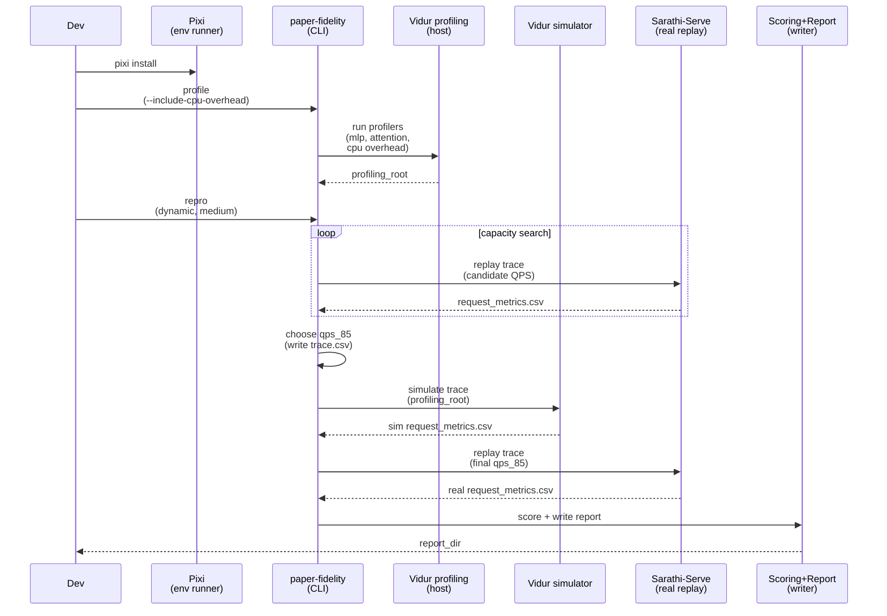

# Plan: Run paper-fidelity (dynamic, medium) for LLaMA2-7B

## HEADER

- **Purpose**: Run the end-to-end paper-fidelity workflow for a dynamic workload at medium scale (first 500 requests), producing a scored Vidur-vs-Sarathi report and the underlying artifacts needed to debug fidelity gaps.
- **Status**: Draft
- **Date**: 2026-01-12
- **Dependencies**:
  - `context/summaries/vidur-kb/tutorials/in-depth-vidur-with-llama2-7b.md`
  - `specs/002-reproduce-vidur-paper-fidelity/quickstart.md`
  - `specs/002-reproduce-vidur-paper-fidelity/qa-002-sim-vs-real-llama2-7b.md`
  - `configs/paper_fidelity/repro.yaml`
  - `configs/paper_fidelity/scenario/llama2_7b_arxiv.yaml`
  - `configs/paper_fidelity/workload/dynamic.yaml`
  - `configs/paper_fidelity/scale/medium.yaml`
  - `src/gpu_simulate_test/cli/paper_fidelity.py`
  - `src/gpu_simulate_test/paper_fidelity/capacity.py`
  - `src/gpu_simulate_test/paper_fidelity/paths.py`
- **Target**: Developers running Vidur simulation vs Sarathi-Serve real replays on this host (GPU required).

---

## 1. Purpose and Outcome

This plan runs the paper-fidelity experiment in “dynamic + medium” mode for the default LLaMA2-7B scenario (`llama2_7b_arxiv`). “Medium” means the first 500 requests of the scenario’s trace source after max-token filtering; “dynamic” means Poisson arrivals at an operating QPS derived from a capacity search.

Success looks like:

- A report exists at `results/reports/<UTC-YYYY-MM-DD>/paper_fidelity/llama2_7b_arxiv/` with `summary.md`, `run_meta.json`, `scores.json`, and `figs/`.
- The run writes canonical inputs/outputs under `tmp/paper_fidelity/`:
  - `tmp/paper_fidelity/traces/llama2_7b_arxiv/trace.csv` + `trace_meta.json` (should include the chosen QPS and `scale=medium`).
  - `tmp/paper_fidelity/runs/llama2_7b_arxiv/sim/request_metrics.csv` (Vidur) and `.../real/request_metrics.csv` (Sarathi).
  - `tmp/paper_fidelity/runs/llama2_7b_arxiv/capacity/capacity.json` (capacity QPS and `qps_85` operating point).
- If CPU overhead modeling is enabled for Vidur (`scenario.vidur.skip_cpu_overhead_modeling=false`), the report’s profiling block shows CPU overhead `status: ok` (not `missing`/`placeholder`/`error`).

Assumption: we are extending the existing LLaMA2-7B case study (scenario `llama2_7b_arxiv`). If you want a different scenario/model/TP/PP, copy the same flow but switch the `--scenario` and ensure you have a matching profiling root and model assets.

## 2. Implementation Approach

### 2.1 High-level flow

1. Prepare the repo (submodules + Pixi env), pin the GPU, and ensure model assets are present.
2. Generate a host profiling root for Vidur (include CPU overhead profiling if you want host-fidelity dynamic results).
3. Run `paper-fidelity repro` with `--workload dynamic --scale medium`, pointing Vidur at the host profiling root and enabling CPU overhead modeling.
4. Validate the run by checking (a) the report summary and (b) the generated artifacts under `tmp/paper_fidelity/`.
5. If runtime is too long, narrow the dynamic capacity-search bounds/iters (the current implementation always runs capacity search for dynamic repro).

Key commands (expected to be run from repo root):

```bash
git submodule update --init --recursive
pixi install
```

```bash
# GPU pinning (preferred): set this once via repo-root .env
export GSIM_CUDA_VISIBLE_DEVICES=0
pixi run python -c "import torch; print(torch.__version__); print(torch.cuda.is_available(), torch.cuda.device_count())"
```

```bash
# Host profiling root for Vidur (recommended for “gap reproduction” fidelity claims).
# Captures MLP + attention and, with the flag, CPU overhead timings used by Vidur’s predictor.
pixi run paper-fidelity profile --scenario llama2_7b_arxiv --include-cpu-overhead
```

```bash
# Dynamic + medium experiment.
# Note: dynamic repro performs a capacity search and chooses qps_85 internally; workload.qps is not used here.
profiling_root="tmp/paper_fidelity/profiling_roots/llama2_7b_arxiv/<run_id>"
pixi run paper-fidelity repro \
  --scenario llama2_7b_arxiv \
  --workload dynamic \
  --scale medium \
  "scenario.vidur.profiling_root=$profiling_root" \
  "scenario.vidur.skip_cpu_overhead_modeling=false"
```

Optional (runtime control): tighten the capacity-search loop for dynamic workloads if needed:

```bash
pixi run paper-fidelity repro \
  --scenario llama2_7b_arxiv \
  --workload dynamic \
  --scale medium \
  "scenario.capacity_search.min_qps=1.0" \
  "scenario.capacity_search.max_qps=12.0" \
  "scenario.capacity_search.max_iters=4" \
  "scenario.vidur.profiling_root=$profiling_root" \
  "scenario.vidur.skip_cpu_overhead_modeling=false"
```

### 2.2 Sequence diagram (steady-state usage)



## 3. Files to Modify or Add

- **context/plans/plan-paper-fidelity-dynamic-medium.md**: Add this plan (runbook-style implementation steps).
- **tmp/paper_fidelity/profiling_roots/llama2_7b_arxiv/<run_id>/**: Generated Vidur profiling root (host-calibrated CSVs).
- **tmp/paper_fidelity/runs/llama2_7b_arxiv/capacity/**: Generated capacity-search artifacts (`capacity.json`, intermediate metrics).
- **tmp/paper_fidelity/traces/llama2_7b_arxiv/**: Generated canonical trace (`trace.csv`, `trace_meta.json`).
- **tmp/paper_fidelity/runs/llama2_7b_arxiv/sim/**: Generated Vidur sim outputs (`request_metrics.csv`, `vidur_raw/`, `run_meta.json`).
- **tmp/paper_fidelity/runs/llama2_7b_arxiv/real/**: Generated Sarathi real outputs (`request_metrics.csv`, `sarathi/`, `run_meta.json`).
- **results/reports/<UTC-YYYY-MM-DD>/paper_fidelity/llama2_7b_arxiv/**: Generated report artifacts (`summary.md`, `scores.json`, `run_meta.json`, `figs/`).

## 4. TODOs (Implementation Steps)

- [ ] **Initialize environment**: Run `git submodule update --init --recursive` and `pixi install`.
- [ ] **Pin GPU and sanity-check CUDA**: Set `GSIM_CUDA_VISIBLE_DEVICES=<gpu_id>` and verify `torch.cuda.is_available()` inside Pixi.
- [ ] **Verify model assets**: Ensure `models/llama2-7b-hf/source-data` exists (run model bootstrap if missing).
- [ ] **Generate host profiling root (with CPU overhead)**: Run `pixi run paper-fidelity profile --scenario llama2_7b_arxiv --include-cpu-overhead` and record the printed profiling root path.
- [ ] **Validate profiling inputs**: Confirm `cpu_overheads.csv` exists under `<profiling_root>/data/profiling/cpu_overhead/...` and is non-empty (avoid placeholder-like data).
- [ ] **Run dynamic + medium repro**: Run `pixi run paper-fidelity repro --scenario llama2_7b_arxiv --workload dynamic --scale medium ...` with `scenario.vidur.profiling_root=<profiling_root>` and `scenario.vidur.skip_cpu_overhead_modeling=false`.
- [ ] **Validate outputs**: Check `results/reports/<UTC-date>/paper_fidelity/llama2_7b_arxiv/summary.md` for:
  - CPU overhead status `ok` (when enabled),
  - A scores table populated for dynamic metrics,
  - Correct input paths pointing to `tmp/paper_fidelity/.../sim/request_metrics.csv` and `.../real/request_metrics.csv`.
- [ ] **Inspect capacity result**: Read `tmp/paper_fidelity/runs/llama2_7b_arxiv/capacity/capacity.json` and confirm `qps_85` is recorded; confirm the final dynamic `trace_meta.json` includes that QPS.
- [ ] **Triage if results look wrong**: If sim is consistently faster, re-check profiling root provenance and CPU overhead status; if the run is too slow, reduce `scenario.capacity_search.max_qps` and/or `scenario.capacity_search.max_iters` via Hydra overrides and rerun.
