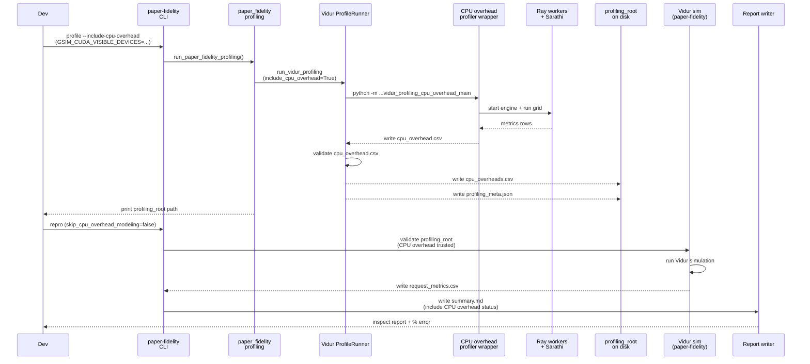

# Plan: Make paper-fidelity CPU overhead profiling real and enforceable (LLaMA2-7B)

## HEADER
- **Purpose**: Eliminate the persistent sim-vs-real underprediction for LLaMA2-7B caused by running Vidur CPU overhead modeling against placeholder inputs, by making CPU overhead profiling produce real data on this host and adding guardrails to prevent “CPU overhead enabled with dummy/untrusted CSVs”.
- **Status**: Draft
- **Date**: 2026-01-09
- **Dependencies**:
  - `context/issues/issue-paper-fidelity-llama2-7b-gap-persists-with-dummy-cpu-overheads.md`
  - `context/issues/issue-vidur-sim-underpredicts-sarathi-real.md`
  - `context/instructions/prep-dev-env.md`
  - `docs/manual/troubleshooting.md`
  - `specs/002-reproduce-vidur-paper-fidelity/qa-002-sim-vs-real-llama2-7b.md`
  - `tests/manual/generate_dummy_cpu_overhead.py`
  - `src/gpu_simulate_test/env_guard.py`
  - `src/gpu_simulate_test/vidur_ext/vidur_profiling_cpu_overhead_main.py`
  - `src/gpu_simulate_test/vidur_ext/profile_runner.py`
  - `src/gpu_simulate_test/vidur_ext/profiling_root.py`
  - `src/gpu_simulate_test/paper_fidelity/profiling.py`
  - `src/gpu_simulate_test/cli/paper_fidelity.py`
  - `src/gpu_simulate_test/paper_fidelity/report.py`
  - `extern/tracked/vidur/vidur/profiling/cpu_overhead/benchmark_runner.py`
- **Target**: Developers doing sim-vs-real fidelity work and host profiling (paper-fidelity workflow).

---

## 1. Purpose and Outcome

This plan assumes the primary blocker is that CPU overhead profiling is failing on this host (likely due to GPU visibility / Ray worker init issues), producing an empty `cpu_overhead.csv`, which leads developers to substitute dummy `cpu_overheads.csv` and still see a ~16–20% global underprediction.

Success looks like:

- `pixi run paper-fidelity profile --scenario llama2_7b_arxiv --include-cpu-overhead` produces a profiling root whose `data/profiling/cpu_overhead/.../cpu_overheads.csv` is **non-empty and non-degenerate**.
- `paper-fidelity repro` with `scenario.vidur.skip_cpu_overhead_modeling=false` refuses to run (or clearly warns) if the CPU overhead CSV is missing, empty, or clearly placeholder (e.g., constant-valued dummy data).
- Reports (`results/reports/.../summary.md`) explicitly state whether CPU overhead inputs are **profiled+trusted**, **missing**, or **untrusted** (with reason).
- A bounded manual smoke test exists to catch regressions (e.g., “CPU overhead profiling wrote an empty file but exit code was 0”).

Non-goals (for this plan):

- Optimizing Sarathi’s CPU overheads themselves.
- “Calibrating away” residual gaps via a global fudge factor before confirming we have real CPU overhead inputs.

## 2. Implementation Approach

### 2.1 High-level flow

1. **Make CPU overhead profiling fail fast on empty results**
   - Update the CPU overhead wrapper (`vidur_profiling_cpu_overhead_main.py`) so that if *all* benchmark runs fail (or produce zero result rows), it exits non-zero with a short diagnosis and pointers to Ray logs.

2. **Validate `cpu_overhead.csv` at the staging boundary**
   - In `profile_runner.py`, after running the profiler and before writing `cpu_overheads.csv`, validate that the generated `cpu_overhead.csv` is readable, has required columns, and has at least one row.
   - Convert pandas’ `EmptyDataError` / schema errors into actionable errors (GPU pinning, Ray worker logs path, and what to re-run).

3. **Validate `cpu_overheads.csv` at the consumption boundary**
   - Extend `validate_profiling_root()` so that when `skip_cpu_overhead_modeling=false`, it validates the *content* of `cpu_overheads.csv` (not only existence).
   - Add a “strict vs warn” knob so developers can intentionally use dummy data for debugging without silently producing misleading “fidelity” results.

4. **Expose bounded knobs for faster iteration**
   - Add `profiling.cpu_overhead.max_batch_size` (and optionally a validation mode) to `configs/paper_fidelity/profile.yaml`, plumb it through `paper_fidelity/profiling.py` into `VidurProfileInputs`.
   - This enables quick smoke runs (e.g., max batch size 16/32) while still exercising the full pipeline.

5. **Surface CPU overhead trust in reports**
   - Add a small “CPU overhead” sub-block under the “Profiling” section in `summary.md`, driven by metadata produced during profiling validation (trusted/untrusted/missing + details).

6. **Verify end-to-end on the host**
   - With a healthy GPU pin (via `.env` + `GSIM_CUDA_VISIBLE_DEVICES`), regenerate a profiling root with real CPU overheads and rerun `paper-fidelity repro` with CPU overhead modeling enabled.
   - If a material gap remains, capture additional provenance (Sarathi settings parity, backend/dtype/kernel path) and file a follow-up issue with evidence.

### 2.2 Sequence diagram (steady-state usage)

### 2.3 CPU overhead CSV validation rules (proposal)

Define a lightweight validator used both during profiling and simulation:

- **Must exist and parse**: fail with a friendly error if pandas cannot read it (`EmptyDataError`, missing headers).
- **Must be non-empty**: at least 1 row.
- **Must contain required keys**: at minimum `model_name`, `batch_size`, `tensor_parallel_degree`, and `ray_comm_time_mean`. (If Vidur schema changes, version-gate based on observed columns.)
- **Must be non-degenerate (strict mode)**: if there are 2+ distinct `batch_size` values, then at least one of the primary overhead metrics should have >1 unique value across rows; otherwise mark as “placeholder-like” with a warning that points at `tests/manual/generate_dummy_cpu_overhead.py`.

## 3. Files to Modify or Add

- **`src/gpu_simulate_test/vidur_ext/vidur_profiling_cpu_overhead_main.py`**: fail fast when profiling produces 0 rows; improve error summary so the failure mode is obvious (not “1-byte CSV”).
- **`src/gpu_simulate_test/vidur_ext/profile_runner.py`**: validate CPU overhead outputs before staging; convert empty/invalid CSVs into actionable exceptions; plumb `cpu_overhead_max_batch_size` from paper-fidelity config.
- **`src/gpu_simulate_test/vidur_ext/profiling_root.py`**: extend `validate_profiling_root()` to validate CPU overhead content (and optionally consult `profiling_meta.json` when present).
- **`src/gpu_simulate_test/paper_fidelity/profiling.py`**: add `profiling.cpu_overhead.max_batch_size` support and ensure the generated `profiling_meta.json` records CPU overhead status (path + trust/warnings).
- **`src/gpu_simulate_test/paper_fidelity/report.py`**: render CPU overhead status/warnings under the “Profiling” section.
- **`configs/paper_fidelity/profile.yaml`**: add CPU overhead batch-size + validation knobs (keep defaults conservative).
- **`context/instructions/prep-dev-env.md`**: document `.env` + `GSIM_CUDA_VISIBLE_DEVICES` (why required, how to choose a healthy subset).
- **`docs/manual/troubleshooting.md`**: add a concrete “empty cpu_overhead.csv” / “invalid device index” troubleshooting branch with recommended commands and environment variables.
- **`tests/manual/test_paper_fidelity_profile_smoke.py`**: add an optional mode that runs `--include-cpu-overhead` with a small batch-size cap and asserts `cpu_overheads.csv` is non-empty.
- **`src/gpu_simulate_test/vidur_ext/cpu_overhead_validation.py`** (new): shared validation helpers so profiling + simulation use identical rules and error messages.

## 4. TODOs (Implementation Steps)

- [ ] **Implement shared CPU overhead validator** Add `cpu_overhead_validation.py` with strict/warn modes and clear error messages.
- [ ] **Fail fast on empty profiling output** Update `vidur_profiling_cpu_overhead_main.py` to raise/exit non-zero when it would otherwise write an empty/no-header CSV.
- [ ] **Add staging-boundary validation** In `profile_runner.py`, validate `cpu_overhead.csv` before writing `cpu_overheads.csv`; catch pandas empty/schema errors and re-raise with actionable guidance.
- [ ] **Add consumption-boundary validation** In `profiling_root.py`, validate `cpu_overheads.csv` when `skip_cpu_overhead_modeling=false`, with a config knob to downgrade to warning when intentionally using dummy data.
- [ ] **Plumb CPU overhead profiling knobs** Extend `configs/paper_fidelity/profile.yaml` and `paper_fidelity/profiling.py` to support `profiling.cpu_overhead.max_batch_size` and `profiling.cpu_overhead.validation={strict,warn,off}`.
- [ ] **Annotate paper-fidelity reports** Update `paper_fidelity/report.py` so `summary.md` calls out whether CPU overhead inputs are trusted, missing, or placeholder-like.
- [ ] **Update developer docs** Add `.env`/GPU pinning guidance to `context/instructions/prep-dev-env.md` and expand `docs/manual/troubleshooting.md` for CPU overhead profiling failures.
- [ ] **Add a bounded manual smoke test** Extend `tests/manual/test_paper_fidelity_profile_smoke.py` (or add a new test) to validate CPU overhead profiling writes a non-empty, parseable CSV.
- [ ] **Host verification run** Re-run `paper-fidelity profile --include-cpu-overhead` and then `paper-fidelity repro` with `scenario.vidur.skip_cpu_overhead_modeling=false`, and record whether the sim-vs-real gap decreases materially; if not, open a follow-up issue with residual gap evidence and provenance.

