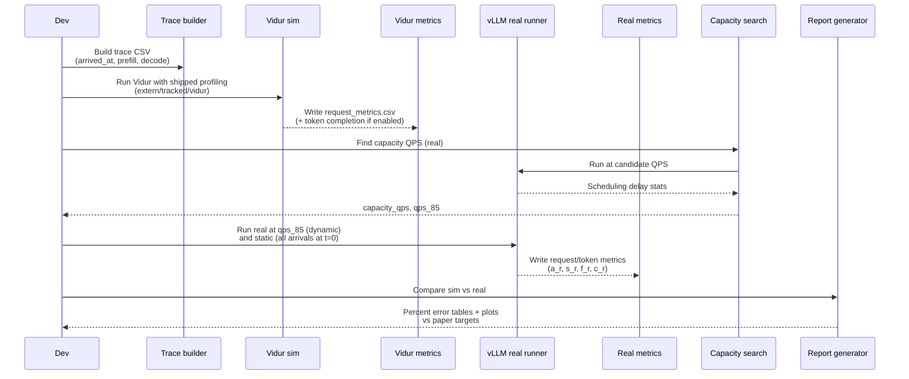

# Plan: Reproduce Vidur paper fidelity (sim vs real gap)

## HEADER
- **Purpose**: Reproduce the core fidelity results from the Vidur MLSys’24 paper (static + dynamic workloads) using this repo’s Vidur integration and real inference engines (vLLM and optionally Sarathi-Serve), so we can verify we are “using Vidur correctly” by matching the paper’s simulator-vs-real error bands.
- **Status**: Draft
- **Date**: 2026-01-03
- **Dependencies**:
  - `extern/tracked/vidur/paper/tex/5-eval.tex` (fidelity methodology and target error bands)
  - `extern/tracked/vidur/paper/tex/figures-tex/fig-fidelity-static-trace.tex` (static metric: `request_execution_plus_preemption_time_normalized`)
  - `extern/tracked/vidur/paper/tex/figures-tex/fig-fidelity-dynamic-trace.tex` (dynamic metric: `request_e2e_time_normalized` at 85% capacity)
  - `extern/tracked/vidur/docs/metrics.md` (definitions of `a_r`, `s_r`, `f_r`, `c_r` and derived metrics)
  - `context/summaries/about-vidur-gpu-simulator.md` (Vidur design + timing boundaries)
  - `docs/developer/architecture.md` (repo pipeline: workload → real-bench/vidur-sim → compare)
  - `models/README.md` (local model references for paper models)
  - `extern/orphan/vllm/` (real engine reference checkout; ignored by git)
  - `src/gpu_simulate_test/vidur_ext/sim_runner.py` (current Vidur wrapper output standardization)
  - `src/gpu_simulate_test/real_bench/` (current real timing harness; currently sequential and not system-level)
- **Target**: Contributors validating Vidur fidelity and maintaining simulator-vs-real comparisons.

---

## 1. Purpose and Outcome

We want to reproduce the paper’s *fidelity claims* for a small but representative subset of scenarios, focused on the **sim vs real gap**:

- **Static workloads**: match the paper’s “normalized execution latency” metric (excluding initial scheduling delay).
- **Dynamic workloads**: match the paper’s “normalized end-to-end latency” metric at **85% of capacity** (where queueing effects begin to matter but the system is not overloaded).

Success looks like:

- We can run the same model/workload/config through **(A) Vidur simulation** and **(B) a real engine** with consistent metric definitions and boundaries.
- We compute the same error metric the paper uses (percent error on percentile summaries of the normalized latency distributions).
- The resulting error bands are in the same ballpark as the paper (paper headline: <9% across the range; <5% error near 85% capacity for most scenarios), or we can explain any consistent deviation with concrete root causes (kernel mismatch, CPU overhead boundary mismatch, topology mismatch, etc.).

Non-goals (at least initially):

- Reproducing Vidur’s full configuration-search results (`syssearch`) or large-scale (32 GPU) figures.
- Matching the exact datasets and internal vLLM fork used in the paper if they are not publicly available; we prioritize reproducing the **methodology + gap**.

---

## 2. Implementation Approach

### 2.1 High-level flow

1. **Lock the reproduction target (“slice”)**
   - Hardware: start with `A100 80GB` (paper uses 4xA100 pairwise NVLink nodes; use TP/PP only if the machine supports it).
   - Models (paper + locally referenced): `meta-llama/Llama-2-7b-hf`, `meta-llama/Llama-2-70b-hf`, `internlm/internlm-20b`, `Qwen/Qwen-72B` (see `models/`).
   - Scheduler: paper fidelity uses **default vLLM scheduler**; use vLLM as the primary real baseline. Optionally run Sarathi-Serve as a secondary baseline if we want to validate Vidur’s Sarathi scheduler implementation too.

2. **Use Vidur’s shipped profiling bundles to remove a major variable**
   - For reproduction, set `profiling_root = extern/tracked/vidur` so we use the profiling CSVs that shipped with this Vidur commit (same provenance as the paper’s artifact bundle).
   - Only move to custom profiling (`tmp/vidur_profiling/...`) after fidelity is established.

3. **Normalize workload representation (shared by sim + real)**
   - Paper workloads are “trace-driven token counts + arrival process”.
   - Use a single “trace” CSV schema: `arrived_at` (seconds since start), `num_prefill_tokens`, `num_decode_tokens` (Vidur’s `TraceRequestGeneratorConfig` already consumes this shape).
   - For traces without arrivals (e.g., token-length distributions), generate `arrived_at` using a seeded Poisson process at the chosen QPS.

4. **Implement a system-level real runner (vLLM) with server-side timing**
   - Current `real-bench` is sequential and cannot reproduce batching/scheduler behavior under load; add a new vLLM runner that:
     - Injects requests into the engine according to `arrived_at` (Poisson/deterministic), allowing concurrency and batching.
     - Records **server-side** timestamps consistent with Vidur’s definitions:
       - `a_r`: when the request is enqueued into the engine (post-tokenization or using synthetic token IDs).
       - `s_r`: when the request is first scheduled into a batch (first time it is assigned to execute).
       - `f_r`: when the first output token becomes available.
       - `c_r`: when the final output token becomes available.
     - Records per-token completion timestamps for decode tokens to compute inter-token latency distributions.
   - Prefer providing **synthetic token IDs** (length-only) to avoid including tokenization time in `a_r` and to match Vidur’s token-count abstraction more closely.

5. **Extract comparable simulator metrics from Vidur**
   - For static fidelity: use Vidur’s `request_scheduling_delay` to compute `s_r`, and compare `request_execution_plus_preemption_time_normalized` (matches the paper’s static figure file names).
   - For dynamic fidelity: compare `request_e2e_time_normalized` at 85% capacity.
   - Enable Vidur’s token completion metrics if needed (avoid synthesizing per-token times by linear interpolation when reproducing the paper’s token-level distributions).

6. **Reproduce the paper’s “85% of capacity” methodology**
   - Implement a capacity search loop for the **real vLLM run**:
     - For a given QPS, run long enough to reach steady state; compute scheduling delay distribution.
     - Define “not overloaded” using a threshold similar to the paper’s search section (e.g., `P99(request_scheduling_delay) < 5s`).
     - Binary search for max sustainable QPS; pick `0.85 * capacity` for the dynamic fidelity experiment.
   - Mirror the same capacity point for Vidur using the same trace and configuration, so we compare at the same operating regime.

7. **Compute fidelity metrics and compare to paper**
   - For each scenario (model × workload × config):
     - Compute the real and sim percentile summaries (P50 and P95 are the ones plotted in the paper figures).
     - Compute percent error: `abs(sim - real) / real`.
   - Produce a small reproduction report under `results/reports/<date>/.../summary.md` with:
     - The exact configs used (TP/PP, batch caps, max tokens, seeds).
     - Plots/tables for static and dynamic metrics.
     - A short “gap diagnosis” section if we miss the paper’s error bands.

### 2.2 Sequence diagram (steady-state usage)

---

## 3. Files to Modify or Add

- **`src/gpu_simulate_test/real_bench/backends/vllm_backend.py`** Add an in-process vLLM backend that supports concurrent request injection and token-completion timing hooks.
- **`src/gpu_simulate_test/real_bench/replay.py`** Add a Poisson arrival generator and/or an async scheduler to drive concurrent request submission (current loop is sequential).
- **`src/gpu_simulate_test/real_bench/metrics.py`** Extend the standardized schema to optionally include `schedule_time_ns` (or `scheduling_delay_ns`) and (if available) prefill completion timestamps distinct from “first token observed”.
- **`src/gpu_simulate_test/vidur_ext/sim_runner.py`** Preserve additional Vidur raw columns needed for paper metrics (at minimum `request_scheduling_delay` and normalized fields like `request_e2e_time_normalized`, `request_execution_plus_preemption_time_normalized`).
- **`src/gpu_simulate_test/analysis/`** Add a “paper-fidelity” analyzer that computes the exact percent-error summaries used in the paper figures (static and dynamic).
- **`src/gpu_simulate_test/cli/`** Add a Hydra entrypoint for “paper fidelity repro” (runs: trace build → sim → capacity search → real → compare).
- **`configs/compare_vidur_real/backend/`** Add `vllm.yaml` and knobs for scheduler alignment (batch token caps, block size, precision, cuda graph flags).
- **`results/`** Add a new report folder (generated) + optionally a short tracked README update pointing to the reproduction report location.
- **`context/summaries/`** Add a post-run summary describing what matched/mismatched the paper and why.

---

## 4. TODOs (Implementation Steps)

- [ ] **Define the reproduction matrix** Pick the initial scenarios (start with LLaMA2-7B on A100 TP1, then scale to InternLM-20B TP2 and LLaMA2-70B TP4 if hardware allows).
- [ ] **Choose workload sources** Start with Vidur’s shipped traces (`extern/tracked/vidur/data/processed_traces/*.csv`) and add additional paper-like traces if available.
- [ ] **Add trace builder utilities** Convert “length-only distributions” into full traces with `arrived_at` via seeded Poisson arrivals; add a “static” mode with all arrivals at `t=0`.
- [ ] **Implement vLLM real runner (system-level)** Support concurrent request injection and record `a_r`, `s_r`, `f_r`, `c_r` plus per-token completion times.
- [ ] **Align scheduler knobs** Map Vidur’s vLLM scheduler params (`batch_size_cap`, `block_size`, `watermark_blocks_fraction`, `max_tokens_in_batch`) to vLLM runtime flags/config; document mismatches explicitly.
- [ ] **Extend Vidur output standardization** Keep the Vidur raw normalized metrics needed for paper plots; avoid per-token interpolation when reproducing token-level distributions.
- [ ] **Implement capacity search** Add a binary search loop over QPS with a clear overload criterion (e.g., `P99(request_scheduling_delay) < 5s`) and output `capacity_qps` and `qps_85`.
- [ ] **Implement fidelity scorer** Compute P50/P95 for static and dynamic metrics on both sides and percent error vs paper targets; emit tables + plots.
- [ ] **Run the first “known-good” scenario** LLaMA2-7B, A100, TP1, vLLM scheduler, shipped trace; verify errors are in a reasonable band before scaling.
- [ ] **Scale up and compare to paper bands** Add 20B + 70B scenarios (and H100 if available); record where the gap deviates and attribute root causes.
- [ ] **Write a tracked summary** Add `context/summaries/vidur-paper-fidelity-repro.md` (or similar) with commands, configs, and findings.
