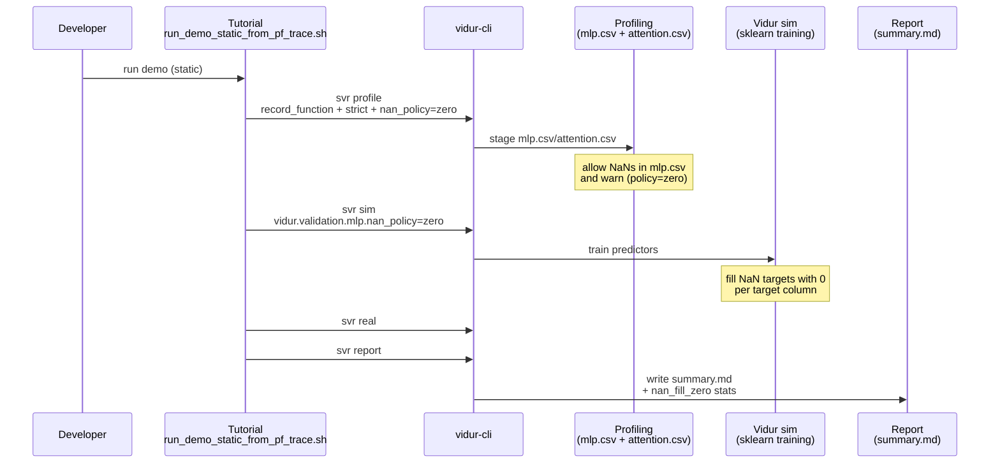

# Plan: Salvage MLP NaN policies and tutorial defaults (discard Ray/no-Ray branch)

## HEADER

**Purpose**: Discard the current `006-vidur-cli-ray-config` branch work around Ray/`--disable_ray` (since upstream Vidur does not implement it), while still landing the useful MLP validation + fallback behavior documentation and making the `tut-sim-vs-real-with-vidur-cli` tutorial default to the current recommended settings (`record_function`, `mode=strict`, `nan_policy=zero`, fallback disabled).  
**Status**: Implemented  
**Date**: 2026-01-20  
**Dependencies**:
- `specs/006-vidur-cli-ray-config/spec.md` (explains the now-abandoned purpose: Ray disable/config)
- `context/plans/plan-vidur-mlp-nan-policy.md` (existing “reject vs drop” design and consumer patching)
- `docs/tutorial/howto/tut-sim-vs-real-with-vidur-cli/run_demo_static_from_pf_trace.sh`
- `docs/tutorial/howto/tut-sim-vs-real-with-vidur-cli/README.md`
- `src/gpu_simulate_test/vidur_ext/mlp_validation.py`
- `src/gpu_simulate_test/vidur_ext/vidur_sklearn_nan_patch.py`
- `src/gpu_simulate_test/vidur_ext/sim_runner.py`
- `src/gpu_simulate_test/vidur_ext/profile_runner.py` (attention profiling defaults)
- `src/gpu_simulate_test/vidur_cli/reporting.py`
- `src/sitecustomize.py` (Vidur/Sarathi attention profiling compat toggle)
**Target**: Maintainers and contributors running `vidur-cli` / paper-fidelity workflows who need explicit NaN handling controls and a runnable sim-vs-real tutorial.

---

## 1. Purpose and Outcome

### 1.1 What gets discarded

Do **not** merge any of the “Ray runtime config” / “no-Ray profiling” work from `006-vidur-cli-ray-config`, including:

- `src/gpu_simulate_test/ray_runtime.py` and Hydra `configs/compare_vidur_real/ray/*`
- Any `profiling.compute.use_ray` behavior intended to bypass Ray
- Spec/task/impl-guide docs under `specs/006-vidur-cli-ray-config/` and `context/tasks/working/006-vidur-cli-ray-config/`

Rationale: upstream Vidur’s `--disable_ray` flags are stubs, so “no-Ray profiling” cannot work without upstream changes; keeping these features would create misleading surface area.

### 1.2 What must land on `main`

Success looks like:

- `nan_policy` supports **`auto|reject|drop|zero`** in both profiling and consumption paths.
  - `zero` semantics: allow NaNs at validation time and fill missing targets with `0.0` per-target during sklearn training; record a fill summary in run metadata.
- New doc: `docs/manual/mlp-validation-and-fallback.md` describing:
  - missing required columns vs missing cells
  - profiling vs consumption enforcement points
  - validation/fallback combinations and implications (including `zero`)
- `docs/tutorial/howto/tut-sim-vs-real-with-vidur-cli` defaults updated to:
  - `profiling.mlp.profile_method=record_function`
  - `profiling.mlp.validation.mode=strict`
  - `profiling.mlp.validation.nan_policy=zero`
  - `profiling.mlp.fallback.enabled=false`
  - `vidur.validation.mlp.nan_policy=zero`
- Tutorial remains runnable end-to-end on `main`:
  - Ensure attention profiling is compatible (enable `GPU_SIMULATE_TEST_ENABLE_VIDUR_ATTENTION_COMPAT` in the tutorial script).
  - Ensure attention profiling collects both prefill + decode (either by defaulting to `both` in `profile_runner.py` or by adding/configuring an override that the tutorial uses).

## 2. Implementation Approach

### 2.1 High-level flow

1. Start a fresh branch from `origin/main` (do not base work on `006-vidur-cli-ray-config`).
2. Port only the **MLP NaN policy + docs + tutorial defaults** changes:
   - Add `nan_policy=zero` support end-to-end (validator, sim consumer patch, CLI validation, reporting).
   - Add the new doc and update references from existing docs.
3. Make the tutorial runnable on `main` with the new defaults:
   - Enable Vidur/Sarathi attention compat via environment (`GPU_SIMULATE_TEST_ENABLE_VIDUR_ATTENTION_COMPAT=1`).
   - Ensure attention profiling produces both prefill + decode timings.
4. Add unit tests for `nan_policy=zero`:
   - validator behavior
   - profiling-root validation behavior
   - sklearn patch behavior (fills NaNs with 0 and records a summary)
5. Run `pixi run pytest` and run the tutorial script once; store outputs under `tmp/<subdir>`.
6. Open a PR targeting `main` with only the salvaged changes; explicitly state that Ray/no-Ray work is intentionally dropped.

### 2.2 Sequence diagram (steady-state usage)

## 3. Files to Modify or Add

- **`src/gpu_simulate_test/vidur_ext/mlp_validation.py`**: add `nan_policy=zero` and “effective policy” resolution; warn (not fail) on NaNs under `zero`.
- **`src/gpu_simulate_test/vidur_ext/vidur_sklearn_nan_patch.py`**: add `patch_vidur_sklearn_train_model_fillna_zero()` that fills NaNs in the target column with 0 and records per-model counts.
- **`src/gpu_simulate_test/vidur_ext/sim_runner.py`**: enable the fillna(0) patch when effective policy is `zero`; record `mlp_nan_fill_zero` into run metadata.
- **`src/gpu_simulate_test/vidur_cli/reporting.py`**: surface `nan_fill_zero` summary in `summary.md`.
- **`src/gpu_simulate_test/vidur_cli/stages.py`**: accept `auto|reject|drop|zero` for `profiling.mlp.validation.nan_policy` and `vidur.validation.mlp.nan_policy`.
- **`src/gpu_simulate_test/vidur_ext/profile_runner.py`**: default attention profiling mode to `both` (or expose a knob used by the tutorial) so simulation has prefill+decode training data.
- **`docs/manual/mlp-validation-and-fallback.md`**: add (new) behavior matrix + rationale (profiling vs consumption) including `zero`.
- **`docs/manual/run-workflow.md`**, **`docs/developer/configs.md`**: link to the new manual doc and include `nan_policy=zero` as a best-effort option.
- **`docs/tutorial/howto/tut-sim-vs-real-with-vidur-cli/run_demo_static_from_pf_trace.sh`**: set tutorial defaults (record_function + strict + zero + fallback disabled), set `GPU_SIMULATE_TEST_ENABLE_VIDUR_ATTENTION_COMPAT=1`, ensure attention profiling covers both phases.
- **`docs/tutorial/howto/tut-sim-vs-real-with-vidur-cli/README.md`**: update tutorial description and NaN handling section to match defaults.
- **`tests/unit/test_mlp_validation.py`**: add test cases for `nan_policy=zero` validation behavior.
- **`tests/unit/test_profiling_root_mlp_validation.py`**: add test cases that `ProfilingRootLayout(... mlp_nan_policy=\"zero\")` warns (not fails) on NaNs in strict mode.
- **`tests/unit/test_vidur_sklearn_nan_patch.py`**: add test coverage for fillna(0) patch and summary.

## 4. TODOs (Implementation Steps)

- [X] **Branch from main** Create a fresh branch from `origin/main` (do not reuse `006-vidur-cli-ray-config`).
- [X] **Add `nan_policy=zero`** Implement `zero` in `mlp_validation.py` and propagate it through `stages.py`.
- [X] **Add fillna(0) sklearn patch** Implement `patch_vidur_sklearn_train_model_fillna_zero()` and wire it into `sim_runner.py` when effective policy is `zero`.
- [X] **Surface in reports** Update `vidur_cli/reporting.py` to include a `nan_fill_zero` summary section.
- [X] **Fix attention profiling defaults for sim** Ensure `attention_profile_mode` defaults to `both` (or ensure the tutorial passes an override) to avoid empty `attn_prefill` training data.
- [X] **Write docs** Add `docs/manual/mlp-validation-and-fallback.md` and link it from relevant docs; update tutorial docs to reflect the new defaults.
- [X] **Update tutorial script** Set env defaults for record_function + strict + nan_policy=zero + fallback disabled; enable `GPU_SIMULATE_TEST_ENABLE_VIDUR_ATTENTION_COMPAT=1`.
- [X] **Add unit tests** Extend unit tests for validator, profiling root validation, and sklearn fill patch.
- [X] **Validation runs** Run `pixi run pytest` and run the tutorial once, saving outputs under `tmp/<subdir>`.
- [X] **PR + messaging** Open PR against `main` explaining that Ray/`--disable_ray` work is intentionally dropped and only NaN policies + tutorial defaults are being merged.
