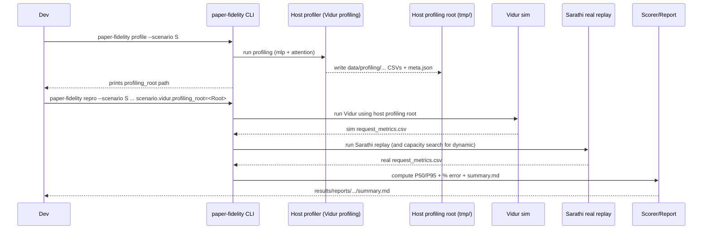

# Plan: Paper-fidelity sim-vs-real gap reproduction (host profiling)

## HEADER
- **Purpose**: Add a first-class “host-calibrated” reproduction path that profiles/microbenchmarks on the current machine, runs Vidur using the resulting profiling bundle, and compares against Sarathi-Serve “real” metrics so the sim-vs-real gap is meaningful on this host.
- **Status**: Draft
- **Date**: 2026-01-05
- **Dependencies**:
  - `specs/002-reproduce-vidur-paper-fidelity/spec.md` (success criteria and terminology)
  - `specs/002-reproduce-vidur-paper-fidelity/tasks.md` (current authoritative checklist; needs extension)
  - `specs/002-reproduce-vidur-paper-fidelity/quickstart.md` (user-facing run commands; needs host-profiling section)
  - `context/tasks/working/002-reproduce-vidur-paper-fidelity/qa-impl-phase-3-repro-report.md` (defines “sanity-check vs gap reproduction” expectations)
  - `src/gpu_simulate_test/cli/paper_fidelity.py` (current orchestration entrypoint)
  - `src/gpu_simulate_test/vidur_ext/profile_runner.py` (existing Vidur profiling orchestration we can reuse)
  - `src/gpu_simulate_test/vidur_ext/sim_runner.py` (uses `scenario.vidur.profiling_root`; currently skips CPU-overhead modeling)
  - `extern/tracked/vidur/docs/profiling.md` (upstream profiling concepts and expected output layout)
- **Target**: Contributors validating “paper fidelity” on their own hosts and maintainers evolving the reproduction workflow.

---

## 1. Purpose and Outcome

We want to support a second, explicit reproduction mode beyond the current “paper artifacts sanity-check”:

- **Sanity-check reproduction (already supported)**: run `paper-fidelity repro` using the Vidur submodule’s shipped profiling bundle to validate the pipeline and simulator-side metrics generation.
- **Sim-vs-real gap reproduction (to implement)**: generate a host-specific profiling bundle (microbenchmarked kernel/op timings), run Vidur with that bundle, run Sarathi-Serve to get “real” request metrics, then score and report the sim-vs-real gap.

Success looks like:

- A contributor can run a single documented workflow that produces a **host profiling root** under `tmp/`, then runs `paper-fidelity repro` using it (without manual copying of CSVs).
- The report clearly records which profiling root was used (paper-provided vs host-profiled), and how to interpret the resulting `% error` (sanity-check vs gap reproduction).
- There is at least one lightweight validation path under `tests/` (unit tests for profiling-root assembly + a manual GPU smoke script for host profiling).

Non-goals (initially):

- Perfect numeric agreement with the paper’s published error values (that requires matching their full stack); instead we aim for a “host-consistent” gap.
- Multi-node and large-scale (32 GPU) paper figures; start with TP=1/PP=1 scenarios and extend as hardware allows.

## 2. Implementation Approach

### 2.1 High-level flow

1. **Define “profiling modes” and artifacts**
   - Introduce a clear concept of `profiling_mode`:
     - `paper`: use `extern/tracked/vidur` as `scenario.vidur.profiling_root` (current default).
     - `host`: create a profiling root under `tmp/paper_fidelity/profiling_roots/<scenario>/<timestamp>/` that matches Vidur’s expected layout (`data/profiling/...`).
   - Always write heavy raw profiling outputs under `tmp/paper_fidelity/profiling_outputs/...` (ignored by git).

2. **Implement a host profiling orchestration layer**
   - Reuse (and lightly extend if needed) `src/gpu_simulate_test/vidur_ext/profile_runner.py` to:
     - Run Vidur’s profiling entrypoints for **MLP** and **attention** on this host GPU.
     - Assemble the required `data/profiling/compute/<device>/<model_id>/{mlp,attention}.csv` outputs into the host profiling root.
     - Optionally stage network profiling CSVs from the Vidur submodule (for TP/PP>1 scenarios).
   - Add a small metadata file (JSON) alongside the profiling root recording the commands, timestamps, git commit, and `build_env_snapshot()`.

3. **Add a `paper-fidelity profile` command**
   - Add a new CLI subcommand that generates a host profiling root for a given scenario (model/device/network_device inferred from scenario config).
   - The command prints the created profiling root path so users can pass it to `paper-fidelity repro` via Hydra override.

4. **Integrate “host profiling root” into reproduction**
   - Keep `paper-fidelity repro` as-is (it already accepts `scenario.vidur.profiling_root=...` overrides).
   - Update reporting to always include:
     - `scenario.vidur.profiling_root` (resolved absolute path)
     - a short note on interpretation (“sanity-check” vs “gap reproduction”).

5. **(Optional) CPU overhead modeling toggle**
   - Add a config knob so contributors can opt into CPU-overhead modeling if they have `cpu_overheads.csv` available.
   - Default remains current behavior (`skip_cpu_overhead_modeling=True`) to keep profiling requirements minimal.

### 2.2 Sequence diagram (steady-state usage)

## 3. Files to Modify or Add

- **`configs/paper_fidelity/profile.yaml`** New Hydra config for profiling runs (scenario selection + output controls).
- **`src/gpu_simulate_test/cli/paper_fidelity.py`** Add `profile` subcommand and `_profile_main()` Hydra entrypoint.
- **`src/gpu_simulate_test/paper_fidelity/paths.py`** Add helpers for `tmp/paper_fidelity/profiling_outputs/...` and `tmp/paper_fidelity/profiling_roots/...`.
- **`src/gpu_simulate_test/paper_fidelity/profiling.py`** (new) Orchestrate host profiling: call `run_vidur_profiling`, write meta, return profiling root path.
- **`src/gpu_simulate_test/vidur_ext/profile_runner.py`** Extend inputs/configurability as needed (e.g., allow TP size, max_tokens, attention profiling controls) while keeping defaults compatible.
- **`src/gpu_simulate_test/vidur_ext/sim_runner.py`** Optionally add a config knob for CPU overhead modeling (do not change default behavior).
- **`specs/002-reproduce-vidur-paper-fidelity/tasks.md`** Add a new task group for “host gap reproduction” (profiling + docs + validation).
- **`specs/002-reproduce-vidur-paper-fidelity/quickstart.md`** Document both reproduction modes and the exact commands/artifacts.
- **`tests/unit/test_paper_fidelity_profiling_root.py`** (new) Unit test for profiling-root assembly logic (uses small fixture CSVs).
- **`tests/manual/test_paper_fidelity_profile_smoke.py`** (new) GPU/manual smoke script to run `paper-fidelity profile` for a single-model scenario.

## 4. TODOs (Implementation Steps)

- [ ] **Define config + CLI surface** Add `paper-fidelity profile --scenario <name>` with Hydra config `configs/paper_fidelity/profile.yaml` and documented outputs under `tmp/paper_fidelity/`.
- [ ] **Add profiling path helpers** Extend `src/gpu_simulate_test/paper_fidelity/paths.py` with `profiling_outputs_dir(...)` and `profiling_root_dir(...)`.
- [ ] **Implement profiling orchestration** Add `src/gpu_simulate_test/paper_fidelity/profiling.py` to build a host profiling root and write a provenance JSON.
- [ ] **Wire CLI to orchestrator** Update `src/gpu_simulate_test/cli/paper_fidelity.py` to dispatch the new `profile` subcommand and print the profiling root path.
- [ ] **Make profiling runner configurable** Update `src/gpu_simulate_test/vidur_ext/profile_runner.py` to accept scenario-driven parameters (model_id/device/network_device/tp/pp), and keep outputs deterministic and under `tmp/`.
- [ ] **Expose CPU overhead toggle (optional)** Add `scenario.vidur.skip_cpu_overhead_modeling` (or similar) and plumb it into `src/gpu_simulate_test/vidur_ext/sim_runner.py`.
- [ ] **Update reporting/provenance** Ensure `summary.md` and run metadata record the effective profiling root and profiling mode.
- [ ] **Add unit tests** Create fixtures and unit tests for assembling a profiling root and for validating required files via `src/gpu_simulate_test/vidur_ext/profiling_root.py`.
- [ ] **Add manual GPU smoke test** Provide a small, bounded profiling invocation (single model, constrained settings) under `tests/manual/`.
- [ ] **Update specs docs** Extend `specs/002-reproduce-vidur-paper-fidelity/tasks.md` and `specs/002-reproduce-vidur-paper-fidelity/quickstart.md` with the new workflow and acceptance checks.
