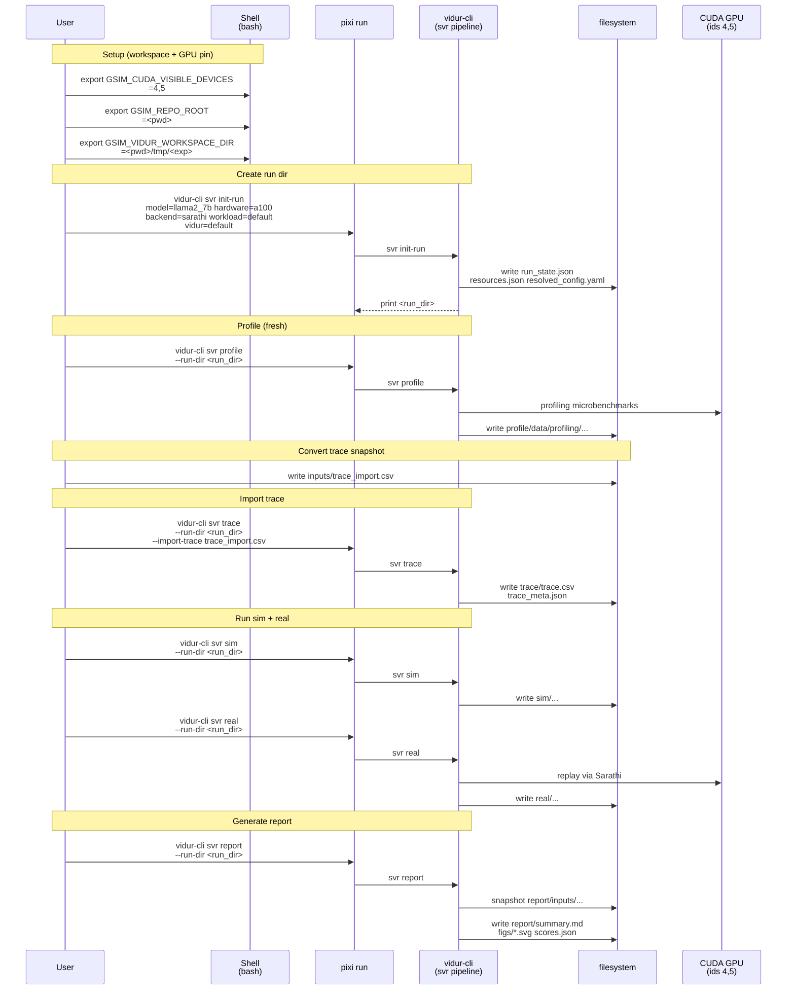

# Plan: Vidur-cli demo from paper-fidelity trace (llama2-7b, static, self-contained)

## HEADER

- **Purpose**: Produce a self-contained demo of `vidur-cli` that consumes an existing paper-fidelity `trace.csv` snapshot (static case) and generates all other artifacts fresh, ending in a `vidur-cli` sim-vs-real report. The demo must be demonstratable to users, and essential inputs/outputs (excluding caches) are tracked in git.
- **Status**: Implemented
- **Date**: 2026-01-15
- **Dependencies**:
  - `docs/tutorial/howto/tut-sim-vs-real-with-vidur-cli.md` (baseline workflow and workspace conventions)
  - `results/reports/2026-01-15/paper_fidelity/llama2_7b_arxiv_vc_profile_static_small_20260115/inputs/trace.csv` (trace source for the demo)
  - `src/gpu_simulate_test/cli/vidur_cli.py` (CLI entrypoint)
  - `src/gpu_simulate_test/vidur_cli/stages.py` (init-run/trace/profile/sim/real/report pipeline)
  - `src/gpu_simulate_test/vidur_cli/trace.py` (trace import schema for `svr trace --import-trace`)
  - `src/gpu_simulate_test/env_guard.py` (GPU pinning via `GSIM_CUDA_VISIBLE_DEVICES`)
- **Target**: Repo users who want an end-to-end `vidur-cli` demo that aligns with paper-fidelity’s trace inputs (and developers validating pipeline parity).

---

## 1. Purpose and Outcome

Success looks like:

1) A user can follow the tutorial end-to-end and produce a `vidur-cli` sim-vs-real report locally.
2) The tutorial is self-contained in-repo:
   - Essential **inputs** are committed to git (no dependency on mutable `tmp/` files).
   - A representative **expected output snapshot** (report directory) is committed to git for structure/provenance comparison.
3) During a demo run, a new `vidur-cli` run directory is created under a user-chosen workspace (recommended: `<pwd>/tmp/<experiment-name>`).
4) The demo imports the paper-fidelity trace snapshot (static) by converting it into `vidur-cli`’s canonical trace schema (`arrival_time_ns`, nanoseconds).
5) `vidur-cli` generates fresh artifacts:
   - profiling bundle under `<run_dir>/profile/`
   - simulation outputs under `<run_dir>/sim/`
   - real replay outputs under `<run_dir>/real/`
   - final report under `<run_dir>/report/summary.md` (with report-local input snapshots under `<run_dir>/report/inputs/`)
6) The final report includes an “apple-to-apple” config section proving parity-critical knobs match (CPU overhead modeling enabled, batch/chunk sizes matched, etc.). Exact %errors may vary across hosts, but the artifact structure and config checks should match the committed snapshot.

## 2. Implementation Approach

### 2.1 High-level flow

1. **Choose a fresh workspace** under `<pwd>/tmp/<experiment-name>` and pin GPUs to `4,5`.
2. **Initialize a new `vidur-cli` run** (`svr init-run`) with `model=llama2_7b hardware=a100 backend=sarathi workload=default vidur=default`.
3. **Generate fresh profiling** (`svr profile`) into `<run_dir>/profile/` (compute + CPU overhead; network copied from Vidur’s packaged network CSVs).
4. **Convert the paper-fidelity trace snapshot** (schema: `arrived_at` seconds) into a `vidur-cli` import trace (schema: `arrival_time_ns` int nanoseconds).
5. **Store demo inputs/outputs in git**:
   - All tracked demo artifacts live under: `<workspace>/examples/<tutorial-name>/`
   - Check in the demo input trace used by `vidur-cli` under that tutorial-owned path (so the tutorial does not depend on a date-stamped report directory).
   - Check in a representative expected output report snapshot (summary/scores/figures + input snapshots) under that tutorial-owned path.
6. **Import the converted trace** into the run (`svr trace --import-trace ...`).
7. **Run sim + real + report** (`svr sim`, `svr real`, `svr report`) and verify expected artifacts exist.
8. **(Optional) Parity checks**: verify that token-length sequences match the source trace and that report config lists the expected parity-critical settings.

### 2.2 Sequence diagram (steady-state usage)

## 3. Files to Modify or Add

- **`context/plans/plan-vidur-cli-demo-from-paper-fidelity-trace.md`**: This plan.
- **`docs/tutorial/howto/tut-sim-vs-real-with-vidur-cli.md`**: Add a dedicated “Demo (self-contained): vidur-cli from paper-fidelity trace snapshot (static)” section that uses only tracked inputs and points to the tracked expected output snapshot.
- **`examples/tut-sim-vs-real-with-vidur-cli/inputs/trace.csv`** (new): Committed demo input trace (copied from the referenced paper-fidelity report snapshot).
- **`examples/tut-sim-vs-real-with-vidur-cli/inputs/trace_import.csv`** (new): Committed `vidur-cli` canonical import trace derived from the above (so users can skip conversion if they want).
- **`examples/tut-sim-vs-real-with-vidur-cli/expected_report/`** (new): Committed expected output snapshot from one successful run:
  - `summary.md`, `scores.json`, `run_meta.json`, `inputs/{sim,real}_request_metrics.csv`, `figs/*.svg` (with machine-local paths sanitized to placeholders like `<RUN_DIR>`)
- **`examples/tut-sim-vs-real-with-vidur-cli/run_demo_static_from_pf_trace.sh`** (new): A runnable demo script that:
  - creates `<pwd>/tmp/<experiment-name>` workspace
  - uses the committed demo inputs (or performs conversion deterministically)
  - runs `svr init-run/profile/trace(sim import)/sim/real/report`
  - optionally copies the produced report into `examples/tut-sim-vs-real-with-vidur-cli/expected_report/` when run in “refresh snapshot” mode (for maintainers only)
- **`tmp/<experiment-name>/...`**: Generated artifacts only (must remain untracked and treated as cache/scratch).

## 4. TODOs (Implementation Steps)

- [x] **Decide demo surface** Make the tutorial section the primary UX; add a `scripts/` runner as a convenience.
- [x] **Define experiment workspace** Use `<pwd>/tmp/vidur_cli_demo_pf_trace_llama2_7b_static_<UTC>` as the default `GSIM_VIDUR_WORKSPACE_DIR`.
- [x] **Pin GPUs** Ensure demo explicitly exports `GSIM_CUDA_VISIBLE_DEVICES=4,5` (and optionally `CUDA_VISIBLE_DEVICES=4,5`) before any GPU stages.
- [x] **Vendor demo inputs (tracked)** Copy `results/reports/2026-01-15/paper_fidelity/llama2_7b_arxiv_vc_profile_static_small_20260115/inputs/trace.csv` into `examples/tut-sim-vs-real-with-vidur-cli/inputs/trace.csv`.
- [x] **Create run dir** Run `vidur-cli svr init-run model=llama2_7b hardware=a100 backend=sarathi workload=default vidur=default` and capture `<run_dir>`.
- [x] **Profile fresh** Run `vidur-cli svr profile --run-dir <run_dir>` and verify profiling outputs exist under `<run_dir>/profile/data/profiling/{compute,cpu_overhead,network}/...`.
- [x] **Convert paper-fidelity trace snapshot (deterministic)** Read `examples/tut-sim-vs-real-with-vidur-cli/inputs/trace.csv` and write a converted import trace:
  - output path: `examples/tut-sim-vs-real-with-vidur-cli/inputs/trace_import.csv`
  - columns: `request_id,arrival_time_ns,num_prefill_tokens,num_decode_tokens`
  - conversion: `arrival_time_ns = round(arrived_at * 1e9)` (for static this should be all zeros)
- [x] **Import trace** Run `vidur-cli svr trace --run-dir <run_dir> --import-trace examples/tut-sim-vs-real-with-vidur-cli/inputs/trace_import.csv`.
- [x] **Run sim** Run `vidur-cli svr sim --run-dir <run_dir>` and verify `<run_dir>/sim/request_metrics.csv` exists.
- [x] **Run real** Run `vidur-cli svr real --run-dir <run_dir>` and verify `<run_dir>/real/request_metrics.csv` exists.
- [x] **Generate report** Run `vidur-cli svr report --run-dir <run_dir>` and verify:
  - `<run_dir>/report/summary.md` exists
  - `<run_dir>/report/inputs/{sim,real}_request_metrics.csv` exist (stable snapshots)
  - `<run_dir>/report/figs/*_ecdf.svg` exist for scored metrics
- [x] **Parity assertions** In the final report, confirm the “Config (apple-to-apple)” section shows matching values for:
  - `max_tokens`, `chunk_size`, `batch_size`, `TP/PP`, and `cpu_overhead_modeling`
- [x] **Snapshot expected outputs (tracked)** Copy one successful run’s `<run_dir>/report/` directory into `examples/tut-sim-vs-real-with-vidur-cli/expected_report/` (excluding machine-local caches), and document which fields are expected to vary across hosts (e.g., absolute paths in `run_meta.json`).
- [x] **Add a demo script** Implement `examples/tut-sim-vs-real-with-vidur-cli/run_demo_static_from_pf_trace.sh` that runs the demo and prints the final report path; add a maintainer-only flag to refresh `expected_report/`.
- [x] **Document the demo** Update `docs/tutorial/howto/tut-sim-vs-real-with-vidur-cli.md` to reference the committed demo inputs and expected report snapshot.
