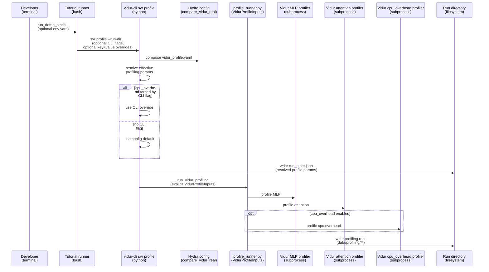

# Plan: Vidur-cli profiling controls in compare_vidur_real

## HEADER

- **Purpose**: Make all `svr profile` parameters configurable via `configs/compare_vidur_real` (Hydra), with clear precedence between config defaults and explicit CLI flags, and with resolved values recorded for reproducibility.
- **Status**: Draft
- **Date**: 2026-01-21
- **Dependencies**:
  - `configs/compare_vidur_real/vidur_profile.yaml`
  - `configs/compare_vidur_real/hardware/*.yaml`
  - `src/gpu_simulate_test/cli/vidur_cli.py`
  - `src/gpu_simulate_test/vidur_cli/stages.py`
  - `src/gpu_simulate_test/cli/vidur_profile.py`
  - `src/gpu_simulate_test/vidur_ext/profile_runner.py`
  - `docs/tutorial/howto/tut-sim-vs-real-with-vidur-cli/run_demo_static_from_pf_trace.sh`
  - `docs/tutorial/howto/tut-sim-vs-real-with-vidur-cli/README.md`
  - `magic-context/general/python-coding-guide.md`
- **Target**: `vidur-cli` users running profiling/sim-vs-real pipelines, and repo maintainers debugging profiling fidelity.

---

## 1. Purpose and Outcome

Success means:

1) Every field that affects `svr profile` execution is configurable in `configs/compare_vidur_real` (and can be overridden via Hydra `key=value` args).
2) The effective values are deterministic and documented (e.g., CLI flag overrides config, otherwise config default applies).
3) The resolved profiling configuration is recorded in `<run_dir>/run_state.json` (and surfaced in the report) so “what was profiled” is always auditable.
4) Failure behavior stays “fail fast” (no template/placeholder fallbacks for missing profiling data).

Assumption (can be revised during implementation): keep the existing `--include-cpu-overhead/--no-include-cpu-overhead` CLI flags as optional overrides, but make the default come from Hydra config when no flag is provided.

## 2. Implementation Approach

### 2.1 High-level flow

1) Extend `configs/compare_vidur_real/vidur_profile.yaml` to include all profiling knobs currently implicit in code defaults (attention, CPU overhead, batch sizes, etc.).
2) Decide the schema so it aligns with existing repo conventions (`configs/vidur_profiling/bundle.yaml` and `configs/paper_fidelity/profile.yaml`):
   - `profiling.num_gpus`, `profiling.tensor_parallel_size`, `profiling.max_tokens`
   - `profiling.include_network`
   - `profiling.cpu_overhead.enabled`, `profiling.cpu_overhead.max_batch_size`, `profiling.cpu_overhead.validation`
   - `profiling.attention.profile_mode`, `profiling.attention.backend`, `profiling.attention.block_size`, `profiling.attention.{min,max}_batch_size`
   - `hardware.network_device` (preferred) or `profiling.network_device` (fallback)
3) Plumb these values through `vidur-cli`:
   - Parse + validate in `run_profile()` (`src/gpu_simulate_test/vidur_cli/stages.py`).
   - Populate `VidurProfileInputs` explicitly (no reliance on `VidurProfileInputs` defaults).
4) Update CLI parsing so CPU overhead enablement can be “unset” (use config) vs explicitly forced:
   - Change argparse default to `None` and apply precedence in `run_profile()`.
5) Update other entrypoints that use the same config (`src/gpu_simulate_test/cli/vidur_profile.py`) so behavior matches `vidur-cli`.
6) Record resolved profiling parameters in `run_state.json` (and include them in the generated report section so diffs are obvious).
7) Add unit tests that validate config parsing and precedence without requiring GPUs.
8) Update tutorial docs/scripts to use config overrides instead of relying on hard-coded CLI flags (or at least document precedence and the tutorial’s chosen defaults).

### 2.2 Sequence diagram (steady-state usage)

## 3. Files to Modify or Add

- **`configs/compare_vidur_real/vidur_profile.yaml`**: add missing profiling keys (attention, cpu_overhead, general profiling runtime knobs) with comments and defaults.
- **`configs/compare_vidur_real/hardware/a100.yaml`** (and other hardware presets as needed): add `network_device` so CPU overhead outputs are placed under the intended network topology.
- **`src/gpu_simulate_test/cli/vidur_cli.py`**: make CPU overhead flag tri-state (unset vs true vs false) so config can be the default.
- **`src/gpu_simulate_test/vidur_cli/stages.py`**: parse/validate the new keys, apply precedence rules, and pass explicit `VidurProfileInputs(...)` fields.
- **`src/gpu_simulate_test/cli/vidur_profile.py`**: keep it aligned with `vidur-cli` by parsing the same config keys and passing explicit `VidurProfileInputs(...)` fields.
- **`src/gpu_simulate_test/vidur_cli/reporting.py`**: include a “Profiling config” section with resolved values (and/or ensure it’s present via run_state extraction).
- **`tests/unit/test_vidur_cli_profile_config.py`** (new): unit tests for config parsing + precedence (no GPU required).
- **`docs/tutorial/howto/tut-sim-vs-real-with-vidur-cli/run_demo_static_from_pf_trace.sh`**: optionally replace `--no-include-cpu-overhead` with a config override (or document that the flag overrides config).
- **`docs/tutorial/howto/tut-sim-vs-real-with-vidur-cli/README.md`**: document where profiling knobs live and how to override them.

## 4. TODOs (Implementation Steps)

- [ ] **Define config schema** Extend `configs/compare_vidur_real/vidur_profile.yaml` with the full set of profiling keys and choose defaults consistent with the tutorial.
- [ ] **Add hardware network_device** Add `hardware.network_device` to `configs/compare_vidur_real/hardware/*.yaml` and decide the default for A100 (`a100_pairwise_nvlink`).
- [ ] **Make CPU overhead flag tri-state** Update `src/gpu_simulate_test/cli/vidur_cli.py` so the profile stage can represent “flag not provided” and defer to config.
- [ ] **Plumb config into run_profile** Update `src/gpu_simulate_test/vidur_cli/stages.py` to read/validate all profiling keys and pass explicit `VidurProfileInputs(...)` fields.
- [ ] **Align vidur_profile entrypoint** Update `src/gpu_simulate_test/cli/vidur_profile.py` to use the same config keys and explicit inputs.
- [ ] **Record resolved params** Extend `run_state.json` profile artifact to include resolved attention/cpu_overhead/general profiling settings (not just the MLP summary).
- [ ] **Report visibility** Update `src/gpu_simulate_test/vidur_cli/reporting.py` to surface resolved profiling settings from `run_state.json`.
- [ ] **Unit tests** Add tests for precedence (CLI override vs config) and schema validation (bad values fail early with clear errors).
- [ ] **Tutorial update** Make the tutorial run reproducibly using config defaults/overrides, and document the precedence rules.
- [ ] **Manual docs** Add a short “Profiling knobs” section under `docs/manual/` (or an existing doc) explaining where to configure profiling parameters for `vidur-cli`.
