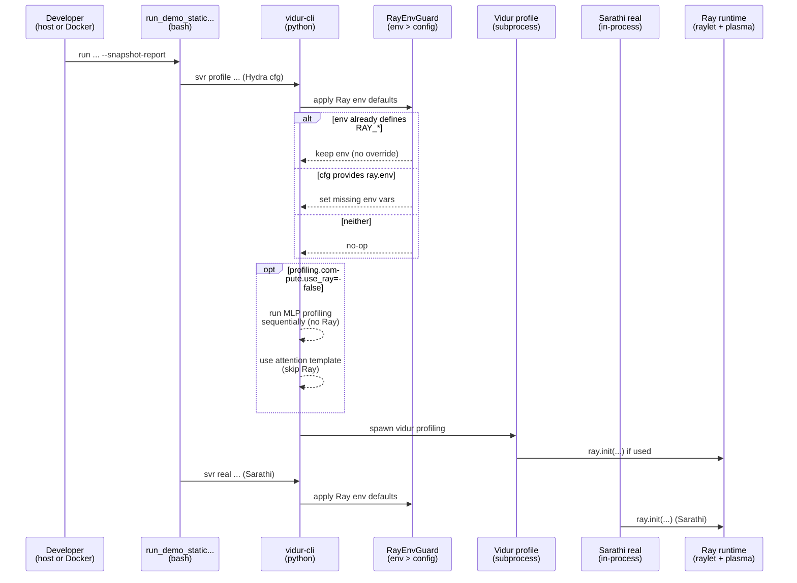

# Plan: Vidur-cli Ray runtime config + optional no-Ray Vidur profiling

## HEADER

- **Purpose**: Make Ray behavior consistent across host/container by allowing `vidur-cli` to set key Ray runtime knobs from Hydra config, while respecting user-provided `RAY_*` env vars; also add an option to avoid Ray in Vidur compute profiling where feasible.
- **Status**: Implemented
- **Date**: 2026-01-20
- **Dependencies**:
  - `context/issues/known/issue-vidur-ray-object-store-memory-spike-in-docker.md`
  - `src/gpu_simulate_test/vidur_cli/stages.py`
  - `src/gpu_simulate_test/vidur_cli/search_path.py`
  - `src/gpu_simulate_test/vidur_ext/profile_runner.py`
  - `src/gpu_simulate_test/env_guard.py`
  - `src/gpu_simulate_test/vidur_ext/vidur_profiling_mlp_main.py`
  - `src/gpu_simulate_test/vidur_ext/vidur_profiling_attention_main.py`
  - `configs/compare_vidur_real/vidur_profile.yaml`
  - `configs/compare_vidur_real/real_bench.yaml`
  - `extern/tracked/vidur/vidur/profiling/mlp/main.py`
  - `extern/tracked/vidur/vidur/profiling/cpu_overhead/main.py`
  - `extern/tracked/sarathi-serve/sarathi/engine/ray_utils.py`
- **Target**: `vidur-cli` users running sim-vs-real pipelines (host or Docker), plus maintainers who debug profiling/replay failures.

---

## Update (2026-01-20)

Implemented via `specs/006-vidur-cli-ray-config/`:

- Added `ray` config group (`configs/compare_vidur_real/ray/default.yaml`) with supported `ray.env.*` keys and precedence env > config > defaults.
- `vidur-cli` stages emit an effective settings report to stderr and write `<run_dir>/<stage>/ray_settings.json` for Ray-using stages.
- Added `profiling.compute.use_ray=false` to disable Ray in compute profiling (single-GPU only; cpu overhead profiling is rejected).
- Note: `profiling.compute.use_ray=false` currently fails fast (Vidur's `--disable_ray` flags are stubs in the tracked submodule; this repo does not hide missing attention profiling data via template fallbacks).
- Added unit tests: `tests/unit/test_ray_runtime_config.py`, `tests/unit/test_vidur_profile_no_ray.py`.

See: `specs/006-vidur-cli-ray-config/plan.md` and `specs/006-vidur-cli-ray-config/tasks.md`.

## 1. Purpose and Outcome

Success means:

1) `vidur-cli` can apply a small set of Ray runtime settings (especially object-store sizing) deterministically across environments (host vs container) without requiring users to remember `export RAY_*` incantations.
2) The precedence is explicit and safe: **env > config > Ray default**.
3) Users can disable Ray for Vidur compute profiling (MLP/attention) in low-footprint situations, while still allowing CPU overhead profiling and Sarathi replay to work (they require Ray today).
4) The behavior is documented and test-covered (at least for the env precedence logic).

## 2. Implementation Approach

### 2.1 High-level flow

1) Add a `ray` section to the Hydra configs used by `vidur-cli` (under `configs/compare_vidur_real/`).
2) Implement a small “Ray env guard” helper that:
   - Reads desired values from config (e.g. `cfg.ray.env`).
   - Sets `os.environ[...]` only when the env var is not already set.
   - Skips `None` values (meaning “leave to Ray defaults”).
3) Call the helper early in `vidur-cli` stages that (directly or indirectly) import/start Ray:
   - `svr profile` (Vidur profiling subprocess imports Ray; also `patch_sarathi_preserve_cuda_visible_devices()` imports Sarathi modules that import Ray).
   - `svr real` (Sarathi engine unconditionally calls `ray.init(...)`).
   - Optionally `svr sim` if future Vidur sim codepaths start using Ray.
4) Add a config knob to avoid Ray in Vidur compute profiling:
   - `profiling.compute.use_ray` (default `true`).
   - When `false`:
     - Run MLP profiling sequentially in-process (no `ray.init`, no actors), limited to the `--num_gpus=1` case initially.
     - Skip attention profiling execution and directly write the attention fallback CSV template (already supported in `profile_runner.py`).
   - Keep CPU overhead profiling unchanged (still uses Ray), but it will benefit from the Ray object store cap applied by step (2).

Key design choice: use env vars (not `ray.init(object_store_memory=...)`) as the “portable control plane”, because Vidur and Sarathi call `ray.init(...)` internally and we don’t want to maintain deep patches in submodules.

### 2.2 Sequence diagram (steady-state usage)

## 3. Files to Modify or Add

- **`configs/compare_vidur_real/ray/default.yaml`** Add a `ray.env` mapping of supported Ray env vars (nullable).
- **`configs/compare_vidur_real/vidur_profile.yaml`** Include `ray: default` in `defaults` and add `profiling.compute.use_ray` (default true).
- **`configs/compare_vidur_real/real_bench.yaml`** Include `ray: default` in `defaults` so replay sees the same Ray config.
- **`configs/compare_vidur_real/vidur_sim.yaml`** Include `ray: default` for consistency (even if currently unused).
- **`src/gpu_simulate_test/ray_runtime.py`** New helper to apply Ray env defaults with precedence rules.
- **`src/gpu_simulate_test/vidur_cli/stages.py`** Call the helper immediately after composing stage configs (before any Sarathi/Vidur/Ray imports).
- **`src/gpu_simulate_test/vidur_ext/profile_runner.py`** Plumb `profiling.compute.use_ray` into MLP/attention profiling execution; add a no-Ray MLP path (initially for `num_gpus=1`).
- **`src/gpu_simulate_test/vidur_ext/vidur_profiling_mlp_main.py`** (Optional safety) Ensure we don’t accidentally import Ray before env is applied; possibly add a `--disable-ray` mode if we keep subprocess-based profiling.
- **`context/issues/known/issue-vidur-ray-object-store-memory-spike-in-docker.md`** Link to this plan and document new config knobs once implemented.
- **`tests/test_ray_runtime_config.py`** Unit tests for env precedence and value serialization (no Ray imports).

## 4. TODOs (Implementation Steps)

- [X] **Define config schema** Add a `ray` config group with `ray.env` (nullable fields) and decide which env vars are officially supported (start with object store sizing + slow storage + memory monitor).
- [X] **Add compare_vidur_real defaults** Include `ray: default` in `vidur_profile.yaml`, `real_bench.yaml`, and `vidur_sim.yaml`.
- [X] **Implement `ray_runtime` helper** Create `src/gpu_simulate_test/ray_runtime.py` with `apply_ray_env_defaults(cfg_ray_env)` that enforces env > config > Ray default.
- [X] **Integrate into `vidur-cli` stages** Call the helper in `run_profile()` and `run_real()` before any call that can import/start Ray (notably before `patch_sarathi_preserve_cuda_visible_devices()` and before Sarathi engine creation).
- [X] **Add `profiling.compute.use_ray` knob** Default `true`; when `false`, run MLP profiling without Ray and skip attention execution (use fallback CSV template directly).
- [X] **Decide how to implement no-Ray MLP profiling** Prefer an in-process sequential implementation based on Vidur’s `MlpWrapper` for the `num_gpus=1` case; document limitations for multi-GPU.
- [X] **Tests** Add unit tests that validate env precedence and that `None` values are treated as “no-op”.
- [X] **Docs** Update `context/issues/known/issue-vidur-ray-object-store-memory-spike-in-docker.md` to describe the new config knobs and include an example override command line for `vidur-cli` users.
