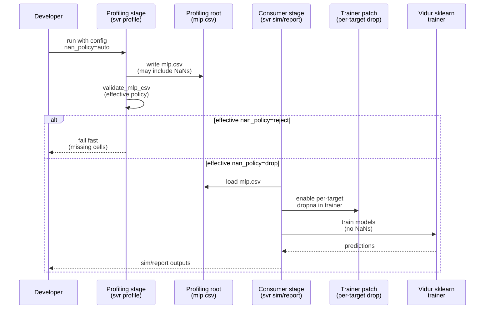

# Plan: Configurable NaN handling for Vidur MLP profiling (reject vs drop)

## HEADER

**Purpose**: Add a configurable policy for handling missing (NaN) MLP timing targets so runs can either fail fast or proceed by dropping missing measurements per target during consumption (simulation/reporting) by patching Vidur’s sklearn trainer.  
**Status**: Draft  
**Date**: 2026-01-19  
**Dependencies**:
- `context/issues/known/issue-vidur-mlp-profiling-misses-cuda-driver-kernels.md`
- `src/gpu_simulate_test/vidur_ext/mlp_validation.py`
- `src/gpu_simulate_test/vidur_ext/profile_runner.py`
- `src/gpu_simulate_test/vidur_ext/profiling_root.py`
- `src/gpu_simulate_test/vidur_ext/sim_runner.py`
- `src/gpu_simulate_test/vidur_cli/stages.py`
- `src/gpu_simulate_test/vidur_cli/reporting.py`
- `configs/vidur_profiling/bundle.yaml`
- `configs/paper_fidelity/profile.yaml`
- `configs/compare_vidur_real/vidur_profile.yaml`
- `configs/compare_vidur_real/vidur/default.yaml`
- Vidur consumer behavior: `extern/tracked/vidur/vidur/execution_time_predictor/sklearn_execution_time_predictor.py`
**Target**: Developers running profiling + sim/report pipelines (`paper-fidelity`, `vidur-cli`, `vidur-sim`) who want explicit control over how NaNs are treated.

---

## 1. Purpose and Outcome

Today, the repository treats missing MLP timing targets as always-fatal validation failures. This is safe but prevents
running “best-effort” simulations when a profiling root contains some missing (NaN) cells.

This plan adds a new NaN-handling policy that can be configured from Hydra configs:

- **Default (`auto`)**:
  - **strict mode** ⇒ **reject** NaNs (fail fast)
  - **non_strict mode** ⇒ **drop** NaNs (allow; ignore missing samples per target during consumption)
- **Explicit override**:
  - `reject` ⇒ always fail on NaNs (ignores strict/non_strict)
  - `drop` ⇒ always allow and drop missing samples per target (ignores strict/non_strict)

Success looks like:

- Users can select `nan_policy` in both profiling and consumption configs.
- New profiling roots can be created even when NaNs exist (when effective policy is `drop`), and consumers can run by
  using a patched sklearn trainer that drops NaNs per target column before fitting.
- Reports/provenance clearly record the chosen NaN policy and the per-target sample-drop summary.

Assumptions (to confirm during implementation):

- “Drop NaNs” applies to **missing cells** (NaNs) in existing columns; **missing required columns** remains a hard error
  (Vidur’s sklearn training expects specific `time_stats.<op>.median` columns to exist).

## 2. Implementation Approach

### 2.1 High-level flow

1. **Introduce `nan_policy` config** in both places that currently control MLP validation:
   - Profiling/staging: `profiling.mlp.validation.nan_policy`
   - Consumption: `vidur.validation.mlp.nan_policy`
2. **Compute the effective policy**:
   - If `nan_policy=auto`:
     - `mode=strict` ⇒ `reject`
     - `mode=non_strict` ⇒ `drop`
   - If `nan_policy` is explicitly `reject` or `drop`, use it and ignore `mode` for NaN handling.
3. **Update validation** (`validate_mlp_csv`) so NaN handling is policy-driven:
   - `reject`: fail if any core timing target cell is missing
   - `drop`: allow missing cells, but record counts and produce warnings (and require consumers to handle NaNs)
4. **Implement per-target NaN handling in Vidur sklearn trainer** for `drop`:
   - Apply a local monkey-patch (or wrapper) so each per-op training call drops rows with NaNs for that model’s
     `target_col` (and any feature cols) before calling scikit-learn `.fit(...)`.
   - If the filtered dataset becomes empty for any required model, fail with a remediation hint (“rerun profiling with
     `profiling.mlp.profile_method=cuda_event` / enable fallback”).
   - Record per-target dropped-row counts to make the tradeoff visible.
5. **Surface in provenance and reports**:
   - Include `nan_policy` (resolved/effective) in:
     - profiling meta (`profiling_meta.json` / report “Profiling” section)
     - run meta (`run_state.json` / report “Profiling” section)
   - If `drop` is used, include a per-target “rows dropped” summary so readers understand the compromise.

### 2.2 Sequence diagram (steady-state usage)

## 3. Files to Modify or Add

- **`configs/vidur_profiling/bundle.yaml`**: add `profiling.mlp.validation.nan_policy` with comments and defaults.
- **`configs/paper_fidelity/profile.yaml`**: same as above.
- **`configs/compare_vidur_real/vidur_profile.yaml`**: same as above.
- **`configs/compare_vidur_real/vidur/default.yaml`**: add `vidur.validation.mlp.nan_policy` with comments and defaults.
- **`src/gpu_simulate_test/vidur_ext/mlp_validation.py`**: add `nan_policy` support and “effective policy” logic.
- **`src/gpu_simulate_test/vidur_ext/profile_runner.py`**: plumb `nan_policy` from config into staging validation and
  provenance.
- **`src/gpu_simulate_test/vidur_ext/profiling_root.py`**: plumb `nan_policy` into consumption validation and return
  enough validation context for reporting.
- **`src/gpu_simulate_test/vidur_ext/sim_runner.py`**: apply the sklearn trainer patch when effective policy is `drop`.
- **`src/gpu_simulate_test/vidur_ext/vidur_sklearn_nan_patch.py`** (new): local monkey-patch helpers for per-target NaN
  dropping (avoid modifying the Vidur submodule).
- **`src/gpu_simulate_test/vidur_cli/stages.py`**: plumb `vidur.validation.mlp.nan_policy` into `VidurSimInputs`.
- **`src/gpu_simulate_test/vidur_cli/reporting.py`**: include `nan_policy` (and drop summary if used) in the final report.
- **`tests/unit/test_mlp_validation.py`**: update/add tests for `nan_policy` behavior (`auto/reject/drop`).
- **`tests/unit/test_profiling_root_mlp_validation.py`**: add tests for consumption behavior under `nan_policy=drop`
  (no GPU).
- **Docs**:
  - **`context/issues/known/issue-vidur-mlp-profiling-misses-cuda-driver-kernels.md`**: document the new knob and tradeoffs.

## 4. TODOs (Implementation Steps)

- [ ] **Add config knobs** Add `profiling.mlp.validation.nan_policy` and `vidur.validation.mlp.nan_policy` to the Hydra
      config files, defaulting to `auto`, with short docs and examples.
- [ ] **Define policy enum** Add a small Literal/enum type for `nan_policy` (`auto|reject|drop`) and implement
      “effective policy” resolution based on `mode` when `auto` is selected.
- [ ] **Update validator** Extend `validate_mlp_csv(...)` to accept `nan_policy` and:
      - always treat missing required columns as fatal
      - in `reject`, raise on any missing cells
      - in `drop`, allow missing cells and return a result containing counts + warnings
- [ ] **Implement trainer patch** Add a local monkey-patch/wrapper so Vidur’s sklearn training drops NaNs per target
      column (instead of requiring whole-row drops across all targets).
- [ ] **Wire staging behavior** Plumb `nan_policy` through `VidurProfileInputs` and staging provenance so profiling runs
      record the intended policy and validation result.
- [ ] **Wire consumption behavior** Plumb `nan_policy` through `ProfilingRootLayout`/`VidurSimInputs` and, when effective
      policy is `drop`, enable the trainer patch before invoking Vidur so training can proceed.
- [ ] **Report/provenance updates** Add `nan_policy` (effective) and a per-target “rows dropped” summary to final reports
      and run meta.
- [ ] **Unit tests** Add/update unit tests for:
      - policy resolution (`auto` + strict/non_strict)
      - `reject` raising on missing cells
      - `drop` allowing missing cells and ensuring per-target training can proceed (no crash)
- [ ] **Documentation** Update the known-issue doc (and relevant tutorials if needed) to explain:
      - when to use `drop` (best-effort runs / legacy roots)
      - tradeoffs (reduced per-target training data; potential accuracy impact)
      - recommended remediation (`cuda_event` profiling / fallback) for high-fidelity runs

## Q&A

### Q: Do we have to drop an entire row if some value is NaN, or can we treat each target column independently?

We do **not** fundamentally have to drop whole rows; we could treat each target column independently.

The main reason “drop whole row” is attractive is that Vidur’s sklearn predictor trains *many* per-op models from a
single `mlp.csv`-derived dataframe, and scikit-learn `.fit()` does not accept NaNs in the target array `y`.

Concretely:

- Vidur loads one `compute_df` from `mlp.csv` and then iterates model names, training each model with:
  - `X = df[["num_tokens"]]`
  - `y = df[f"time_stats.{model_name}.median"]`
  - `GridSearchCV.fit(X, y)` (fails if `y` contains NaNs)

If we avoid patching Vidur and insist on a single “sanitized” `mlp.csv` that is safe for *all* models, the simplest
guarantee is to drop rows that contain NaNs in any required target column.

This plan instead chooses the higher-fidelity alternative:

- Patch/monkey-patch the Vidur training loop to do per-target filtering (drop NaNs only for the current `target_col`
  before calling `.fit()`). This keeps more rows for other targets and avoids “one NaN drops the whole row”.

### Q: What are possible remedies for the “one NaN forces removing entire row” tradeoff?

Options (roughly from “most correct” to “most convenient”):

1. **Per-target NaN handling in the trainer (chosen in this plan)**  
   Modify/patch the training loop so that for each `target_col` it trains on `df.dropna(subset=[target_col, *feature_cols])`.
   This keeps rows for other targets intact and avoids throwing away data that is only missing for one op. This can be
   done by patching:
   - `extern/tracked/vidur/vidur/execution_time_predictor/sklearn_execution_time_predictor.py` (upstream), or
   - a local wrapper/monkey-patch applied before constructing the predictor (preferred for this repo).

2. **Fill missing targets from a fallback profiler run (mixed-method merge)**  
   If `record_function` produces NaNs for some `num_tokens`, rerun profiling with `cuda_event` (or another method) and
   fill only the missing cells, producing a “complete” dataset without dropping rows. This preserves coverage but mixes
   measurement methods; it should be recorded in provenance and may affect fidelity.

3. **Impute missing targets (explicitly “synthetic” values)**  
   Fill NaNs using interpolation or model-based imputation (e.g., fit on non-NaN rows, predict missing). This can keep a
   full grid but can silently bias simulation if used without clear reporting; it should be opt-in and always recorded.

Notes:

- scikit-learn does **not** “ignore NaNs in `y`”; missing targets must be dropped or imputed before calling `.fit()`.
- If we avoid patching Vidur and insist on a single sanitized `mlp.csv` used for all targets, dropping rows that contain
  NaNs in any required target column is the simplest way to guarantee the training won’t crash.
