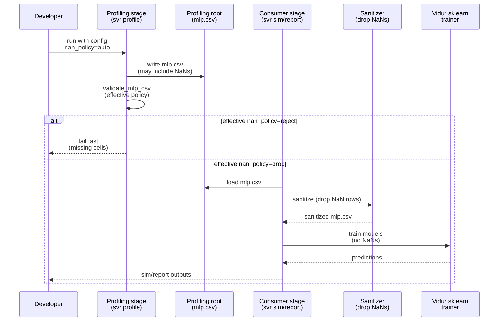

# Plan: Configurable NaN handling for Vidur MLP profiling (reject vs drop)

## HEADER

**Purpose**: Add a configurable policy for handling missing (NaN) MLP timing targets so runs can either fail fast or proceed by dropping missing measurements during consumption (simulation/reporting).  
**Status**: Draft  
**Date**: 2026-01-19  
**Dependencies**:
- `context/issues/known/issue-vidur-mlp-profiling-misses-cuda-driver-kernels.md`
- `src/gpu_simulate_test/vidur_ext/mlp_validation.py`
- `src/gpu_simulate_test/vidur_ext/profile_runner.py`
- `src/gpu_simulate_test/vidur_ext/profiling_root.py`
- `src/gpu_simulate_test/vidur_ext/sim_runner.py`
- `src/gpu_simulate_test/vidur_cli/stages.py`
- `src/gpu_simulate_test/vidur_cli/reporting.py`
- `configs/vidur_profiling/bundle.yaml`
- `configs/paper_fidelity/profile.yaml`
- `configs/compare_vidur_real/vidur_profile.yaml`
- `configs/compare_vidur_real/vidur/default.yaml`
- Vidur consumer behavior: `extern/tracked/vidur/vidur/execution_time_predictor/sklearn_execution_time_predictor.py`
**Target**: Developers running profiling + sim/report pipelines (`paper-fidelity`, `vidur-cli`, `vidur-sim`) who want explicit control over how NaNs are treated.

---

## 1. Purpose and Outcome

Today, the repository treats missing MLP timing targets as always-fatal validation failures. This is safe but prevents
running “best-effort” simulations when a profiling root contains some missing (NaN) cells.

This plan adds a new NaN-handling policy that can be configured from Hydra configs:

- **Default (`auto`)**:
  - **strict mode** ⇒ **reject** NaNs (fail fast)
  - **non_strict mode** ⇒ **drop** NaNs (allow; ignore missing rows during consumption)
- **Explicit override**:
  - `reject` ⇒ always fail on NaNs (ignores strict/non_strict)
  - `drop` ⇒ always allow and drop missing rows (ignores strict/non_strict)

Success looks like:

- Users can select `nan_policy` in both profiling and consumption configs.
- New profiling roots can be created even when NaNs exist (when effective policy is `drop`), and consumers can run by
  using a sanitized copy for training/simulation that removes NaN rows.
- Reports/provenance clearly record the chosen NaN policy and whether rows were dropped.

Assumptions (to confirm during implementation):

- “Drop NaNs” applies to **missing cells** (NaNs) in existing columns; **missing required columns** remains a hard error
  (Vidur’s sklearn training expects specific `time_stats.<op>.median` columns to exist).

## 2. Implementation Approach

### 2.1 High-level flow

1. **Introduce `nan_policy` config** in both places that currently control MLP validation:
   - Profiling/staging: `profiling.mlp.validation.nan_policy`
   - Consumption: `vidur.validation.mlp.nan_policy`
2. **Compute the effective policy**:
   - If `nan_policy=auto`:
     - `mode=strict` ⇒ `reject`
     - `mode=non_strict` ⇒ `drop`
   - If `nan_policy` is explicitly `reject` or `drop`, use it and ignore `mode` for NaN handling.
3. **Update validation** (`validate_mlp_csv`) so NaN handling is policy-driven:
   - `reject`: fail if any core timing target cell is missing
   - `drop`: allow missing cells, but record counts and produce warnings (and require consumers to sanitize)
4. **Implement consumption-time sanitization** for `drop`:
   - Before invoking Vidur’s sklearn training, create a **sanitized copy** of `mlp.csv` with NaN rows removed for the
     training target columns Vidur uses.
   - Use a temporary/scratch directory (under the run output directory) so the original profiling root remains
     unchanged.
   - Ensure the sanitized `mlp.csv` has no NaNs in required target columns; otherwise fail with a remediation hint
     (“use `profiling.mlp.profile_method=cuda_event` / enable fallback”).
5. **Surface in provenance and reports**:
   - Include `nan_policy` (resolved/effective) in:
     - profiling meta (`profiling_meta.json` / report “Profiling” section)
     - run meta (`run_state.json` / report “Profiling” section)
   - If sanitization happened, include “rows dropped” counts so readers understand the compromise.

### 2.2 Sequence diagram (steady-state usage)

## 3. Files to Modify or Add

- **`configs/vidur_profiling/bundle.yaml`**: add `profiling.mlp.validation.nan_policy` with comments and defaults.
- **`configs/paper_fidelity/profile.yaml`**: same as above.
- **`configs/compare_vidur_real/vidur_profile.yaml`**: same as above.
- **`configs/compare_vidur_real/vidur/default.yaml`**: add `vidur.validation.mlp.nan_policy` with comments and defaults.
- **`src/gpu_simulate_test/vidur_ext/mlp_validation.py`**: add `nan_policy` support and “effective policy” logic.
- **`src/gpu_simulate_test/vidur_ext/profile_runner.py`**: plumb `nan_policy` from config into staging validation and
  provenance.
- **`src/gpu_simulate_test/vidur_ext/profiling_root.py`**: plumb `nan_policy` into consumption validation, and provide
  a hook to request sanitization behavior.
- **`src/gpu_simulate_test/vidur_ext/sim_runner.py`**: implement consumption-time sanitization (temporary profiling root)
  when effective policy is `drop`.
- **`src/gpu_simulate_test/vidur_cli/stages.py`**: plumb `vidur.validation.mlp.nan_policy` into `VidurSimInputs`.
- **`src/gpu_simulate_test/vidur_cli/reporting.py`**: include `nan_policy` (and drop summary if used) in the final report.
- **`tests/unit/test_mlp_validation.py`**: update/add tests for `nan_policy` behavior (`auto/reject/drop`).
- **`tests/unit/test_profiling_root_mlp_validation.py`**: add tests for consumption sanitization decisions (no GPU).
- **Docs**:
  - **`context/issues/known/issue-vidur-mlp-profiling-misses-cuda-driver-kernels.md`**: document the new knob and tradeoffs.

## 4. TODOs (Implementation Steps)

- [ ] **Add config knobs** Add `profiling.mlp.validation.nan_policy` and `vidur.validation.mlp.nan_policy` to the Hydra
      config files, defaulting to `auto`, with short docs and examples.
- [ ] **Define policy enum** Add a small Literal/enum type for `nan_policy` (`auto|reject|drop`) and implement
      “effective policy” resolution based on `mode` when `auto` is selected.
- [ ] **Update validator** Extend `validate_mlp_csv(...)` to accept `nan_policy` and:
      - always treat missing required columns as fatal
      - in `reject`, raise on any missing cells
      - in `drop`, allow missing cells and return a result containing counts + warnings
- [ ] **Implement sanitizer** Add a helper to produce a sanitized `mlp.csv` for Vidur consumption by dropping rows with
      NaNs in required target columns (at minimum: the `time_stats.<op>.median` columns Vidur trains on).
- [ ] **Wire staging behavior** Plumb `nan_policy` through `VidurProfileInputs` and staging provenance so profiling runs
      record the intended policy and validation result.
- [ ] **Wire consumption behavior** Plumb `nan_policy` through `ProfilingRootLayout`/`VidurSimInputs` and, when effective
      policy is `drop`, run simulation against a sanitized copy of the profiling root (do not mutate the original root).
- [ ] **Report/provenance updates** Add `nan_policy` (effective) and “rows dropped” summary to final reports and run meta.
- [ ] **Unit tests** Add/update unit tests for:
      - policy resolution (`auto` + strict/non_strict)
      - `reject` raising on missing cells
      - `drop` allowing missing cells and producing a sanitized `mlp.csv` without NaNs
- [ ] **Documentation** Update the known-issue doc (and relevant tutorials if needed) to explain:
      - when to use `drop` (best-effort runs / legacy roots)
      - tradeoffs (reduced training data; potential accuracy impact)
      - recommended remediation (`cuda_event` profiling / fallback) for high-fidelity runs
