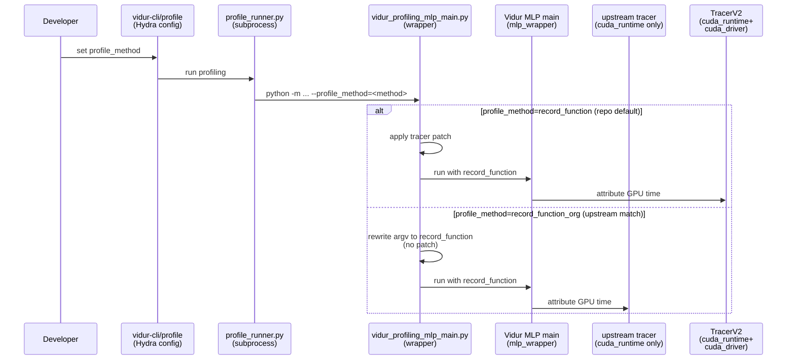

# Plan: Add upstream-matched `record_function_org` for Vidur MLP profiling

## HEADER

**Purpose**: Introduce a new MLP profiling method option (`record_function_org`) that matches upstream Vidur’s
`record_function` tracer behavior exactly, while keeping this repo’s patched `record_function` (TracerV2) as the
default for driver-launched kernel coverage.  
**Status**: Draft  
**Date**: 2026-01-19  
**Dependencies**:
- Upstream tracer: `extern/tracked/vidur/vidur/profiling/utils/record_function_tracer.py`
- Vidur MLP wrapper: `extern/tracked/vidur/vidur/profiling/mlp/mlp_wrapper.py`
- Patched tracer: `src/gpu_simulate_test/vidur_ext/record_function_tracer_v2.py`
- Wrapper entrypoint (patch point): `src/gpu_simulate_test/vidur_ext/vidur_profiling_mlp_main.py`
- Profiling runner (subprocess + validation): `src/gpu_simulate_test/vidur_ext/profile_runner.py`
- CLI wiring (vidur-cli): `src/gpu_simulate_test/vidur_cli/stages.py`
- CLI wiring (compare workflow): `src/gpu_simulate_test/cli/vidur_profile.py`
- Paper-fidelity profiling wiring: `src/gpu_simulate_test/paper_fidelity/profiling.py`
- Bundle exporter: `src/gpu_simulate_test/vidur_ext/profiling_bundle.py`
- Tutorials: `docs/tutorial/howto/tut-sim-vs-real-with-vidur-cli/README.md`, `docs/tutorial/in-depth/adv-tut-vidur-cli-mlp-profile-methods/README.md`
**Target**: Developers who need an “upstream-accurate” profiling mode to debug discrepancies and isolate trace
attribution changes (especially when comparing results against vanilla Vidur).

---

## 1. Purpose and Outcome

Today, this repo’s `profiling.mlp.profile_method=record_function` does **not** behave exactly like upstream Vidur:
we monkey-patch Vidur’s MLP record-function tracer to use `RecordFunctionTracerV2`, which also considers CUDA driver
launch events to avoid missing timings.

This is the right default for fidelity, but it makes debugging harder when a developer wants to answer:

- “Is this discrepancy caused by our tracer patch, or by something else (hardware, drivers, CUDA, Torch, kernels)?”

Success looks like:

- Users can select `profiling.mlp.profile_method=record_function_org`.
- The resulting run matches upstream Vidur `record_function` behavior exactly (no tracer monkey-patch applied).
- Provenance and reports record both:
  - the requested method (`record_function_org`)
  - the underlying Vidur method executed (`record_function`) so it’s obvious why upstream accepts it.
- Tutorials/documentation clearly explain the difference and recommend when to use each mode.

Non-goals:

- Changing the default `record_function` behavior (TracerV2 remains the default in this repo).
- Modifying the Vidur submodule itself (keep the submodule pinned; implement at wrapper level).

---

## 2. Implementation Approach

### 2.1 High-level flow

1. Extend the accepted `profiling.mlp.profile_method` values in this repo to include `record_function_org`.
2. In the MLP wrapper entrypoint (`vidur_profiling_mlp_main.py`), detect `record_function_org` and:
   - rewrite the argv passed to Vidur so it receives `--profile_method record_function` (so Vidur accepts it),
   - do **not** apply the tracer monkey-patch (so upstream tracer is used).
3. Ensure provenance/reporting shows the difference between:
   - requested profile method (`record_function_org`), and
   - the actual Vidur profile method invoked (`record_function`).
4. Add unit tests for the rewrite + patch gating logic (CPU-only; no GPU required).
5. Update docs/tutorials to include a prominent warning and an “escape hatch” recommendation.

### 2.2 Sequence diagram (steady-state usage)

---

## 3. Files to Modify or Add

- **`src/gpu_simulate_test/vidur_ext/vidur_profiling_mlp_main.py`**: implement `record_function_org` argv rewrite and ensure tracer patch is not applied for this mode.
- **`src/gpu_simulate_test/vidur_ext/profile_runner.py`**: ensure provenance includes requested vs executed method (especially when `record_function_org` is used).
- **`src/gpu_simulate_test/vidur_cli/stages.py`**: accept `record_function_org` in validation/UX and record it in run_state `artifacts.profile.mlp`.
- **`src/gpu_simulate_test/cli/vidur_profile.py`** / **`src/gpu_simulate_test/paper_fidelity/profiling.py`** /
  **`src/gpu_simulate_test/vidur_ext/profiling_bundle.py`**: ensure any “allowed values” validation (if added) includes `record_function_org`.
- **`docs/tutorial/howto/tut-sim-vs-real-with-vidur-cli/README.md`**: add warning blockquote and mention the upstream-matched option.
- **`docs/tutorial/in-depth/adv-tut-vidur-cli-mlp-profile-methods/README.md`**: add warning blockquote and guidance.
- **`tests/unit/test_vidur_profiling_mlp_main_record_function_org.py`** (new): unit tests for argv rewrite + patch gating (no GPU).

---

## 4. TODOs (Implementation Steps)

- [ ] **Define method name** Confirm final user-facing name: `record_function_org` (vs `record_function_upstream`).
- [ ] **Rewrite argv for Vidur** In `vidur_profiling_mlp_main.py`, map `--profile_method record_function_org` to `record_function` before calling Vidur’s CLI parser, without applying the tracer patch.
- [ ] **Provenance clarity** Record both `requested_profile_method` and `executed_profile_method` in:
  - `vidur-cli` `run_state.json` (profile artifacts)
  - `profiling_meta.json` (bundle + paper-fidelity profiling)
  - compare workflow `run_meta.json` (vidur-profile)
- [ ] **Validation / UX** If we enforce allowed values for `profiling.mlp.profile_method`, include `record_function_org` and emit a hint describing when to use it.
- [ ] **Unit tests (CPU-only)** Add a unit test that stubs Vidur’s MLP `main` and asserts:
  - `record_function` applies tracer patch (TracerV2),
  - `record_function_org` does not apply tracer patch and rewrites argv to `record_function`.
- [ ] **Docs** Update tutorials and developer docs to:
  - warn about upstream `record_function` being `cuda_runtime`-only,
  - explain that this repo’s default `record_function` is patched,
  - recommend `record_function_org` as a debugging escape hatch when investigating discrepancies.

