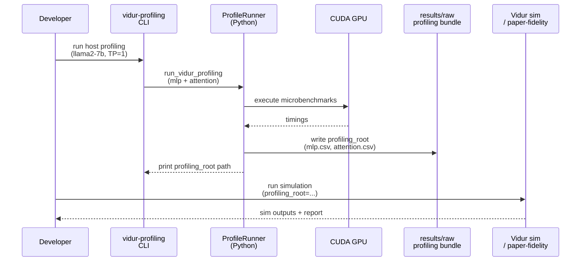

# Plan: Vidur host profiling for LLaMA2-7B

## HEADER

- **Purpose**: Produce Vidur-compatible *compute* profiling CSVs (MLP + attention) for `meta-llama/Llama-2-7b-hf` on the current machine’s GPU, using Sarathi-Serve–aligned settings, and store the curated bundle under `results/raw/vidur-profiling/` for reuse in simulations and sim-vs-real comparisons.
- **Status**: Draft
- **Date**: 2026-01-07
- **Dependencies**:
  - `context/instructions/prep-dev-env.md`
  - `context/summaries/vidur-kb/about-vidur-gpu-simulator.md`
  - `context/summaries/vidur-kb/about-vendor-provided-data.md`
  - `extern/tracked/vidur/docs/profiling.md`
  - `extern/tracked/vidur/vidur/profiling/mlp/main.py`
  - `extern/tracked/vidur/vidur/profiling/attention/main.py`
  - `src/gpu_simulate_test/vidur_ext/profile_runner.py`
  - `src/gpu_simulate_test/cli/vidur_profile.py`
  - `src/gpu_simulate_test/cli/paper_fidelity.py`
  - `src/gpu_simulate_test/paper_fidelity/profiling.py`
- **Target**: Developers (including future maintainers) generating host-calibrated Vidur profiling bundles.

---

## 1. Purpose and Outcome

### 1.1 Task Summary

- Target model: `meta-llama/Llama-2-7b-hf` (single-GPU first: TP=1, PP=1).
- Generate Vidur compute profiling artifacts similar to `extern/tracked/vidur/data/profiling/compute/...` (MLP + attention), without requiring network profiling.
- Use Sarathi-Serve–aligned attention settings (e.g., explicit `--attention_backend`, decode/prefill selection, batch size range) and record all knobs in provenance.
- Write curated outputs to `results/raw/vidur-profiling/llama2-7b/<scheduler-name>/<run_id>/` (with a stable `data/profiling/compute/...` subtree plus metadata).

### 1.2 Success Criteria

- A single command can produce a Vidur-compatible profiling root containing:
  - `data/profiling/compute/<device>/meta-llama/Llama-2-7b-hf/mlp.csv`
  - `data/profiling/compute/<device>/meta-llama/Llama-2-7b-hf/attention.csv`
  - `profiling_meta.json` recording the exact commands + environment snapshot.
- The produced profiling root can be used as `scenario.vidur.profiling_root=...` for `paper-fidelity repro` or other Vidur simulation entrypoints, and the run succeeds without touching `extern/tracked/vidur/`.
- Staging outputs and other large intermediates live under `tmp/` (not under `results/`).

---

## 2. Implementation Approach

### 2.1 High-level flow

1. Confirm the Pixi environment and CUDA are available (`torch.cuda.is_available()` must be `True`).
2. Reuse the existing Vidur profiling runner (`src/gpu_simulate_test/vidur_ext/profile_runner.py`) as the core microbenchmark executor.
3. Add a thin “bundle export” layer that:
   - Runs profiling with explicit, Sarathi-Serve–aligned knobs (attention backend, decode/prefill selection, batch size range).
   - Writes the *curated* profiling root into `results/raw/vidur-profiling/llama2-7b/<scheduler-name>/<run_id>/data/profiling/compute/...`.
   - Writes intermediates (full profiling outputs) under `tmp/vidur_profiling_outputs/...`.
4. Provide a dedicated CLI + Hydra config to standardize repeatability (so callers do not rely on “run from the right CWD”).
5. Add a bounded GPU manual smoke test that:
   - Runs profiling with `max_tokens` capped (e.g., 256).
   - Asserts `mlp.csv` and `attention.csv` exist under the created profiling root.
6. Document the new command and the output layout in the existing Vidur data notes.

### 2.2 Sequence diagram (steady-state usage)

---

## 3. Files to Modify or Add

- **`src/gpu_simulate_test/vidur_ext/profile_runner.py`**: extend inputs to accept attention/profiling knobs (backend, decode/prefill mode, batch size range) and to optionally skip network staging for “compute-only” bundles.
- **`src/gpu_simulate_test/cli/`** (new): add a dedicated CLI entrypoint (Hydra-driven) that produces bundles under `results/raw/vidur-profiling/...` and writes provenance metadata.
- **`configs/`** (new or extend): add a config for the profiling bundle command (defaults for llama2-7b, Sarathi-Serve–aligned attention backend, bounded max_tokens).
- **`pyproject.toml`**: add a Pixi task (e.g., `vidur-profiling`) for the new CLI command.
- **`tests/manual/`**: add a GPU-required smoke test that runs a bounded profiling run and validates output files exist.
- **`context/summaries/vidur-kb/about-vendor-provided-data.md`**: document the new “host profiling bundle” workflow and how it differs from using `extern/tracked/vidur/data/profiling/`.

---

## 4. TODOs (Implementation Steps)

- [ ] **Define bundle layout** Specify the exact directory layout and naming for `results/raw/vidur-profiling/llama2-7b/<scheduler-name>/<run_id>/`.
- [ ] **Add profiling knobs** Extend `VidurProfileInputs` + `run_vidur_profiling(...)` to accept and plumb through attention backend and profiling mode (decode/prefill/both), plus min/max batch size.
- [ ] **Implement bundle exporter** Add a small module that runs profiling, writes curated CSVs + `profiling_meta.json`, and keeps intermediates under `tmp/`.
- [ ] **Add CLI command** Create a Hydra-driven CLI that takes `model_id`, `hardware_id`, `scheduler_name`, and profiling knobs; prints the profiling root path.
- [ ] **Add Pixi task** Wire the CLI into `pyproject.toml` for consistent invocation.
- [ ] **Add manual smoke test** Add a bounded GPU test (small `max_tokens`) that asserts the profiling root is Vidur-compatible and contains `mlp.csv` and `attention.csv`.
- [ ] **Document usage** Update the Vidur data notes with: command, knobs, output paths, and the intended interpretation (host-calibrated compute only).
