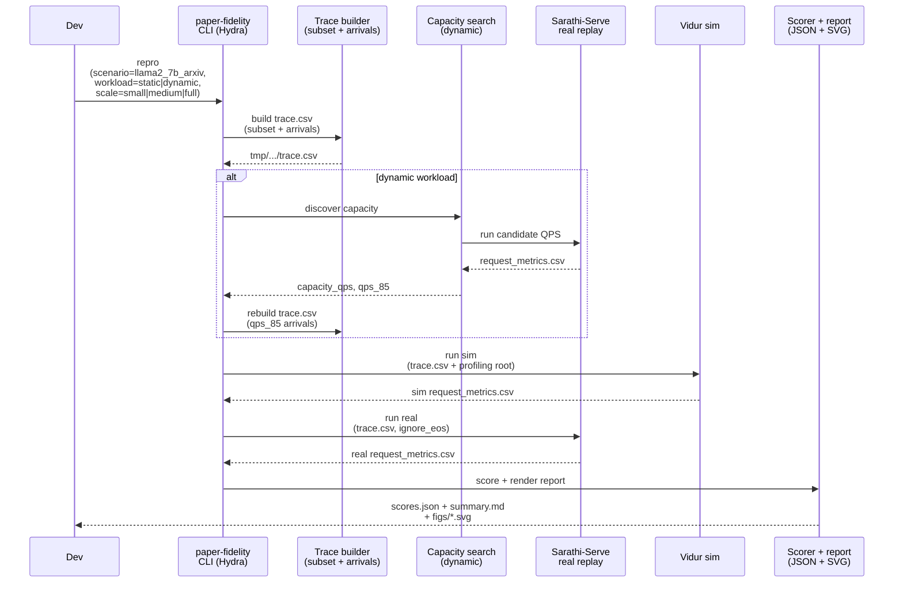

# Plan: Comparable Vidur sim vs Sarathi real (LLaMA2-7B)

## HEADER
- **Purpose**: Implement the requirements in `context/tasks/working/req-vidur-sim-vs-real.md` so we can run paper-fidelity sim-vs-real experiments for LLaMA2-7B that are comparable by construction (same trace, same decode token counts, aligned metric boundaries), and produce both machine-readable JSON and paper-style Markdown + SVG outputs.
- **Status**: Draft
- **Date**: 2026-01-07
- **Dependencies**:
  - `context/tasks/working/req-vidur-sim-vs-real.md` (requirements; authoritative for this plan)
  - `specs/002-reproduce-vidur-paper-fidelity/spec.md` (paper-fidelity scope + methodology)
  - `specs/002-reproduce-vidur-paper-fidelity/tasks.md` (implementation checklist)
  - `specs/002-reproduce-vidur-paper-fidelity/qa-002-sim-vs-real-llama2-7b.md` (host-specific runbook notes)
  - `configs/paper_fidelity/scenario/llama2_7b_arxiv.yaml` (baseline scenario)
  - `extern/tracked/vidur/data/processed_traces/arxiv_summarization_stats_llama2_tokenizer_filtered_v2.csv` (trace lengths source)
  - `results/raw/README.md` (profiling bundle semantics; `latest/` symlink caveats)
  - `src/gpu_simulate_test/cli/paper_fidelity.py` (orchestration: trace → sim/real → score/report)
  - `src/gpu_simulate_test/paper_fidelity/traces.py` (canonical `trace.csv`, arrivals, subsetting)
  - `src/gpu_simulate_test/vidur_ext/sim_runner.py` (Vidur paper-fidelity simulation wrapper)
  - `src/gpu_simulate_test/real_bench/backends/sarathi_paper_fidelity_backend.py` (Sarathi-Serve real replay + token-count validation)
  - `src/gpu_simulate_test/paper_fidelity/scoring.py` (percentiles + percent error)
  - `src/gpu_simulate_test/paper_fidelity/report.py` (report: `scores.json`, `summary.md`, SVGs)
- **Target**: Developers iterating on paper-fidelity on multi-A100 hosts who need repeatable, comparable sim-vs-real runs for LLaMA2-7B (TP=1/PP=1).

---

## 1. Purpose and Outcome

Success looks like:

- One reproducible workflow runs **static** and **dynamic** paper-fidelity experiments for `meta-llama/Llama-2-7b-hf` with TP=1/PP=1 using:
  - Profiling root: `results/raw/vidur-profiling/llama2-7b/sarathi-serve/latest` (resolved to a timestamped directory in metadata)
  - Trace lengths source: `extern/tracked/vidur/data/processed_traces/arxiv_summarization_stats_llama2_tokenizer_filtered_v2.csv`
  - Real backend: Sarathi-Serve (in-engine metrics)
- The run enforces **token-count equality** between sim and real:
  - Sarathi must decode exactly `num_decode_tokens` per request (no early stop).
  - Vidur must report compatible `request_num_decode_tokens`.
  - Any mismatch is a hard failure (no truncation fallback).
- The run is easy to scale for iteration:
  - **Small**: first 50 requests
  - **Medium**: first 500 requests
  - **Full**: all requests
- Outputs are both human- and machine-friendly:
  - `results/reports/<date>/paper_fidelity/<scenario>/scores.json` for programmatic processing
  - `results/reports/<date>/paper_fidelity/<scenario>/summary.md` with tables
  - `results/reports/<date>/paper_fidelity/<scenario>/figs/*.svg` including ECDF + percentile plots for:
    - `request_execution_plus_preemption_time_normalized` (static)
    - `request_e2e_time_normalized` (dynamic)
- Multi-GPU default is safe:
  - If `CUDA_VISIBLE_DEVICES` is unset, pick the MIG-disabled A100 with the least used VRAM by default; allow explicit override.

Non-goals:

- Supporting TP>1 or PP>1 in this plan (requires re-profiling and additional topology alignment work).
- Reproducing the entire Vidur paper matrix; this plan is scoped to one model + one trace source on this host.

Current status (already implemented in-repo, focus is wiring + hardening):

- Trace subsetting for paper-fidelity (`trace_subset.*`) and deterministic arrivals.
- Sarathi paper-fidelity replay validates decoded token counts vs the trace and can pick a default GPU on multi-A100 hosts.
- Reports write `scores.json` and embed SVG plots into `summary.md`.

---

## 2. Implementation Approach

### 2.1 High-level flow

1. **Pin the experiment slice (inputs + boundary assumptions)**
   - Model: `meta-llama/Llama-2-7b-hf`
   - TP=1, PP=1
   - Profiling: host microbenchmark bundle under `results/raw/vidur-profiling/...` (compute-only by default)
   - Real backend: Sarathi-Serve using in-engine metrics (not client timestamps)

2. **Standardize “scale” as a first-class knob**
   - Add a Hydra config group (or a small wrapper) that maps `scale={small,medium,full}` to `trace_subset` values.
   - Ensure the subset is applied once at the trace layer so both Vidur and Sarathi consume identical request rows.

3. **Trace build and arrivals**
   - Untimed trace source → canonical `trace.csv` (prefill/decode only) → optional subsetting → arrivals:
     - static: `arrived_at=0`
     - dynamic: Poisson arrivals (seeded) and/or capacity-discovered `qps_85` for the operating point

4. **Run Sarathi real replay and validate decoded token counts**
   - Ensure Sarathi is configured with `ignore_eos=true` and validate `request_num_decode_tokens == num_decode_tokens` per request.
   - Prefer default GPU selection (least-used VRAM) unless overridden.

5. **Run Vidur simulation and validate token-count compatibility**
   - Run Vidur with the same `trace.csv` and the host profiling root.
   - Add/verify validation that Vidur’s reported `request_num_decode_tokens` aligns with the trace (and with Sarathi’s IDs/counts).

6. **Score and report**
   - Compute percentile summaries + percent error for the two normalized latency metrics.
   - Write:
     - `scores.json` (machine-readable)
     - `summary.md` with tables
     - SVG plots (ECDF + percentile bars) embedded in the Markdown

7. **Make “run all scales” easy**
   - Add a small runner script that executes `static` + `dynamic` for `small|medium|full`, and writes a manifest JSON pointing at the produced report directories and `scores.json` paths.

### 2.2 Sequence diagram (steady-state usage)

---

## 3. Files to Modify or Add

- **`context/tasks/working/req-vidur-sim-vs-real.md`** Keep requirements updated as implementation details stabilize.
- **`configs/paper_fidelity/`** Add a `scale/` group (or equivalent) that maps `small|medium|full` to `trace_subset`.
- **`src/gpu_simulate_test/cli/paper_fidelity.py`** Thread `scale` (or `trace_subset`) through `trace`, `repro`, and capacity search paths; ensure metadata includes the chosen scale/subset.
- **`src/gpu_simulate_test/vidur_ext/sim_runner.py`** Add/verify a strict validation that Vidur output token counts match the trace schema expectations for paper-fidelity.
- **`src/gpu_simulate_test/paper_fidelity/scoring.py`** Add a sim-vs-real compatibility validator (request ids + token counts) and call it before scoring.
- **`src/gpu_simulate_test/paper_fidelity/report.py`** Ensure report writes `scores.json` and SVG plots and embeds them into `summary.md` (and add any paper-style plot refinements needed).
- **`scripts/run_pf_llama2_7b_sim_vs_real.sh`** (new) Convenience script to run static+dynamic across scales and write a manifest JSON of outputs.
- **`tests/unit/test_paper_fidelity_*`** Add unit tests for:
  - scale→subset mapping
  - sim/real compatibility validation (token counts + request ids)
  - report artifacts (`scores.json`, `figs/*.svg`)

---

## 4. TODOs (Implementation Steps)

- [ ] **Add `scale` config group** Create `configs/paper_fidelity/scale/{small,medium,full}.yaml` that sets `trace_subset` appropriately, and update `repro.yaml` / `trace.yaml` defaults to include `scale: full`.
- [ ] **Expose scale in CLI** Update `paper-fidelity` CLI to accept `scale=<...>` as a top-level override and record it in `trace_meta.json` / `run_meta.json`.
- [ ] **Validate Vidur token counts** Add a check that Vidur’s `request_num_decode_tokens` matches the trace’s `num_decode_tokens` semantics for paper-fidelity, failing fast with an actionable error.
- [ ] **Validate sim vs real compatibility** Add a shared validator (called before scoring) that checks:
  - same request id set (or a documented mapping)
  - no duplicates
  - `request_num_decode_tokens` agree between sim and real
  - required metric columns present
- [ ] **Add “run all scales” script** Add `scripts/run_pf_llama2_7b_sim_vs_real.sh`:
  - runs `paper-fidelity repro` for static+dynamic at `scale=small|medium|full`
  - writes `results/reports/<date>/paper_fidelity/llama2_7b_arxiv/manifest.json` (or a separate location) containing report dirs and score paths
- [ ] **Refine paper-style plots** Ensure the SVG plots are paper-friendly (axis labels, titles, consistent styling) and embedded into `summary.md`; add a short note linking plots to the paper metrics.
- [ ] **Add/extend unit tests** Add tests for `scale` mapping and sim/real compatibility validation, and extend report tests to assert both ECDF and percentile SVG outputs exist.
- [ ] **Run validations** Run `pixi run pytest tests/unit` and a small smoke run (`scale=small`) for both static and dynamic to confirm end-to-end behavior.
