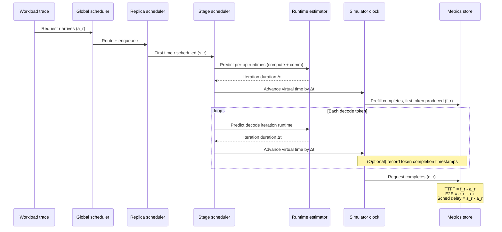
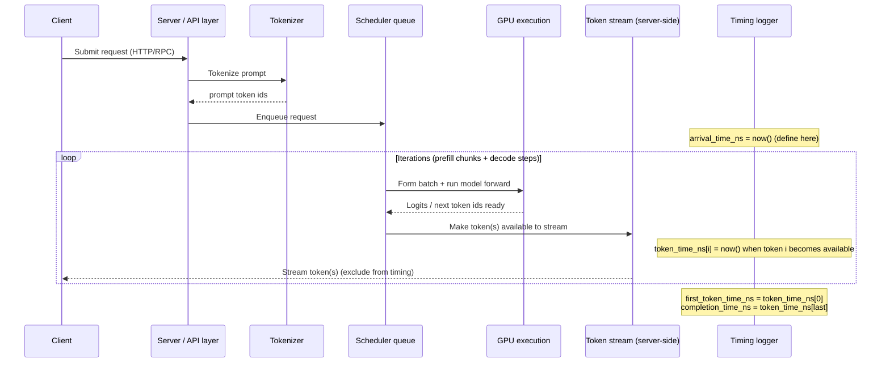

# About Vidur: what it simulates, what it “times”, and how to compare to real GPU runs

## HEADER
- **Purpose**: Summarize Vidur’s design and timing semantics (from its MLSys’24 paper), and give a practical “apples-to-apples” timing plan when comparing Vidur simulation to real inference engines (Sarathi-Serve / vLLM).
- **Status**: Active
- **Date**: 2026-01-03
- **Primary sources**:
  - Paper: `extern/tracked/vidur/paper/tex/main.tex` (includes `1-intro.tex`, `2-background.tex`, `3-design.tex`, `4-benchmark.tex`, `5-eval.tex`)
  - Metric definitions: `extern/tracked/vidur/docs/metrics.md`
  - Profiling details: `extern/tracked/vidur/docs/profiling.md`
- **Target**: Contributors doing simulator-vs-real timing comparisons who need to understand Vidur’s scope/assumptions.

## 1) What Vidur is (and isn’t)

Vidur is a **performance simulator** for LLM inference systems. You provide:

- A **model spec** (architecture parameters),
- A **deployment config** (TP/PP, replicas, device + network topology),
- A **workload** (request arrival process + prompt/decode token counts),
- A **scheduler/batching policy** (e.g., vLLM / Orca / Sarathi-Serve variants),

…and Vidur predicts request- and cluster-level performance metrics (TTFT, inter-token delay/TBT, throughput, utilization, etc.) using an event-driven simulation backed by profiled + learned operator runtimes.

Vidur is **not**:

- A functional “runs the model weights” inference engine.
- A full end-to-end serving stack simulator (it does not inherently model client networking, HTTP parsing, tokenization cost, etc.; those must be treated separately or via an explicit overhead model).

## 2) Design overview (from the paper)

### 2.1 Two-phase workflow: profiling → simulation

Vidur’s pipeline is:

1. **Model onboarding / profiling**
   - Decompose common transformer LLMs into a small set of operators.
   - Profile a minimal set of input sizes and parallelism sharding configs.
2. **Runtime estimation**
   - Train small regressors (the paper uses Random Forest) to interpolate unprofiled sizes.
   - Produce runtime lookup tables for operator latencies.
3. **Event-driven simulation**
   - Simulate request arrivals, scheduling decisions, batching, and per-iteration execution times using the predicted operator runtimes (plus communication profiles).

### 2.2 Operator triaging: what gets profiled and how it’s predicted

The profiler categorizes operators into:

- **Token-level operators**: runtime depends mainly on the **total tokens processed this iteration** (prefill + decode tokens). Examples: GEMMs, activations, layernorm, etc.
- **Sequence-level operators**: runtime depends on request history / context length. Key example: **attention**.
- **Communication operators**: runtime depends on **bytes transferred**, not model architecture (e.g., all-reduce, all-gather, send/recv).

Key attention modeling details used by the profiler/runtime estimator:

- **Prefill attention** is treated as quadratic in prefill length and approximated for a batch of prefills by using an “equivalent” single prefill length:
  - batch cost ∝ `Σ p_i^2`, approximate via a single length `sqrt(Σ p_i^2)`.
- **Decode attention** is treated as largely **memory-bound** and modeled primarily by the **total KV-cache data volume read** in the batch (rather than the exact per-request context length split).

### 2.3 Hierarchical scheduling (what Vidur simulates at the “system” layer)

Vidur models multiple tiers of scheduling:

- **Global scheduler**: request routing/load balancing across replicas (including stateful routing options).
- **Replica scheduler**: batching policy + KV-cache memory planning/management.
- **Replica stage scheduler**: microbatching within pipeline stages (synchronous PP in the paper).

Vidur includes implementations of several well-known LLM inference scheduling/batching strategies (vLLM, Orca, Sarathi-Serve, FasterTransformer, etc.), and can account for KV-cache capacity limits (including “restart” behavior for policies that preempt/restart when memory is insufficient).

## 3) What Vidur “times”: its time model and metric semantics

The most important thing for simulator-vs-real comparisons is to match **definitions**, not just column names.

Vidur defines (per request `r`) the following key timestamps (see `extern/tracked/vidur/docs/metrics.md`):

- `a_r`: **arrival time** — when the request enters the system.
- `s_r`: **schedule time** — when the request is scheduled for the first time.
- `f_r`: **prefill completion time** — when prefill completes and the **first output token is produced**.
- `c_r`: **completion time** — when the request completes (all output tokens produced or stopped).

And these durations:

- `d_r = s_r - a_r`: **scheduling delay** (time waiting before first scheduling).
- `e_r`: **execution time** (time actually executing on GPU, across attempts), excluding bubble/idle.
- `p_r`: **preemption/bubble time** (time allocated but not executing due to pipeline bubbles, preemptions, time between restarts, etc.).

### 3.1 Common request-level metrics (how to interpret Vidur CSVs)

From Vidur’s definitions:

- **Request end-to-end latency**: `request_e2e_time = c_r - a_r`
- **TTFT (time to first token / first byte)**: `prefill_e2e_time = f_r - a_r`
- **Scheduling delay**: `request_scheduling_delay = s_r - a_r`
- **Time in-system excluding initial queueing**: `request_execution_plus_preemption_time = c_r - s_r`
- **User-observed decode inter-token delay** is intended to include both compute and bubble effects:
  - `decode_token_execution_plus_preemption_times`: distribution of per-token gaps (≈ “TBT”)
  - `decode_time_execution_plus_preemption_normalized`: `(c_r - f_r) / (# decode tokens)` (per-request average)

Practical takeaway: Vidur’s “time” is driven primarily by **predicted GPU operator runtimes + predicted collective communication + the simulated scheduling/batching outcomes** (plus optional implementation overhead models if enabled).

### 3.2 What Vidur does *not* inherently time (unless you model it explicitly)

When comparing to real systems, be aware that Vidur’s default scope generally does not include:

- Client↔server network time (HTTP, TCP, streaming).
- Prompt tokenization / output detokenization CPU time.
- Python/framework overheads (unless profiled and injected via a CPU-overhead model; see `extern/tracked/vidur/docs/profiling.md`).

The paper’s evaluation mitigates CPU overhead by using an optimized vLLM fork with CUDA graphs to “eliminate unnecessary CPU overheads”, which makes real measurements closer to Vidur’s modeled scope.

## 4) Fair comparison to real runs (Sarathi-Serve / vLLM): timing logic and alignment

There are two reasonable comparison targets; pick one explicitly.

### Option A: “User-visible” server-side latency (recommended default)

Goal: compare what a user would feel, but measured **inside the server process** (no client network).

**Log these timestamps per request (both sim and real):**

- `arrival_time_ns`: when the request is enqueued into the inference system (post-tokenization).
- `first_token_time_ns`: when the first output token becomes available to stream.
- `completion_time_ns`: when the last output token becomes available.
- `token_time_ns[i]`: when each token `i` becomes available (for TBT distribution).

**Compute metrics consistently:**

- `ttft_ns = first_token_time_ns - arrival_time_ns`
- `token_latency_ns[i] = token_time_ns[i] - token_time_ns[i-1]` (TBT samples)
- `request_e2e_ns = completion_time_ns - arrival_time_ns`

**Important alignment notes:**

- Define `arrival_time_ns` *after* tokenization/HTTP parsing (Vidur workloads are already token-count based).
- Define token times at “token produced / ready to stream”, not “client received”.
- Disable features that change semantics (e.g., speculative decoding, prefix caching) unless you model them in both.

### Option B: “Model execution” time (only if you really need kernel-level parity)

Goal: compare the portion Vidur primarily models: GPU execution + comm (excluding most framework overhead).

This requires deeper instrumentation in real engines (CUDA events / Nsight/CUPTI), and clear rules for:

- Whether you include pipeline bubbles as “time” (Vidur tracks them as preemption/bubble time).
- How you attribute shared-batch execution time to individual requests.

If you only need per-request TTFT/TBT, Option A is almost always easier and more interpretable.

## 5) Mermaid diagrams: what gets timed (sim vs real)

### 5.1 Vidur simulation (event-driven “virtual clock”)

### 5.2 Real engine (Sarathi-Serve / vLLM) “server-side observed” timing

This diagram shows the recommended measurement boundary for comparisons: **inside the server/engine**, excluding client network.

## 6) Practical checklist for “meaningful” comparisons

- **Same workload definition**: match `(num_prefill_tokens, num_decode_tokens)` and arrival process; be explicit whether you’re comparing an online (queueing) regime or a no-queueing service-time regime.
- **Same scheduler semantics**: match policy + parameters (batch caps, chunk size, tokens/iter limits, watermarks, etc.) between Vidur’s scheduler and the real engine.
- **Same hardware assumptions**: device SKU + topology (Vidur’s `network_device` should reflect real NVLink/IB characteristics).
- **Same kernel class**: Vidur’s fidelity depends on profiling data; if your real engine uses different attention/fused kernels than the profiling bundle assumed, expect systematic gaps.
- **Same measurement boundary**: define `arrival_time_ns` and token times in a way that matches Vidur’s scope (avoid mixing client network and tokenization into “TTFT” unless that’s explicitly the goal).
