# Vidur: A Large-Scale Simulation Framework for LLM Inference

## 0. Metadata
- **Full Title**: Vidur: A Large-Scale Simulation Framework for LLM Inference
- **Authors**: Amey Agrawal, Nitin Kedia, Jayashree Mohan, Ashish Panwar, Nipun Kwatra, Bhargav S. Gulavani, Ramachandran Ramjee, Alexey Tumanov (extern/tracked/vidur/paper/tex/main.tex)
- **Venue / Year**: MLSys 2024 (accepted) (extern/tracked/vidur/paper/tex/main.tex)
- **Links**: Code: https://github.com/microsoft/vidur | Paper source: `extern/tracked/vidur/paper/tex/main.tex` | (Likely) arXiv: 2405.05465 (from `extern/tracked/vidur/paper/tex/source-2405.05465.tar.gz`)
- **Keywords**: LLM inference, simulator, profiling, scheduling, configuration search, what-if analysis, cost/performance modeling
- **Paper ID (short handle)**: `vidur-mlsys2024`

## 1. TL;DR (3–5 bullets)
- **Problem**: Deployment optimization is expensive because it requires running real workloads across a large configuration space (parallelism, batching, scheduling, SKUs, etc.).
  > "Optimizing the deployment of Large language models (LLMs) is expensive today since it requires experimentally running an application workload against an LLM implementation while exploring large configuration space formed by system knobs such as parallelization strategies, batching techniques, and scheduling policies." (Abstract; extern/tracked/vidur/paper/tex/0-abstract.tex)
- **Idea**: Use a high-fidelity simulator built from minimal profiling + predictive runtime modeling to estimate operator and end-to-end performance.
  > "Vidur models the performance of LLM operators using a combination of experimental profiling and predictive modeling, and evaluates the end-to-end inference performance for different workloads by estimating several metrics of interest such as latency and throughput." (Abstract; extern/tracked/vidur/paper/tex/0-abstract.tex)
- **System**: Vidur simulates both model execution and multi-tier request scheduling (replica + cluster) in an event-driven framework.
  > "Vidur leverages domain knowledge to provide high-fidelity performance estimations of LLM inference. It emulates the behavior of all layers of the inference stack, including both the model execution and the various tiers of request scheduling, at both replica as well as the cluster level." (Design; extern/tracked/vidur/paper/tex/3-design.tex)
- **Fidelity**: Reported request-level latency estimation error is under 9% across tested scenarios; tail latencies can be within a few percent in static traces.
  > "We validate the fidelity of Vidur on several LLMs and show that it estimates inference latency with less than 9\% error across the range." (Abstract; extern/tracked/vidur/paper/tex/0-abstract.tex)
  > "We observe that Vidur predicts even the tail latency (P95) with upto 3.33\% error across the four models and three datasets." (Evaluation; extern/tracked/vidur/paper/tex/5-eval.tex)
- **Result**: Vidur-Search (\syssearch) can find cost-effective deployment configs orders-of-magnitude cheaper than brute-force deployment experiments.
  > "\syssearch finds the best deployment configuration for \llamaL in one hour on a CPU machine, in contrast to a deployment-based exploration which would require 42K GPU hours -- costing 218K dollars." (Abstract; extern/tracked/vidur/paper/tex/0-abstract.tex)

## 2. Problem & Motivation

### 2.1 Why deployment optimization is expensive (and workload-dependent)
- **Combinatorial configuration space**: Choices include parallelism strategy + degree, scheduling policy, batching knobs, and workload generation/arrival patterns.
  > "First, the provider has to choose a model parallelization strategy such as the number of tensor parallel dimensions, number of pipeline stages, number of replicas, etc." (Introduction; extern/tracked/vidur/paper/tex/1-intro.tex)
  > "Third, the provider has to determine several configuration parameters, such as maximum batch size (BS),  wait time for batching, as well as algorithm specific parameters (e.g., chunk size in Sarathi, watermark fraction in vLLM)..." (Introduction; extern/tracked/vidur/paper/tex/1-intro.tex)
- **Workload-aware optimality**: The “best” config depends on both the model and the workload trace; reusing a config across traces can be expensive.
  > "This cost is further exacerbated by our observation that optimal configuration is a function of a model-trace pair..." (Introduction; extern/tracked/vidur/paper/tex/1-intro.tex)
  > "...an optimal config obtained on one trace could be sub-optimal by a factor of up to 2\myx ... when applied to the same model on a different trace." (Introduction; extern/tracked/vidur/paper/tex/1-intro.tex)

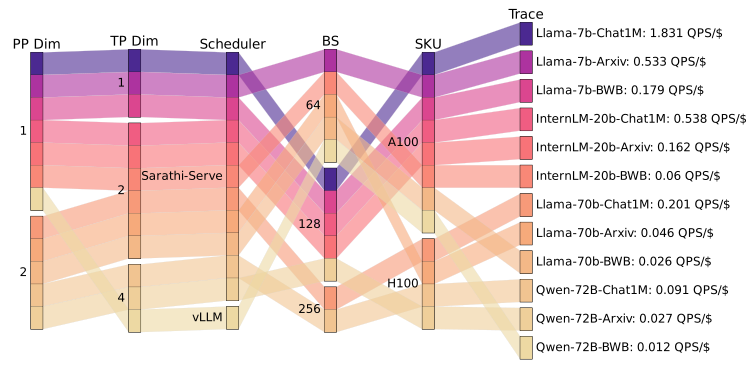
> "\textbf{Optimal configurations:} Color bands correspond to the optimal config for each of the 12 model-trace pairs with corresponding throughput achieved per dollar." (Figure; extern/tracked/vidur/paper/tex/figures-tex/fig-best-configs.tex)

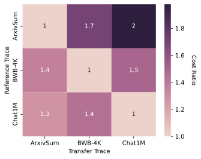
> "\textbf{Cost of mis-configuration}: the optimal config on one trace used for another results in up to 2\myx cost difference (\llamaL)." (Figure; extern/tracked/vidur/paper/tex/figures-tex/fig-best-configs.tex)

### 2.2 Inference-specific simulation challenges
- **Short time scale**: Inference iterations can be only a few milliseconds, making coarse estimators insufficient.
  > "LLM inference is a far more latency-sensitive task where iterations can be much shorter (a few milliseconds each)..." (Challenges; extern/tracked/vidur/paper/tex/2-background.tex)
- **Highly variable iteration time**: Varies by prefill vs decode phase, sequence length distribution, varying batch size, and mixed batches.
  > "Compared to traditional DL workloads... latency of different iterations can vary significantly during LLM inference." (Challenges; extern/tracked/vidur/paper/tex/2-background.tex)
- **Cascading errors**: In online inference, runtime prediction errors can perturb batching decisions, amplifying end-to-end error.
  > "...if the runtime prediction of any batch has significant errors, that can change in the batching pattern. Thus small errors in individual batch predictions cascade over time and lead to aggregate errors." (Challenges; extern/tracked/vidur/paper/tex/2-background.tex)

## 3. Key Ideas & Contributions (Condensed)
- **Vidur**: High-fidelity simulator for LLM inference metrics across models, workloads, scheduling policies, and parallelism strategies.
  > "Vidur: an LLM inference simulator that predicts key performance metrics of interest with high-fidelity" (Contributions; extern/tracked/vidur/paper/tex/1-intro.tex)
- **Vidur-Bench (\sysbench)**: Benchmark/workload suite + schedulers/framework support + profiling info for popular GPUs.
  > "\sysbench: a benchmark suite comprising of various workload patterns, schedulers and serving frameworks, along with profiling information for popular hardware like A100 and H100 GPUs" (Contributions; extern/tracked/vidur/paper/tex/1-intro.tex)
- **Vidur-Search (\syssearch)**: Search tool to identify throughput-per-dollar-optimal deployment configs under SLO constraints.
  > "\syssearch: a configuration search tool that helps optimize deployment by identifying the highest throughput per dollar configuration" (Contributions; extern/tracked/vidur/paper/tex/1-intro.tex)

## 4. Method Overview
- **High-level flow**: (1) onboard a model via profiling + runtime estimation, then (2) run event-driven simulations for workloads/configs, and (optionally) (3) search configs.
  > "Vidur primarily has two phases of processing. First is the model onboarding phase..." (System Overview; extern/tracked/vidur/paper/tex/3-design.tex)
  > "Once the model is onboarded, the user can perform simulations using various scheduling policies, and parallelism strategies, across a wide range of workloads..." (System Overview; extern/tracked/vidur/paper/tex/3-design.tex)

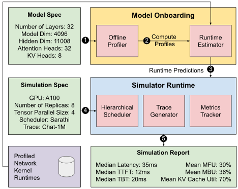
> "Vidur Simulator High Level Architecture." (Figure; extern/tracked/vidur/paper/tex/figures-tex/fig-hld.tex)

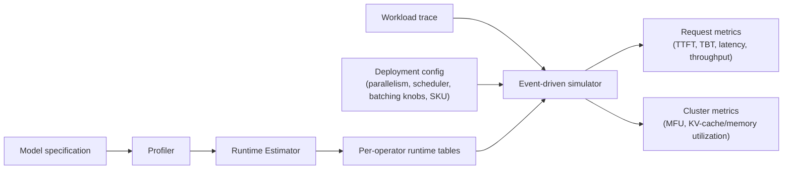

## 5. Interface / Contract (Inputs & Outputs)
- **Inputs (model onboarding)**: Model specification + minimal targeted profiling runs.
  > "...the model specification is used to generate a set of compute operators to be profiled. The Vidur profiler ... collects the runtime characteristics..." (System Overview; extern/tracked/vidur/paper/tex/3-design.tex)
- **Inputs (simulation)**: Deployment configuration + workload trace / arrival process.
  > "Vidur takes a specification of deployment configuration and workload, and predicts a variety of request-level metrics..." (Introduction; extern/tracked/vidur/paper/tex/1-intro.tex)
- **Outputs**: Operator-, request-, replica-, and cluster-level metrics (and search visualizations in \syssearch).
  > "Using the estimator, Vidur takes a specification of deployment configuration and workload, and predicts a variety of request-level metrics such as Time to First Token (TTFT), Time Between Tokens (TBT), latency, throughput..." (Introduction; extern/tracked/vidur/paper/tex/1-intro.tex)
  > "\syssearch... also gives detailed visualizations of how changes in configurations impact cost, TTFT, TBT, etc." (Syssearch; extern/tracked/vidur/paper/tex/4-benchmark.tex)

## 6. Architecture / Components

### 6.1 Profiler (operator triaging + targeted measurements)
- **Core decomposition**: Classify operators by how runtime depends on batch/token/history to control profiling explosion.
  > "The profiler analyzes different operators to identify their input dependencies. We find that all the operators can be placed on one of the three buckets:" (Profiler; extern/tracked/vidur/paper/tex/3-design.tex)
- **Token-level operators**: Runtime depends primarily on total tokens in the current iteration (prefill + decode).
  > "\textit{Token-level Operators:} ... their runtime only depends on the total number of tokens being processed (prefill plus decode) in the batch." (Profiler; extern/tracked/vidur/paper/tex/3-design.tex)
- **Sequence-level operators (attention)**: Depends on context length and/or KV-cache state, requiring special modeling.
  > "\textit{Sequence-level Operators:} The attention operation depends not only on the number of tokens in the current batch but also the context length of each request." (Profiler; extern/tracked/vidur/paper/tex/3-design.tex)
- **Communication operators**: Modeled as topology- and payload-dependent, model-agnostic profiles.
  > "\textit{Communication Operators:} The runtime of communication operations like \textit{all-reduce} and \textit{all-gather} depend only on the amount of data to be transferred..." (Profiler; extern/tracked/vidur/paper/tex/3-design.tex)

### 6.2 Runtime Estimator (fit-and-interpolate runtime surfaces)
- **Goal**: Generalize from a limited set of profiled points to predict runtimes over the larger input space seen in end-to-end runs.
  > "Collecting profiling data for every possible input combination across all the operators is prohibitively expensive. Therefore, we collect a limited set of data points and rely on small machine-learning models to interpolate the runtimes." (Runtime Estimator; extern/tracked/vidur/paper/tex/3-design.tex)
- **Model choice**: Random forest regression used for a balance of data-frugality and fidelity (vs MLPs or polynomials).
  > "For our scenario, we find that random forest (RF) regression models achieve the right balance between data frugality and fidelity." (Runtime Estimator; extern/tracked/vidur/paper/tex/3-design.tex)

### 6.3 Hierarchical Scheduler (routing + batching + memory mgmt + pipeline microbatches)
- **Architecture**: Three tiers: global scheduler → replica scheduler → replica stage scheduler.
  > "In Vidur we adopt a three-tier hierarchical scheduler architecture, that provides a powerful and extensible interface." (Scheduler; extern/tracked/vidur/paper/tex/3-design.tex)
- **Replica scheduler responsibilities**: Batching + KV-cache memory planning/management exposed via APIs to implement policies.
  > "Second is the replica scheduler that encapsulates two key responsibilities; batching and memory management." (Scheduler; extern/tracked/vidur/paper/tex/3-design.tex)
- **Extensibility claim**: Existing batching policies implemented in <150 LOC each in the simulator (suggesting a stable policy interface).
  > "...all the aforementioned policies have been implemented each in less than 150 lines of Python code in our simulator" (Scheduler; extern/tracked/vidur/paper/tex/3-design.tex)

### 6.4 Vidur-Bench (\sysbench) (workloads + metrics)
- **Workload diversity**: Traces curated from open datasets to cover varied prompt/decode distributions and arrival rates.
  > "\sysbench provides a set of workloads curated from publicly available datasets..." (Sysbench; extern/tracked/vidur/paper/tex/4-benchmark.tex)
- **Metrics surface**: Operator/request/replica/hardware metrics, including TTFT and TBT and cluster-level utilization.
  > "\sysbench provides a comprehensive set of system-level performance metrics..." (Sysbench; extern/tracked/vidur/paper/tex/4-benchmark.tex)

### 6.5 Vidur-Search (\syssearch) (SLO-constrained deployment optimization)
- **Objective**: Maximize QPS per dollar while satisfying latency SLOs (TTFT/TBT) and stability constraints (e.g., bounded scheduling delay).
  > "\syssearch helps the operator maximize QPS per dollar." (Syssearch; extern/tracked/vidur/paper/tex/4-benchmark.tex)
  > "Specifically we constrain the P99 scheduling delay to be under 5 seconds." (Syssearch; extern/tracked/vidur/paper/tex/4-benchmark.tex)
- **Key method**: For each config, binary search the maximum sustainable QPS (“capacity”) by simulating and checking scheduling-delay blowup.
  > "We use this property to find the maximum QPS supported by a system via a simple binary search..." (Syssearch; extern/tracked/vidur/paper/tex/4-benchmark.tex)

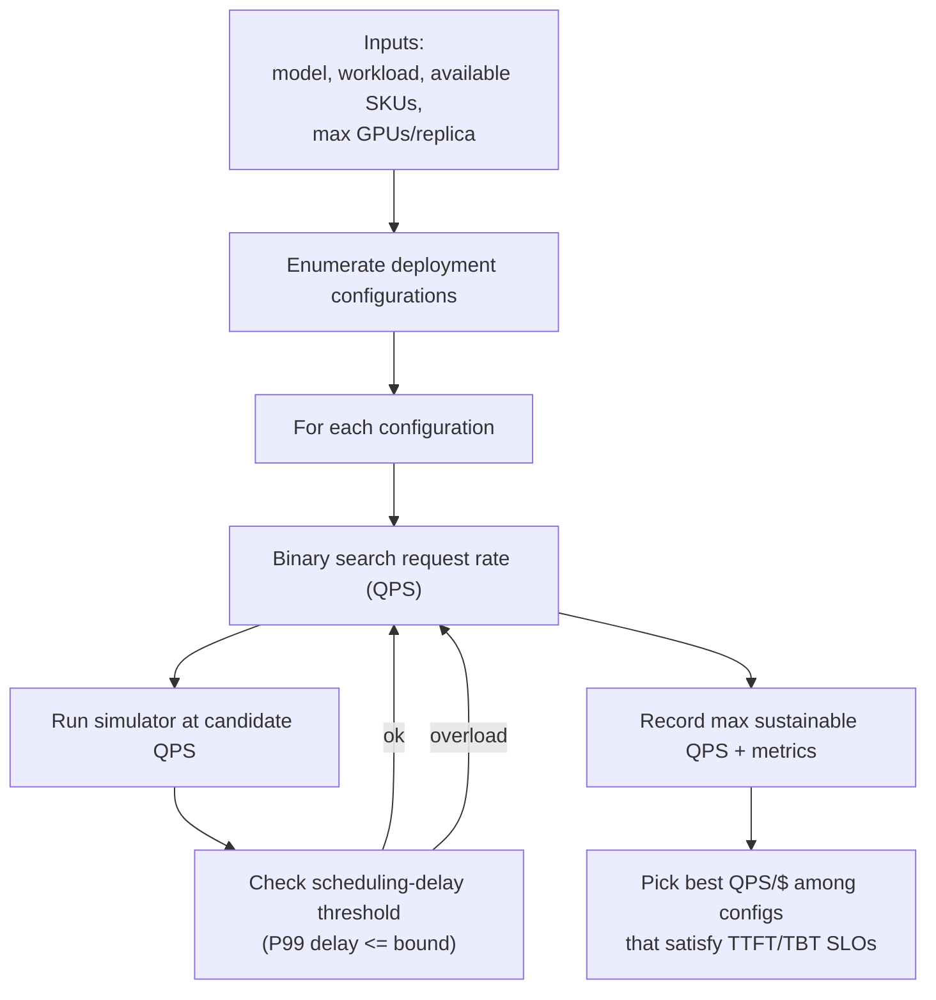

## 7. Algorithm / Pseudocode (Optional)

### 7.1 \syssearch: capacity (max-QPS) via binary search
```python
# Given: config c, workload trace t, delay_threshold (e.g., P99 delay <= 5s)
# Return: capacity_qps(c, t)

lo, hi = 0.0, qps_upper_bound(c, t)  # choose a safe upper bound; paper uses capacity-point search per config
best = 0.0
for _ in range(max_iters):
    mid = (lo + hi) / 2
    metrics = simulate(config=c, workload=t, target_qps=mid)
    if metrics.p99_scheduling_delay <= delay_threshold:
        best = mid
        lo = mid
    else:
        hi = mid
return best
```
- **Grounding**: Capacity is defined via scheduling-delay stability and found via binary search.
  > "Capacity of the system is defined as the maximum queries per second that it can support without the queuing delay blowing up." (Syssearch; extern/tracked/vidur/paper/tex/4-benchmark.tex)
  > "We use this property to find the maximum QPS supported by a system via a simple binary search..." (Syssearch; extern/tracked/vidur/paper/tex/4-benchmark.tex)

### 7.2 Attention profiling approximations (prefill vs decode)
```text
Prefill attention:
  Batch has P prefills with lengths p_i
  Batch cost ~ sum_i p_i^2
  Approximate by an equivalent single prefill of length sqrt(sum_i p_i^2)

Decode attention:
  Model as memory-bound
  Runtime ~ f(total KV-cache data volume fetched in the batch)
```
- **Prefill approximation**:
  > "To approximate the runtime of this batch we predict the runtime of an \textit{equivalent} batch of a single prefill of length \(\sqrt{\Sigma_{i=1}^P p_i^2}\)." (Profiler; extern/tracked/vidur/paper/tex/3-design.tex)
- **Decode modeling**:
  > "the runtime of this operation is mainly determined by the total data volume that needs to be fetched from the \kvcache..." (Profiler; extern/tracked/vidur/paper/tex/3-design.tex)

## 8. Training Setup
- **Not LLM training**: The “training” in Vidur is training small runtime estimators for kernel/operator latency interpolation.
  > "Therefore, we collect a limited set of data points and rely on small machine-learning models to interpolate the runtimes." (Runtime Estimator; extern/tracked/vidur/paper/tex/3-design.tex)
- **Profiling**: Minimal profiling is used; additional surfaces are inferred via estimator models.
  > "To minimize the cost barrier of adding new models to the system, we collect minimal data during the profiling phase and then train small machine-learning models..." (System Overview; extern/tracked/vidur/paper/tex/3-design.tex)

## 9. Inference / Runtime Behavior
- **Inference phases**: Prefill produces first token; decode generates tokens autoregressively; KV-cache stores K/V activations.
  > "LLM inference request processing consists of two distinct phases -- prefill and decode." (Background; extern/tracked/vidur/paper/tex/2-background.tex)
  > "To avoid repeated computation, contemporary LLM inference systems store them in \kvcache." (Background; extern/tracked/vidur/paper/tex/2-background.tex)
- **Scheduler tradeoff context**: Prior work classifies schedulers by prefill- vs decode-prioritizing and the throughput/latency tradeoff.
  > "...classification of existing LLM inference schedulers into two categories -- prefill prioritizing ... and decode prioritizing..." (Background; extern/tracked/vidur/paper/tex/2-background.tex)

## 10. Experiments & Results

### 10.1 Fidelity on static and dynamic workloads
- **Static traces**: Tail (P95) normalized execution time error can be small across multiple models/workloads.
  > "We observe that Vidur predicts even the tail latency (P95) with upto 3.33\% error across the four models and three datasets." (Evaluation; extern/tracked/vidur/paper/tex/5-eval.tex)
- **Dynamic traces**: High fidelity reported near “capacity point” at 85% of capacity (motivated by production provisioning buffers).
  > "Therefore, we evaluate Vidur's fidelity near the \textit{capacity point}, which represents the maximum arrival rate the system can sustain without overloading..." (Evaluation; extern/tracked/vidur/paper/tex/5-eval.tex)
  > "As shown in \autoref{fig:fidelty-dynamic-trace}, Vidur achieves high fidelity ($< 5\%$ error) in almost all scenarios with request rate set to 85\% of the system capacity..." (Evaluation; extern/tracked/vidur/paper/tex/5-eval.tex)

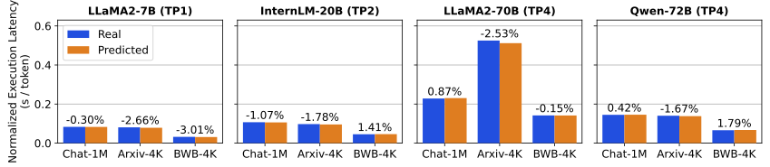
> "Fidelity of Vidur's request execution time prediction for four models and three \textit{static} traces." (Figure; extern/tracked/vidur/paper/tex/figures-tex/fig-fidelity-static-trace.tex)

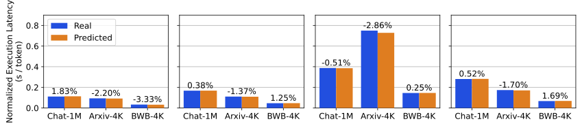
> "Fidelity of Vidur's request execution time prediction for four models and three \textit{static} traces." (Figure; extern/tracked/vidur/paper/tex/figures-tex/fig-fidelity-static-trace.tex)


> "Fidelity of Vidur's execution time predictions across four models and three \textit{dynamic} workload traces, using request load at 85\% of the maximum serving capacity for each scenario." (Figure; extern/tracked/vidur/paper/tex/figures-tex/fig-fidelity-dynamic-trace.tex)

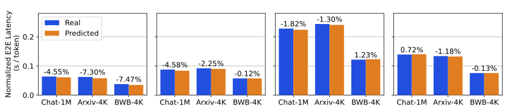
> "Fidelity of Vidur's execution time predictions across four models and three \textit{dynamic} workload traces, using request load at 85\% of the maximum serving capacity for each scenario." (Figure; extern/tracked/vidur/paper/tex/figures-tex/fig-fidelity-dynamic-trace.tex)

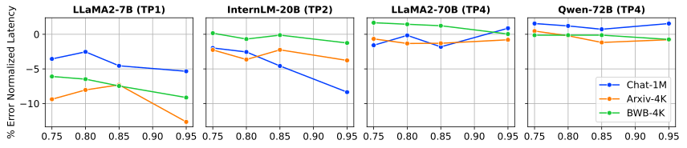
> "Prediction error for p95 normalized end-to-end latency at arrival rates between 0.75\myx and 0.95\myx of the maximum serving capacity." (Figure; extern/tracked/vidur/paper/tex/figures-tex/fig-fidelity-dynamic-trace-trends.tex)

### 10.2 What-if analysis + cost/performance optimization
- **SLO-driven optimization**: Example SLOs used in paper: TTFT P90 < 2s and TBT P99 < 200ms.
  > "We put the following SLO constraints on the latency metrics: TTFT P90 $<$ 2s and TBT P99 $<$ 200ms." (What-if; extern/tracked/vidur/paper/tex/5-eval.tex)
- **Workload changes optimal configs**: The “best” batch size and even GPU SKU can change as the workload’s KV-cache pressure changes.
  > "First, the \textit{change in workload can drastically change the optimal configuration}." (What-if; extern/tracked/vidur/paper/tex/5-eval.tex)
  > "This is a consequence of the high \kvcache load in BWB workload due to large decode sequences." (What-if; extern/tracked/vidur/paper/tex/5-eval.tex)
- **Cost savings**: Search over many configs becomes feasible on CPUs vs enormous projected GPU-hours.
  > "The what-if analysis... required a total of 35,565 runs, with a total projected GPU duration of 1,139,865 dollars. The same search completes takes only $\sim12.5$ hours on a 96-core CPU machine costing just \$125." (Appendix; extern/tracked/vidur/paper/tex/9-appendix.tex)

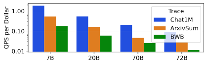
> "QPS per dollar for best configurations using P90 TTFT and P99 TBT SLOs of 2s and 200ms respectively." (Figure; extern/tracked/vidur/paper/tex/figures-tex/fig-qps-per-dollar.tex)

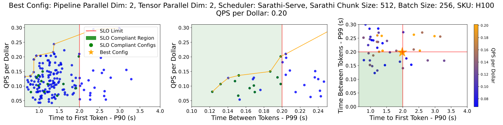
> "Capacity per dollar for different deployment configurations vs corresponding TTFT-P90 (left) and  TBT-P99 (middle)." (Figure; extern/tracked/vidur/paper/tex/figures-tex/fig-parto-slo.tex)

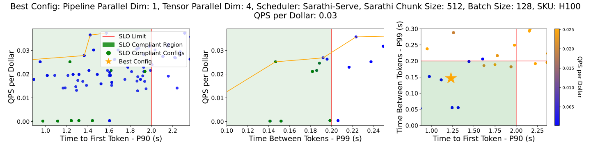
> "Capacity per dollar for different deployment configurations vs corresponding TTFT-P90 (left) and  TBT-P99 (middle)." (Figure; extern/tracked/vidur/paper/tex/figures-tex/fig-parto-slo.tex)

## 11. Ablations & Analysis
- **Configuration stability / transfer risk**: Optimal config for one workload can be far from optimal for another (up to ~2× overhead in example).
  > "\autoref{fig:intro:cost-of-misconfig} shows the overhead factor of using the optimal configuration for one workload, to serve a different workload on the \llamaL model." (What-if; extern/tracked/vidur/paper/tex/5-eval.tex)
  > "...such a misconfiguration can result in a very high overhead, e.g., ... results in a 2\myx overhead!" (What-if; extern/tracked/vidur/paper/tex/5-eval.tex)
- **Model architecture matters**: Similar-sized models can have different KV-cache loads and deployment choices (e.g., GQA vs MHA).
  > "Second, even models with similar sizes can have very different performance characteristics due to variation in architectural details." (What-if; extern/tracked/vidur/paper/tex/5-eval.tex)
  > "\llamaL uses Group Query Attention (GQA), where as \qwenL employs Multi Head Attention (MHA) -- which translates to 8\myx higher \kvcache load." (What-if; extern/tracked/vidur/paper/tex/5-eval.tex)
- **Arrival rate sensitivity**: Error can grow near capacity due to tipping-point dynamics; appendix reports additional results up to 95% capacity.
  > "Note that, as we approach capacity point, any small deltas in prediction can lead to significant blow up of the errors." (Evaluation; extern/tracked/vidur/paper/tex/5-eval.tex)
  > "We present additional fidelity results for Vidur at different request arrival rates..." (Appendix; extern/tracked/vidur/paper/tex/9-appendix.tex)

## 12. Limitations, Risks, Ethics
- **Limitations (from reading)**: The provided LaTeX sources do not include an explicit “limitations/ethics” section; interpret fidelity claims in the context of the profiled hardware/models/schedulers and the simulator’s approximation choices.
- **Risk**: Over-trusting simulator outputs outside profiled regimes (new kernels, new interconnects, new schedulers) could lead to misestimation; use targeted validation when extending.

## 13. Applicability & Integration Notes (Project-Focused)
- **Why it matters here**: This repo already vendors Vidur as a submodule (`extern/tracked/vidur/`), and we frequently need fast, repeatable “what-if” comparisons for scheduling/parallelism decisions without burning GPU-hours.
- **Potential uses in this repo**:
  - **Simulator-driven experiments**: Use Vidur to generate predicted TTFT/TBT/throughput across workload traces under varying scheduler + parallelism knobs.
  - **Search harness**: Use a \syssearch-like workflow to find “good enough” configs, then validate a small subset on real hardware.
- **Integration caution**: Ensure profiling data matches the GPU SKU + interconnect; the paper emphasizes model-agnostic comm profiling but hardware-specific characteristics still matter.

## 14. Reproducibility Plan
- **Paper artifacts (in this repo)**: LaTeX sources and figures live under `extern/tracked/vidur/paper/tex/`.
- **Code artifact**: Vidur source is under `extern/tracked/vidur/` (submodule); initialize submodules if needed: `git submodule update --init --recursive`.
- **Suggested reproduction outline**:
  - **Step 1**: Select a model spec + target hardware SKU.
  - **Step 2**: Run Vidur profiler to collect minimal operator/comm profiles.
  - **Step 3**: Train runtime estimator (RF regressors) and export runtime tables.
  - **Step 4**: Run simulations on static traces, then dynamic traces near capacity (e.g., ~0.85×).
  - **Step 5**: Run config search with SLO constraints and compare predicted cost/performance tradeoffs.

## 15. Related Work
- **Training-focused simulators**: Habitat, Daydream, Proteus, etc., leverage predictable training iteration structure; Vidur argues inference needs different handling.
  > "State-of-the-art DNN simulation frameworks ... focus on training jobs." (Challenges; extern/tracked/vidur/paper/tex/2-background.tex)
  > "Different from these training-based simulators, Vidur is the first simulator that accounts for the specific properties of LLM inference." (Related Work; extern/tracked/vidur/paper/tex/7-related.tex)

## 16. Open Questions & Follow-Ups
- **Accuracy boundaries**: When does the “decode is memory-bound; model via total KV reads” approximation break (e.g., extreme skew, new attention kernels)?
- **New architectures**: How to extend the declarative model spec for MoE, multi-modal, speculative decoding, or new KV-cache formats?
- **Scheduler extensions**: The paper mentions future support for async comm, sequence parallelism, and speculative pipelined decoding—what are the minimal API changes needed?
  > "...in the future, we aim to extend the replica stage scheduler to emulate various optimizations like asynchronous communication, sequence parallelism ... and speculative pipelined decoding..." (Scheduler; extern/tracked/vidur/paper/tex/3-design.tex)

## 17. Glossary / Notation
- **Prefill**: Prompt-processing phase that produces the first output token.
  > "The prefill phase processes the entire user input prompt and produces the first output token." (Background; extern/tracked/vidur/paper/tex/2-background.tex)
- **Decode**: Autoregressive phase generating tokens one-by-one.
  > "Subsequently, output tokens are generated one at a time in an autoregressive manner." (Background; extern/tracked/vidur/paper/tex/2-background.tex)
- **KV-cache**: Stored key/value activations used to avoid recomputation across decode steps.
  > "To avoid repeated computation, contemporary LLM inference systems store them in \kvcache." (Background; extern/tracked/vidur/paper/tex/2-background.tex)
- **TTFT**: Time to First Token.
- **TBT**: Time Between Tokens.
- **TP / PP**: Tensor parallelism / pipeline parallelism.
  > "Tensor Parallelism (TP) is a common strategy to parallelize LLM inference..." (Background; extern/tracked/vidur/paper/tex/2-background.tex)
  > "Pipeline Parallelism (PP) is another parallelization strategy..." (Background; extern/tracked/vidur/paper/tex/2-background.tex)
- **Capacity point**: Maximum sustainable arrival rate before scheduling delay/queues blow up.
  > "capacity point... represents the maximum arrival rate the system can sustain without overloading" (Evaluation; extern/tracked/vidur/paper/tex/5-eval.tex)

## 18. Figures & Diagrams (Optional)
- **High-level architecture**: `figures/vidur-hld.svg`
- **Workload/config dependence**: `figures/parallel_coord.svg`
- **Misconfiguration cost**: `figures/confusion_matrix_Llama-2-70b-hf.svg`
- **Static fidelity**: `figures/static_fidelity_v12_request_execution_plus_preemption_time_normalized_p50.svg`, `figures/static_fidelity_v12_request_execution_plus_preemption_time_normalized_p95.svg`
- **Dynamic fidelity**: `figures/dynamic_fidelity_v8_request_e2e_time_normalized_85_p50.svg`, `figures/dynamic_fidelity_v8_request_e2e_time_normalized_85_p95.svg`
- **Dynamic error trend**: `figures/dynamic_fidelity_v8_request_e2e_time_normalized_error_trends_p95.svg`
- **Optimization summaries**: `figures/capacity_per_dollar.svg`, `figures/llama70b_Chat1M_ttft_tbt_90_99_2.0_0.2.svg`, `figures/qwen_ArxivSum_ttft_tbt_90_99_2.0_0.2.svg`

## 19. BibTeX / Citation
```bibtex
@inproceedings{agrawal2024vidur,
  title        = {Vidur: A Large-Scale Simulation Framework for LLM Inference},
  author       = {Agrawal, Amey and Kedia, Nitin and Mohan, Jayashree and Panwar, Ashish and Kwatra, Nipun and Gulavani, Bhargav S. and Ramjee, Ramachandran and Tumanov, Alexey},
  booktitle    = {Proceedings of Machine Learning and Systems (MLSys)},
  year         = {2024},
  url          = {https://github.com/microsoft/vidur},
}
```
