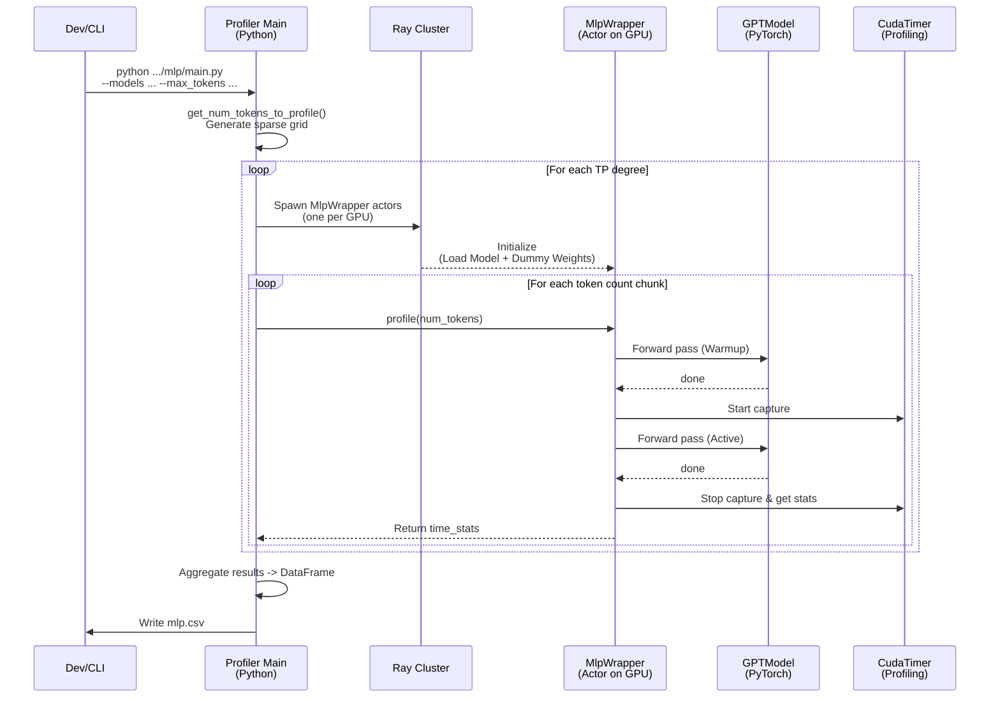

# About Vidur Profiling Sampling

Vidur profiles operators by sampling a sparse grid of input configurations (token counts, batch sizes, etc.) and then training regressors (Random Forest) to predict execution times for any input.

## How Vidur determines input sizes

Vidur defines hardcoded "spaces" (lists of values with increasing step sizes) for each dimension. It filters these lists based on the maximum limits provided via CLI arguments (e.g., `--max_tokens`, `--max_batch_size`).

The logic resides in `extern/tracked/vidur/vidur/profiling/utils/__init__.py`.

### 1. Compute (MLP) - Token Counts
- **Function**: `get_num_tokens_to_profile(max_num_tokens)`
- **Sampling Strategy**:
  - Starts dense (steps of 1, 2, 4)
  - Increases step size as token counts grow (doubling the step size as the range doubles):
    - 1-8: Dense
    - 8-1024: Step 8
    - 1024-2048: Step 16
    - 2048-4096: Step 32
    - ... and so on (up to 1024 step size for >64k tokens)
- **Goal**: Capture the non-linear "ramp-up" for small sizes and the linear behavior for large sizes.
- **Configurable**: **No**, these step sizes are hardcoded.

```python
# extern/tracked/vidur/vidur/profiling/utils/__init__.py

def get_num_tokens_to_profile(max_num_tokens: int):
    NUM_TOKENS_SPACE = (
        list([1, 2, 4])
        + list(range(8, 1024, 8))
        + list(range(1024, 2 * 1024 + 1, 16))
        + list(range(2 * 1024, 4 * 1024 + 1, 32))
        + list(range(4 * 1024, 8 * 1024 + 1, 64))
        # ...
    )
    # ...
```

### 2. Attention
Attention profiling covers three dimensions: `prefill_chunk_size`, `kv_cache_size`, and `batch_size` (decode).

- **Prefill Chunk Sizes**: `get_attention_prefill_chunk_sizes_to_profile`
  - Step sizes: 16 (up to 128), 32 (up to 1024), 64 (up to 4096), etc.
- **KV Cache Sizes**: `get_seq_lengths_to_profile`
  - Step sizes: 32 (up to 1024), 64 (up to 4096), 256 (up to 64k).
- **Decode Batch Sizes**: `get_attention_batch_sizes_to_profile`
  - Step sizes: 1 (up to 128), 8 (up to 1024).
- **Configurable**: **No**, these step sizes are hardcoded.

```python
# extern/tracked/vidur/vidur/profiling/utils/__init__.py

def get_attention_prefill_chunk_sizes_to_profile(max_seq_len: int):
    PREFILL_CHUNK_SIZE_SPACE = (
        list(range(64, 128 + 1, 16))
        + list(range(128, 1024 + 1, 32))
        + list(range(1024, 4 * 1024 + 1, 64))
        # ...
    )
    # ...

def get_seq_lengths_to_profile(max_seq_len: int):
    SEQ_LENGTH_SIZE_SPACE = (
        list(range(0, 1024 + 1, 32))
        + list(range(1024, 4 * 1024 + 1, 64))
        # ...
    )
    # ...

def get_attention_batch_sizes_to_profile(min_batch_size: int, max_batch_size: int):
    BATCH_SIZE_SPACE = list(range(1, 128 + 1, 1)) + list(range(128, 1024 + 1, 8))
    # ...
```

### 3. Network (Collectives)
- **Function**: `get_collectives_sizes_to_profile(max_collective_size)`
- **Sampling Strategy**: Step sizes increase from 4KB to 256KB as message size grows.

### 4. CPU Overhead
- **Function**: `get_cpu_overhead_batch_sizes_to_profile(max_batch_size)`
- **Sampling Strategy**: Steps of 8 (up to 64), then 16 (up to 256).

## How to control sampling density

The sampling density is **hardcoded in the source code** and cannot be controlled via configuration files or CLI arguments.

To change the density (e.g., to profile every 1 token for higher fidelity at small scales), you must modify `extern/tracked/vidur/vidur/profiling/utils/__init__.py`.

**Example: Increasing MLP profiling density**

```python
# extern/tracked/vidur/vidur/profiling/utils/__init__.py

def get_num_tokens_to_profile(max_num_tokens: int):
    # OLD: Sparse sampling
    # NUM_TOKENS_SPACE = list([1, 2, 4]) + list(range(8, 1024, 8)) ...

    # NEW: Dense sampling (e.g., every 8 tokens everywhere)
    NUM_TOKENS_SPACE = list(range(8, 128 * 1024 + 1, 8))
    
    # ... rest of function ...
```

**Note**: Increasing density significantly increases profiling time.

## How the Vidur Profiler Works

The Vidur profiler (specifically the `mlp` profiler as an example) uses a distributed architecture with Ray to profile multiple tensor-parallel configurations concurrently.

### Architecture

1.  **Main Driver (`main.py`)**:
    -   Coordinates the profiling run.
    -   Generates the list of inputs (token counts) to profile.
    -   Spawns remote `MlpWrapper` actors (one per GPU).
    -   Distributes profiling tasks (chunks of token counts) to these actors.
    -   Aggregates results into a Pandas DataFrame.

2.  **Wrapper (`mlp_wrapper.py`)**:
    -   Instantiates the actual PyTorch model (or a specific layer implementation like `GPTModel`).
    -   Initializes dummy weights (since weights don't affect runtime, only shapes do).
    -   Executes the model forward pass with dummy inputs.
    -   Uses `CudaTimer` (via `RecordFunctionTracer` or explicit syncs) to capture kernel execution times.

### Sequence Diagram



## How to Select Profiling Parameters

When profiling a new model, you should select `--max_tokens` and `--max_batch_size` based on the **hardware capacity** and the **model architecture** to ensure the profiling grid covers the entire operating range without wasting time on impossible configurations.

### Example: LLaMA2-7B on A100 (80GB)

**1. Set `--max_tokens` based on Model Context Limit**
- **Logic**: Profiling beyond the model's supported context length is rarely useful for standard inference.
- **Example**: LLaMA2 supports up to 4096 tokens.
- **Selection**: Set `--max_tokens 4096`.
- **Why**: This ensures Vidur measures actual runtimes for all valid sequence lengths. If you profile less (e.g., 2048), Vidur will extrapolate for 2049-4096, reducing accuracy.

**2. Set `--max_batch_size` based on Memory Capacity**
- **Logic**: Calculate the maximum number of requests that can physically fit in GPU memory at full context length.
- **Calculation**:
  - **Available Memory**: `Total - Weights - Overhead`
    - A100: 80GB
    - LLaMA2-7B (fp16): ~14GB weights
    - Overhead (activations/runtime): ~4-6GB
    - **Available**: ~60GB
  - **KV Cache per Request**: `(2 * layers * hidden_dim * dtype_size) / heads * kv_heads * seq_len`? No, simpler: `2 * layers * hidden_dim * dtype_size * seq_len` is wrong for GQA.
  - **Correct KV Size (LLaMA2-7B)**:
    - Layers: 32, Hidden: 4096, KV-Heads: 32 (MHA, so 1:1), Head-Dim: 128.
    - Size per token = `2 (K+V) * 32 (layers) * 128 (dim) * 2 (bytes) = 16,384 bytes`?
    - Actually: `2 * n_layers * n_kv_heads * head_dim * 2 bytes`
    - `2 * 32 * 32 * 128 * 2 = 524,288 bytes` (0.5 MB/token).
  - **Full Context (4096)**: `0.5 MB * 4096 ≈ 2 GB/request`.
  - **Max Batch Size**: `60 GB / 2 GB ≈ 30 requests`.
- **Selection**: Set `--max_batch_size 128` (or 64).
- **Why**: 128 is comfortably above the physical limit (30) for full context. It also covers "short request" scenarios (e.g., 512 tokens -> 0.25GB/req -> 240 reqs possible) adequately because Vidur's batch size grid (1, 2...128) captures the saturation curve well. Profiling up to 256 or 512 would mostly OOM or be redundant.