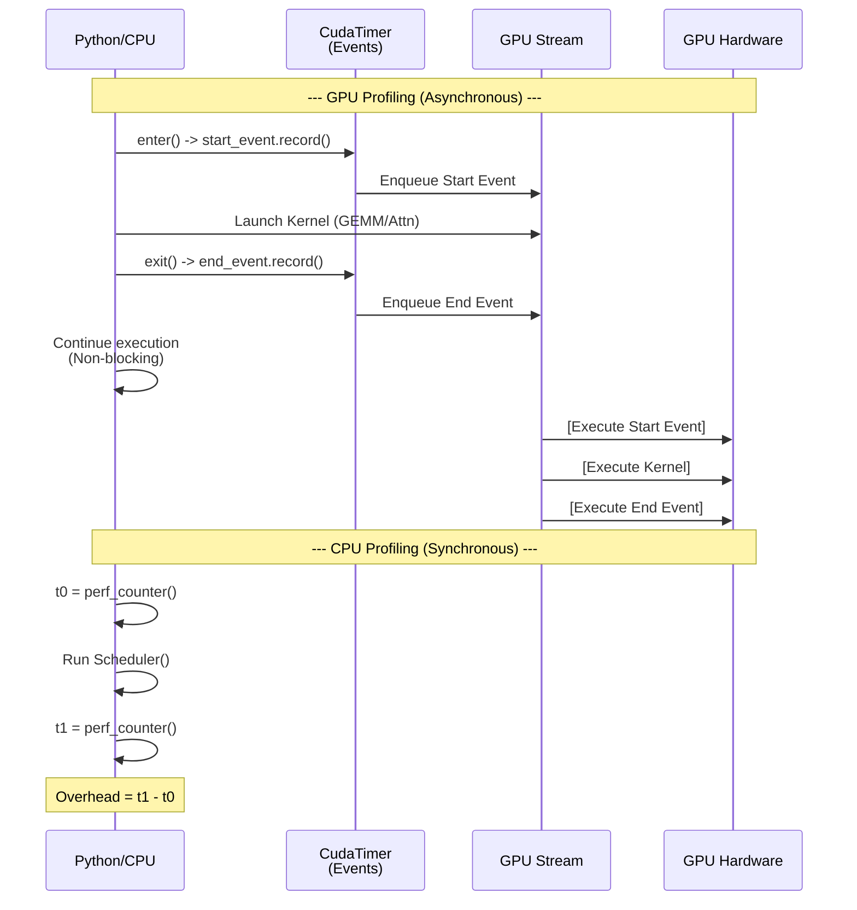

# About Vidur Profiling Timing

Vidur uses different timing mechanisms for GPU operations (Compute/Attention) and CPU operations (Overhead).

## 1. GPU Operations (Compute & Attention)

Vidur measures "pure" GPU kernel execution time, excluding Python and CPU launch overheads.

- **Mechanism**: `CudaTimer` (in `extern/tracked/vidur/vidur/profiling/common/cuda_timer.py`).
- **Method**: Asynchronous timing using `torch.cuda.Event`.
    1.  `start_event.record()` is queued in the GPU stream.
    2.  Kernels (MLP layers, Attention ops) are queued.
    3.  `end_event.record()` is queued.
    4.  CPU continues execution immediately (non-blocking).
    5.  Later, `start_event.elapsed_time(end_event)` is called, which synchronizes or queries the events to get the duration.
- **Goal**: To capture the hardware execution time of the kernels.

### Source Code: `CudaTimer`

```python
# extern/tracked/vidur/vidur/profiling/common/cuda_timer.py

class CudaTimer:
    def __enter__(self):
        # ...
        elif self.timer_stats_store.profile_method == ProfileMethod.CUDA_EVENT:
            self.start_event = torch.cuda.Event(enable_timing=True)
            self.start_event.record() # Asynchronous start
        # ...

    def __exit__(self, *args):
        # ...
        elif self.timer_stats_store.profile_method == ProfileMethod.CUDA_EVENT:
            self.end_event = torch.cuda.Event(enable_timing=True)
            self.end_event.record() # Asynchronous end
            self.timer_stats_store.record_time(
                self.name, [self.start_event, self.end_event]
            )
        # ...
```

## 2. CPU Operations (Overhead)

Vidur measures the wall-clock time taken by the CPU to perform scheduling, sampling, and runtime management tasks.

- **Mechanism**: `BenchmarkRunner` (in `extern/tracked/vidur/vidur/profiling/cpu_overhead/benchmark_runner.py`) relying on Sarathi's internal metrics.
- **Method**: Synchronous wall-clock timing and inferred "Ray/Glue" time.
    1.  `CpuOperationMetrics` (in Sarathi) capture specific functions (schedule, sample, etc.) using `time.perf_counter()`.
    2.  `BenchmarkRunner` captures total `start_time` and `end_time` (wall clock) for the entire benchmark loop.
    3.  **Ray Overhead** is calculated as `(Total Time - Sum(Known CPU Ops)) / Steps`.

### Source Code: `BenchmarkRunner`

```python
# extern/tracked/vidur/vidur/profiling/cpu_overhead/benchmark_runner.py

class BenchmarkRunner:
    def run(self):
        # ...
        start_time = time.monotonic()
        # ... (Run execution loop) ...
        end_time = time.monotonic()

        # ... (Get metrics from Sarathi engine) ...

        total_recorded_cpu_time = (
            metric_store.cpu_operation_metrics[CpuOperationMetrics.SCHEDULE].sum
            + metric_store.cpu_operation_metrics[CpuOperationMetrics.PROCESS_MODEL_OUTPUTS].sum
            + # ... other known ops ...
        )

        # Inferred glue overhead (attributed to Ray comms)
        ray_comm_time_mean = (
            (end_time - start_time) - total_recorded_cpu_time
        ) / num_steps
```

## Sequence Diagram: Timing Brackets

