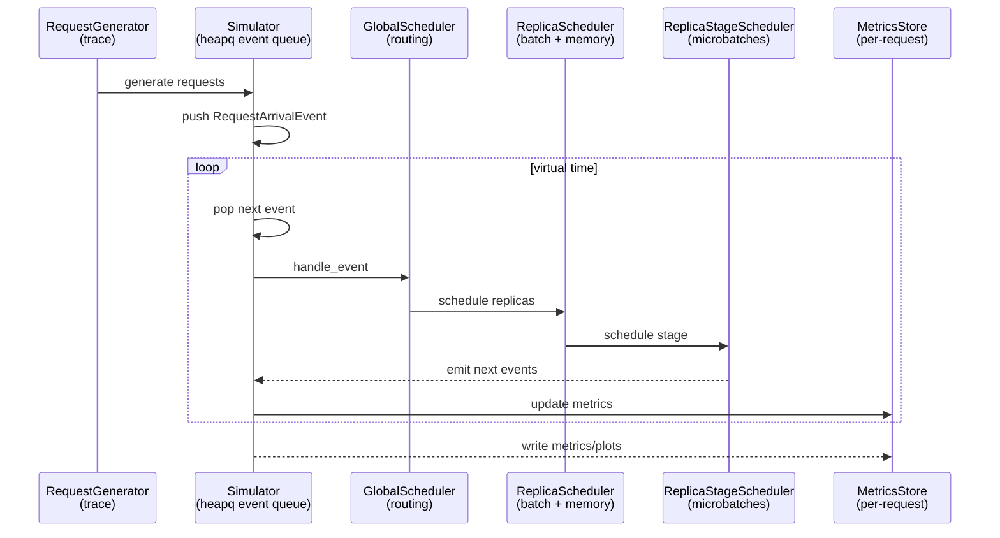

# In-depth Vidur (paper-led) with a LLaMA2-7B sim-vs-real case study

Audience: Python machine learning (ML) developers who understand large language model (LLM) inference (prefill vs decode, batching, key/value (KV) cache, tensor parallelism (TP), pipeline parallelism (PP)) and have a little familiarity with discrete-event simulation.

This deep dive explains *how Vidur works* using three aligned viewpoints:

1) The Vidur paper as the narrative spine (the paper’s TeX is vendored in this repo).
2) Vidur’s Python implementation (classes, configs, and control flow).
3) A concrete LLaMA2-7B “sim vs real” reproduction in this repo (paper-fidelity workflow + report artifacts).

If you just want “how to run Vidur correctly”, start with:

- Practical tutorial: `context/summaries/vidur-kb/tutorials/howto-use-vidur-for-llama2-7b.md`
- Report guide: `results/reports/2026-01-12/paper_fidelity/llama2_7b_arxiv/intro-to-the-report.md`

---

## 1) Paper map → code map → case-study map

Path convention used in this tutorial:

- `vidur/...` and `paper/...` are paths inside the Vidur repository vendored in this repo.
  - Vidur source code references use `vidur/...` (the Vidur Python package directory).
  - Vidur paper references use `paper/...`.

Vidur paper source (canonical for this tutorial):

- `paper/tex/main.tex`
  - `paper/tex/2-background.tex`
  - `paper/tex/3-design.tex`
  - `paper/tex/4-benchmark.tex`
  - `paper/tex/5-eval.tex`

How to read this (high-level):

- `paper/tex/main.tex` is the “table of contents” that includes the per-section files (`2-background.tex`, `3-design.tex`, ...).
- This tutorial follows the same order: first the problem framing (background), then the simulator architecture (design), then workloads/metrics (benchmark), then fidelity claims (evaluation).

This section previews the core concepts you’ll see throughout the deep dive and explains how they connect:

- **Background**: what makes LLM inference hard to model (prefill vs decode, key/value (KV) cache, tensor parallelism (TP), pipeline parallelism (PP), scheduler knobs).
- **Design**: how Vidur models that system as a discrete-event simulator with a hierarchical scheduler.
- **Profiling/runtime estimation**: how Vidur turns sparse profiling points into operator-time models (via small regressors) used by the simulator.
- **Benchmark/evaluation**: what “fidelity” means and how we quantify it in the LLaMA2-7B case study.

File pointers are included only as implementation anchors for readers who want to drill down later.

### 1.1 Background: inference phases and configuration space

Core concept:

- LLM inference has two phases with very different cost structure:
  - **prefill**: process the prompt; attention scales roughly with prompt length and can be compute-heavy.
  - **decode**: generate tokens one-at-a-time; attention often becomes memory-bandwidth bound because it reads the KV cache.
- Real systems add an additional layer of complexity: the “shape” of each iteration depends on batching/chunking decisions and memory constraints, and small per-iteration errors can cascade into different queueing dynamics over time.
- This creates a large configuration space: TP/PP degrees, routing/batching policy, chunk size, batch caps, memory watermarks, and the workload’s length distribution and arrival pattern.

How Vidur represents it (implementation anchor):

Vidur expresses these choices as config objects (request generators, scheduler configs, and type selectors) in `vidur/config/config.py`.

Two critical examples are:

1) The trace-driven request generator (workload comes from a trace file; note the explicit scale factors and max token bound):

```py
# vidur/config/config.py (pseudo)
class TraceRequestGeneratorConfig:
    # Where your workload comes from.
    trace_file: str  # CSV with arrived_at/prefill/decode lengths

    # Simple “knobs” to morph a trace without rewriting it.
    prefill_scale_factor: float = 1.0
    decode_scale_factor: float = 1.0
    time_scale_factor: float = 1.0

    # Global bound to avoid simulating requests beyond model context.
    max_tokens: int = 4096

    def get_type(self) -> RequestGeneratorType:
        return TRACE_REPLAY  # “use trace rows as requests”
```

2) The scheduler knobs that dominate batching and KV-cache memory behavior (shared base knobs, plus scheduler-specific knobs like Sarathi chunk size):

```py
# vidur/config/config.py (pseudo)
class BaseReplicaSchedulerConfig:
    # Cap “how many sequences can be in flight together”.
    batch_size_cap: int = 128

    # KV-cache paging granularity (affects memory planning + preemption behavior).
    block_size: int = 16

    # “Start preempting / throttling when memory is tight” threshold.
    watermark_blocks_fraction: float = 0.01

    # Optional override: if set, bypass auto memory planning.
    num_blocks: Optional[int] = None


class SarathiSchedulerConfig(BaseReplicaSchedulerConfig):
    # Chunked prefill knob: limits prefill tokens processed per iteration.
    chunk_size: int = 512

    def get_type(self) -> ReplicaSchedulerType:
        return SARATHI
```

How it shows up in our LLaMA2-7B run:

- `tmp/paper_fidelity/traces/llama2_7b_arxiv/trace.csv` is the concrete workload: per-request arrival time + prefill/decode token counts.
- `configs/paper_fidelity/scenario/llama2_7b_arxiv.yaml` is the “experiment definition”: it pins TP/PP, scheduler knobs, and token semantics (e.g., avoid early EOS).

### 1.2 Design: event-driven simulator and hierarchical scheduler

Core concept:

- Vidur is a **discrete-event simulator**: it maintains a time-ordered event queue and advances *virtual time* by popping the next event and applying its effects (which may schedule future events).
- The simulator’s “engine behavior” is not hardcoded; it is factored into a **hierarchical scheduler**:
  - **global scheduler**: routes requests to replicas (cluster-level decisions).
  - **replica scheduler**: decides which requests form batches and how memory (KV cache) is managed.
  - **stage scheduler**: schedules microbatches within a pipeline stage (relevant when PP > 1).
- This factoring matters because most “system differences” between serving stacks show up as differences in batching, chunking, and memory/preemption behavior—i.e., scheduler logic.

How Vidur represents it (implementation anchor):

Here is the essence of Vidur’s discrete-event simulator loop (simplified):

```py
# vidur/simulator.py + vidur/events/* (pseudo)
# Event queue is a min-heap over (time, priority).
event_queue = Heap()

# Seed the queue from the workload generator (trace or synthetic).
for req in request_generator.generate():
    event_queue.push(RequestArrivalEvent(time=req.arrived_at, request=req))

# Run until no events remain (or a time limit is reached).
while not event_queue.empty() and not terminate:
    event = event_queue.pop_min()  # next event in virtual time
    now = event.time               # advance virtual clock

    # Event mutates scheduler/request state and emits future events.
    new_events = event.handle_event(global_scheduler, metrics_store)
    event_queue.push_all(new_events)
```

Event ordering at the *same* timestamp is controlled by an explicit priority enum:

```py
# vidur/types/event_type.py (pseudo)
# Smaller number runs earlier at the same virtual time.
BATCH_STAGE_ARRIVAL      = 1
REQUEST_ARRIVAL          = 2
BATCH_STAGE_END          = 3
BATCH_END                = 4
GLOBAL_SCHEDULE          = 5
REPLICA_SCHEDULE         = 6
REPLICA_STAGE_SCHEDULE   = 7  # scheduled last to “see” arrivals
```

How it shows up in our LLaMA2-7B run:

- `tmp/pf_llama2_7b_cpu_overhead_20260112_040049/repro.log` includes `Starting simulation ... and 50 requests`, which is emitted by the simulator loop when it starts consuming the event queue.

### 1.3 Design: profiling + runtime estimation (operator-time models)

Core concept:

- The simulator’s event structure tells you *which* operations happen; you still need a way to estimate *how long they take* on real hardware.
- Exhaustively profiling every possible batch composition is infeasible, so Vidur:
  - profiles a small, carefully chosen set of operator runtimes (guided by operator input dependencies), then
  - fits lightweight regressors (random forest models in the paper) to interpolate runtimes over the range encountered during simulation.
- Conceptually, Vidur turns “profiling measurements” into a set of *operator runtime lookup functions* used at simulation time.

How Vidur represents it (implementation anchor):

Vidur’s runtime pipeline is “profile a few points → fit small regressors → use predictions during simulation”.

Here is the essence (simplified):

```py
# vidur/profiling/* (pseudo)
# Onboarding/profiling: measure operator runtimes on real hardware.
profiling_root = "data/profiling/<category>/<device>/<network>/<model>/..."

for operator_family in ["compute(mlp/etc)", "attention", "collectives", "cpu_overhead"]:
    rows = []
    for each chosen input point (batch_size, tokens, kv_cache_size, ...):
        t = run_microbench(operator_family, inputs)
        rows.append({inputs..., "runtime_ms": t})
    write_csv(profiling_root / f"{operator_family}.csv", rows)


# vidur/execution_time_predictor/sklearn_execution_time_predictor.py (pseudo)
# Runtime estimator: train small models and precompute lookup tables.
dfs = load_and_filter_csvs(profiling_root, model_config, tp_degree, block_size, ...)

models = {}
for op_name in ops_to_model:
    X = derived_features(dfs[op_name])  # e.g., kv_cache_size, chunk_size^2, batch_size
    y = measured_runtime(dfs[op_name])
    models[op_name] = fit_random_forest_with_grid_search(X, y)

pred_tables = {}
for op_name, model in models.items():
    pred_tables[op_name] = model.predict(on_a_reasonable_grid)

# Simulation later calls predictor.get_execution_time(batch, stage_id)
# which composes these per-op predictions into a batch-stage time.
```

How it shows up in our LLaMA2-7B run:

- `tmp/paper_fidelity/profiling_roots/llama2_7b_arxiv/` is the host-generated profiling bundle used by Vidur for this run.
- `tmp/pf_llama2_7b_cpu_overhead_20260112_040049/repro.log` shows the estimator training (“Trained model ...”) before the simulator runs end-to-end.

### 1.4 Benchmark/evaluation: metrics and “paper-fidelity” scoring

Core concept:

- You need metrics that reflect user experience and system behavior under varying request lengths and arrival patterns.
- The paper emphasizes **per-token normalized request latency** for comparing across workloads with different output lengths (a common approach in LLM systems papers).
- “Fidelity” is then defined as the percent error between simulated and measured metrics at key percentiles (e.g., p50/p95).
- A subtle but important point (directly relevant to our case study): for smaller models, **CPU/runtime overhead** can dominate a larger fraction of wall time, making it a common source of error if it is missing or mis-modeled.

How we implement the same comparison in this repo (implementation anchor):

At a high level, the paper-fidelity pipeline does:

```py
# src/gpu_simulate_test/paper_fidelity/scoring.py (pseudo)
sim = read_csv(sim_csv)
real = read_csv(real_csv)

# Hard guardrail: don’t compare different workloads.
validate_sim_vs_real_compatibility(sim, real)
#   - same request ids
#   - same request_num_decode_tokens per request id

results = []
for metric in metrics_to_score:
    per = {}
    for q in [0.50, 0.95]:
        sim_q = quantile(sim[metric], q)
        real_q = quantile(real[metric], q)
        per[q] = abs(sim_q - real_q) / abs(real_q)  # percent error
    verdict = pass_warn_fail(max(per.values()), thresholds)
    results.append({metric, per, verdict})


# src/gpu_simulate_test/paper_fidelity/report.py (pseudo)
write_scores_json(results, inputs={sim_csv, real_csv})
write_summary_md(
    inputs={sim_csv, real_csv, profiling_status, thresholds},
    table=results,
    figures=write_ecdf_and_percentiles_svg(sim_csv, real_csv, key_metrics),
)
```

How it shows up in our LLaMA2-7B run:

- `results/reports/2026-01-12/paper_fidelity/llama2_7b_arxiv/summary.md` is the human-oriented output (inputs, profiling status, score table, figures).
- `results/reports/2026-01-12/paper_fidelity/llama2_7b_arxiv/scores.json` is the machine-readable truth of the score computation.
- `results/reports/2026-01-12/paper_fidelity/llama2_7b_arxiv/run_meta.json` is the provenance record (resolved config + environment snapshot + artifact paths).

---

## 2) The concrete case study: what we ran and what it produced

Canonical report directory (this tutorial uses it as the ground-truth example output):

- `results/reports/2026-01-12/paper_fidelity/llama2_7b_arxiv/`

What it contains:

- `summary.md` (human-readable)
- `run_meta.json` (full provenance, resolved config)
- `scores.json` (machine-readable scores)
- `figs/` (plots)

This repo also saved the “verification run bundle” in:

- `tmp/pf_llama2_7b_cpu_overhead_20260112_040049/`

Key facts to keep in mind for the rest of this tutorial:

- The workload was **static** (all requests arrived at `arrived_at=0.0`), small scale (first 50 trace entries).
- Vidur used a **host-generated profiling root** (not the paper-provided bundle).
- CPU overhead modeling was **enabled** and validated as **ok**.

You can confirm these in:

- `results/reports/2026-01-12/paper_fidelity/llama2_7b_arxiv/run_meta.json`

---

## 3) Workload modeling (paper background → trace schema → comparability rules)

### 3.1 Paper framing

The paper’s background section (`paper/tex/2-background.tex`) frames LLM inference as:

- prefill: process prompt and produce first token
- decode: autoregressive token-by-token generation using KV cache

This matters because the simulator is only meaningful if it is driven by realistic request shapes and arrivals.

### 3.2 What we simulate in this repo (trace-driven workloads)

This repo uses a canonical trace format for paper-fidelity comparisons:

- `tmp/paper_fidelity/traces/llama2_7b_arxiv/trace.csv`

This trace is a comma-separated values (CSV) file.

Schema:

- `arrived_at` (seconds, float)
- `num_prefill_tokens` (int)
- `num_decode_tokens` (int)
- `request_id` (int)

Example (first few rows from the LLaMA2-7B run):

```csv
arrived_at,num_prefill_tokens,num_decode_tokens,request_id
0.0,3772,54,0
0.0,2015,156,1
0.0,3858,133,2
0.0,2509,79,3
0.0,3169,189,4
```

### 3.3 Comparability rule: token counts must match

For a sim-vs-real comparison to be meaningful, **the real replay must produce exactly the same decode lengths** as the trace. Early end-of-sequence (EOS) stopping breaks comparability.

In this repo, we avoid that by setting `ignore_eos: true` in the real runner config:

- `configs/paper_fidelity/scenario/llama2_7b_arxiv.yaml` under `scenario.real.sampling.ignore_eos`

The paper-fidelity pipeline also validates sim-vs-real compatibility (request ids and decode token counts), see:

```py
# src/gpu_simulate_test/paper_fidelity/scoring.py (pseudo)
def validate_sim_vs_real_compatibility(sim_df, real_df):
    # Request ids may differ in formatting (e.g., "0_123" vs 123).
    sim_ids  = normalize_request_id(sim_df["request_id"])
    real_ids = normalize_request_id(real_df["request_id"])

    assert unique(sim_ids) and unique(real_ids)
    assert set(sim_ids) == set(real_ids)  # same workload instances

    # Most important: decode lengths must match for every request.
    # Otherwise “normalized per-token latency” is not comparable.
    assert per_request(sim_ids, sim_df["request_num_decode_tokens"]) == \
           per_request(real_ids, real_df["request_num_decode_tokens"])
```

---

## 4) Core simulator mechanics (paper design → `Simulator` → event types)

### 4.1 Paper framing: event-driven simulator

The design section (`paper/tex/3-design.tex`) describes Vidur as an event-driven simulator with a hierarchical scheduler.

### 4.2 The actual loop in code

At the center is a heap-backed event queue: events mutate scheduler/request state and emit follow-on events.

Below is the critical control flow in pseudo code (names match Vidur’s classes, but details are intentionally simplified):

```py
# vidur/events/*.py (pseudo)
# The simulator’s job is mostly: “dispatch events → schedule next events”.

class RequestArrivalEvent:
    def handle_event(time, request):
        global_scheduler.add_request(request)          # enqueue at cluster level
        metrics.on_request_arrival(time, request)      # start per-request metrics
        return [GlobalScheduleEvent(time)]


class GlobalScheduleEvent:
    def handle_event(time):
        mapping = global_scheduler.schedule()
        # mapping: list of (replica_id, request) pairs
        for replica_id, req in mapping:
            replica_scheduler(replica_id).add_request(req)
        return [ReplicaScheduleEvent(time, rid) for rid in unique_replica_ids(mapping)]


class ReplicaScheduleEvent:
    def handle_event(time, replica_id):
        # Engine-specific: batching + memory management happens here.
        batches = replica_scheduler(replica_id).on_schedule()
        if not batches:
            return []

        metrics.on_replica_schedule(time, replica_id, memory_usage_percent)
        for batch in batches:
            batch.on_schedule(time)  # marks “scheduled at” timestamps

        # Start executing stage 0 for each scheduled batch.
        return [BatchStageArrivalEvent(time, replica_id, stage_id=0, batch=b) for b in batches]


class BatchStageArrivalEvent:
    def handle_event(time, replica_id, stage_id, batch):
        stage_scheduler(replica_id, stage_id).add_batch(batch)
        return [ReplicaStageScheduleEvent(time, replica_id, stage_id)]


class ReplicaStageScheduleEvent:
    def handle_event(time, replica_id, stage_id):
        # Stage scheduler uses the execution-time predictor to decide how long this stage runs.
        batch, batch_stage, exec_time = stage_scheduler(replica_id, stage_id).on_schedule()
        if batch is None:
            return []

        batch_stage.on_schedule(time)
        metrics.on_replica_stage_schedule(time, replica_id, stage_id, batch_stage, exec_time)

        return [
            BatchStageEndEvent(
                time + batch_stage.execution_time,
                replica_id,
                stage_id,
                is_last_stage=stage_scheduler(replica_id, stage_id).is_last_stage,
                batch=batch,
                batch_stage=batch_stage,
            )
        ]


class BatchStageEndEvent:
    def handle_event(time, replica_id, stage_id, is_last_stage, batch, batch_stage):
        stage_scheduler(replica_id, stage_id).on_stage_end()  # mark stage idle
        batch_stage.on_stage_end(time)
        metrics.on_batch_stage_end(batch_stage, time, replica_id, stage_id)

        # Keep trying to schedule more work on this stage at the same timestamp.
        next_events = [ReplicaStageScheduleEvent(time, replica_id, stage_id)]

        if is_last_stage:
            return next_events + [BatchEndEvent(time, replica_id, batch)]
        else:
            # Pipeline forward to the next stage.
            return next_events + [BatchStageArrivalEvent(time, replica_id, stage_id + 1, batch)]


class BatchEndEvent:
    def handle_event(time, replica_id, batch):
        batch.on_batch_end(time)                         # update request progress
        replica_scheduler(replica_id).on_batch_end(batch) # free KV-cache blocks, etc.
        metrics.on_batch_end(time, batch, replica_id, memory_usage_percent)

        # Try to schedule the next batch immediately.
        return [ReplicaScheduleEvent(time, replica_id)]
```

### 4.3 Minimal flow diagram (what a “simulation step” looks like)

This diagram abstracts away many details but captures the control-flow that matters for understanding the paper and debugging parity.



### 4.4 What you see in the case study

In the LLaMA2-7B repro log, Vidur prints a line when the simulator starts:

```text
INFO ... simulator.py:60] Starting simulation with cluster: Cluster({'id': 0, 'num_replicas': 1}) and 50 requests
```

See:

- `tmp/pf_llama2_7b_cpu_overhead_20260112_040049/repro.log`

---

## 5) Hierarchical scheduling (paper design → scheduler modules → parity knobs)

### 5.1 Paper framing: three-tier scheduling

The paper’s `\hScheduler` section in `paper/tex/3-design.tex` describes:

1) global scheduler: routes requests to replicas
2) replica scheduler: batching + memory management
3) replica stage scheduler: microbatch scheduling within a pipeline stage

### 5.2 Where it is in code

The best way to understand the hierarchical scheduler is to see the *interfaces* it wires together.

```py
# vidur/scheduler/global_scheduler/base_global_scheduler.py (pseudo)
class BaseGlobalScheduler:
    def __init__(config, replicas):
        # One execution-time predictor shared by all replica schedulers.
        predictor = ExecutionTimePredictorRegistry.get(config.execution_time_predictor_type, ...)

        # One replica scheduler per replica (policy chosen by config).
        self.replica_schedulers = {
            replica_id: ReplicaSchedulerRegistry.get(
                config.replica_scheduler_type,
                replica=replicas[replica_id],
                execution_time_predictor=predictor,
                num_stages=replicas[replica_id].num_pipeline_stages,
                replica_scheduler_config=config.replica_scheduler_config,
                request_generator_config=config.request_generator_config,
            )
            for replica_id in replicas
        }

        self.request_queue = []  # “cluster-level” waiting requests

    def add_request(req):
        self.request_queue.append(req)

    def schedule() -> list[(replica_id, req)]:
        # Policy-specific routing (e.g., round-robin, least outstanding requests).
        # Output is a mapping from requests → replicas.
        ...
```

```py
# vidur/scheduler/replica_scheduler/base_replica_scheduler.py (pseudo)
class BaseReplicaScheduler:
    def __init__(replica, replica_scheduler_config, request_generator_config, predictor):
        # Memory planning: KV-cache capacity expressed in “blocks”.
        max_blocks_per_seq = request_generator_config.max_tokens // replica_scheduler_config.block_size
        if replica_scheduler_config.num_blocks is None:
            # Auto-derive total KV-cache blocks from device memory and model spec.
            replica_scheduler_config.num_blocks = max_blocks_per_seq * memory_planner.max_request_slots()

        # Batch-size cap is the min of what memory supports and what config allows.
        self.max_batch_size = min(memory_planner.max_batch_size(), replica_scheduler_config.batch_size_cap)

        self.request_queue = []          # waiting on this replica
        self.allocation_map = {}         # request_id -> allocated KV-cache blocks
        self.num_allocated_blocks = 0

        # One per-stage scheduler; each stage schedules microbatches and asks the predictor for time.
        self.stage_schedulers = [ReplicaStageScheduler(stage_id, predictor, is_last_stage=...)]

    def on_schedule() -> list[Batch]:
        # Try to keep the pipeline full: schedule up to num_stages batches concurrently.
        batches = []
        while running_batches < num_stages:
            batch = self._get_next_batch()  # implemented by each policy (Sarathi/vLLM/etc.)
            if batch is None:
                break
            batches.append(batch)
            running_batches += 1
        return batches

    def on_batch_end(batch):
        # Policy-specific: free KV-cache, update request states, handle preemption/restarts.
        ...
```

```py
# vidur/scheduler/replica_stage_scheduler/replica_stage_schduler.py (pseudo)
class ReplicaStageScheduler:
    def on_schedule() -> (batch, batch_stage, exec_time):
        if busy or queue_empty:
            return None, None, None

        busy = True
        batch = pop_next_batch()

        # “How long does this stage take?” is delegated to the predictor.
        exec_time = predictor.get_execution_time(batch, stage_id)

        # BatchStage stores the stage-local timing + request list for metrics.
        batch_stage = BatchStage(
            batch_id=batch.id,
            stage_id=stage_id,
            execution_time=exec_time.total_time,
            model_time=exec_time.model_time,
            requests=batch.requests,
            num_tokens=batch.num_tokens,
        )

        return batch, batch_stage, exec_time
```

Concrete replica schedulers (e.g., Sarathi, vLLM, Orca) mainly differ in how they implement `_get_next_batch()` and `on_batch_end()`:

- which requests to include (prefill vs decode priority)
- whether to do chunked prefill
- how to allocate/preempt KV-cache blocks under memory pressure

### 5.3 Why parity-critical knobs dominate fidelity

From a simulation perspective, the scheduler is not “just a policy choice”: it defines the event structure and batch composition, which defines the runtime calls, which cascades into later scheduling decisions (the paper calls this out as “cascading errors” in `paper/tex/2-background.tex`).

In this repo’s paper-fidelity scenario, the parity-critical knobs are explicitly aligned between sim and real:

- Real (Sarathi):
  - `scenario.real.scheduler.chunk_size`
  - `scenario.real.scheduler.max_num_seqs`
- Sim (Vidur configured to emulate Sarathi scheduling):
  - `scenario.vidur.scheduler.type: sarathi`
  - `scenario.vidur.scheduler.chunk_size`
  - `scenario.vidur.scheduler.batch_size_cap`
  - `scenario.vidur.scheduler.block_size`
  - `scenario.vidur.scheduler.watermark_blocks_fraction`

See:

- `configs/paper_fidelity/scenario/llama2_7b_arxiv.yaml`

Takeaway:

- If you rely on defaults here, you can get “plausible looking” results while measuring a different system.

---

## 6) Runtime prediction (paper profiler/estimator → profiling CSVs → sklearn predictor logs)

### 6.1 Paper framing: profile sparsely, predict broadly

The paper’s `\profiler` and `\RE` sections (`paper/tex/3-design.tex`) make two important claims:

- Operator input space is too big to profile exhaustively → triage operators by dependencies.
- Use small machine learning models (random forest (RF) regressors) to interpolate runtimes from sparse profiling data.

One concrete example of “operator triaging” from the paper:

- Prefill attention is treated as quadratic in prefill length and approximated via an “equivalent” single-prefill length based on \(\sqrt{\sum p_i^2}\).
- Decode attention is treated as largely memory-bound and modeled primarily by total KV-cache reads for the batch.

### 6.2 Where it is in code

The key implementation idea is that the predictor loads *model- and hardware-specific* CSVs and then trains per-operator regressors.

Here are the critical moving parts in pseudo code (names mirror the code, details simplified):

```py
# vidur/execution_time_predictor/sklearn_execution_time_predictor.py (pseudo)
class SklearnExecutionTimePredictor:
    def __init__(config, replica_config, model_config):
        # Resolve profiling input files by substituting hardware/model keys.
        compute_csv   = config.compute_input_file   .format(DEVICE=replica_config.device, MODEL=model_name, NETWORK_DEVICE=replica_config.network_device)
        attention_csv = config.attention_input_file .format(DEVICE=..., MODEL=..., NETWORK_DEVICE=...)
        cpu_csv       = config.cpu_overhead_input_file.format(DEVICE=..., MODEL=..., NETWORK_DEVICE=...)
        # plus collectives (all-reduce, send/recv) depending on TP/PP

        # Load + filter to “this exact model + TP degree + block size”.
        compute_df   = read_csv(compute_csv)   .filter(n_head=model.num_heads, tp=replica_config.tp, ...)
        attention_df = read_csv(attention_csv) .filter(n_embd=model.hidden, block_size=replica_config.block_size, tp=replica_config.tp, ...)
        cpu_df       = read_csv(cpu_csv)       .filter(model_name=model.name, tensor_parallel_degree=replica_config.tp)

        # Operator triaging / feature engineering (attention):
        attention_df["is_decode"] = (prefill_chunk_size == 0)
        attention_df["prefill_chunk_size_squared"] = prefill_chunk_size ** 2
        # Prefill attention model uses kv_cache_size + chunk_size^2.
        # Decode attention model uses batch_size + kv_cache_size.

        # Train per-operator models (random forest + grid search in the paper).
        models = {}
        models["mlp_up_proj"] = fit_rf(X=compute_df[features], y=compute_df[target])
        ...
        if not config.skip_cpu_overhead_modeling:
            models["schedule"] = fit_rf(X=cpu_df[["batch_size"]], y=cpu_df["schedule_median"])
            ...
        models["attn_prefill"] = fit_rf(X=prefill_df[["kv_cache_size","prefill_chunk_size_squared"]], y=prefill_df["attn_prefill_time"])
        models["attn_decode"]  = fit_rf(X=decode_df[["batch_size","kv_cache_size"]], y=decode_df["attn_decode_time"])

        # Precompute predictions on bounded grids for fast lookup during simulation.
        pred_tables = {op: model.predict(grid(op)) for op, model in models.items()}

    def get_execution_time(batch, stage_id):
        # Use batch composition to derive attention params and then sum per-op predictions.
        # Returns (total_time, model_time, ...).
        ...
```

Profiling wrappers (where those CSVs come from) are organized by operator family (MLP, attention, collectives, CPU overhead).

### 6.3 What you see in the case study (evidence)

During the repro run, Vidur logs the fitting of per-operator RF models, e.g.:

```text
INFO ... sklearn_execution_time_predictor.py:376] Trained model mlp_up_proj ... best parameters ... MEAP ...
```

This is a concrete manifestation of the paper’s runtime estimator pipeline.

See:

- `tmp/pf_llama2_7b_cpu_overhead_20260112_040049/repro.log`

---

## 7) CPU/runtime overhead modeling (why small-model fidelity can look “too fast”)

### 7.1 Paper framing (and where the gap can come from)

The evaluation section (`paper/tex/5-eval.tex`) notes that smaller models can be more sensitive to CPU overhead (their GPU kernels are shorter, so CPU/runtime overhead becomes a larger fraction of wall time).

In our repo, we hit this failure mode directly: enabling CPU overhead modeling with dummy or missing inputs produced systematic underprediction (an “apparent fidelity gap” that was actually an input correctness problem).

### 7.2 Where CPU overhead data comes from in code

Vidur’s CPU overhead profiling is conceptually “run a real engine loop, but record CPU-side phase times”.

In pseudo code:

```py
# vidur/profiling/cpu_overhead/benchmark_runner.py (pseudo)
class BenchmarkRunner:
    def __init__(model_name, batch_size, tp_degree, output_dir, model_path=None):
        # Build a Sarathi engine configured to emit CPU operation metrics.
        system_config = {
            "model": model_path or model_name,
            "dtype": "float16",
            "load_format": "dummy",              # don't load full weights
            "tensor_parallel_size": tp_degree,
            "max_num_seqs": batch_size,          # cap concurrency
            "enable_cpu_op_level_metrics": True, # schedule/prepare/sampler/etc.
            "write_metrics": True,
        }
        self.engine = LLMEngine.from_system_config(system_config)

    def run():
        warmup_once()
        engine.reset_metrics()

        # Submit N requests, then step until all finish.
        for _ in range(batch_size):
            engine.add_request(prompt_token_ids=random_ids(NUM_PREFILL_TOKEN), max_tokens=batch_size * K)
        while not all_done:
            engine.step()

        # Pull worker metrics and aggregate CPU op timing.
        engine.pull_worker_metrics()
        cpu = engine.metric_store.cpu_operation_metrics  # schedule, prepare_inputs, sampler, ...

        # “Ray comm time” is defined as the leftover wall time not accounted for by CPU ops.
        ray_comm_time_mean = (wall_time - sum(cpu_op_times)) / num_steps

        return {
            "model_name": model_name,
            "batch_size": batch_size,
            "tensor_parallel_degree": tp_degree,
            "schedule_median": cpu["schedule"].median,
            "prepare_inputs_e2e_median": cpu["prepare_inputs_e2e"].median,
            "sampler_e2e_median": cpu["sample_e2e"].median,
            "process_model_outputs_median": cpu["process_model_outputs"].median,
            "model_execution_e2e_median": cpu["model_execution_e2e"].median,
            "ray_comm_time_mean": ray_comm_time_mean,
            # (plus means, etc.)
        }
```

This repo adds guardrails so “CPU overhead modeling enabled” cannot silently use empty/dummy inputs:

```py
# src/gpu_simulate_test/vidur_ext/profile_runner.py (pseudo)
def run_cpu_overhead_profiling(...):
    rows = []
    for batch_size in grid:
        rows.append(BenchmarkRunner(...).run())

    assert len(rows) > 0  # fail fast if profiling produced nothing
    write_csv("cpu_overhead.csv", rows)
    stage_into_profiling_root_as("cpu_overheads.csv")


# src/gpu_simulate_test/vidur_ext/cpu_overhead_validation.py (pseudo)
def validate_cpu_overheads_csv(csv_path, mode="strict", expected_model_id=None, expected_tp=None):
    df = read_csv(csv_path)
    assert df not empty
    assert required columns exist (model_name, batch_size, tensor_parallel_degree)

    # Detect placeholder-like data: key overhead columns constant across rows.
    if mode == "strict":
        assert not looks_like_dummy(df)
    elif mode == "warn":
        warn_if_dummy(df)
```

### 7.3 What you see in the case study (evidence)

The case study’s profiling root contains a non-empty CPU overhead file:

- `tmp/pf_llama2_7b_cpu_overhead_20260112_040049/cpu_overhead/cpu_overheads.csv`

Header + first rows:

```csv
schedule_mean,sampler_e2e_mean,prepare_inputs_e2e_mean,model_execution_e2e_mean,...
0.0426207843702286,0.3564672453129398,0.1117332888367984,15.099332393479669,...
...
```

And the report explicitly records CPU overhead status as `ok`:

- `results/reports/2026-01-12/paper_fidelity/llama2_7b_arxiv/summary.md`
- `results/reports/2026-01-12/paper_fidelity/llama2_7b_arxiv/run_meta.json`

---

## 8) Metrics and scoring (paper fidelity metric → report table)

### 8.1 Paper framing: normalized latency

The paper evaluates “normalized end-to-end latency” (end-to-end latency divided by output length) for dynamic workloads, and a closely related normalized execution metric for static workloads (see the “Evaluation Metric” paragraph in `paper/tex/5-eval.tex`).

### 8.2 What “normalized” means in this repo

In this repo’s paper-fidelity workflow, “normalized” means **per output token** (or per prompt token for prefill-only metrics).

Conceptually (matching Sarathi’s definitions):

```py
# sarathi/.../sequence_state.py (pseudo)
# Per-request timestamps are tracked in wall-clock seconds.

request_e2e_time = completed_at - arrived_at
request_execution_plus_preemption_time = execution_time + preempted_time

# Normalize by the number of generated tokens (output tokens).
request_e2e_time_normalized = request_e2e_time / num_output_tokens
request_execution_plus_preemption_time_normalized = request_execution_plus_preemption_time / num_output_tokens

# For prefill-only metrics, normalize by prompt tokens instead.
prefill_time_execution_plus_preemption_normalized = prefill_execution_plus_preemption_time / num_prompt_tokens
```

### 8.3 How scoring works

This repo computes:

```text
percent_error = abs(sim - real) / abs(real)
```

Then assigns `pass`/`warn`/`fail` based on configured thresholds.

In pseudo code:

```py
# src/gpu_simulate_test/paper_fidelity/scoring.py (pseudo)
def pass_warn_fail(max_pct_error, thresholds):
    if max_pct_error <= thresholds.pass_pct:
        return "pass"
    if max_pct_error <= thresholds.warn_pct:
        return "warn"
    return "fail"
```

### 8.4 What you see in the case study (evidence)

From `scores.json` (one metric shown):

```json
{
  "metric": "request_execution_plus_preemption_time_normalized",
  "percentiles": {
    "p50": {"pct_error": 0.0338, "real": 0.0359, "sim": 0.0347},
    "p95": {"pct_error": 0.0364, "real": 0.0707, "sim": 0.0733}
  },
  "verdict": "pass"
}
```

See:

- `results/reports/2026-01-12/paper_fidelity/llama2_7b_arxiv/scores.json`

---

## 9) Figures: distribution-level sanity checks (empirical cumulative distribution function (ECDF) + percentiles)

The case study includes empirical cumulative distribution function (ECDF) plots and percentile plots. Copies are stored here:

- `context/summaries/vidur-kb/tutorials/figures/request_execution_plus_preemption_time_normalized_ecdf.svg`
- `context/summaries/vidur-kb/tutorials/figures/request_execution_plus_preemption_time_normalized_percentiles.svg`
- `context/summaries/vidur-kb/tutorials/figures/request_e2e_time_normalized_ecdf.svg`
- `context/summaries/vidur-kb/tutorials/figures/request_e2e_time_normalized_percentiles.svg`

How to read them (portable):

- ECDF shape mismatch → distributional mismatch (often a scheduling/arrival issue).
- Uniform horizontal shift → consistent scaling bias (often a missing overhead or profiling mismatch).
- Tail-only mismatch → contention effects or scheduling edge-cases (parity-critical knobs, memory watermarks).

---

## 10) Reproducing the case study (step-by-step, with outputs)

This is the “paper-fidelity reproduction” pipeline used to generate the report.

### Step 0: Environment sanity check

Why (portable): ensure Compute Unified Device Architecture (CUDA) is usable and the environment can allocate on the intended GPU.

This repo’s implementation:

```bash
pixi install
export GSIM_CUDA_VISIBLE_DEVICES=0
pixi run python -c "import torch; print(torch.__version__); print(torch.cuda.is_available(), torch.cuda.device_count())"
```

### Step 1: Host profiling root generation (include CPU overhead)

Why (portable): you need a profiling bundle matched to model/hardware/topology for fidelity claims.

This repo’s implementation:

```bash
pixi run paper-fidelity profile --scenario llama2_7b_arxiv --include-cpu-overhead
```

Expected output shape (last line is a profiling root path):

```text
.../tmp/paper_fidelity/profiling_roots/llama2_7b_arxiv/<run_id>
```

### Step 2: Repro run (sim + real + report)

Why (portable): run comparable sim and real replays against the same trace.

This repo’s implementation:

```bash
profiling_root="tmp/paper_fidelity/profiling_roots/llama2_7b_arxiv/<run_id>"
pixi run paper-fidelity repro \
  --scenario llama2_7b_arxiv \
  --workload static \
  --scale small \
  "scenario.vidur.profiling_root=$profiling_root" \
  "scenario.vidur.skip_cpu_overhead_modeling=false"
```

Expected output shape (printed report directory):

```text
.../results/reports/<YYYY-MM-DD>/paper_fidelity/llama2_7b_arxiv
```

### Step 3: Credibility checks before interpretation

Why (portable): don’t interpret a run that accidentally used missing/dummy overheads or mismatched token semantics.

This repo’s implementation:

```bash
sed -n '1,120p' results/reports/<YYYY-MM-DD>/paper_fidelity/llama2_7b_arxiv/summary.md
jq '.profiling.cpu_overhead.status' results/reports/<YYYY-MM-DD>/paper_fidelity/llama2_7b_arxiv/run_meta.json
```

Look for:

- CPU overhead `status: ok` when modeling is enabled.
- Percent errors that are not systematically biased in the same direction across metrics (a red flag for missing overheads).

---

## 11) Caveats and failure modes (mistakes we made; how to recognize them)

These are the “you can waste days here” issues. Treat them as required checks.

1) Dummy/missing CPU overhead inputs with modeling enabled:
   - Symptom: CPU overhead status is `missing`/`placeholder`/`error` in the report; sim is consistently faster than real.
   - Fix: rerun profiling with CPU overhead; keep validation `strict`.

2) Worker GPU visibility issues (Ray/Sarathi clearing/overriding `CUDA_VISIBLE_DEVICES`):
   - Symptom: `RuntimeError: No CUDA GPUs are available` inside worker logs.
   - Fix: pin a healthy GPU via `GSIM_CUDA_VISIBLE_DEVICES`; inspect `/tmp/ray/session_latest/logs/`.

3) Relying on defaults for parity-critical scheduler knobs:
   - Symptom: headline metrics “look ok” but prefill vs decode split is wrong; ECDF skew looks “scheduler-ish”.
   - Fix: explicitly align chunk size and inflight caps; confirm they appear in `run_meta.json`.

4) Token mismatch due to early EOS:
   - Symptom: sim/real request token counts differ → invalid comparison.
   - Fix: disable early EOS stopping; validate token counts.

5) Non-host-matched profiling root used for host-fidelity claims:
   - Symptom: results drift with hardware changes; profiling root provenance does not match your environment.
   - Fix: profile on the host/topology you care about.

---

## 12) Where to go next (deepening beyond this tutorial)

If you want to deepen beyond this LLaMA2-7B case study, here are the highest-leverage threads.

### 12.1 Follow the “config → simulator” wiring

Conceptually, Vidur’s command-line interface (CLI) just builds a `SimulationConfig`, seeds randomness, and runs the simulator:

```py
# vidur/main.py (pseudo)
def main():
    config = SimulationConfig.create_from_cli_args()  # parse CLI → config dataclasses
    set_seeds(config.seed)
    Simulator(config).run()
```

Once you understand what’s inside `SimulationConfig` (request generator, scheduler type, predictor inputs), most of the system becomes navigable.

### 12.2 Follow one request end-to-end through the event chain

The event chain pseudo code in §4.2 is the “backbone” of Vidur. If you can explain:

- which events fire next, and
- which component’s state each event mutates (global scheduler vs replica scheduler vs stage scheduler),

then you can reason about most fidelity bugs (and why they cascade).

### 12.3 Compare scheduler policies by their batching/memory decisions

If you compare two replica schedulers, focus on:

- how `_get_next_batch()` chooses requests (prefill vs decode priority, chunking)
- how `on_batch_end()` frees memory and updates request state (preemption/restarts)
- what triggers “watermark” behavior when KV-cache is tight

Those differences often dominate distribution-level outcomes even when operator models are identical.

### 12.4 Understand profiling bundles as “calibration contracts”

Treat the profiling bundle as a contract:

- if profiling keys (model/hardware/topology/TP/PP) don’t match the run,
  you’re no longer measuring simulator fidelity—you’re measuring mismatch.

### 12.5 Use this repo’s paper-fidelity pipeline as a reference integration

This repo’s paper-fidelity pipeline is a concrete, end-to-end integration of:

- trace generation,
- Vidur simulation,
- real replay (Sarathi),
- scoring + reporting.

Conceptually, it looks like:

```py
# src/gpu_simulate_test/cli/paper_fidelity.py (pseudo)
def repro(scenario_cfg):
    trace_csv = build_trace_csv(scenario_cfg.trace_source, subset=..., arrivals=...)

    sim_csv = run_vidur_sim(
        trace_csv=trace_csv,
        profiling_root=scenario_cfg.vidur.profiling_root,
        scheduler_knobs=scenario_cfg.vidur.scheduler,
        cpu_overhead_modeling=not scenario_cfg.vidur.skip_cpu_overhead_modeling,
    )

    real_csv = run_real_replay(
        trace_csv=trace_csv,
        model_ref=scenario_cfg.model.model_ref,
        ignore_eos=True,  # prevent token-count drift
        scheduler_knobs=scenario_cfg.real.scheduler,
    )

    validate_sim_vs_real_compatibility(sim_csv, real_csv)
    report_dir = score_and_write_report(sim_csv, real_csv, profiling_status=...)
    print(report_dir)
```

If you want the design rationale behind those steps (and why the guardrails exist), the spec under `specs/002-reproduce-vidur-paper-fidelity/` is the best starting point.
