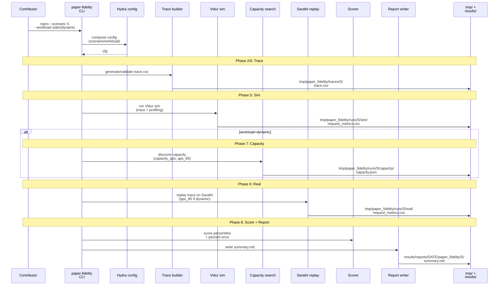
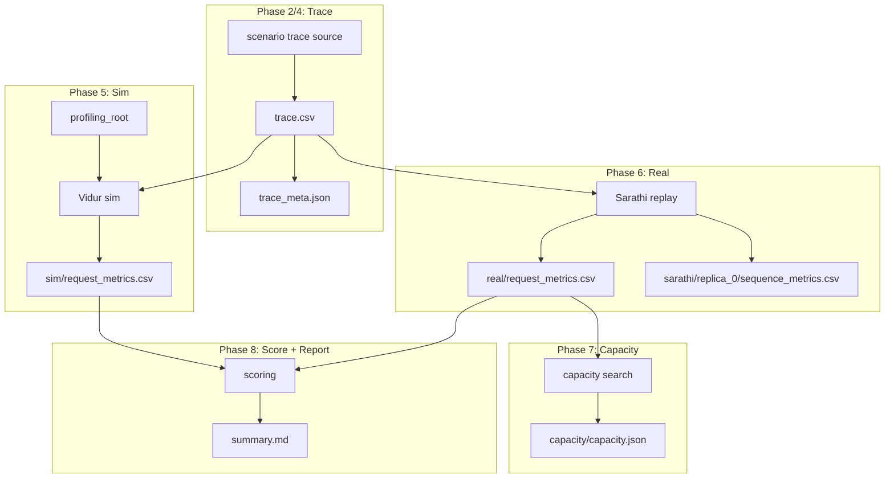
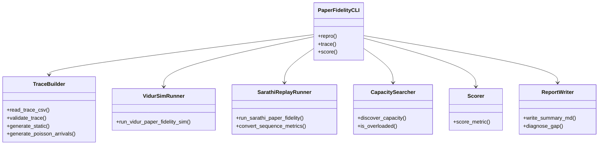
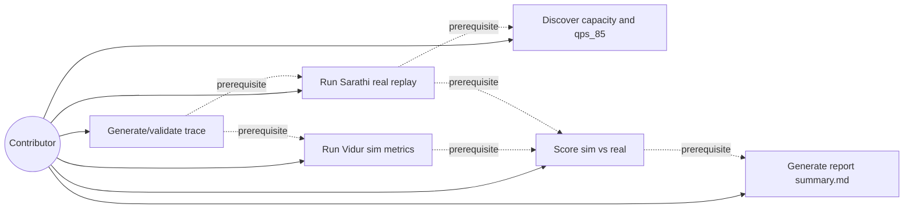
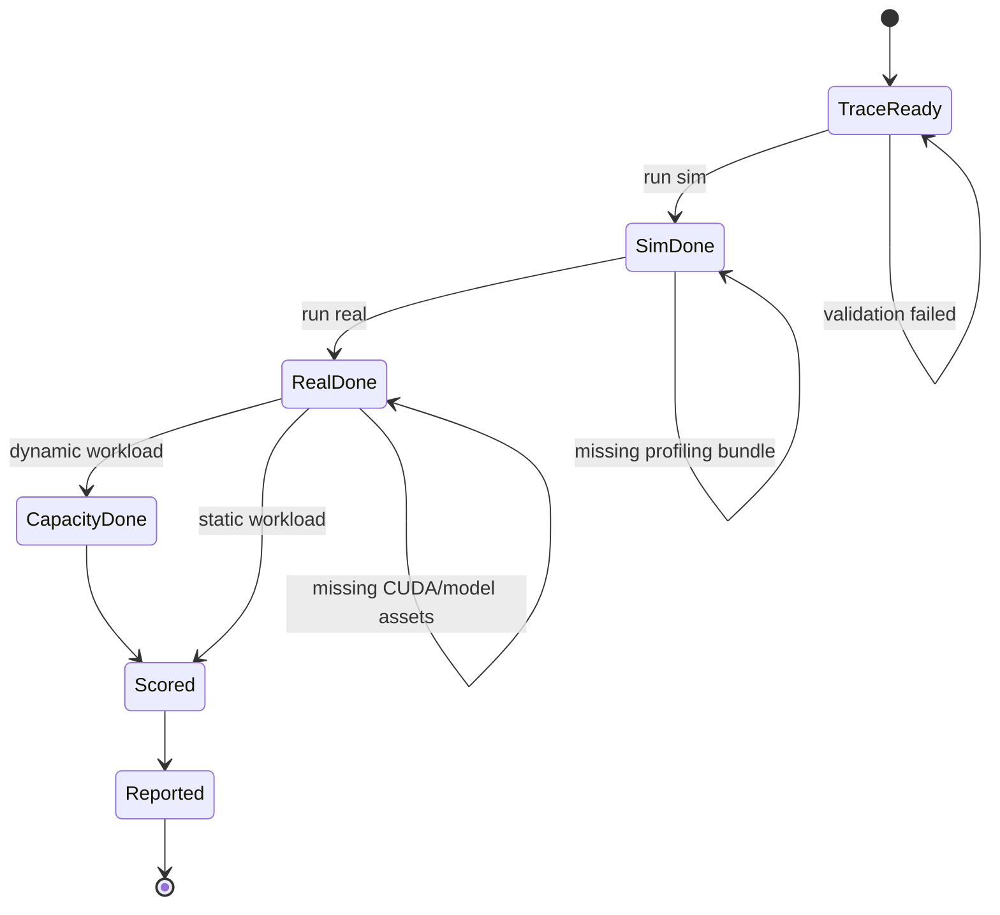

# Phase Integration Guide: Reproduce Vidur paper fidelity

**Feature**: `002-reproduce-vidur-paper-fidelity` | **Phases**: 8

## Overview

This feature is a CLI-first, artifact-driven workflow to reproduce the Vidur MLSys’24 paper’s fidelity methodology. The core invariant is that **the same canonical `trace.csv`** drives both Vidur simulation and Sarathi-Serve real replay, and both sides emit **paper-aligned request metrics** with consistent definitions (especially scheduling delay and normalized latencies).

The pipeline is organized as phases so that each phase can be implemented and validated independently, while still composing into an end-to-end reproduction (`paper-fidelity repro`).

**Path convention**: All repo paths are relative to `<WORKSPACE_ROOT>` (repository root).

## Phase Flow

**MUST HAVE: End-to-End Sequence Diagram**



## Artifact Flow Between Phases



## System Architecture



## Use Cases



## Activity Flow



## Inter-Phase Dependencies

### Phase 2/4 → Phase 5/6 (trace is the shared contract)

**Artifacts**:

- `tmp/paper_fidelity/traces/<scenario>/trace.csv` is consumed by both Vidur and Sarathi replays.

**Code dependencies**:

```python
from gpu_simulate_test.paper_fidelity.traces import read_trace_csv
from gpu_simulate_test.vidur_ext.sim_runner import run_vidur_paper_fidelity_sim
from gpu_simulate_test.real_bench.backends.sarathi_paper_fidelity_backend import run_sarathi_paper_fidelity
```

### Phase 5/6 → Phase 8 (metrics schema must match)

**Artifacts**:

- `sim/request_metrics.csv`
- `real/request_metrics.csv`

Both must include:

- `request_scheduling_delay`
- `request_execution_plus_preemption_time_normalized`
- `request_e2e_time_normalized`

## Integration Testing

```bash
# Unit (CPU-only)
pixi run pytest tests/unit/test_paper_fidelity_trace.py
pixi run pytest tests/unit/test_paper_fidelity_vidur_metrics_schema.py
pixi run pytest tests/unit/test_paper_fidelity_real_metrics_schema.py
pixi run pytest tests/unit/test_paper_fidelity_capacity_search.py
pixi run pytest tests/test_paper_fidelity_scorer.py

# Manual (GPU requirements vary)
pixi run python tests/manual/test_paper_fidelity_trace_smoke.py
pixi run python tests/manual/test_paper_fidelity_vidur_sim_smoke.py
pixi run python tests/manual/test_paper_fidelity_real_smoke.py
pixi run python tests/manual/test_paper_fidelity_capacity_smoke.py
pixi run python tests/manual/test_paper_fidelity_repro_smoke.py
```

## Critical Integration Points

1. **Trace determinism and validity**: dynamic traces must be deterministic for a fixed seed and schema-valid for both sim and real.
2. **Metric boundary alignment**: real replay must use Sarathi’s in-engine metric definitions (avoid client-side approximations for scheduling delay).
3. **Normalized metrics preservation**: Vidur sim must preserve its normalized columns (no recomputation/renaming beyond `Request Id` → `request_id`).
4. **Capacity criterion correctness**: capacity discovery must use P99 scheduling delay > 5s (default) and record the criterion used.
5. **Overhead controls**: disable expensive tracing by default (Chrome trace, op-level metrics) so measurement overhead doesn’t dominate.

## References

- Individual phase guides: `context/tasks/done/002-reproduce-vidur-paper-fidelity/impl-phase-*.md`
- Spec: `specs/002-reproduce-vidur-paper-fidelity/spec.md`
- Data model: `specs/002-reproduce-vidur-paper-fidelity/data-model.md`
- Contracts: `specs/002-reproduce-vidur-paper-fidelity/contracts/`
- Tasks breakdown (authoritative checklist): `specs/002-reproduce-vidur-paper-fidelity/tasks.md`
