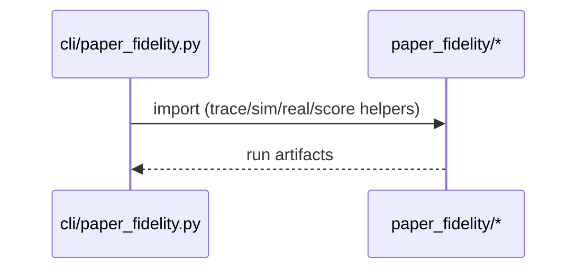
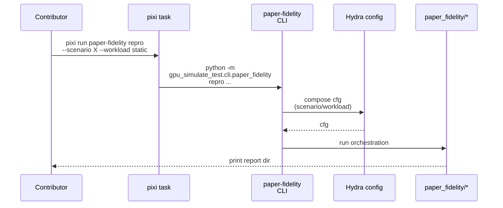
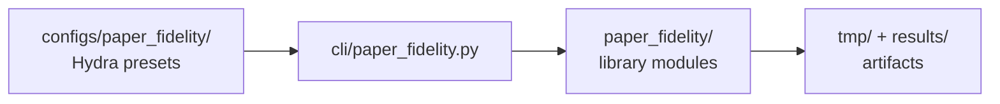

# Implementation Guide: Setup (CLI + configs)

**Phase**: 1 | **Feature**: Reproduce Vidur paper fidelity | **Tasks**: T001–T004

## Goal

Create the shared scaffolding used by all paper-fidelity workflows:

- A new module layout under `src/gpu_simulate_test/paper_fidelity/`
- A single CLI entrypoint `paper-fidelity` with subcommands (`repro`, `trace`, `score`)
- Hydra presets under `configs/paper_fidelity/` (scenario + workload selection)
- A Pixi task that wires everything into `pixi run paper-fidelity ...`

**Path convention**: All repo paths are relative to `<WORKSPACE_ROOT>` (repository root).

## Public APIs

### T001: `paper_fidelity` package skeleton

Create a small, importable library layer that the CLI uses.

```python
# src/gpu_simulate_test/paper_fidelity/__init__.py

from __future__ import annotations

# Re-export “leaf” helpers used by the CLI (keep this list small).

__all__ = [
    "paths",
    "traces",
    "capacity",
    "scoring",
    "report",
]
```

**Usage Flow**:



---

### T002: `paper-fidelity` CLI entrypoint (subcommands + Hydra)

The CLI contract is defined by the spec:

- `pixi run paper-fidelity repro --scenario <scenario_name> --workload static|dynamic`
- `pixi run paper-fidelity trace --scenario <scenario_name> --workload static|dynamic`
- `pixi run paper-fidelity score --sim <sim_metrics.csv> --real <real_metrics.csv>`

To keep consistency with existing repo CLIs (Hydra + “print output dir”), implement the CLI as:

1. `argparse` parses subcommands/flags.
2. The wrapper translates flags into Hydra-style overrides (`key=value`).
3. A single Hydra app runs for the chosen command (so Hydra can snapshot config and manage run dirs).

```python
# src/gpu_simulate_test/cli/paper_fidelity.py

from __future__ import annotations

import argparse
import sys
from typing import Literal


PaperFidelityWorkload = Literal["static", "dynamic"]


def main(argv: list[str] | None = None) -> None:
    """Dispatch `paper-fidelity` subcommands.

    This wrapper keeps UX friendly flags (`--scenario`, `--workload`) while still
    running a Hydra app (consistent with other repo CLIs).
    """
    parser = argparse.ArgumentParser(prog="paper-fidelity")
    sub = parser.add_subparsers(dest="cmd", required=True)

    repro = sub.add_parser("repro")
    repro.add_argument("--scenario", required=True)
    repro.add_argument("--workload", choices=["static", "dynamic"], required=True)

    trace = sub.add_parser("trace")
    trace.add_argument("--scenario", required=True)
    trace.add_argument("--workload", choices=["static", "dynamic"], required=True)

    score = sub.add_parser("score")
    score.add_argument("--sim", required=True)
    score.add_argument("--real", required=True)

    args = parser.parse_args(argv)

    # Translate into Hydra overrides and invoke the Hydra app for the chosen command.
    if args.cmd == "repro":
        sys.argv = [sys.argv[0], f"scenario={args.scenario}", f"workload={args.workload}"]
        _repro_main()
    elif args.cmd == "trace":
        sys.argv = [sys.argv[0], f"scenario={args.scenario}", f"workload={args.workload}"]
        _trace_main()
    elif args.cmd == "score":
        sys.argv = [sys.argv[0], f"inputs.sim_csv={args.sim}", f"inputs.real_csv={args.real}"]
        _score_main()
    else:  # pragma: no cover
        raise ValueError(f"Unhandled cmd: {args.cmd}")


def _repro_main() -> None:
    """Hydra main for `paper-fidelity repro` (see `configs/paper_fidelity/repro.yaml`)."""


def _trace_main() -> None:
    """Hydra main for `paper-fidelity trace` (see `configs/paper_fidelity/trace.yaml`)."""


def _score_main() -> None:
    """Hydra main for `paper-fidelity score` (see `configs/paper_fidelity/score.yaml`)."""
```

**Usage Flow**:



**Pseudocode**:

```python
def repro(cfg):
    trace = ensure_trace(cfg)
    sim_metrics = run_vidur_sim(trace, cfg)
    if cfg.workload.mode == "dynamic":
        capacity = discover_capacity(cfg)
        real_metrics = run_real(trace, qps=capacity.qps_85, cfg=cfg)
    else:
        real_metrics = run_real(trace, qps=None, cfg=cfg)
    score = score_metrics(sim_metrics, real_metrics, cfg)
    write_report(score, cfg)
```

---

### T003: Pixi task wiring (`paper-fidelity`)

Expose the CLI as a Pixi task so users can run:

`pixi run paper-fidelity ...`

```toml
# pyproject.toml

[tool.pixi.tasks]
paper-fidelity = "python -m gpu_simulate_test.cli.paper_fidelity"
```

---

### T004: Hydra config tree (`configs/paper_fidelity/`)

Define presets for:

- Scenario selection (model + trace source + profiling roots)
- Workload selection (static/dynamic)
- Per-command inputs/outputs

Recommended layout:

```text
configs/paper_fidelity/
├── repro.yaml
├── trace.yaml
├── score.yaml
├── scenarios/
│   └── llama2_7b_arxiv.yaml
└── workload/
    ├── static.yaml
    └── dynamic.yaml
```

Example config skeleton:

```yaml
# configs/paper_fidelity/repro.yaml

defaults:
  - scenario: llama2_7b_arxiv
  - workload: static
  - _self_

paths:
  repo_root: ${hydra:runtime.cwd}
  tmp_root: ${paths.repo_root}/tmp
  results_root: ${paths.repo_root}/results

hydra:
  run:
    dir: ${paths.tmp_root}/paper_fidelity/runs/${scenario.name}/repro
  job:
    chdir: true
```

## Phase Integration



## Testing

### Test Input

- None (this phase is mostly wiring); use `--help` smoke checks once implemented.

### Test Procedure

```bash
pixi run python -m gpu_simulate_test.cli.paper_fidelity --help
pixi run paper-fidelity --help
```

### Test Output

- Help output lists subcommands: `repro`, `trace`, `score`
- No artifacts created (help-only)

## References

- Spec: `specs/002-reproduce-vidur-paper-fidelity/spec.md`
- Plan: `specs/002-reproduce-vidur-paper-fidelity/plan.md`
- Tasks breakdown (authoritative checklist): `specs/002-reproduce-vidur-paper-fidelity/tasks.md`
- Data model: `specs/002-reproduce-vidur-paper-fidelity/data-model.md`
- Contracts: `specs/002-reproduce-vidur-paper-fidelity/contracts/`

## Implementation Summary

- Added the `paper_fidelity` package skeleton under `src/gpu_simulate_test/paper_fidelity/` (`__init__.py` + module layout).
- Implemented the `paper-fidelity` CLI entrypoint at `src/gpu_simulate_test/cli/paper_fidelity.py` (argparse wrapper around Hydra apps; supports forwarding Hydra overrides via `parse_known_args`).
- Wired a Pixi task in `pyproject.toml` (`[tool.pixi.tasks].paper-fidelity`) so the workflow runs as `pixi run paper-fidelity ...` (lock updated in `pixi.lock`).
- Added Hydra configs under `configs/paper_fidelity/` (`repro.yaml`, `trace.yaml`, `score.yaml`) plus config groups `scenario/` and `workload/` (baseline scenario: `configs/paper_fidelity/scenario/llama2_7b_arxiv.yaml`).
