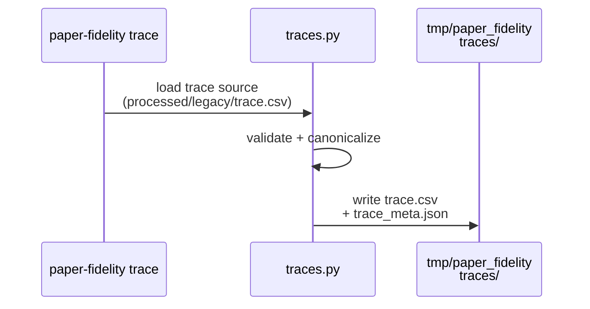
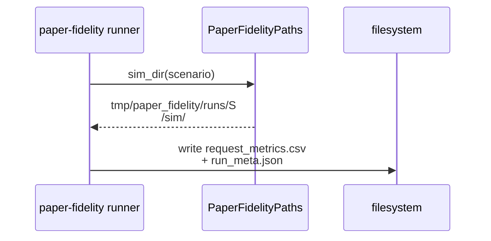
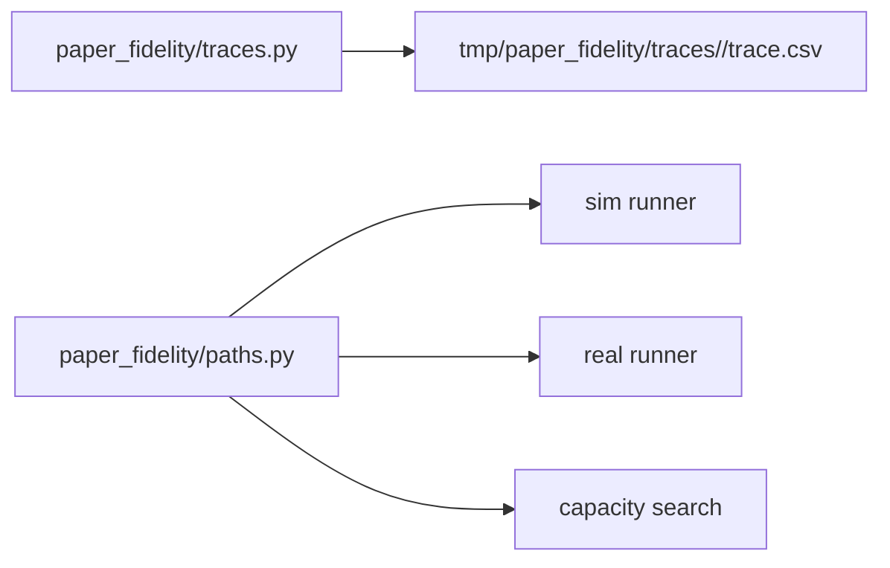

# Implementation Guide: Foundational (trace + paths)

**Phase**: 2 | **Feature**: Reproduce Vidur paper fidelity | **Tasks**: T010–T012

## Goal

Standardize the “shared contract layer” used by every workflow:

- Canonical `trace.csv` schema and deterministic conversions
- Reproducible artifact directory helpers under `tmp/paper_fidelity/`
- Run metadata helpers that reuse `gpu_simulate_test.io` conventions

**Path convention**: All repo paths are relative to `<WORKSPACE_ROOT>` (repository root).

## Public APIs

### T010: Canonical trace schema + deterministic converters

Implement a canonical `trace.csv` that is directly consumable by Vidur and easily schedulable for real replays.

```python
# src/gpu_simulate_test/paper_fidelity/traces.py

from __future__ import annotations

from dataclasses import dataclass
from pathlib import Path

import pandas as pd


TRACE_REQUIRED_COLUMNS = ("arrived_at", "num_prefill_tokens", "num_decode_tokens")


@dataclass(frozen=True)
class TraceSpec:
    """Parameters for generating/validating a canonical trace."""

    max_tokens: int = 4096
    seed: int = 42
    num_requests: int | None = None


def read_trace_csv(path: Path) -> pd.DataFrame:
    """Load and validate a canonical `trace.csv`."""


def validate_trace(df: pd.DataFrame, *, spec: TraceSpec) -> None:
    """Fail fast with actionable errors if schema/values are invalid."""


def legacy_workload_dir_to_trace(workload_dir: Path, *, out_csv: Path) -> None:
    """Convert legacy split files into canonical `trace.csv` deterministically.

    Uses:
    - `trace_lengths.csv`: request_id,prompt_id,num_prefill_tokens,num_decode_tokens
    - `trace_intervals.csv`: request_id,inter_arrival_ns,arrival_time_ns

    Canonicalization:
    - `arrived_at = arrival_time_ns / 1e9`
    """


def make_static(df: pd.DataFrame) -> pd.DataFrame:
    """Return a static trace with all arrivals at time 0."""


def add_poisson_arrivals(df: pd.DataFrame, *, qps: float, seed: int) -> pd.DataFrame:
    """Assign arrival times using a seeded Poisson arrival process."""
```

**Usage Flow**:



**Pseudocode**:

```python
def legacy_workload_dir_to_trace(workload_dir, out_csv):
    lengths = read_csv(workload_dir / "trace_lengths.csv")
    intervals = read_csv(workload_dir / "trace_intervals.csv")
    merged = merge_on_request_id(lengths, intervals).sort_values("request_id")
    df = DataFrame({
        "arrived_at": merged["arrival_time_ns"] / 1e9,
        "num_prefill_tokens": merged["num_prefill_tokens"],
        "num_decode_tokens": merged["num_decode_tokens"],
    })
    validate_trace(df)
    df.to_csv(out_csv, index=False)
```

---

### T012: Artifact paths + run metadata helpers

Centralize path decisions so every phase writes artifacts to the same locations.

```python
# src/gpu_simulate_test/paper_fidelity/paths.py

from __future__ import annotations

from dataclasses import dataclass
from pathlib import Path


@dataclass(frozen=True)
class PaperFidelityPaths:
    """Stable locations for all paper-fidelity artifacts (no DB)."""

    repo_root: Path

    @property
    def tmp_root(self) -> Path:
        return self.repo_root / "tmp" / "paper_fidelity"

    @property
    def results_root(self) -> Path:
        return self.repo_root / "results"

    def trace_dir(self, scenario_name: str) -> Path:
        return self.tmp_root / "traces" / scenario_name

    def sim_dir(self, scenario_name: str) -> Path:
        return self.tmp_root / "runs" / scenario_name / "sim"

    def real_dir(self, scenario_name: str) -> Path:
        return self.tmp_root / "runs" / scenario_name / "real"

    def capacity_dir(self, scenario_name: str) -> Path:
        return self.tmp_root / "runs" / scenario_name / "capacity"
```

**Usage Flow**:



---

### T011: Unit tests for trace determinism + validation errors

Write unit tests that enforce:

- Schema errors are caught (missing columns, negative tokens, unsorted arrivals)
- Determinism for fixed seed (dynamic arrivals)

```python
# tests/unit/test_paper_fidelity_trace.py

def test_trace_validation_rejects_negative_tokens(): ...
def test_poisson_arrivals_are_deterministic_for_seed(): ...
```

## Phase Integration



## Testing

### Test Input

- Tiny in-memory fixtures in the unit tests (no GPU required).

### Test Procedure

```bash
pixi run pytest tests/unit/test_paper_fidelity_trace.py
```

### Test Output

- `test_paper_fidelity_trace.py` passes
- No files written outside pytest temp dirs

## References

- Spec: `specs/002-reproduce-vidur-paper-fidelity/spec.md`
- Research: `specs/002-reproduce-vidur-paper-fidelity/research.md`
- Tasks breakdown (authoritative checklist): `specs/002-reproduce-vidur-paper-fidelity/tasks.md`
- Contracts: `specs/002-reproduce-vidur-paper-fidelity/contracts/`

## Implementation Summary

- Implemented the canonical trace schema + validation in `src/gpu_simulate_test/paper_fidelity/traces.py` (`TraceSpec`, `validate_trace`, `read_trace_csv`).
- Added deterministic trace sources/converters in `src/gpu_simulate_test/paper_fidelity/traces.py`:
  - legacy workload dir → `trace.csv` via `legacy_workload_dir_to_trace`
  - Vidur processed token-length stats → base trace via `processed_lengths_csv_to_trace`
  - arrivals: `make_static` and seeded `add_poisson_arrivals`
- Added stable artifact path helpers and report path conventions in `src/gpu_simulate_test/paper_fidelity/paths.py` (`PaperFidelityPaths`) plus provenance helper `build_run_meta`.
- Added unit coverage for schema validation and determinism in `tests/unit/test_paper_fidelity_trace.py`.
