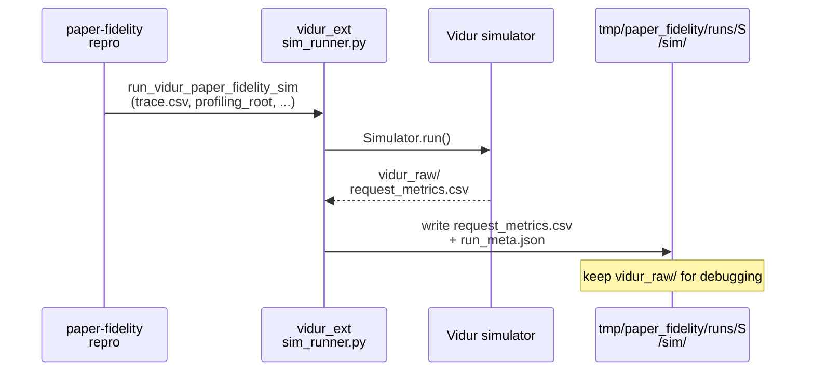
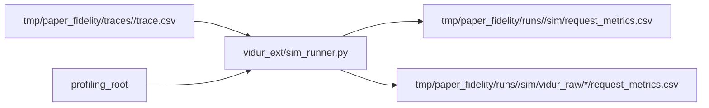

# Implementation Guide: Vidur sim with paper-required metrics (US3)

**Phase**: 5 | **Feature**: Reproduce Vidur paper fidelity | **Tasks**: T040–T042

## Goal

Run Vidur simulation using a canonical `trace.csv` and emit a paper-fidelity `request_metrics.csv` that:

- preserves Vidur’s normalized metrics *without recomputation*
- keeps Vidur’s raw output directory for debugging

**Path convention**: All repo paths are relative to `<WORKSPACE_ROOT>` (repository root).

## Public APIs

### T042: Extend Vidur sim runner for paper-fidelity output

Vidur’s own `request_metrics.csv` already contains the paper-required columns:

- `request_scheduling_delay`
- `request_execution_plus_preemption_time_normalized`
- `request_e2e_time_normalized`
- plus token-count columns like `request_num_decode_tokens`

The paper-fidelity sim runner should:

1. Run Vidur with `TraceRequestGeneratorConfig(trace_file=trace.csv)`
2. Load Vidur’s raw `request_metrics.csv`
3. Rename `Request Id` → `request_id`
4. Write the merged/preserved output to:
   - `tmp/paper_fidelity/runs/<scenario>/sim/request_metrics.csv`

```python
# src/gpu_simulate_test/vidur_ext/sim_runner.py

from __future__ import annotations

from dataclasses import dataclass
from pathlib import Path


@dataclass(frozen=True)
class VidurPaperFidelitySimInputs:
    scenario_name: str
    trace_csv: Path
    profiling_root: Path
    model_id: str
    device: str = "a100"
    network_device: str = "a100_pairwise_nvlink"
    tensor_parallel_size: int = 1
    num_pipeline_stages: int = 1
    seed: int = 42


def run_vidur_paper_fidelity_sim(
    inputs: VidurPaperFidelitySimInputs,
    *,
    out_dir: Path,
    run_meta: dict,
) -> None:
    """Run Vidur and write a paper-fidelity `request_metrics.csv` preserving normalized columns."""
```

**Usage Flow**:



**Pseudocode**:

```python
def run_vidur_paper_fidelity_sim(inputs, out_dir, run_meta):
    validate_profiling_root(...)
    simulator = Simulator(sim_cfg(trace_file=inputs.trace_csv))
    simulator.run()
    simulator.metric_store.plot()

    raw = read_csv(out_dir / "vidur_raw/<timestamp>/request_metrics.csv")
    raw = raw.rename(columns={"Request Id": "request_id"})
    write_csv(out_dir / "request_metrics.csv", raw, required_columns=[...paper columns...])
    write_json(out_dir / "run_meta.json", run_meta)
```

---

### T041: Unit test for schema preservation

Use a checked-in fixture `request_metrics.csv` (Vidur-like) and assert:

- required columns exist and are unmodified
- `request_id` is present (after rename)

```python
# tests/unit/test_paper_fidelity_vidur_metrics_schema.py

def test_vidur_request_metrics_preserves_normalized_columns(): ...
```

---

### T040: Manual sim smoke (`tests/manual/test_paper_fidelity_vidur_sim_smoke.py`)

Run a tiny trace through Vidur (requires a usable profiling bundle) and confirm:

- paper-fidelity `request_metrics.csv` exists
- `vidur_raw/` is kept for debugging

## Phase Integration



## Testing

### Test Input

- A canonical trace: `tmp/paper_fidelity/traces/<scenario>/trace.csv`
- A profiling bundle root that passes `validate_profiling_root`

### Test Procedure

```bash
# CPU-only check (schema fixture)
pixi run pytest tests/unit/test_paper_fidelity_vidur_metrics_schema.py

# GPU-ish smoke (requires profiling bundle)
pixi run python tests/manual/test_paper_fidelity_vidur_sim_smoke.py
```

### Test Output

- `tmp/paper_fidelity/runs/<scenario>/sim/request_metrics.csv` exists
- `request_metrics.csv` contains the normalized metric columns used in scoring

## References

- Vidur metrics definition: `extern/tracked/vidur/docs/metrics.md`
- Tasks breakdown (authoritative checklist): `specs/002-reproduce-vidur-paper-fidelity/tasks.md`
- Contracts: `specs/002-reproduce-vidur-paper-fidelity/contracts/`

## Implementation Summary

- Added paper-fidelity Vidur sim adapter in `src/gpu_simulate_test/vidur_ext/sim_runner.py`:
  - `VidurPaperFidelitySimInputs`
  - `run_vidur_paper_fidelity_sim(...)` writes `tmp/paper_fidelity/runs/<scenario>/sim/request_metrics.csv` while preserving Vidur’s normalized columns (renames `Request Id` → `request_id`).
- Keeps Vidur raw outputs for debugging and records the actual timestamped dir in `run_meta.json` (`vidur_raw_dir`), since Vidur appends a timestamp to `MetricsConfig.output_dir`.
- Sets Vidur’s predictor cache to a per-run directory (`<output-dir>/vidur-cache`) to avoid polluting the repo root.
- Added schema-preservation unit test using a checked-in fixture: `tests/unit/test_paper_fidelity_vidur_metrics_schema.py`.
- Added a profiling-dependent smoke script: `tests/manual/test_paper_fidelity_vidur_sim_smoke.py`.
