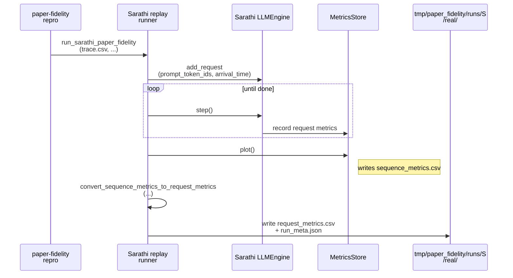
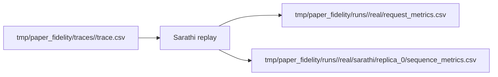

# Implementation Guide: Sarathi real replay with aligned timing (US4)

**Phase**: 6 | **Feature**: Reproduce Vidur paper fidelity | **Tasks**: T050–T052

## Goal

Replay the same `trace.csv` on Sarathi-Serve and emit paper-fidelity request metrics:

- scheduling delay (`request_scheduling_delay`)
- normalized latencies (`request_e2e_time_normalized`, `request_execution_plus_preemption_time_normalized`)
- token counts (`request_num_decode_tokens`, etc.)

**Path convention**: All repo paths are relative to `<WORKSPACE_ROOT>` (repository root).

## Public APIs

### T052: Sarathi-backed trace replay runner (metrics-store based)

Avoid client-side timing and rely on Sarathi’s in-engine metric definitions (matching Vidur).

Key implementation idea:

- Use `prompt_token_ids` (length-only) to avoid tokenization overhead.
- Enable Sarathi metrics writing and disable expensive tracing:
  - `write_metrics=True`
  - `enable_chrome_trace=False`
  - keep op-level metrics off unless explicitly debugging
- After replay, call `engine.metrics_store.plot()` to flush `sequence_metrics.csv`.
- Convert `sequence_metrics.csv` into the paper-fidelity `request_metrics.csv` schema (keep names aligned with Vidur).

```python
# src/gpu_simulate_test/real_bench/backends/sarathi_paper_fidelity_backend.py

from __future__ import annotations

from dataclasses import dataclass
from pathlib import Path

import pandas as pd


@dataclass(frozen=True)
class SarathiPaperFidelityInputs:
    scenario_name: str
    trace_csv: Path
    model_id: str
    model_ref: Path
    seed: int = 42


def run_sarathi_paper_fidelity(
    inputs: SarathiPaperFidelityInputs,
    *,
    out_dir: Path,
) -> Path:
    """Replay a trace on Sarathi and return the written request_metrics.csv path."""


def convert_sequence_metrics_to_request_metrics(sequence_metrics_csv: Path) -> pd.DataFrame:
    """Map Sarathi `sequence_metrics.csv` to the paper-fidelity request metrics schema."""
```

**Usage Flow**:



**Pseudocode**:

```python
def run_sarathi_paper_fidelity(inputs, out_dir):
    engine = LLMEngine.from_system_config(...)
    trace = read_trace_csv(inputs.trace_csv)
    start = time.monotonic()
    i = 0
    while i < len(trace) or engine.has_unfinished_requests():
        now = time.monotonic()
        while i < len(trace) and now >= start + trace.arrived_at[i]:
            engine.add_request(
                prompt=None,
                prompt_token_ids=[0] * trace.num_prefill_tokens[i],
                sampling_params=SamplingParams(max_tokens=trace.num_decode_tokens[i]),
                arrival_time=start + trace.arrived_at[i],
                seq_id=str(i),
            )
            i += 1
        engine.step()
    engine.metrics_store.plot()
    seq_csv = out_dir / "sarathi/replica_0/sequence_metrics.csv"
    df = convert_sequence_metrics_to_request_metrics(seq_csv)
    df.to_csv(out_dir / "request_metrics.csv", index=False)
```

---

### T051: Unit test for conversion to paper-fidelity schema

Check conversion logic using a small checked-in fixture `sequence_metrics.csv`:

```python
# tests/unit/test_paper_fidelity_real_metrics_schema.py

def test_sequence_metrics_conversion_emits_required_columns(): ...
```

---

### T050: Manual real smoke (`tests/manual/test_paper_fidelity_real_smoke.py`)

Run a tiny replay and confirm `request_metrics.csv` contains:

- `request_scheduling_delay`
- `request_e2e_time_normalized`
- `request_execution_plus_preemption_time_normalized`

## Phase Integration



## Testing

### Test Input

- CUDA available (`torch.cuda.is_available() == True`)
- Model assets present (baseline): `models/llama2-7b-hf/source-data`
- Canonical trace exists: `tmp/paper_fidelity/traces/<scenario>/trace.csv`

### Test Procedure

```bash
# CPU-only conversion unit test
pixi run pytest tests/unit/test_paper_fidelity_real_metrics_schema.py

# GPU replay smoke
pixi run python tests/manual/test_paper_fidelity_real_smoke.py
```

### Test Output

- `tmp/paper_fidelity/runs/<scenario>/real/request_metrics.csv` exists
- `request_scheduling_delay` distribution matches expectations (0-ish for static, >0 under overload)

## References

- Sarathi metric semantics: `extern/tracked/sarathi-serve/sarathi/metrics/README.md`
- Tasks breakdown (authoritative checklist): `specs/002-reproduce-vidur-paper-fidelity/tasks.md`

## Implementation Summary

- Implemented Sarathi paper-fidelity replay in `src/gpu_simulate_test/real_bench/backends/sarathi_paper_fidelity_backend.py`:
  - `SarathiPaperFidelityInputs`
  - `run_sarathi_paper_fidelity(...)` replays canonical `trace.csv` with `prompt_token_ids` (token-length-only) and writes `tmp/paper_fidelity/runs/<scenario>/real/request_metrics.csv`.
- Uses Sarathi’s in-engine metrics store to produce `sarathi/replica_0/sequence_metrics.csv`, then converts to the paper-fidelity request-metrics schema (`convert_sequence_metrics_to_request_metrics`).
- Avoids `metrics_store.plot()` (Plotly/Kaleido/Chrome dependency) by writing `sequence_metrics.csv` directly via `metrics_store._save_as_csv(...)`.
- Adds GPU safety/compat: chooses a usable `CUDA_VISIBLE_DEVICES` subset by default and patches Sarathi’s Ray worker init so the setting is preserved.
- Added CPU-only conversion unit test (`tests/unit/test_paper_fidelity_real_metrics_schema.py`) and GPU smoke (`tests/manual/test_paper_fidelity_real_smoke.py`).
