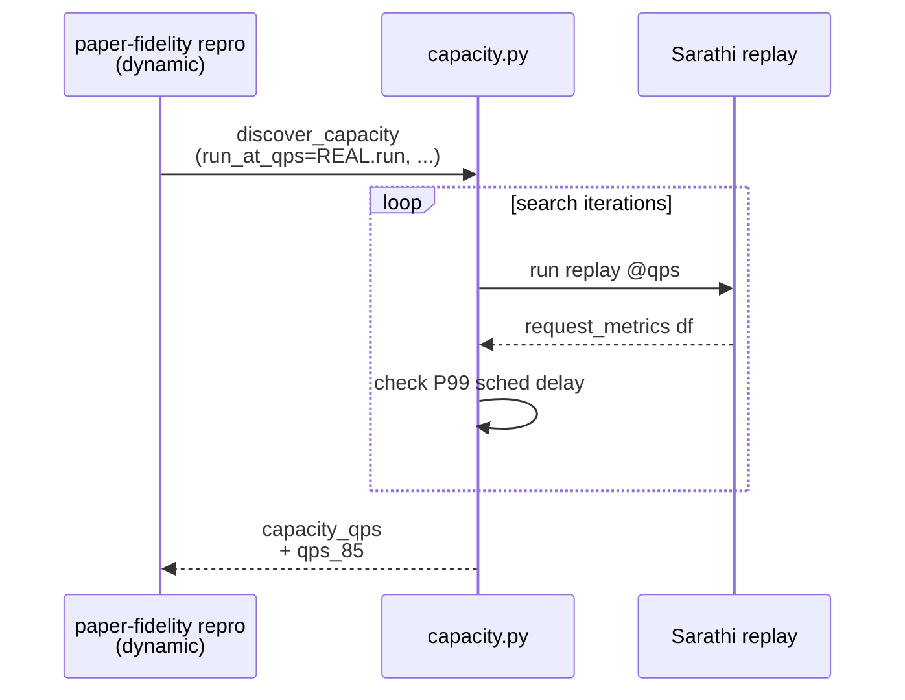

# Implementation Guide: Capacity discovery (US5)

**Phase**: 7 | **Feature**: Reproduce Vidur paper fidelity | **Tasks**: T060–T062

## Goal

Compute the operating point for dynamic workloads:

- find `capacity_qps` under an overload criterion
- compute `qps_85 = 0.85 * capacity_qps`
- record the criterion used and the measurements taken

**Path convention**: All repo paths are relative to `<WORKSPACE_ROOT>` (repository root).

Overload criterion (default): overloaded if **P99**(`request_scheduling_delay`) **> 5 seconds**.

## Public APIs

### T062: Capacity discovery algorithm (binary search over QPS)

Implement as a pure “search” layer that calls a provided runner for each candidate QPS.

```python
# src/gpu_simulate_test/paper_fidelity/capacity.py

from __future__ import annotations

from dataclasses import dataclass
from typing import Callable

import pandas as pd


@dataclass(frozen=True)
class CapacityCriterion:
    metric: str = "request_scheduling_delay"
    quantile: float = 0.99
    threshold_s: float = 5.0


@dataclass(frozen=True)
class CapacityResult:
    capacity_qps: float
    qps_85: float
    criterion: CapacityCriterion


def is_overloaded(df: pd.DataFrame, *, criterion: CapacityCriterion) -> bool:
    """Return True if df violates the overload criterion."""


def discover_capacity(
    *,
    run_at_qps: Callable[[float], pd.DataFrame],
    min_qps: float,
    max_qps: float,
    max_iters: int,
    criterion: CapacityCriterion,
    operating_point_fraction: float = 0.85,
) -> CapacityResult:
    """Binary search the max QPS that is not overloaded."""
```

**Usage Flow**:



**Pseudocode**:

```python
def discover_capacity(run_at_qps, min_qps, max_qps, max_iters, criterion):
    lo, hi = min_qps, max_qps
    for _ in range(max_iters):
        mid = (lo + hi) / 2.0
        df = run_at_qps(mid)
        if is_overloaded(df, criterion=criterion):
            hi = mid
        else:
            lo = mid
    capacity_qps = lo
    return CapacityResult(capacity_qps=capacity_qps, qps_85=0.85 * capacity_qps, criterion=criterion)
```

---

### T060: Unit test for capacity search (pure function)

Use a fake `run_at_qps(qps)` that returns a synthetic scheduling delay distribution.

```python
# tests/unit/test_paper_fidelity_capacity_search.py

def test_capacity_search_binary_search_finds_threshold_crossing(): ...
```

---

### T061: Manual smoke (`tests/manual/test_paper_fidelity_capacity_smoke.py`)

Run a bounded search (small range + low iters) and confirm it writes:

- `tmp/paper_fidelity/runs/<scenario>/capacity/capacity.json`

## Phase Integration


## Testing

### Test Input

- A scenario + trace
- A real runner capable of producing `request_scheduling_delay` (GPU required for Sarathi)

### Test Procedure

```bash
pixi run pytest tests/unit/test_paper_fidelity_capacity_search.py
pixi run python tests/manual/test_paper_fidelity_capacity_smoke.py
```

### Test Output

- Unit test passes (CPU-only)
- Manual smoke emits `capacity.json` with `capacity_qps` and `qps_85`

## References

- Research (criterion rationale): `specs/002-reproduce-vidur-paper-fidelity/research.md`
- Tasks breakdown (authoritative checklist): `specs/002-reproduce-vidur-paper-fidelity/tasks.md`

## Implementation Summary

- Implemented capacity discovery primitives in `src/gpu_simulate_test/paper_fidelity/capacity.py` (`CapacityCriterion`, `discover_capacity`, `is_overloaded`, `write_capacity_json`).
- Integrated capacity search into dynamic `paper-fidelity repro` (uses Sarathi replays at candidate QPS values and overload criterion P99(`request_scheduling_delay`) > threshold).
- Writes `tmp/paper_fidelity/runs/<scenario>/capacity/capacity.json` plus a `run_meta.json` and per-QPS run subdirectories for debugging.
- Added unit coverage (`tests/unit/test_paper_fidelity_capacity_search.py`) and a bounded GPU smoke (`tests/manual/test_paper_fidelity_capacity_smoke.py`).
