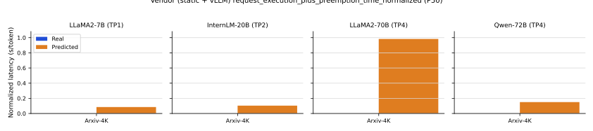
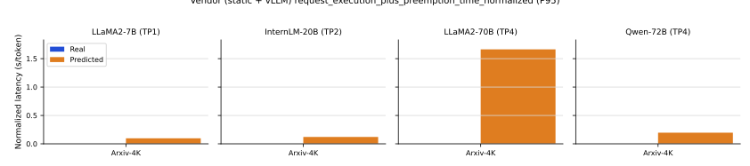
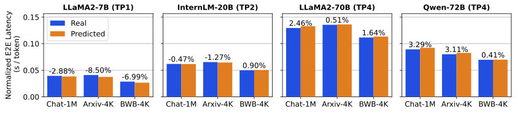
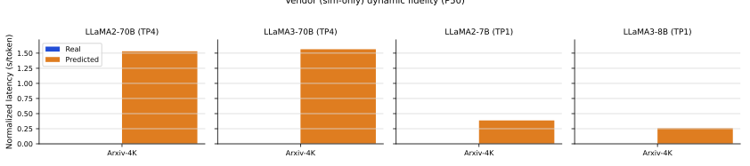
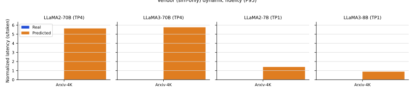
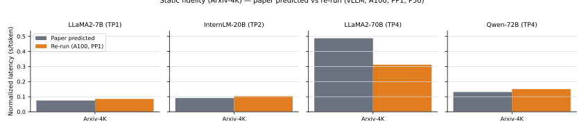
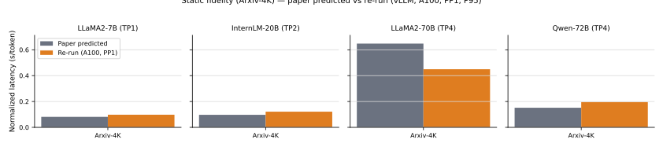
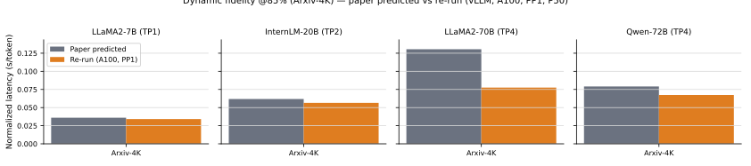
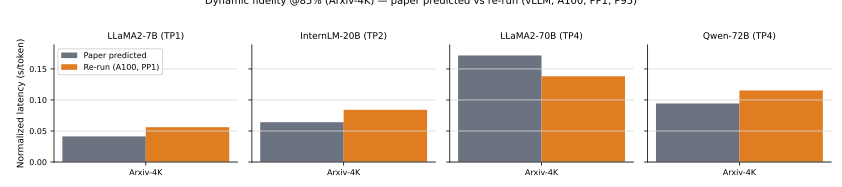

# Q&A: impl-phase-3-repro-report

## Introduction

This Q&A doc captures implementation questions and answers for Phase 3 (US1: end-to-end reproduction report) of the `002-reproduce-vidur-paper-fidelity` workflow, intended for developers (including future maintainers).

**Related docs**
- `context/tasks/done/002-reproduce-vidur-paper-fidelity/impl-phase-3-repro-report.md`
- `context/tasks/done/002-reproduce-vidur-paper-fidelity/impl-integrate-phases.md`
- `specs/002-reproduce-vidur-paper-fidelity/spec.md`
- `specs/002-reproduce-vidur-paper-fidelity/plan.md`
- `specs/002-reproduce-vidur-paper-fidelity/tasks.md`
- `specs/002-reproduce-vidur-paper-fidelity/quickstart.md`

**Key entrypoints and modules**
- `pyproject.toml`
- `configs/paper_fidelity/repro.yaml`
- `configs/paper_fidelity/trace.yaml`
- `configs/paper_fidelity/score.yaml`
- `src/gpu_simulate_test/cli/paper_fidelity.py`
- `src/gpu_simulate_test/paper_fidelity/paths.py`
- `src/gpu_simulate_test/paper_fidelity/traces.py`
- `src/gpu_simulate_test/paper_fidelity/scoring.py`
- `src/gpu_simulate_test/paper_fidelity/report.py`
- `tests/manual/test_paper_fidelity_repro_smoke.py`

## Which paper metric(s) can we currently reproduce with `paper-fidelity repro`?
> Last revised at: `2026-01-05T13:57:23Z` | Last revised base commit: `7c8877d53389d73486286317d71bd055e335d884`

- We currently reproduce the Vidur paper’s **fidelity** metrics for the “static” and “dynamic” traces:
  - **Static fidelity metric**: `request_execution_plus_preemption_time_normalized` (paper: static trace figure).
  - **Dynamic fidelity metric**: `request_e2e_time_normalized` at the **85% capacity** operating point (paper: dynamic trace figure).
- Paper references: `extern/tracked/vidur/paper/tex/figures-tex/fig-fidelity-static-trace.tex` and `extern/tracked/vidur/paper/tex/figures-tex/fig-fidelity-dynamic-trace.tex`.
- Local SVG copies of the corresponding paper figures are under `context/tasks/done/002-reproduce-vidur-paper-fidelity/figures/` (converted from `extern/tracked/vidur/paper/tex/graphs/*.pdf` via Poppler `pdftocairo -svg`):
  - Static P50: [static_fidelity_v12_request_execution_plus_preemption_time_normalized_p50.svg](figures/static_fidelity_v12_request_execution_plus_preemption_time_normalized_p50.svg)
  - Static P95: [static_fidelity_v12_request_execution_plus_preemption_time_normalized_p95.svg](figures/static_fidelity_v12_request_execution_plus_preemption_time_normalized_p95.svg)
  - Dynamic @85% capacity P50: [dynamic_fidelity_v8_request_e2e_time_normalized_85_p50.svg](figures/dynamic_fidelity_v8_request_e2e_time_normalized_85_p50.svg)
  - Dynamic @85% capacity P95: [dynamic_fidelity_v8_request_e2e_time_normalized_85_p95.svg](figures/dynamic_fidelity_v8_request_e2e_time_normalized_85_p95.svg)

Static fidelity (normalized execution-plus-preemption time), P50:


Vendor simulation (A100; static arrivals; vLLM scheduler; “Real” plotted as 0 placeholder; note: Vidur submodule does not ship Chat-1M/BWB-4K trace-length CSVs, and we exclude Splitwise traces, so only Arxiv-4K is plotted):



Static fidelity (normalized execution-plus-preemption time), P95:


Vendor simulation (A100; static arrivals; vLLM scheduler; “Real” plotted as 0 placeholder):



Dynamic fidelity @85% capacity (normalized end-to-end latency), P50:



Vendor simulation (A100; Poisson QPS=6.45; “Real” plotted as 0 placeholder from `results/raw/vendor-results/sarathi-serve/dynamic/**`; only Arxiv-4K is plotted):



Dynamic fidelity @85% capacity (normalized end-to-end latency), P95:


Vendor simulation (A100; Poisson QPS=6.45; “Real” plotted as 0 placeholder from `results/raw/vendor-results/sarathi-serve/dynamic/**`; only Arxiv-4K is plotted):



- **Re-run using “optimal deployment configuration” knobs (Arxiv-4K only)**:
  - Paper scheduler note (fidelity figs): `extern/tracked/vidur/paper/tex/5-eval.tex` says *“We use the default vLLM scheduler for all these experiments.”*
  - Config source: `context/summaries/vidur-kb/paper-configs.json` (Figure 6 “parallel_coord”; corrected `Llama-70b + Arxiv` SKU to `H100`).
  - Applied knobs: `tp_dim`, `batch_size` (mapped to vLLM `batch_size_cap`); **scheduler is forced to vLLM for all runs**.
  - Additional overrides for sensitivity testing: **PP=1** for all runs and **A100** for all runs.
  - Result: this re-run still does **not** reconcile the known static-fidelity mismatch for **LLaMA2-70B (TP4) + Arxiv-4K** (P50 paper `~0.487 s/token` vs re-run `~0.312 s/token`).

Static fidelity (Arxiv-4K), P50 (paper predicted vs re-run; vLLM scheduler; A100; PP=1):



Static fidelity (Arxiv-4K), P95 (paper predicted vs re-run; vLLM scheduler; A100; PP=1):



Dynamic fidelity @85% capacity (Arxiv-4K), P50 (paper predicted vs re-run; vLLM scheduler; A100; PP=1):



Dynamic fidelity @85% capacity (Arxiv-4K), P95 (paper predicted vs re-run; vLLM scheduler; A100; PP=1):



- For both metrics, we compute **P50/P95** and report **percent error** `abs(sim - real) / real` in `results/reports/<date>/paper_fidelity/<scenario>/summary.md` (`src/gpu_simulate_test/paper_fidelity/report.py`).
- Dynamic “85% capacity” is derived via capacity search using **P99 scheduling delay** (`request_scheduling_delay`) against the configured threshold (default 5s), producing `tmp/paper_fidelity/runs/<scenario>/capacity/capacity.json` (`src/gpu_simulate_test/paper_fidelity/capacity.py`).
- The repro workflow always scores both normalized metrics (see the `metrics = [...]` list in `src/gpu_simulate_test/cli/paper_fidelity.py`), but these two correspond to the paper’s fidelity plots.

## How do I compute the static/dynamic P50/P95 metrics from Vidur “vendor” simulation outputs (paper profiling + processed traces)?
> Last revised at: `2026-01-06T11:43:54Z` | Last revised base commit: `5dd6037d2dcb151e46639d07e0fde6a3765ab894`

- Run Vidur as described in `extern/tracked/vidur/README.md`, using Vidur’s shipped profiling bundle under `extern/tracked/vidur/data/profiling/**` and a processed trace under `extern/tracked/vidur/data/processed_traces/*.csv` (or use the already-produced outputs under `results/raw/vendor-results/**`).
- For a single Vidur run directory (the timestamp dir containing `request_metrics.csv` + `config.json`), identify whether it was “static” vs “dynamic” by inspecting `config.json`:
  - Mode: `jq -r '.request_generator_config.interval_generator_config.name' <run_dir>/config.json` (`static` or `poisson`)
  - QPS (poisson only): `jq -r '.request_generator_config.interval_generator_config.qps' <run_dir>/config.json`
- Compute P50/P95 directly from `request_metrics.csv` percentiles:
  - **Static metric (paper)**: `request_execution_plus_preemption_time_normalized` (P50/P95; units `s/token`).
  - **Dynamic metric (paper)**: `request_e2e_time_normalized` (P50/P95; units `s/token`; paper-comparable only when the offered load matches the paper’s operating point definition, e.g. “85% of capacity”).
- Example (replace `run_dir` with your timestamp directory path):
  - In this repo’s `results/raw/vendor-results/` layout, `<runner>` is `sarathi-serve` or `vllm`, and `<arrival_mode>` is `dynamic` or `static`.

  ```bash
  pixi run python - <<'PY'
  import pandas as pd
  from pathlib import Path

  run_dir = Path("results/raw/vendor-results/<runner>/<arrival_mode>/<gpu>-<model>-<trace>/<timestamp>")
  df = pd.read_csv(run_dir / "request_metrics.csv")
  for metric in [
      "request_execution_plus_preemption_time_normalized",
      "request_e2e_time_normalized",
  ]:
      p50 = float(df[metric].quantile(0.5))
      p95 = float(df[metric].quantile(0.95))
      print(metric, {"p50": p50, "p95": p95})
  PY
  ```

## What are the two Phase 3 “paper reproduction” goals (sanity-check vs sim-vs-real gap), and what counts as “correct”?
> Last revised at: `2026-01-05T15:27:56Z` | Last revised base commit: `7c8877d53389d73486286317d71bd055e335d884`

- In practice, we treat Phase 3 reproduction as two related but different tasks:
  - **Sanity-check reproduction**: run with **paper-provided artifacts** (profiling bundle + trace inputs) to confirm the pipeline runs end-to-end and Vidur produces reasonable simulator-side metrics.
  - **Sim-vs-real gap reproduction**: **microbenchmark/profile on this host**, run Vidur with that profiling bundle, and compare Vidur vs Sarathi “real” so the error band is meaningful on this machine.
- “Correctly reproduced” depends on which task you are doing:
  - For the **sanity check**, correctness is: runs complete; artifacts are produced; Vidur’s sim `request_metrics.csv` is stable/sensible and aligns with the paper’s simulator-side expectations; we do **not** treat `% error` vs Sarathi on this host as a pass/fail signal.
  - For the **gap reproduction**, correctness is: sim and real are both driven by host-matched profiling/stack; the resulting `% error` is in a sensible ballpark and trends like the paper (remaining drift usually indicates stack differences or missing CPU-overhead modeling).
- `paper-fidelity repro` always executes **trace → sim (Vidur) → real (Sarathi) → score/report**; the difference between the two tasks is which profiling bundle you point Vidur at and how you interpret the reported `% error` (`src/gpu_simulate_test/cli/paper_fidelity.py`).
- Dynamic runs follow the paper’s operating point definition: evaluate at **85% of capacity**, where capacity is discovered on the same host via P99 scheduling delay (`src/gpu_simulate_test/paper_fidelity/capacity.py`).

## How do I run the Phase 3 “sanity-check reproduction” (paper artifacts), and what should I verify?
> Last revised at: `2026-01-05T15:27:56Z` | Last revised base commit: `7c8877d53389d73486286317d71bd055e335d884`

- Run a baseline scenario with the default (paper-provided) profiling bundle:
  - `pixi run paper-fidelity repro --scenario llama2_7b_arxiv --workload static`
  - `pixi run paper-fidelity repro --scenario llama2_7b_arxiv --workload dynamic`
- Confirm Vidur is using the paper-provided profiling root from the scenario config (default: `scenario.vidur.profiling_root=${paths.repo_root}/extern/tracked/vidur` in `configs/paper_fidelity/scenario/llama2_7b_arxiv.yaml`).
- Verify the expected artifacts exist and have sensible values:
  - Trace: `tmp/paper_fidelity/traces/<scenario>/trace.csv`
  - Sim metrics (Vidur): `tmp/paper_fidelity/runs/<scenario>/sim/request_metrics.csv`
  - Real metrics (Sarathi): `tmp/paper_fidelity/runs/<scenario>/real/request_metrics.csv`
  - Report: `results/reports/<date>/paper_fidelity/<scenario>/summary.md`
  - Dynamic-only: `tmp/paper_fidelity/runs/<scenario>/capacity/capacity.json`
- For the simulator-only “paper artifacts” comparison (Vidur only), compare your Vidur sim percentiles against the paper’s **Predicted** bars extracted into `context/summaries/vidur-kb/paper-results/`:
  - Static (compare `request_execution_plus_preemption_time_normalized` P50/P95): `context/summaries/vidur-kb/paper-results/static_fidelity_v12_request_execution_plus_preemption_time_normalized_p50.json` and `context/summaries/vidur-kb/paper-results/static_fidelity_v12_request_execution_plus_preemption_time_normalized_p95.json` (filter `series=predicted`).
  - Dynamic @85% (compare `request_e2e_time_normalized` P50/P95): `context/summaries/vidur-kb/paper-results/dynamic_fidelity_v8_request_e2e_time_normalized_85_p50.json` and `context/summaries/vidur-kb/paper-results/dynamic_fidelity_v8_request_e2e_time_normalized_85_p95.json` (filter `series=predicted`; note our current pipeline’s dynamic operating point uses Sarathi-derived capacity on this host, so exact paper match is not guaranteed unless the offered load matches the paper’s 85% point).
  - Baseline example (`llama2_7b_arxiv`): compare `model="LLaMA2-7B (TP1)"` and `trace="Arxiv-4K"`.
- Interpretation for the sanity check: focus on “pipeline runs + sim metrics are reasonable/paper-aligned”; treat sim-vs-real `% error` as informational only unless you have host-matched profiling.
- Workspace hygiene: Vidur cache is written under `tmp/paper_fidelity/runs/<scenario>/sim/vidur-cache/` (no top-level `cache/`) (`src/gpu_simulate_test/vidur_ext/sim_runner.py`).

## How do I run the Phase 3 “sim-vs-real gap reproduction” (host microbenchmarking), and what artifacts do I need?
> Last revised at: `2026-01-06T02:22:35Z` | Last revised base commit: `b7647c91f1d3478c30fc19c9522b68e11aa03ee6`

- Generate a host-specific profiling root via the first-class CLI:
  - `pixi run paper-fidelity profile --scenario llama2_7b_arxiv`
  - Optional (bounded run): `pixi run paper-fidelity profile --scenario llama2_7b_arxiv profiling.max_tokens=256 profiling.num_gpus=1`
- The command prints the created profiling root path and writes:
  - Host profiling root: `tmp/paper_fidelity/profiling_roots/<scenario>/<run_id>/data/profiling/...` (`src/gpu_simulate_test/paper_fidelity/profiling.py`)
  - Profiling provenance: `tmp/paper_fidelity/profiling_roots/<scenario>/<run_id>/profiling_meta.json`
  - Large intermediate outputs: `tmp/paper_fidelity/profiling_outputs/<scenario>/<run_id>/...`
- Run Phase 3 with the host profiling root by overriding `scenario.vidur.profiling_root` (absolute path recommended):
  - `pixi run paper-fidelity repro --scenario llama2_7b_arxiv --workload static scenario.vidur.profiling_root=/abs/path/to/tmp/paper_fidelity/profiling_roots/...`
  - `pixi run paper-fidelity repro --scenario llama2_7b_arxiv --workload dynamic scenario.vidur.profiling_root=/abs/path/to/tmp/paper_fidelity/profiling_roots/...`
- Now the report’s sim-vs-real `% error` is meaningful on this host (both sim and real share the same serving stack); compare it to the paper’s reported error band/trends rather than expecting exact equality.
- CPU overhead modeling: baseline scenarios default to `scenario.vidur.enable_cpu_overhead_modeling=false` (see `configs/paper_fidelity/scenario/llama2_7b_arxiv.yaml`). If you set it to `true`, ensure the profiling root includes `cpu_overheads.csv` or validation will fail (`src/gpu_simulate_test/vidur_ext/profiling_root.py`).
