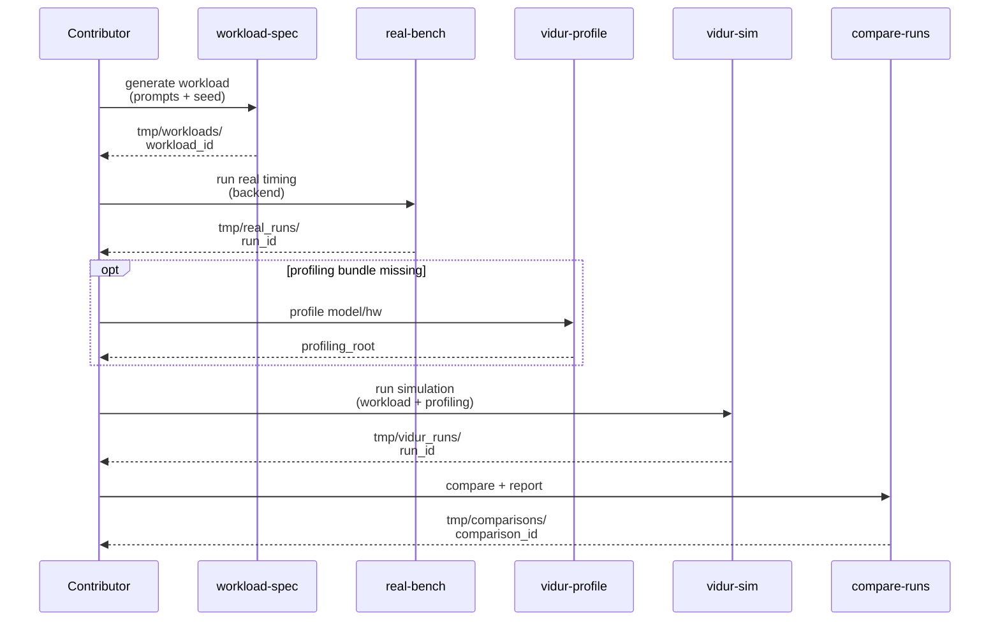
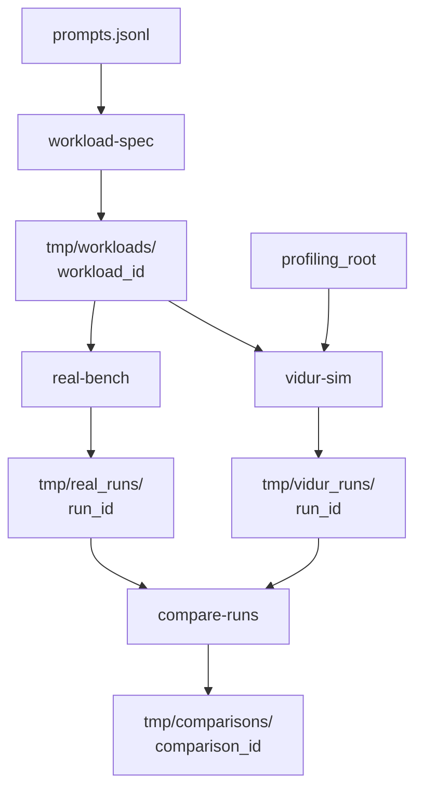

# Phase Integration Guide: Compare Vidur vs real Qwen3 A100 timing

**Feature**: `001-compare-vidur-real-timing` | **Phases**: 7

## Overview

This feature is an end-to-end experiment pipeline with a shared on-disk interface between stages. The core invariant is that **the exact same workload spec** (token lengths + arrival schedule) drives both real timing measurement and Vidur simulation, and both sides emit standardized metrics artifacts to enable apples-to-apples comparisons.

Hydra manages experiment configuration for every stage, so runs are reproducible by reusing the committed presets and the run directory’s captured metadata.

## Phase Flow

**MUST HAVE: End-to-End Sequence Diagram**



## Artifact Flow Between Phases



## Inter-Phase Dependencies

### Phase 2 → Phase 3 (workload → real)

**Artifacts**:
- `tmp/workloads/<workload_id>/trace_intervals.csv` is consumed by the replay scheduler to issue requests at the same times.
- `tmp/workloads/<workload_id>/trace_lengths.csv` is used to set per-request decode length and for schema joins.

### Phase 2 + Phase 6 → Phase 4 (workload + profiling → Vidur sim)

**Artifacts**:
- Workload: `tmp/workloads/<workload_id>/...`
- Profiling bundle: `<profiling_root>/...` (layout validated by `validate_profiling_root`)

### Phase 3 + Phase 4 → Phase 5 (real + sim → report)

**Artifacts**:
- `request_metrics.csv` + `token_metrics.csv` from both runs
- Report generation aligns per-token series using `num_decode_tokens_actual` from the real run

## Integration Testing

```bash
# Unit checks (CPU-only)
pixi run pytest tests/unit/test_workload_spec_determinism.py
pixi run pytest tests/unit/test_real_metrics_schema.py
pixi run pytest tests/unit/test_vidur_sim_prereqs.py
pixi run pytest tests/unit/test_compare_alignment.py

# Manual end-to-end slices (GPU requirements vary)
pixi run python tests/manual/test_workload_spec_smoke.py
pixi run python tests/manual/test_real_bench_smoke.py          # A100 required
pixi run python tests/manual/test_vidur_profile_smoke.py       # A100 required
pixi run python tests/manual/test_vidur_sim_smoke.py           # profiling required
pixi run python tests/manual/test_compare_runs_smoke.py         # CPU-only if inputs exist
```

## Critical Integration Points

1. **Workload determinism**: `trace_intervals.csv` must be byte-identical for the same inputs/seed.
2. **Time units**: all persisted times are integer nanoseconds relative to run start (monotonic).
3. **Early stopping alignment**: per-token comparisons truncate sim tokens using real `num_decode_tokens_actual`.
4. **No submodule patches**: Vidur model support for Qwen3 is provided via `src/gpu_simulate_test/vidur_ext/` wrappers only.

## References

- Individual phase guides: `context/tasks/working/001-compare-vidur-real-timing/impl-phase-*.md`
- Spec: `specs/001-compare-vidur-real-timing/spec.md`
- Tasks breakdown: `specs/001-compare-vidur-real-timing/tasks.md`
- Data model: `specs/001-compare-vidur-real-timing/data-model.md`
- Contracts: `specs/001-compare-vidur-real-timing/contracts/`

## Implementation Summary

TODO (fill after implementation).

