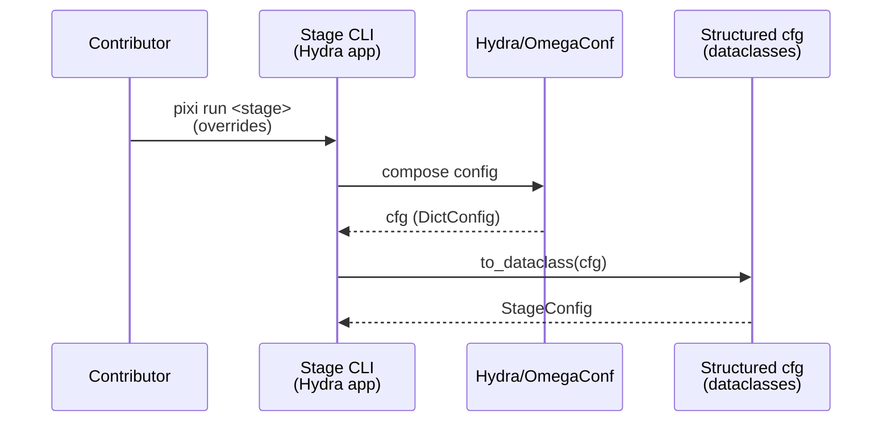
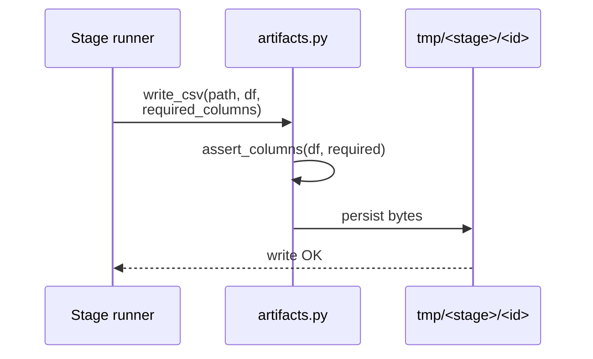
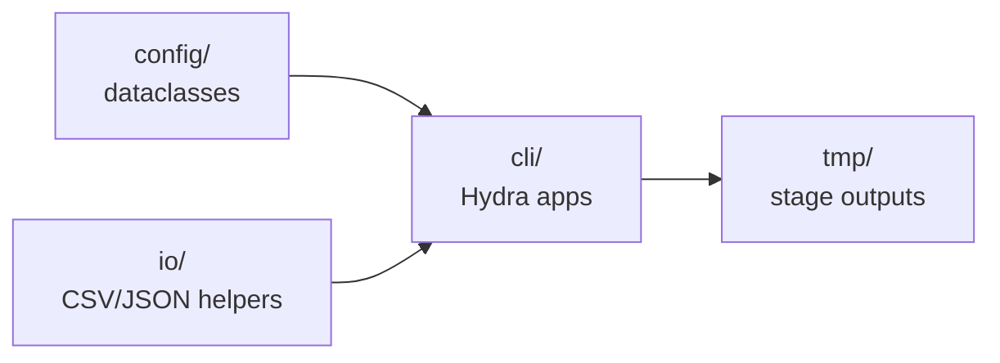

# Implementation Guide: Foundation (Hydra + artifacts)

**Phase**: 1 | **Feature**: Compare Vidur vs real Qwen3 A100 timing | **Tasks**: T001–T006

## Goal

Create the shared scaffolding used by every stage:

- A stable module layout under `src/gpu_simulate_test/`
- Hydra config conventions under `configs/compare_vidur_real/`
- Shared structured configs + artifact IO helpers
- A unit-testable “contract layer” for the on-disk CSV/JSON artifacts

## Public APIs

### T004: Structured config dataclasses

These configs are the typed “source of truth” for Hydra-composed settings. Keep them small and stage-focused; stage entrypoints compose them into an app config.

```python
# src/gpu_simulate_test/config/base.py

from __future__ import annotations

from dataclasses import dataclass
from pathlib import Path
from typing import Literal, Optional


@dataclass(frozen=True)
class ModelConfig:
    """Model selection and tokenizer reference used across stages."""

    model_id: str
    tokenizer_ref: Path


@dataclass(frozen=True)
class HardwareConfig:
    """Hardware identity used for provenance and profiling selection."""

    hardware_id: str  # e.g., "a100"
    device: str  # e.g., "cuda:0"


@dataclass(frozen=True)
class WorkloadPaths:
    """Absolute paths to workload artifacts."""

    workload_dir: Path
    prompts_jsonl: Path
    trace_lengths_csv: Path
    trace_intervals_csv: Path
    workload_meta_json: Path


@dataclass(frozen=True)
class ProfilingConfig:
    """Vidur profiling bundle location."""

    profiling_root: Path


@dataclass(frozen=True)
class OutputConfig:
    """Controls output directories and metadata writing."""

    run_id: str
    write_hydra_snapshot: bool = True


@dataclass(frozen=True)
class StageConfig:
    """Shared stage metadata captured in `run_meta.json`."""

    run_type: Literal["real", "vidur", "compare", "vidur_profile"]
    model: ModelConfig
    hardware: Optional[HardwareConfig]
    output: OutputConfig
```

**Usage Flow**:



**Pseudocode**:

```python
def main(cfg) -> None:
    stage_cfg = StageConfig.from_omegaconf(cfg)
    stage_cfg.validate()
    run(stage_cfg)
```

---

### T005: Artifact IO + schema checks

Centralize “contracts” in IO helpers so every stage writes consistent schemas.

```python
# src/gpu_simulate_test/io/artifacts.py

from __future__ import annotations

from dataclasses import dataclass
from pathlib import Path
from typing import Iterable, Mapping, Sequence

import pandas as pd


def assert_columns(df: pd.DataFrame, required: Sequence[str], *, context: str) -> None:
    """Fail fast if required columns are missing."""


def read_csv(path: Path, *, required_columns: Sequence[str], context: str) -> pd.DataFrame:
    """Load a CSV and validate required columns."""


def write_csv(path: Path, df: pd.DataFrame, *, required_columns: Sequence[str]) -> None:
    """Write a CSV and validate required columns before persisting."""


def read_json(path: Path) -> dict:
    """Load JSON as a Python dict."""


def write_json(path: Path, data: Mapping) -> None:
    """Write JSON with stable formatting (sorted keys, 2-space indent)."""


def stable_id(parts: Iterable[str], *, prefix: str, length: int = 10) -> str:
    """Create a short, stable identifier from input strings."""
```

**Usage Flow**:



**Pseudocode**:

```python
def write_run_artifacts(out_dir, request_df, token_df, run_meta):
    write_csv(out_dir / "request_metrics.csv", request_df, required_columns=[...])
    write_csv(out_dir / "token_metrics.csv", token_df, required_columns=[...])
    write_json(out_dir / "run_meta.json", run_meta)
```

---

### T002/T003: Hydra + Pixi conventions (entrypoint contract)

Each stage should be runnable via Pixi and configured via Hydra presets under:

- `configs/compare_vidur_real/`

Minimal entrypoint convention:

- Module: `src/gpu_simulate_test/cli/<stage>.py`
- Hydra config: `configs/compare_vidur_real/<stage>.yaml`
- Pixi task: `pixi run <stage>` calls `python -m gpu_simulate_test.cli.<stage>`

## Phase Integration



## Testing

### Test Input

- None (schema helper tests should use in-memory DataFrames and temporary directories)

### Test Procedure

```bash
pixi run pytest tests/unit/test_artifact_schemas.py
```

### Test Output

- `test_artifact_schemas.py` passes
- No files written outside the pytest temp directories

## References

- Spec: `specs/001-compare-vidur-real-timing/spec.md`
- Data model: `specs/001-compare-vidur-real-timing/data-model.md`
- Contracts: `specs/001-compare-vidur-real-timing/contracts/`
- Tasks: `specs/001-compare-vidur-real-timing/tasks.md`

## Implementation Summary

- Implemented package skeleton under `src/gpu_simulate_test/` (`cli/`, `config/`, `io/`, `workloads/`, `real_bench/`, `vidur_ext/`, `analysis/`).
- Added shared structured dataclasses in `src/gpu_simulate_test/config/base.py` and an OmegaConf resolver (`stable_id`) in `src/gpu_simulate_test/config/resolvers.py`.
- Implemented artifact IO helpers (`read/write_csv`, `read/write_json`, schema column checks, stable IDs) in `src/gpu_simulate_test/io/artifacts.py` plus provenance helpers in `src/gpu_simulate_test/io/provenance.py`.
- Created Hydra config tree under `configs/compare_vidur_real/` (stage configs + `model/`, `hardware/`, `workload/`, `backend/`, `vidur/` groups).
- Added Pixi tasks in `pyproject.toml` for stage entrypoints.
- Validation: `pixi run pytest tests/unit/test_artifact_schemas.py`.
