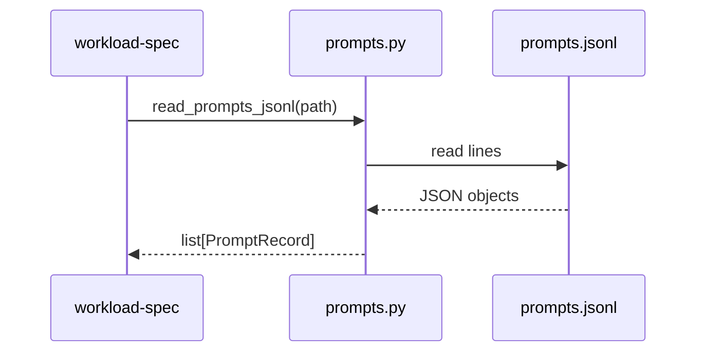
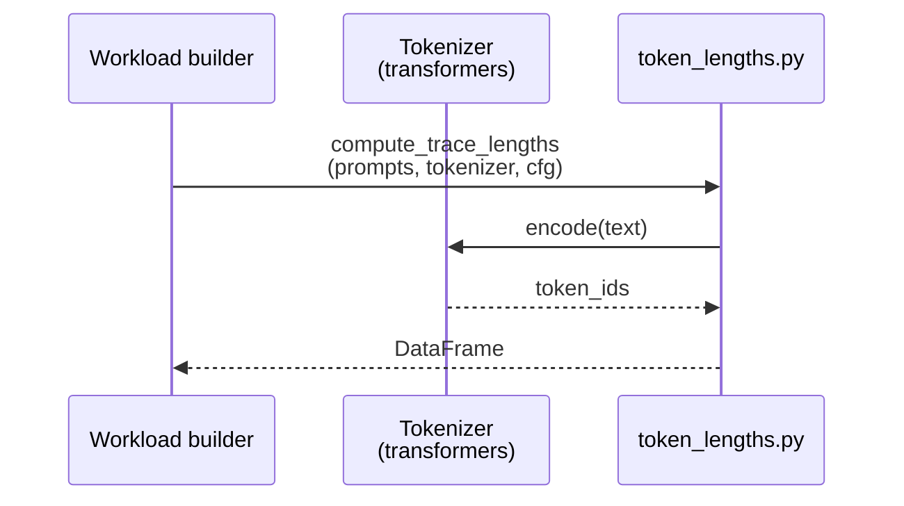
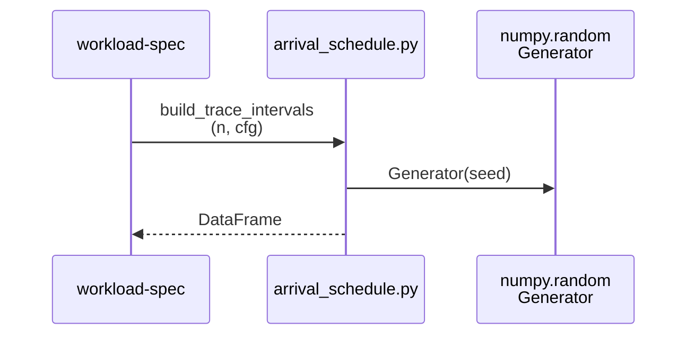
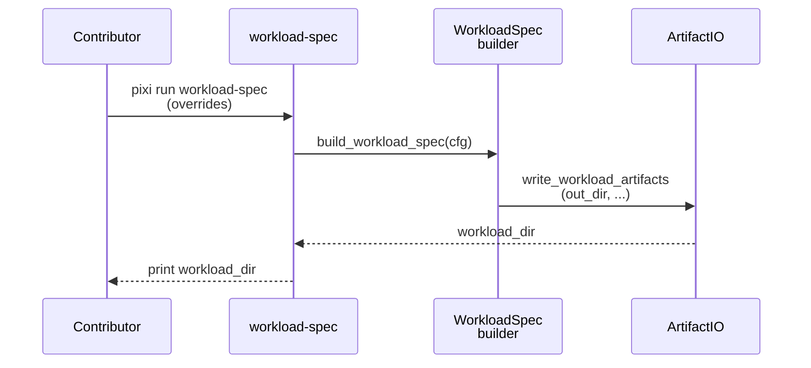
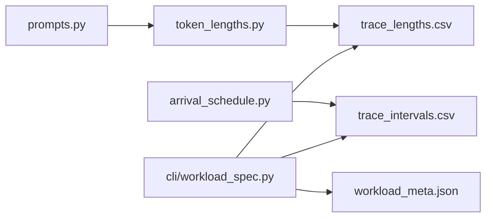

# Implementation Guide: Workload spec (deterministic)

**Phase**: 2 | **Feature**: Compare Vidur vs real Qwen3 A100 timing | **Tasks**: T101–T107

## Goal

Generate a deterministic workload spec directory:

- `prompts.jsonl`
- `trace_lengths.csv` (`num_prefill_tokens`, `num_decode_tokens`)
- `trace_intervals.csv` (`inter_arrival_ns`, `arrival_time_ns`)
- `workload_meta.json` (provenance)

The workload spec must drive both real timing runs and Vidur simulation runs.

## Public APIs

### T103: Prompts IO

```python
# src/gpu_simulate_test/workloads/prompts.py

from __future__ import annotations

from dataclasses import dataclass
from pathlib import Path
from typing import Iterable, Iterator


@dataclass(frozen=True)
class PromptRecord:
    """One prompt input line for workload generation."""

    prompt_id: str
    text: str


def read_prompts_jsonl(path: Path) -> list[PromptRecord]:
    """Read prompts from JSONL (requires `prompt_id` and `text`)."""


def write_prompts_jsonl(path: Path, prompts: Iterable[PromptRecord]) -> None:
    """Write prompts to JSONL with stable ordering."""
```

**Usage Flow**:



---

### T104: Token length extraction

```python
# src/gpu_simulate_test/workloads/token_lengths.py

from __future__ import annotations

from dataclasses import dataclass
from pathlib import Path
from typing import Protocol, Sequence

import pandas as pd

from gpu_simulate_test.workloads.prompts import PromptRecord


class Tokenizer(Protocol):
    """Tokenizer interface (so tests can use a fake tokenizer)."""

    def encode(self, text: str) -> list[int]: ...


@dataclass(frozen=True)
class TraceLengthsConfig:
    """Inputs that affect token length determinism."""

    num_decode_tokens: int


def compute_trace_lengths(
    prompts: Sequence[PromptRecord],
    *,
    tokenizer: Tokenizer,
    config: TraceLengthsConfig,
) -> pd.DataFrame:
    """Compute `trace_lengths.csv` rows for each prompt."""
```

**Usage Flow**:



---

### T105: Deterministic arrival schedule

```python
# src/gpu_simulate_test/workloads/arrival_schedule.py

from __future__ import annotations

from dataclasses import dataclass
from typing import Literal

import numpy as np
import pandas as pd


@dataclass(frozen=True)
class ArrivalScheduleConfig:
    """Deterministic arrival schedule parameters."""

    kind: Literal["fixed_interval", "poisson"]
    seed: int
    inter_arrival_ns: int  # used for fixed_interval
    poisson_rate_per_s: float  # used for poisson


def build_trace_intervals(num_requests: int, *, config: ArrivalScheduleConfig) -> pd.DataFrame:
    """Build `trace_intervals.csv` with integer nanosecond columns."""
```

**Usage Flow**:



---

### T106/T107: Hydra entrypoint + workload meta

```python
# src/gpu_simulate_test/cli/workload_spec.py

from __future__ import annotations

from dataclasses import dataclass
from pathlib import Path

import hydra


@dataclass(frozen=True)
class WorkloadSpecAppConfig:
    """Hydra-composed config for workload-spec."""

    prompts: Path
    seed: int
    out_dir: Path


@hydra.main(
    config_path="../../../configs/compare_vidur_real",
    config_name="workload_spec",
    version_base=None,
)
def main(cfg: WorkloadSpecAppConfig) -> None:
    """Generate workload artifacts under `tmp/workloads/<workload_id>/`."""
```

**Usage Flow**:



**Pseudocode**:

```python
def build_workload_spec(cfg):
    prompts = read_prompts_jsonl(cfg.prompts)
    lengths = compute_trace_lengths(prompts, tokenizer=..., config=...)
    intervals = build_trace_intervals(len(prompts), config=...)
    write_csv(cfg.out_dir / "trace_lengths.csv", lengths, required_columns=[...])
    write_csv(cfg.out_dir / "trace_intervals.csv", intervals, required_columns=[...])
    write_json(cfg.out_dir / "workload_meta.json", meta)
```

## Phase Integration



## Testing

### Test Input

- A small prompts file: `<workspace>/tmp/prompts/smoke.prompts.jsonl`
- A fixed seed: `123`

### Test Procedure

```bash
# Unit: determinism + schema
pixi run pytest tests/unit/test_workload_spec_determinism.py

# Manual smoke: writes under tmp/workloads/
pixi run python tests/manual/test_workload_spec_smoke.py \
  --prompts tmp/prompts/smoke.prompts.jsonl \
  --seed 123
```

### Test Output

- Two identical runs produce identical `trace_intervals.csv` bytes
- `trace_lengths.csv` has required columns per `specs/001-compare-vidur-real-timing/contracts/workload_spec.md`
- Output directory created under `tmp/workloads/`

## References

- Spec: `specs/001-compare-vidur-real-timing/spec.md`
- Data model: `specs/001-compare-vidur-real-timing/data-model.md`
- Contracts: `specs/001-compare-vidur-real-timing/contracts/workload_spec.md`
- Tasks: `specs/001-compare-vidur-real-timing/tasks.md`

## Implementation Summary

- Implemented deterministic arrival schedule generation in `src/gpu_simulate_test/workloads/arrival_schedule.py` (`build_trace_intervals`, integer ns timestamps).
- Implemented prompts JSONL IO in `src/gpu_simulate_test/workloads/prompts.py`.
- Implemented token length extraction in `src/gpu_simulate_test/workloads/token_lengths.py` (HuggingFace tokenizer loader + `compute_trace_lengths`).
- Implemented Hydra entrypoint `src/gpu_simulate_test/cli/workload_spec.py` to write `prompts.jsonl`, `trace_lengths.csv`, `trace_intervals.csv`, and `workload_meta.json` per `specs/001-compare-vidur-real-timing/contracts/workload_spec.md`.
- Added unit validation `tests/unit/test_workload_spec_determinism.py` and manual smoke script `tests/manual/test_workload_spec_smoke.py`.
- Validation: `pixi run pytest tests/unit/test_workload_spec_determinism.py`.
