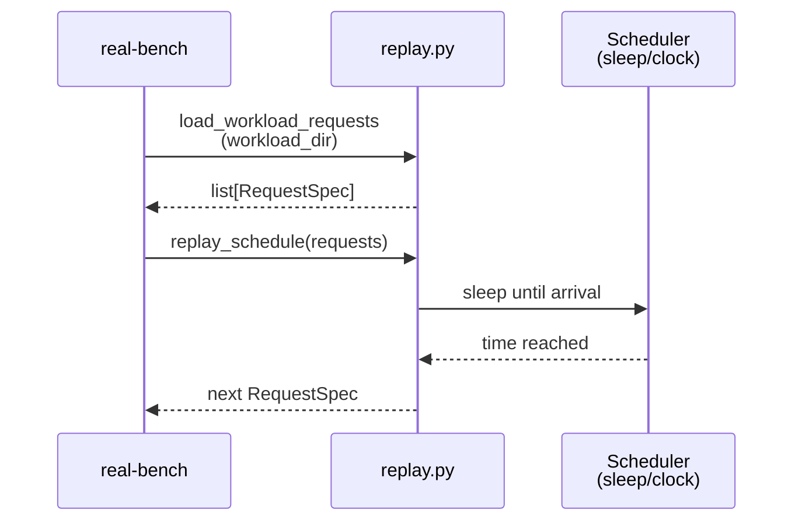
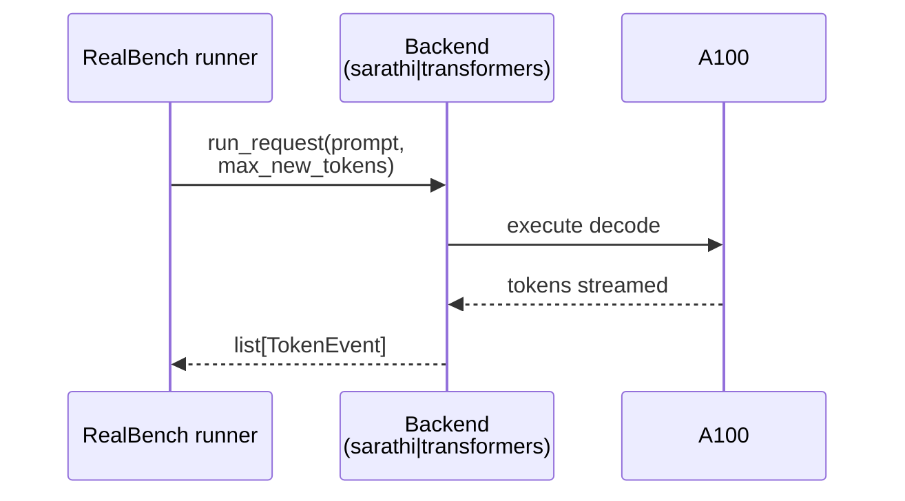
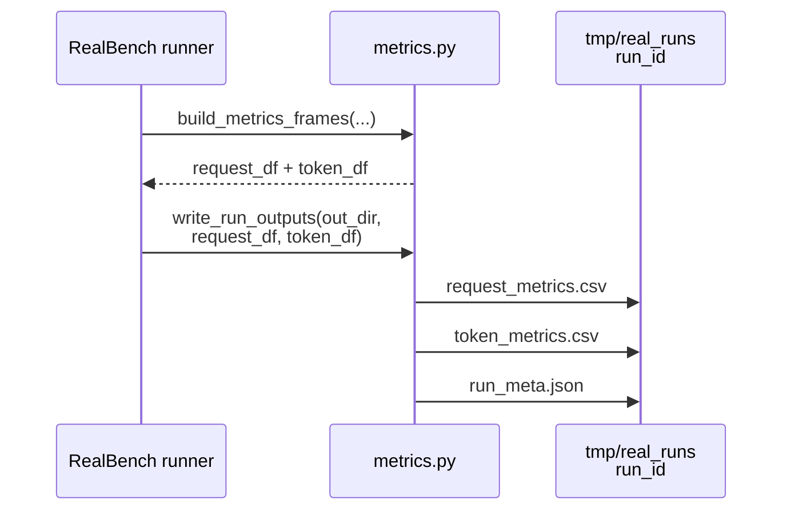
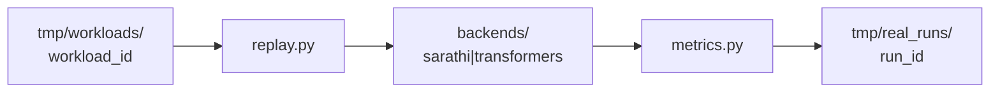

# Implementation Guide: Real benchmark (A100 timing)

**Phase**: 3 | **Feature**: Compare Vidur vs real Qwen3 A100 timing | **Tasks**: T201–T207

## Goal

Replay a workload spec against a real backend (Sarathi or Transformers) and write standardized artifacts:

- `request_metrics.csv`
- `token_metrics.csv`
- `run_meta.json`

All timestamps are integer nanoseconds relative to run start (monotonic).

## Public APIs

### T203: Trace replay scheduler

```python
# src/gpu_simulate_test/real_bench/replay.py

from __future__ import annotations

from dataclasses import dataclass
from pathlib import Path
from typing import Iterable, Iterator

import pandas as pd


@dataclass(frozen=True)
class RequestSpec:
    """One request to issue during replay."""

    request_id: int
    prompt_id: str
    prompt_text: str
    arrival_time_ns: int
    num_decode_tokens: int


def load_workload_requests(workload_dir: Path) -> list[RequestSpec]:
    """Load and join prompts + trace CSVs into per-request specs."""


def replay_schedule(requests: Iterable[RequestSpec]) -> Iterator[RequestSpec]:
    """Yield requests in arrival order, sleeping to match arrival times."""
```

**Usage Flow**:



---

### T204/T205: Backend adapters (transformers / sarathi)

Backends should share a common interface so metrics recording and scheduling are backend-agnostic.

```python
# src/gpu_simulate_test/real_bench/backends/base.py

from __future__ import annotations

from dataclasses import dataclass
from typing import Protocol


@dataclass(frozen=True)
class TokenEvent:
    """One emitted token event from the backend."""

    token_index: int
    token_time_ns: int


class RealBackend(Protocol):
    """Backend interface used by real-bench."""

    def warmup(self) -> None: ...
    def run_request(self, *, prompt: str, max_new_tokens: int) -> list[TokenEvent]: ...
```

**Usage Flow**:



---

### T206: Metrics recorder

```python
# src/gpu_simulate_test/real_bench/metrics.py

from __future__ import annotations

from dataclasses import dataclass
from pathlib import Path
from typing import Iterable

import pandas as pd

from gpu_simulate_test.real_bench.backends.base import TokenEvent


@dataclass(frozen=True)
class RequestMetricsRow:
    request_id: int
    arrival_time_ns: int
    first_token_time_ns: int
    ttft_ns: int
    num_prefill_tokens: int
    num_decode_tokens: int
    num_decode_tokens_actual: int
    status: str


def build_metrics_frames(
    *,
    request_id: int,
    arrival_time_ns: int,
    token_events: list[TokenEvent],
    num_prefill_tokens: int,
    num_decode_tokens: int,
) -> tuple[pd.DataFrame, pd.DataFrame]:
    """Build request_metrics + token_metrics frames per contracts."""


def write_run_outputs(out_dir: Path, *, request_df: pd.DataFrame, token_df: pd.DataFrame, run_meta: dict) -> None:
    """Write CSV/JSON outputs per `contracts/`."""
```

**Usage Flow**:



---

### T207: Hydra entrypoint

```python
# src/gpu_simulate_test/cli/real_bench.py

from __future__ import annotations

from dataclasses import dataclass
from pathlib import Path
from typing import Literal

import hydra


@dataclass(frozen=True)
class RealBenchAppConfig:
    backend: Literal["sarathi", "transformers"]
    workload_dir: Path
    out_dir: Path


@hydra.main(
    config_path="../../../configs/compare_vidur_real",
    config_name="real_bench",
    version_base=None,
)
def main(cfg: RealBenchAppConfig) -> None:
    """Run real benchmark and write standardized metrics artifacts."""
```

## Phase Integration



## Testing

### Test Input

- A tiny workload directory: `<workspace>/tmp/workloads/<workload_id>/`
- A100 access and correct CUDA driver/runtime
- Model/tokenizer reference under `models/` (external ref pattern)

### Test Procedure

```bash
# Unit: schema validation (CPU-only)
pixi run pytest tests/unit/test_real_metrics_schema.py

# Manual: end-to-end smoke (A100 required)
pixi run python tests/manual/test_real_bench_smoke.py \
  --backend transformers \
  --workload-dir tmp/workloads/<workload_id>
```

### Test Output

- `tmp/real_runs/<run_id>/request_metrics.csv` and `token_metrics.csv` exist and match contracts
- All token timestamps are monotonic within each request
- `run_meta.json` captures backend + workload provenance

## References

- Spec: `specs/001-compare-vidur-real-timing/spec.md`
- Data model: `specs/001-compare-vidur-real-timing/data-model.md`
- Contracts: `specs/001-compare-vidur-real-timing/contracts/`
- Tasks: `specs/001-compare-vidur-real-timing/tasks.md`

## Implementation Summary

- Implemented workload loader + replay helpers in `src/gpu_simulate_test/real_bench/replay.py` (joins `prompts.jsonl` + trace CSVs into per-request specs).
- Added backend interface in `src/gpu_simulate_test/real_bench/backends/base.py`.
- Implemented `transformers` adapter in `src/gpu_simulate_test/real_bench/backends/transformers_backend.py` (per-token timing via a custom streamer).
- Implemented `sarathi` adapter in `src/gpu_simulate_test/real_bench/backends/sarathi_backend.py` (per-token timing via `LLMEngine.step()` deltas).
- Implemented standardized metrics writer in `src/gpu_simulate_test/real_bench/metrics.py` and Hydra entrypoint `src/gpu_simulate_test/cli/real_bench.py`.
- Added unit schema validation `tests/unit/test_real_metrics_schema.py` and manual smoke script `tests/manual/test_real_bench_smoke.py`.
- Validation: `pixi run pytest tests/unit/test_real_metrics_schema.py`.
