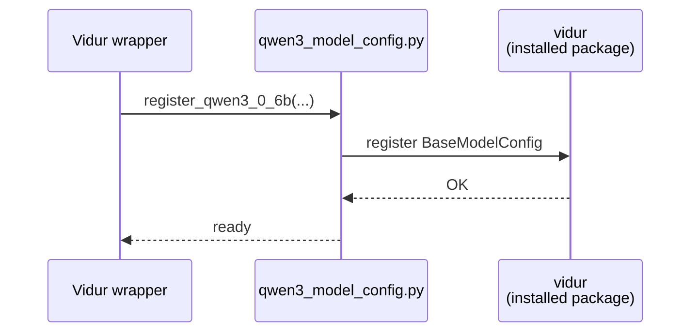
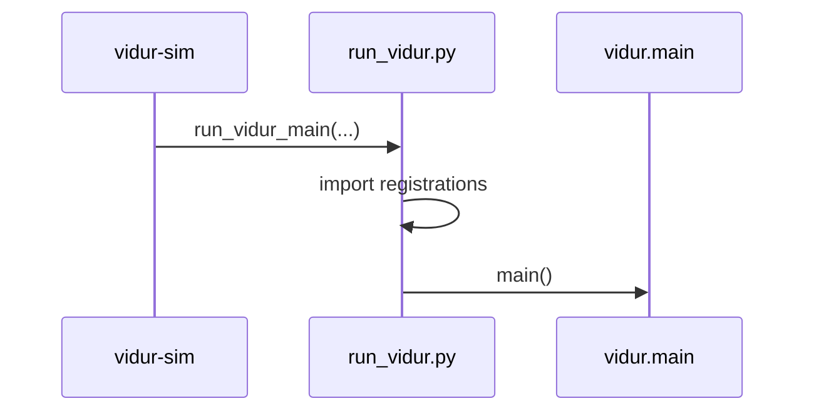
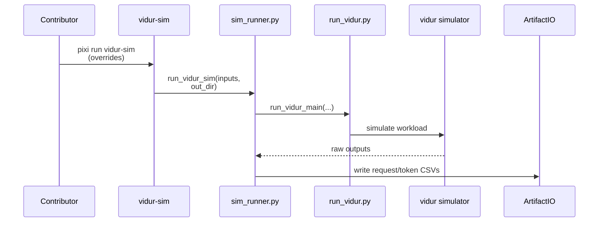
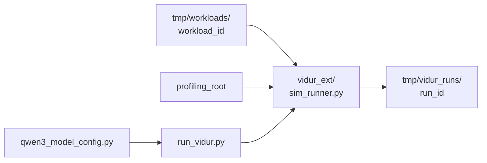

# Implementation Guide: Vidur integration (repo-root sim, no submodule patches)

**Phase**: 4 | **Feature**: Compare Vidur vs real Qwen3 A100 timing | **Tasks**: T301–T305, T601–T604

## Goal

Run Vidur from repo root with:

- Explicit `profiling_root`
- The shared workload spec (`tmp/workloads/<workload_id>/`)
- No modifications under `extern/tracked/vidur/` (adapter/wrapper only)

Write standardized artifacts under `tmp/vidur_runs/<run_id>/`:

- `request_metrics.csv`
- `token_metrics.csv`
- `run_meta.json`

## Public APIs

### T602: Qwen3 model config registration (in-repo)

Register `Qwen/Qwen3-0.6B` with Vidur without patching the submodule.

```python
# src/gpu_simulate_test/vidur_ext/qwen3_model_config.py

from __future__ import annotations

from dataclasses import dataclass
from pathlib import Path


@dataclass(frozen=True)
class Qwen3ModelRef:
    """External reference paths for Qwen3 model config/tokenizer."""

    config_json: Path  # e.g., models/qwen3-0.6b/source-data/config.json


def register_qwen3_0_6b(*, model_ref: Qwen3ModelRef) -> None:
    """Register `Qwen/Qwen3-0.6B` with Vidur (no submodule edits)."""
```

**Usage Flow**:



---

### T603: Vidur wrapper entrypoint (import registrations first)

The wrapper ensures model configs are registered before Vidur parses its own config/CLI.

```python
# src/gpu_simulate_test/vidur_ext/run_vidur.py

from __future__ import annotations

from pathlib import Path


def run_vidur_main(*, model_config_root: Path) -> None:
    """Import local model configs, then delegate to Vidur's main entrypoint."""
```

**Usage Flow**:



---

### T303: Profiling-root validation

```python
# src/gpu_simulate_test/vidur_ext/profiling_root.py

from __future__ import annotations

from dataclasses import dataclass
from pathlib import Path


@dataclass(frozen=True)
class ProfilingRootLayout:
    """Minimal contract for a usable profiling root."""

    profiling_root: Path


def validate_profiling_root(layout: ProfilingRootLayout) -> None:
    """Fail fast with actionable errors if required files are missing."""
```

---

### T304/T305: Sim runner wrapper + Hydra entrypoint

```python
# src/gpu_simulate_test/vidur_ext/sim_runner.py

from __future__ import annotations

from dataclasses import dataclass
from pathlib import Path


@dataclass(frozen=True)
class VidurSimInputs:
    workload_dir: Path
    profiling_root: Path
    model_id: str


def run_vidur_sim(inputs: VidurSimInputs, *, out_dir: Path) -> None:
    """Run Vidur simulation via wrapper and write standardized artifacts."""
```

**Usage Flow**:



## Phase Integration



## Testing

### Test Input

- A tiny workload directory: `<workspace>/tmp/workloads/<workload_id>/`
- A profiling bundle root: `<workspace>/tmp/vidur_profiling/<hardware>/<model>/` (or an existing local profiling root)
- Optional: CPU-only environment is sufficient to validate “fail fast” prereqs; simulation itself typically requires GPU profiling inputs

### Test Procedure

```bash
# Unit: prereq validation (CPU-only)
pixi run pytest tests/unit/test_vidur_sim_prereqs.py

# Manual: simulation smoke (requires profiling bundle)
pixi run python tests/manual/test_vidur_sim_smoke.py \
  --workload-dir tmp/workloads/<workload_id> \
  --profiling-root tmp/vidur_profiling/<hardware>/<model>

# Manual (US6): ensure no vidur submodule diffs
git status --porcelain extern/tracked/vidur
```

### Test Output

- Missing profiling inputs produce actionable errors
- Successful run writes `tmp/vidur_runs/<run_id>/request_metrics.csv`, `token_metrics.csv`, `run_meta.json`
- `git status` shows no modifications under `extern/tracked/vidur/`

## References

- Spec: `specs/001-compare-vidur-real-timing/spec.md`
- Data model: `specs/001-compare-vidur-real-timing/data-model.md`
- Contracts: `specs/001-compare-vidur-real-timing/contracts/`
- Tasks: `specs/001-compare-vidur-real-timing/tasks.md`

## Implementation Summary

- Implemented profiling-root validation in `src/gpu_simulate_test/vidur_ext/profiling_root.py` + unit tests in `tests/unit/test_vidur_sim_prereqs.py`.
- Implemented Qwen3 Vidur model registration (no submodule edits) in `src/gpu_simulate_test/vidur_ext/qwen3_model_config.py` and a thin wrapper in `src/gpu_simulate_test/vidur_ext/run_vidur.py`.
- Implemented Vidur simulation runner + postprocessing into standardized `request_metrics.csv`/`token_metrics.csv` in `src/gpu_simulate_test/vidur_ext/sim_runner.py`.
- Implemented Hydra entrypoint `src/gpu_simulate_test/cli/vidur_sim.py` and manual smoke script `tests/manual/test_vidur_sim_smoke.py`.
- Validation: `pixi run pytest tests/unit/test_vidur_sim_prereqs.py`.
