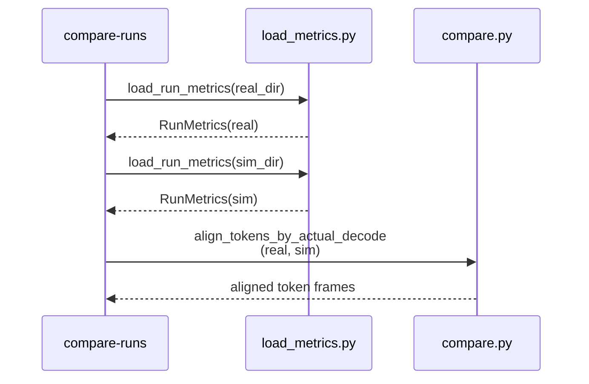
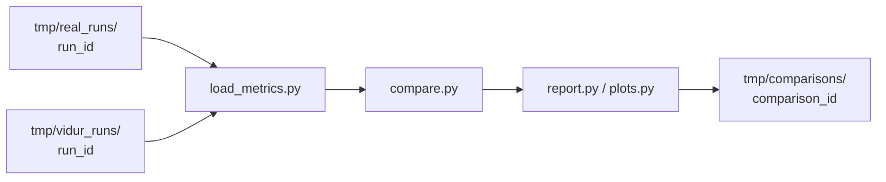

# Implementation Guide: Compare runs (report + plots)

**Phase**: 5 | **Feature**: Compare Vidur vs real Qwen3 A100 timing | **Tasks**: T401–T407

## Goal

Given one real run dir and one Vidur run dir, generate:

- `summary.md` (P50/P90/P99 for TTFT + per-token latency, both sides)
- `tables/*.csv`
- `figs/*`
- `run_meta.json` (comparison provenance)

Comparisons must handle early stopping by aligning per-token series using `num_decode_tokens_actual`.

## Public APIs

### T403: Load metrics (real + sim)

```python
# src/gpu_simulate_test/analysis/load_metrics.py

from __future__ import annotations

from dataclasses import dataclass
from pathlib import Path

import pandas as pd


@dataclass(frozen=True)
class RunMetrics:
    run_dir: Path
    request_metrics: pd.DataFrame
    token_metrics: pd.DataFrame
    run_meta: dict


def load_run_metrics(run_dir: Path) -> RunMetrics:
    """Load and validate metrics artifacts for one run directory."""
```

---

### T404: Alignment + percentile computation

```python
# src/gpu_simulate_test/analysis/compare.py

from __future__ import annotations

from dataclasses import dataclass

import pandas as pd

from gpu_simulate_test.analysis.load_metrics import RunMetrics


@dataclass(frozen=True)
class CompareResult:
    ttft_table: pd.DataFrame
    token_latency_table: pd.DataFrame


def align_tokens_by_actual_decode(
    *, real: RunMetrics, sim: RunMetrics
) -> tuple[pd.DataFrame, pd.DataFrame]:
    """Truncate sim token rows per-request using real `num_decode_tokens_actual`."""


def compute_percentiles(series: pd.Series, percentiles: list[float]) -> pd.Series:
    """Compute percentile values (expects nanosecond integer units)."""
```

**Usage Flow**:



---

### T405/T406: Plots + summary writer

```python
# src/gpu_simulate_test/analysis/report.py

from __future__ import annotations

from dataclasses import dataclass
from pathlib import Path

import pandas as pd


@dataclass(frozen=True)
class ReportPaths:
    out_dir: Path
    summary_md: Path
    tables_dir: Path
    figs_dir: Path


def write_summary_md(paths: ReportPaths, *, ttft_table: pd.DataFrame, token_table: pd.DataFrame) -> None:
    """Write a human-readable summary report."""
```

---

### T407: Hydra entrypoint

```python
# src/gpu_simulate_test/cli/compare_runs.py

from __future__ import annotations

from dataclasses import dataclass
from pathlib import Path

import hydra


@dataclass(frozen=True)
class CompareRunsAppConfig:
    real_run_dir: Path
    sim_run_dir: Path
    out_dir: Path


@hydra.main(
    config_path="../../../configs/compare_vidur_real",
    config_name="compare_runs",
    version_base=None,
)
def main(cfg: CompareRunsAppConfig) -> None:
    """Compare one real run vs one sim run and write a report."""
```

## Phase Integration



## Testing

### Test Input

- Two run directories:
  - `<workspace>/tmp/real_runs/<run_id>/`
  - `<workspace>/tmp/vidur_runs/<run_id>/`
- Can be CPU-only if inputs already exist (report generation does not require GPU)

### Test Procedure

```bash
# Unit: early-stop alignment (CPU-only)
pixi run pytest tests/unit/test_compare_alignment.py

# Manual: end-to-end compare (CPU-only if run dirs exist)
pixi run python tests/manual/test_compare_runs_smoke.py \
  --real-run-dir tmp/real_runs/<run_id> \
  --sim-run-dir tmp/vidur_runs/<run_id>
```

### Test Output

- `tmp/comparisons/<comparison_id>/summary.md` exists and includes P50/P90/P99 for TTFT + per-token latency
- At least one plot per metric family exists under `figs/`
- Missing columns/files fail with actionable errors

## References

- Spec: `specs/001-compare-vidur-real-timing/spec.md`
- Data model: `specs/001-compare-vidur-real-timing/data-model.md`
- Contracts: `specs/001-compare-vidur-real-timing/contracts/`
- Tasks: `specs/001-compare-vidur-real-timing/tasks.md`

## Implementation Summary

TODO (fill after implementation).

