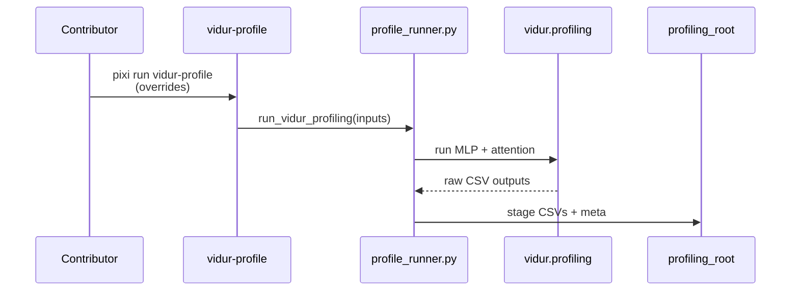
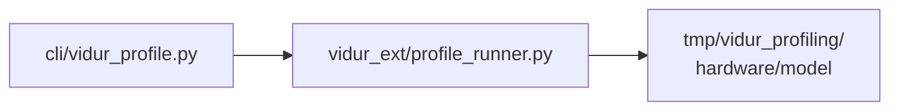

# Implementation Guide: Vidur profiling bundle

**Phase**: 6 | **Feature**: Compare Vidur vs real Qwen3 A100 timing | **Tasks**: T501–T503

## Goal

Generate and stage Vidur profiling inputs under an explicit profiling root, so simulation can run reproducibly without relying on Vidur’s internal relative paths.

## Public APIs

### T502: Profiling runner wrapper

```python
# src/gpu_simulate_test/vidur_ext/profile_runner.py

from __future__ import annotations

from dataclasses import dataclass
from pathlib import Path


@dataclass(frozen=True)
class VidurProfileInputs:
    model_id: str
    hardware_id: str
    profiling_root: Path


def run_vidur_profiling(inputs: VidurProfileInputs) -> None:
    """Run Vidur profiling modules and stage outputs into profiling_root."""
```

**Usage Flow**:



---

### T503: Hydra entrypoint

```python
# src/gpu_simulate_test/cli/vidur_profile.py

from __future__ import annotations

from dataclasses import dataclass
from pathlib import Path

import hydra


@dataclass(frozen=True)
class VidurProfileAppConfig:
    model_id: str
    hardware_id: str
    profiling_root: Path


@hydra.main(
    config_path="../../../configs/compare_vidur_real",
    config_name="vidur_profile",
    version_base=None,
)
def main(cfg: VidurProfileAppConfig) -> None:
    """Generate profiling bundle under cfg.profiling_root."""
```

## Phase Integration



## Testing

### Test Input

- A100 access and correct CUDA driver/runtime
- Writable profiling root directory

### Test Procedure

```bash
# Manual: profiling smoke (A100 required)
pixi run python tests/manual/test_vidur_profile_smoke.py \
  --model-id Qwen/Qwen3-0.6B \
  --profiling-root tmp/vidur_profiling/a100/qwen3_0_6b
```

### Test Output

- Profiling CSV files exist under the profiling root
- A small metadata file exists documenting model + hardware identifiers
- Fail-fast errors if GPU is unavailable or model ref is invalid

## References

- Spec: `specs/001-compare-vidur-real-timing/spec.md`
- Tasks: `specs/001-compare-vidur-real-timing/tasks.md`

## Implementation Summary

- Implemented profiling runner wrapper in `src/gpu_simulate_test/vidur_ext/profile_runner.py` (stages outputs under `<profiling_root>/data/profiling/...`; uses Vidur profiling modules for compute profiling).
- Implemented Hydra entrypoint `src/gpu_simulate_test/cli/vidur_profile.py` (fails fast if GPU unavailable; writes `run_meta.json`).
- Added manual smoke script `tests/manual/test_vidur_profile_smoke.py`.
