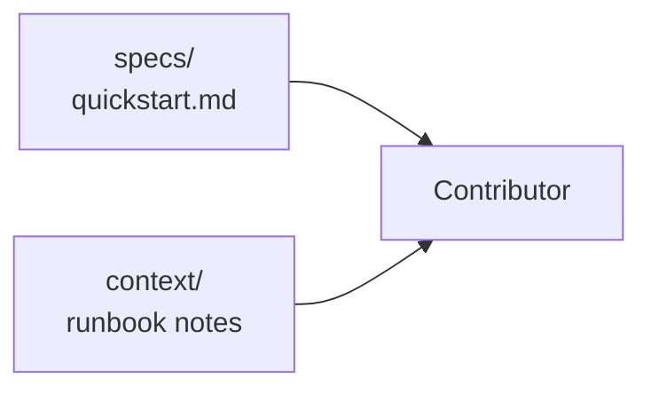

# Implementation Guide: Docs + polish

**Phase**: 7 | **Feature**: Compare Vidur vs real Qwen3 A100 timing | **Tasks**: T901–T902

## Goal

Make the workflow usable for contributors by ensuring:

- `specs/001-compare-vidur-real-timing/quickstart.md` has exact, runnable commands
- `context/` includes a runbook-style troubleshooting section for common failure modes

## Public APIs

N/A (documentation-only phase).

## Phase Integration



## Testing

### Test Input

- A clean checkout and a Pixi environment (`pixi install`)
- A tiny prompts file and a tiny workload spec
- Optional: A100 access for the real timing + profiling stages

### Test Procedure

```bash
# Validate docs steps match reality by executing the quickstart.
# (Exact commands to be filled once code lands.)
```

### Test Output

- All quickstart commands complete (or fail fast with actionable errors)
- Artifacts are created under `tmp/` as documented

## References

- Spec: `specs/001-compare-vidur-real-timing/spec.md`
- Quickstart: `specs/001-compare-vidur-real-timing/quickstart.md`
- Tasks: `specs/001-compare-vidur-real-timing/tasks.md`

## Implementation Summary

- Updated `specs/001-compare-vidur-real-timing/quickstart.md` with the exact `pixi run ...` commands and correct Hydra override keys.
- Added troubleshooting runbook notes in `context/runbooks/001-compare-vidur-real-timing-troubleshooting.md` (missing GPU, missing profiling data, tokenization mismatch, early-stop alignment).
