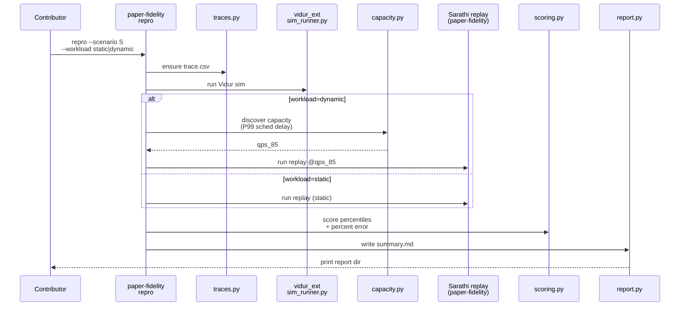
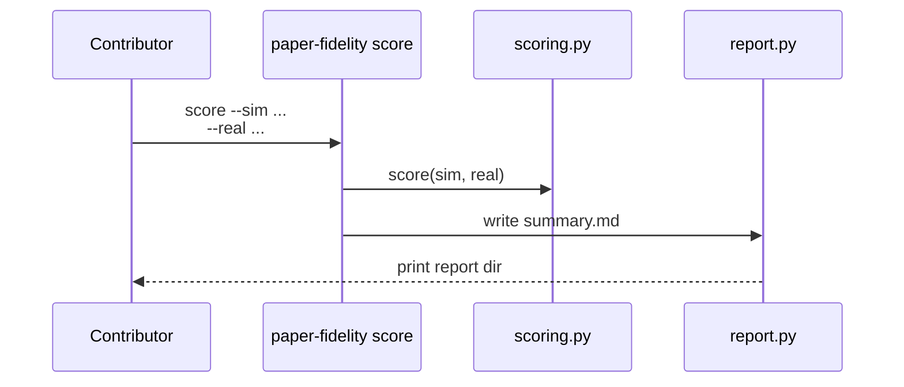
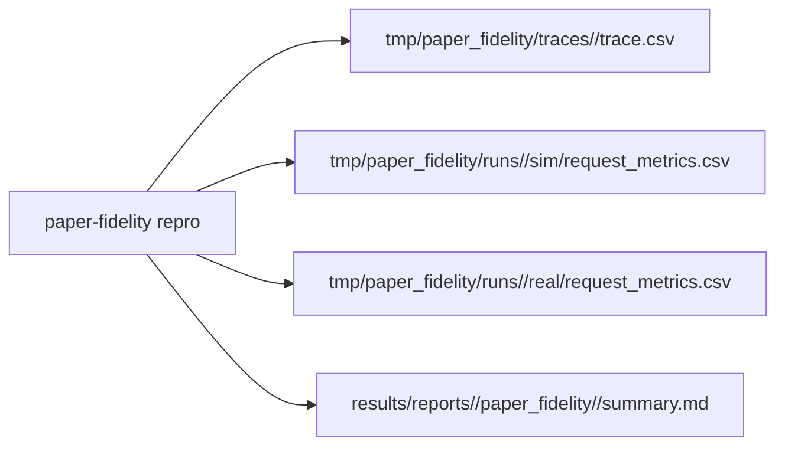

# Implementation Guide: End-to-end reproduction report (US1)

**Phase**: 3 | **Feature**: Reproduce Vidur paper fidelity | **Tasks**: T020–T022

## Goal

One command produces a paper-fidelity report for a scenario:

- `pixi run paper-fidelity repro --scenario <scenario_name> --workload static|dynamic`

Artifacts (stable locations):

- `tmp/paper_fidelity/traces/<scenario>/trace.csv`
- `tmp/paper_fidelity/runs/<scenario>/sim/request_metrics.csv`
- `tmp/paper_fidelity/runs/<scenario>/real/request_metrics.csv`
- `results/reports/<date>/paper_fidelity/<scenario>/summary.md`

## Public APIs

### T021: `paper-fidelity repro` orchestration (trace → sim → capacity/real → score → report)

Keep orchestration logic in the CLI, but delegate “real work” to `paper_fidelity/*` modules.

```python
# src/gpu_simulate_test/cli/paper_fidelity.py

from __future__ import annotations

from pathlib import Path

from omegaconf import DictConfig


def run_repro(cfg: DictConfig, *, repo_root: Path) -> Path:
    """Run the full paper-fidelity workflow and return the report directory."""
```

**Usage Flow**:



**Pseudocode**:

```python
def run_repro(cfg, repo_root):
    scenario = cfg.scenario.name
    trace_csv = ensure_trace_csv(cfg, repo_root=repo_root)

    sim_csv = run_vidur_paper_fidelity_sim(trace_csv, cfg)

    if cfg.workload.mode == "dynamic":
        capacity = discover_capacity(cfg, trace_csv=trace_csv)
        real_csv = run_real(trace_csv, qps=capacity.qps_85, cfg=cfg)
    else:
        real_csv = run_real(trace_csv, qps=None, cfg=cfg)

    score = score_metrics(sim_csv, real_csv, cfg)
    report_dir = write_report(score, cfg)
    return report_dir
```

---

### T022: `paper-fidelity score` (scoring-only)

Scoring-only consumes existing sim/real metrics artifacts and writes a report.

```python
# src/gpu_simulate_test/cli/paper_fidelity.py

from __future__ import annotations

from pathlib import Path

from omegaconf import DictConfig


def run_score_only(cfg: DictConfig, *, sim_csv: Path, real_csv: Path, repo_root: Path) -> Path:
    """Score two metrics CSVs and return the report directory."""
```

**Usage Flow**:



---

### T020: Manual smoke run (`tests/manual/test_paper_fidelity_repro_smoke.py`)

Provide a small end-to-end smoke that:

- generates a tiny trace
- runs sim (if profiling bundle exists)
- runs real (requires CUDA + model)
- writes a report

## Phase Integration



## Testing

### Test Input

- Model reference exists (baseline): `models/llama2-7b-hf/source-data`
- CUDA available (`torch.cuda.is_available() == True`) for real runs
- A small trace configuration (generated by the smoke script)

### Test Procedure

```bash
# GPU required end-to-end (baseline scenario)
pixi run python tests/manual/test_paper_fidelity_repro_smoke.py
```

### Test Output

- `tmp/paper_fidelity/` contains trace + sim + real artifacts
- `results/reports/<date>/paper_fidelity/<scenario>/summary.md` exists
- The script prints the report directory to stdout

## References

- Spec: `specs/002-reproduce-vidur-paper-fidelity/spec.md`
- Quickstart: `specs/002-reproduce-vidur-paper-fidelity/quickstart.md`
- Tasks breakdown (authoritative checklist): `specs/002-reproduce-vidur-paper-fidelity/tasks.md`
- Contracts: `specs/002-reproduce-vidur-paper-fidelity/contracts/`

## Implementation Summary

(fill after implementation)
