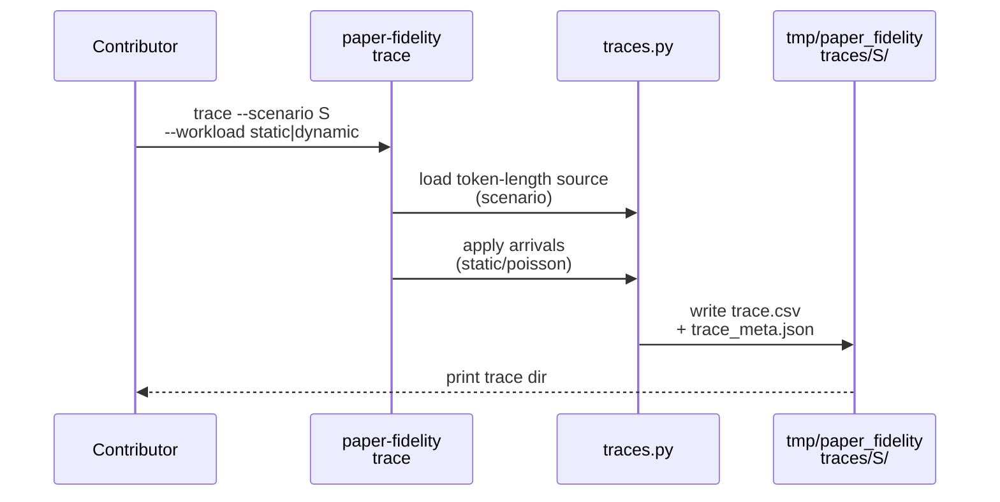
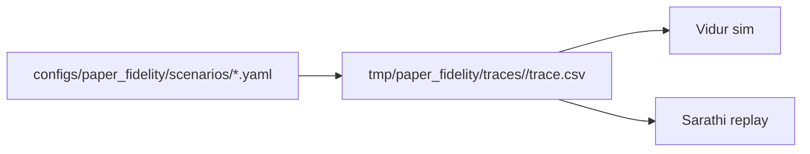

# Implementation Guide: Standardized trace generation (US2)

**Phase**: 4 | **Feature**: Reproduce Vidur paper fidelity | **Tasks**: T030–T032

## Goal

Provide a single canonical trace schema that drives both Vidur simulation and real replay:

- Canonical: `trace.csv` with `arrived_at,num_prefill_tokens,num_decode_tokens` (plus optional IDs)
- Legacy compatibility: `trace_lengths.csv` + `trace_intervals.csv` conversion
- Baseline trace source: Vidur’s processed arXiv summarization token-length distribution (LLaMA2 tokenizer)

**Path convention**: All repo paths are relative to `<WORKSPACE_ROOT>` (repository root).

## Public APIs

### T031: `paper-fidelity trace` CLI subcommand

The trace CLI should:

- generate or validate a canonical `trace.csv`
- write `trace_meta.json` (seed/source/limits)
- print the trace directory to stdout

```python
# src/gpu_simulate_test/cli/paper_fidelity.py

from __future__ import annotations

from pathlib import Path

from omegaconf import DictConfig


def run_trace(cfg: DictConfig, *, repo_root: Path) -> Path:
    """Generate/validate a canonical trace and return the trace directory."""
```

**Usage Flow**:



---

### T032: Baseline token-length distribution wiring (scenario config)

The default scenario should point to Vidur’s processed arXiv summarization stats:

- `extern/tracked/vidur/data/processed_traces/arxiv_summarization_stats_llama2_tokenizer_filtered_v2.csv`

This file has columns:

- `num_prefill_tokens`, `num_decode_tokens`, `num_total_tokens`, `pd_ratio`

```yaml
# configs/paper_fidelity/scenarios/llama2_7b_arxiv.yaml

name: llama2_7b_arxiv

model:
  model_id: meta-llama/Llama-2-7b-hf
  model_ref: ${paths.repo_root}/models/llama2-7b-hf/source-data

trace_source:
  kind: vidur_processed_lengths_csv
  path: ${paths.repo_root}/extern/tracked/vidur/data/processed_traces/arxiv_summarization_stats_llama2_tokenizer_filtered_v2.csv
  max_tokens: 4096
  seed: 42
  num_requests: null
```

---

### T030: Manual trace smoke (`tests/manual/test_paper_fidelity_trace_smoke.py`)

Provide a script that:

- generates a tiny trace for both static and dynamic modes
- validates determinism for dynamic mode given a fixed seed

## Phase Integration



## Testing

### Test Input

- Baseline distribution CSV exists:
  - `extern/tracked/vidur/data/processed_traces/arxiv_summarization_stats_llama2_tokenizer_filtered_v2.csv`

### Test Procedure

```bash
pixi run python tests/manual/test_paper_fidelity_trace_smoke.py
```

### Test Output

- `tmp/paper_fidelity/traces/<scenario>/trace.csv` exists (static + dynamic variants)
- `trace_meta.json` records seed, max_tokens, and source path

## References

- Research: `specs/002-reproduce-vidur-paper-fidelity/research.md`
- Data model: `specs/002-reproduce-vidur-paper-fidelity/data-model.md`
- Tasks breakdown (authoritative checklist): `specs/002-reproduce-vidur-paper-fidelity/tasks.md`

## Implementation Summary

(fill after implementation)
