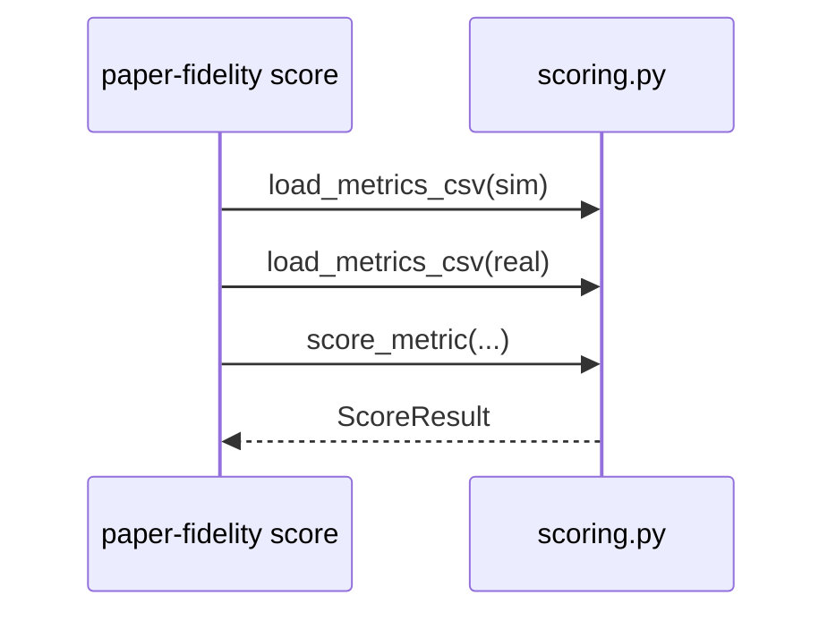
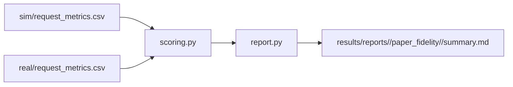

# Implementation Guide: Scoring + gap diagnosis report (US6)

**Phase**: 8 | **Feature**: Reproduce Vidur paper fidelity | **Tasks**: T070–T073

## Goal

Given two metrics files (sim + real), compute paper-aligned summaries:

- Percentiles (minimum P50/P95) for required metrics
- Percent error per metric/percentile: `abs(sim - real) / real`
- Threshold evaluation (Pass/Warn/Fail)
- A human-readable `summary.md`, plus optional diagnosis hints when thresholds are exceeded

**Path convention**: All repo paths are relative to `<WORKSPACE_ROOT>` (repository root).

## Public APIs

### T071: Scorer (percentiles + percent error + thresholds)

Keep scoring pure and testable.

```python
# src/gpu_simulate_test/paper_fidelity/scoring.py

from __future__ import annotations

from dataclasses import dataclass
from pathlib import Path

import pandas as pd


@dataclass(frozen=True)
class ScoreThresholds:
    pass_pct: float = 0.05
    warn_pct: float = 0.09


@dataclass(frozen=True)
class ScoreResult:
    metric: str
    percentiles: list[float]
    sim: dict[float, float]
    real: dict[float, float]
    pct_error: dict[float, float]
    verdict: str  # "pass" | "warn" | "fail"


def score_metric(
    *,
    sim_df: pd.DataFrame,
    real_df: pd.DataFrame,
    metric: str,
    percentiles: list[float],
    thresholds: ScoreThresholds,
) -> ScoreResult:
    """Compute percentile summaries and percent error for one metric."""


def load_metrics_csv(path: Path) -> pd.DataFrame:
    """Load request_metrics.csv and validate required columns."""
```

**Usage Flow**:



---

### T072: Report writer (`summary.md`)

Write a report that includes:

- scenario definition (if available)
- commands run + artifact locations
- percentile tables for sim + real
- percent error + pass/warn/fail thresholds

```python
# src/gpu_simulate_test/paper_fidelity/report.py

from __future__ import annotations

from dataclasses import dataclass
from pathlib import Path


@dataclass(frozen=True)
class ReportInputs:
    scenario_name: str
    sim_csv: Path
    real_csv: Path
    out_dir: Path


def write_summary_md(*, inputs: ReportInputs, results: list, meta: dict) -> Path:
    """Write summary.md and return its path."""
```

---

### T073: Gap diagnosis heuristics (only when thresholds exceeded)

Keep diagnosis lightweight and evidence-based; include at least one concrete hypothesis + pointer to evidence.

```python
# src/gpu_simulate_test/paper_fidelity/report.py

def diagnose_gap(*, sim_csv: Path, real_csv: Path, sim_meta: dict | None) -> list[str]:
    """Return a short list of hypotheses with evidence pointers."""
```

Example heuristics (initial set):

- CPU overhead modeling disabled in Vidur sim (common underprediction for small/batch=1).
- Attention profiling fallback/template used (can massively skew decode/prefill costs).
- Scheduler knob mismatch (chunk size / batch caps) between sim and real.

---

### T070: Scorer unit tests (fixed fixtures)

Use checked-in fixtures:

- `tests/fixtures/paper_fidelity/sim_request_metrics.csv`
- `tests/fixtures/paper_fidelity/real_request_metrics.csv`

```python
# tests/test_paper_fidelity_scorer.py

def test_scorer_percent_error_matches_hand_calc(): ...
def test_threshold_verdicts_pass_warn_fail(): ...
```

## Phase Integration



## Testing

### Test Input

- Fixture CSVs under `tests/fixtures/paper_fidelity/` containing the required metric columns.

### Test Procedure

```bash
pixi run pytest tests/test_paper_fidelity_scorer.py
```

### Test Output

- All scorer unit tests pass
- Threshold verdicts match expectations for fixtures

## References

- Contracts (required columns): `specs/002-reproduce-vidur-paper-fidelity/contracts/`
- Known issue patterns: `context/issues/known/issue-vidur-sim-underpredicts-sarathi-real-qwen3-0.6b.md`
- Tasks breakdown (authoritative checklist): `specs/002-reproduce-vidur-paper-fidelity/tasks.md`

## Implementation Summary

(fill after implementation)
