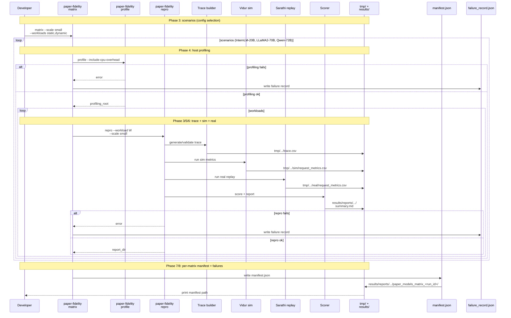
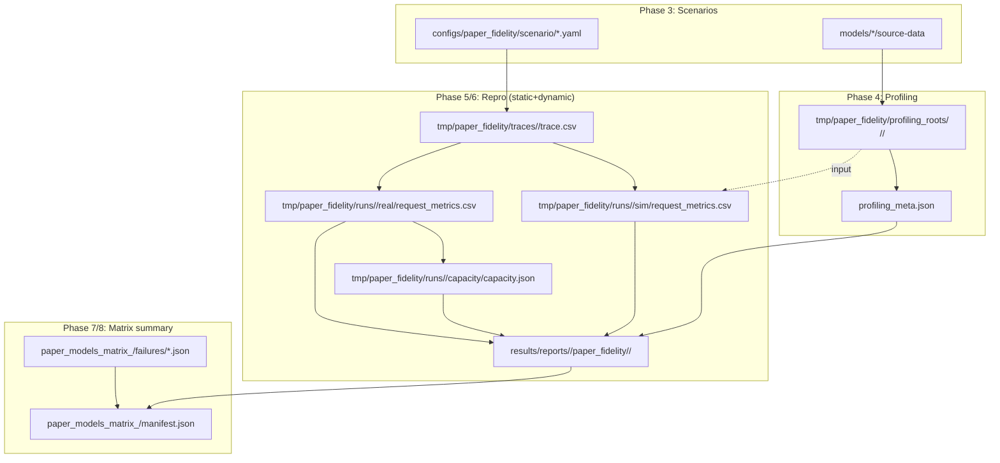
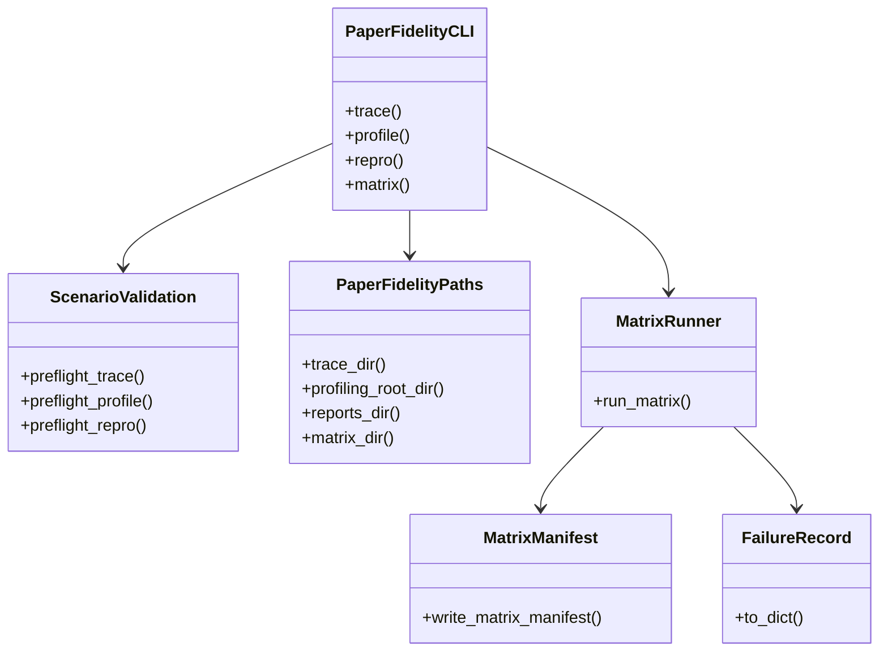
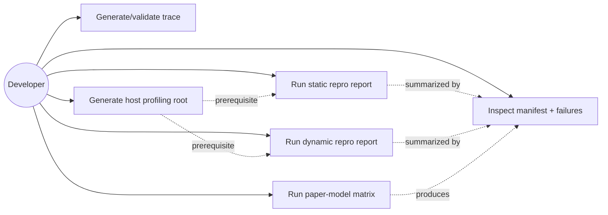
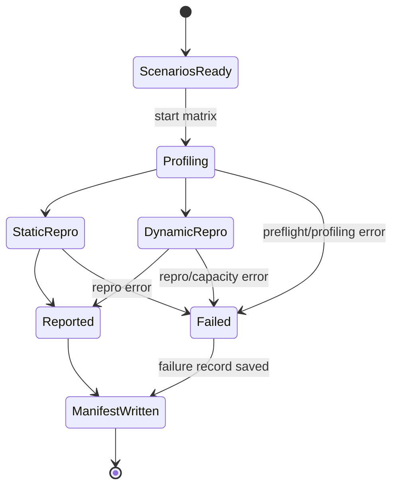

# Phase Integration Guide: Paper-fidelity more models

**Feature**: `003-paper-fidelity-more-models` | **Phases**: 9

## Overview

This feature extends the existing paper-fidelity workflow to additional “paper models”:

- InternLM-20B
- LLaMA2-70B
- Qwen-72B

and adds a repeatable **small-scale** (`--scale small`, 50 requests) **static+dynamic** matrix runner that:

- generates host profiling roots (including CPU overhead microbenchmarks),
- runs static + dynamic repro per model,
- writes self-contained report bundles, and
- records failures with stable blocker categorization.

**Path convention**: All repo paths are relative to `<WORKSPACE_ROOT>` (repository root).

## Implementation Status (as of 2026-01-13)

The feature is implemented across these key areas:

- **Phase 1/2 (shared scaffolding + validation)**:
  - Failure records: `src/gpu_simulate_test/paper_fidelity/failure_record.py`
  - Scenario preflight: `src/gpu_simulate_test/paper_fidelity/validation.py`
  - Visible GPU counting: `src/gpu_simulate_test/env_guard.py` (`count_visible_gpus`)
  - Matrix manifest schema: `src/gpu_simulate_test/paper_fidelity/matrix_manifest.py`
  - Matrix output paths: `src/gpu_simulate_test/paper_fidelity/paths.py` (`matrix_*`)
- **Phase 3/4 (scenarios + profiling)**:
  - New scenarios: `configs/paper_fidelity/scenario/{internlm_20b_arxiv,llama2_70b_arxiv,qwen_72b_arxiv}.yaml`
  - Trace preflight: `src/gpu_simulate_test/cli/paper_fidelity.py` (`_run_trace`)
  - Profiling preflight + failure records: `src/gpu_simulate_test/paper_fidelity/profiling.py`
- **Phase 5/6 (report portability + dynamic meta)**:
  - `inputs/profiling_meta.json` snapshot: `src/gpu_simulate_test/cli/paper_fidelity.py` (`_run_score_only`)
  - Dynamic `trace_meta.json` normalized: `src/gpu_simulate_test/cli/paper_fidelity.py` (`_run_repro`)
- **Phase 7/8 (matrix runner + failure transparency)**:
  - Paper models set + Qwen3 exclusion: `src/gpu_simulate_test/paper_fidelity/paper_models.py`
  - Matrix runner: `src/gpu_simulate_test/paper_fidelity/matrix.py`
  - Matrix CLI: `src/gpu_simulate_test/cli/paper_fidelity.py` (`matrix` subcommand)
  - Repro failure records: `src/gpu_simulate_test/cli/paper_fidelity.py` (`_repro_main`)
- **Phase 9 (docs)**:
  - Matrix quickstart: `specs/003-paper-fidelity-more-models/quickstart.md`
  - Runbook: `docs/runbooks/paper_fidelity_matrix.md`

## Phase Flow

**MUST HAVE: End-to-End Sequence Diagram**



## Artifact Flow Between Phases



## System Architecture



## Use Cases



## Activity Flow



## Inter-Phase Dependencies

### Phase 3 → Phase 4/5/6 (scenario + model assets)

**Artifacts**:

- `configs/paper_fidelity/scenario/<scenario>.yaml` defines:
  - `scenario.model.model_ref` (Sarathi model assets)
  - `scenario.trace_source.path` (Vidur processed lengths CSV)
- `models/<model>/source-data` must exist for profiling + real replay

### Phase 4 → Phase 5/6 (profiling root is a required input)

**Artifacts**:

- `tmp/paper_fidelity/profiling_roots/<scenario>/<timestamp>/data/profiling/...` is passed as:
  - `scenario.vidur.profiling_root=<profiling_root>`

### Phase 5/6 → Phase 7/8 (reports + failures summarized in manifest)

**Artifacts**:

- Report bundles under `results/reports/<DATE>/paper_fidelity/<scenario_tag>/`
- Failure records under `results/reports/<DATE>/paper_fidelity/paper_models_matrix_<run_id>/failures/`

## Integration Testing

```bash
# Unit (CPU-only)
pixi run pytest tests/unit/test_env_guard.py
pixi run pytest tests/unit/test_paper_fidelity_trace.py
pixi run pytest tests/unit/test_paper_fidelity_manifest.py
pixi run pytest -q

# Docs (CPU-only)
pixi run mkdocs build --strict

# Manual (GPU required; model assets required)
pixi run paper-fidelity matrix --scale small --workloads static,dynamic --include-cpu-overhead
```

## Critical Integration Points

1. **GPU pinning is mandatory**: `GSIM_CUDA_VISIBLE_DEVICES` must be set (repo `.env` or exported).
2. **Scenario defaults vs host capacity**: defaults are `tp=1,pp=1` but matrix must fail fast when TP/PP overrides exceed visible GPUs.
3. **Report discoverability**: matrix outputs must live under a dedicated `paper_models_matrix_<run_id>/` directory, and each report must be self-contained (inputs snapshot).
4. **Failure transparency**: every failure must write a durable JSON record with a stable `blocker_category` for triage.

## References

- Individual phase guides: `context/tasks/working/003-paper-fidelity-more-models/impl-phase-*.md`
- Spec: `specs/003-paper-fidelity-more-models/spec.md`
- Plan: `specs/003-paper-fidelity-more-models/plan.md`
- Tasks breakdown (authoritative checklist): `specs/003-paper-fidelity-more-models/tasks.md`
- Data model: `specs/003-paper-fidelity-more-models/data-model.md`
- Contracts: `specs/003-paper-fidelity-more-models/contracts/`
