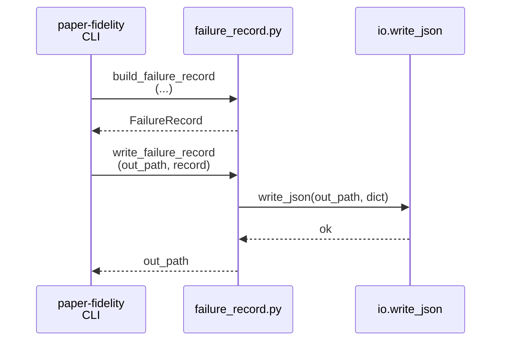
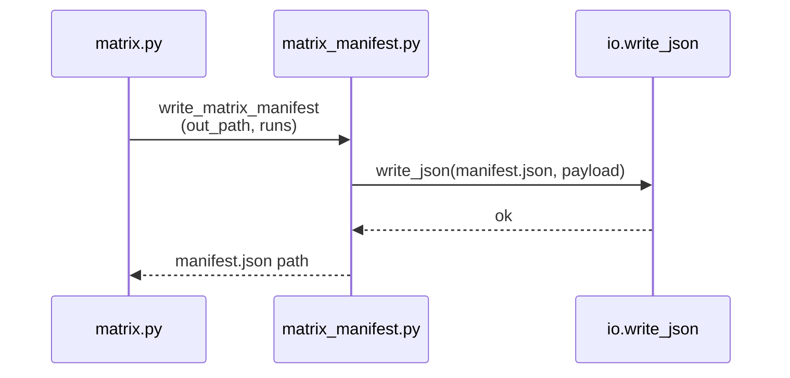
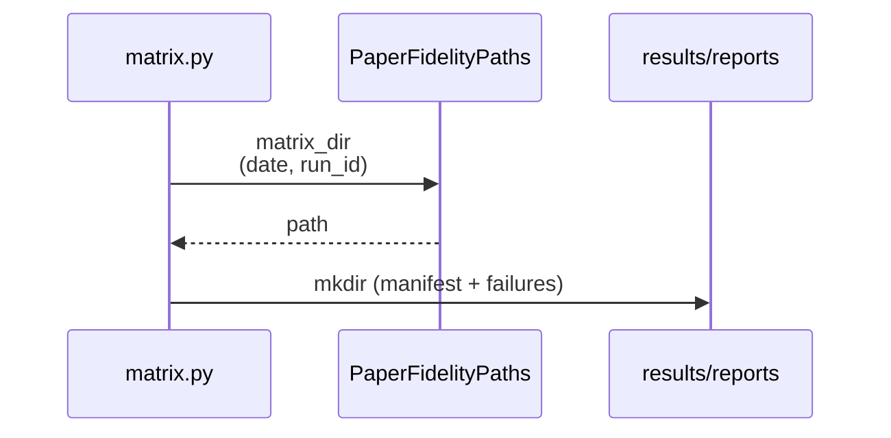
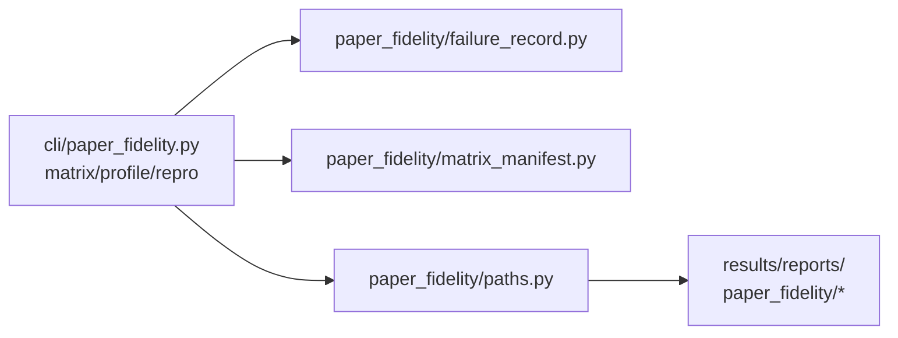

# Implementation Guide: Setup (failure schema + matrix paths)

**Phase**: 1 | **Feature**: Paper-fidelity more models | **Tasks**: T001–T003

## Goal

Create shared scaffolding used by later user stories:

- Structured failure records (JSON) for any failed run (profile/repro/matrix).
- A per-matrix manifest schema that can summarize successes + failures.
- Stable output directories for matrix artifacts under `results/reports/<UTC-YYYY-MM-DD>/paper_fidelity/...`.

**Path convention**: All repo paths are relative to `<WORKSPACE_ROOT>` (repository root).

## Public APIs

### T001: Failure record schema + JSON writer (`paper_fidelity/failure_record.py`)

Define a minimal, typed record aligned with:

- Data model: `specs/003-paper-fidelity-more-models/data-model.md` (Failure Record entity)
- Contract: `specs/003-paper-fidelity-more-models/contracts/openapi.yaml` (`FailureRecord` schema)

```python
# src/gpu_simulate_test/paper_fidelity/failure_record.py

from __future__ import annotations

from dataclasses import dataclass
from pathlib import Path
from typing import Literal, Sequence

from gpu_simulate_test.io import utcnow_iso, write_json


BlockerCategory = Literal[
    "insufficient GPUs",
    "OOM",
    "missing model files",
    "unsupported model",
    "unknown",
]

FailureAction = Literal["trace", "profile", "repro", "matrix"]


@dataclass(frozen=True)
class FailureRecord:
    schema_version: str
    generated_at: str
    run_id: str
    action: FailureAction
    scenario_key: str
    scenario_name: str | None
    workload: Literal["static", "dynamic"] | None
    scale: Literal["small", "medium", "full"] | None
    attempted_command: list[str] | str | None
    hydra_overrides: list[str]
    error_message: str
    traceback: str | None
    blocker_category: BlockerCategory

    def to_dict(self) -> dict[str, object]:
        return {
            "schema_version": self.schema_version,
            "generated_at": self.generated_at,
            "run_id": self.run_id,
            "action": self.action,
            "scenario_key": self.scenario_key,
            "scenario_name": self.scenario_name,
            "workload": self.workload,
            "scale": self.scale,
            "attempted_command": self.attempted_command,
            "hydra_overrides": self.hydra_overrides,
            "error_message": self.error_message,
            "traceback": self.traceback,
            "blocker_category": self.blocker_category,
        }


def write_failure_record(out_path: Path, record: FailureRecord) -> Path:
    out_path.parent.mkdir(parents=True, exist_ok=True)
    write_json(out_path, record.to_dict())
    return out_path.resolve()


def build_failure_record(
    *,
    run_id: str,
    action: FailureAction,
    scenario_key: str,
    scenario_name: str | None,
    workload: str | None,
    scale: str | None,
    attempted_command: Sequence[str] | str | None,
    hydra_overrides: Sequence[str] | None,
    error_message: str,
    traceback: str | None,
    blocker_category: BlockerCategory,
) -> FailureRecord:
    return FailureRecord(
        schema_version="v1",
        generated_at=utcnow_iso(),
        run_id=str(run_id),
        action=action,
        scenario_key=str(scenario_key),
        scenario_name=None if scenario_name is None else str(scenario_name),
        workload=None if workload is None else str(workload),
        scale=None if scale is None else str(scale),
        attempted_command=list(attempted_command) if isinstance(attempted_command, (list, tuple)) else attempted_command,
        hydra_overrides=list(hydra_overrides or []),
        error_message=str(error_message),
        traceback=None if traceback is None else str(traceback),
        blocker_category=blocker_category,
    )
```

**Usage Flow**:



---

### T002: Matrix manifest schema + JSON writer (`paper_fidelity/matrix_manifest.py`)

Define a “one file per matrix run” manifest that:

- lists the scenarios/workloads/scale attempted
- includes per-run status (`success|failure`)
- points to report dirs (success) or failure records (failure)

```python
# src/gpu_simulate_test/paper_fidelity/matrix_manifest.py

from __future__ import annotations

from dataclasses import dataclass
from pathlib import Path
from typing import Any, Literal

from gpu_simulate_test.io import build_env_snapshot, get_git_info, utcnow_iso, write_json


RunStatus = Literal["success", "failure"]


@dataclass(frozen=True)
class MatrixRunEntry:
    scenario_key: str
    workload: Literal["static", "dynamic"]
    scale: Literal["small", "medium", "full"]
    status: RunStatus
    report_dir: Path | None = None
    failure_record_json: Path | None = None
    blocker_category: str | None = None

    def to_dict(self) -> dict[str, Any]:
        return {
            "scenario_key": self.scenario_key,
            "workload": self.workload,
            "scale": self.scale,
            "status": self.status,
            "report_dir": None if self.report_dir is None else str(self.report_dir.resolve()),
            "failure_record_json": None
            if self.failure_record_json is None
            else str(self.failure_record_json.resolve()),
            "blocker_category": self.blocker_category,
        }


def write_matrix_manifest(
    *,
    out_path: Path,
    repo_root: Path,
    run_id: str,
    scenarios: list[str],
    workloads: list[str],
    scale: str,
    runs: list[MatrixRunEntry],
) -> Path:
    git = get_git_info(repo_root=repo_root)
    payload: dict[str, Any] = {
        "schema_version": "v1",
        "generated_at": utcnow_iso(),
        "run_id": str(run_id),
        "scenarios": list(scenarios),
        "workloads": list(workloads),
        "scale": str(scale),
        "git_commit": git.commit or "unknown",
        "git_dirty": git.dirty,
        "env": build_env_snapshot(),
        "runs": [r.to_dict() for r in runs],
    }
    out_path.parent.mkdir(parents=True, exist_ok=True)
    write_json(out_path, payload)
    return out_path.resolve()
```

**Usage Flow**:



---

### T003: Matrix output path helpers (`paper_fidelity/paths.py`)

Add path helpers for where matrix artifacts live (separate from per-scenario reports).

```python
# src/gpu_simulate_test/paper_fidelity/paths.py

from __future__ import annotations

from pathlib import Path


class PaperFidelityPaths:
    # ...
    def matrix_dir(self, *, date: str, run_id: str) -> Path:
        return self.results_root / "reports" / date / "paper_fidelity" / f"paper_models_matrix_{run_id}"

    def matrix_manifest_path(self, *, date: str, run_id: str) -> Path:
        return self.matrix_dir(date=date, run_id=run_id) / "manifest.json"

    def matrix_failures_dir(self, *, date: str, run_id: str) -> Path:
        return self.matrix_dir(date=date, run_id=run_id) / "failures"
```

**Usage Flow**:



## Phase Integration



## Testing

### Test Input

- None (CPU-only). Use a temporary output path under `<WORKSPACE_ROOT>/tmp/` for smoke checks.

### Test Procedure

```bash
# Import smoke (CPU-only)
pixi run python -c "from gpu_simulate_test.paper_fidelity.failure_record import FailureRecord"
pixi run python -c "from gpu_simulate_test.paper_fidelity.matrix_manifest import MatrixRunEntry"

# JSON write smoke (CPU-only)
pixi run python - <<'PY'
from pathlib import Path
from gpu_simulate_test.paper_fidelity.failure_record import build_failure_record, write_failure_record

out = Path('tmp/_smoke_failure_record.json')
rec = build_failure_record(
    run_id='smoke',
    action='matrix',
    scenario_key='llama2_7b_arxiv',
    scenario_name='smoke',
    workload=None,
    scale=None,
    attempted_command=['echo', 'hi'],
    hydra_overrides=[],
    error_message='smoke',
    traceback=None,
    blocker_category='unknown',
)
print(write_failure_record(out, rec))
PY
```

### Test Output

- `tmp/_smoke_failure_record.json` exists and is valid JSON with `schema_version=v1`.

## References

- Spec: `specs/003-paper-fidelity-more-models/spec.md`
- Plan: `specs/003-paper-fidelity-more-models/plan.md`
- Tasks breakdown (authoritative checklist): `specs/003-paper-fidelity-more-models/tasks.md`
- Data model: `specs/003-paper-fidelity-more-models/data-model.md`
- Contracts: `specs/003-paper-fidelity-more-models/contracts/`

## Implementation Summary

TODO (fill after implementation)

