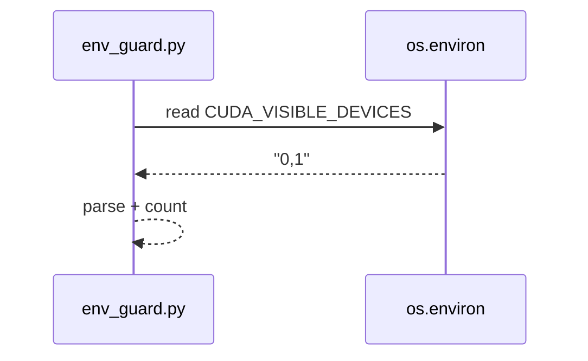
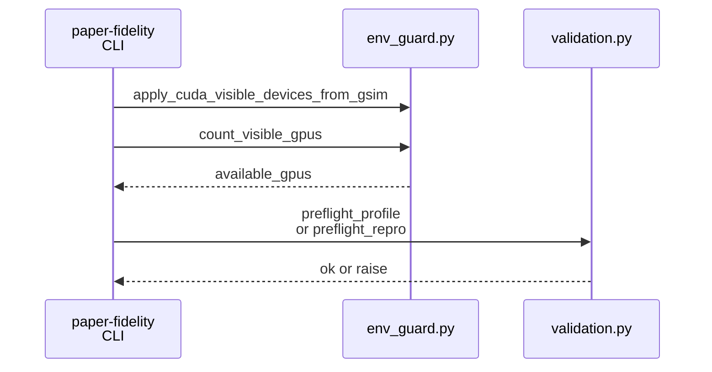
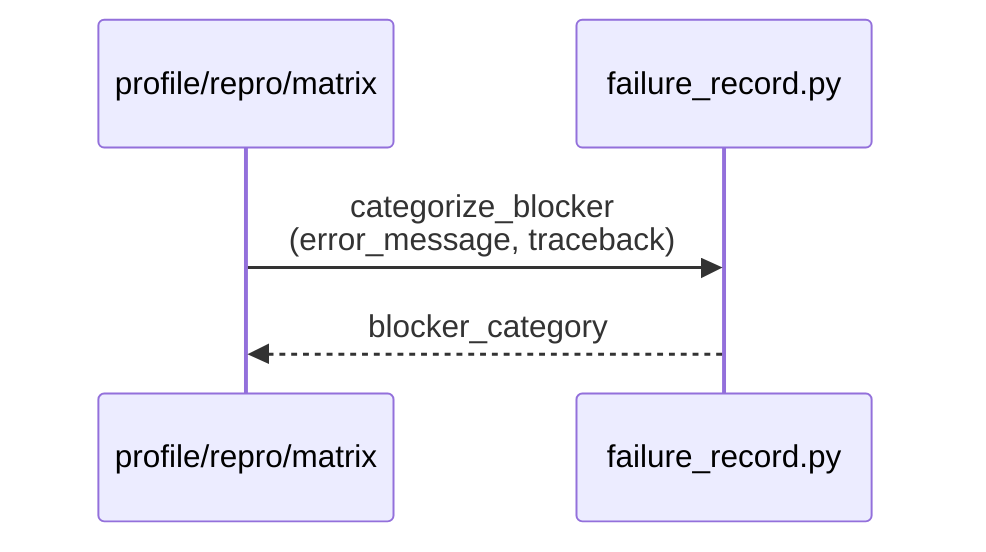

# Implementation Guide: Foundational (validation + blocker categorization)

**Phase**: 2 | **Feature**: Paper-fidelity more models | **Tasks**: T004–T006

## Goal

Add shared “guard rails” so expensive GPU work fails fast and failures are consistently classified:

- determine available GPUs after pinning (`CUDA_VISIBLE_DEVICES`)
- validate scenario inputs before running trace/profile/repro/matrix
- map errors to stable blocker categories for triage (`insufficient GPUs`, `OOM`, …)

**Path convention**: All repo paths are relative to `<WORKSPACE_ROOT>` (repository root).

## Public APIs

### T004: Visible GPU counting (`env_guard.count_visible_gpus`)

Implement a small helper that uses the post-pin environment (`CUDA_VISIBLE_DEVICES`) so that
the matrix runner can check whether `tp * pp` fits.

```python
# src/gpu_simulate_test/env_guard.py

from __future__ import annotations

import os


def count_visible_gpus() -> int:
    """Return the number of GPUs visible to this process.

    Uses CUDA_VISIBLE_DEVICES semantics:
    - unset => 0 (treat as unknown/unsafe for this repo)
    - "" => 0
    - "0,1,3" => 3
    """
    value = (os.environ.get("CUDA_VISIBLE_DEVICES") or "").strip()
    if not value:
        return 0
    return len([part for part in value.split(",") if part.strip()])
```

**Usage Flow**:



---

### T005: Scenario preflight validation (`paper_fidelity/validation.py`)

Provide a single place to validate inputs and compute required GPUs.

Design goals:

- callable from `paper-fidelity trace`, `paper-fidelity profile`, `paper-fidelity repro`, and `paper-fidelity matrix`
- produce structured errors (so failure categorization is stable)
- keep it CPU-only (no importing torch/sarathi)

```python
# src/gpu_simulate_test/paper_fidelity/validation.py

from __future__ import annotations

from dataclasses import dataclass
from pathlib import Path
from typing import Literal

from omegaconf import DictConfig
from omegaconf import OmegaConf


class ScenarioPreflightError(RuntimeError):
    """Base class for all preflight failures."""


class MissingModelFilesError(ScenarioPreflightError):
    pass


class MissingTraceSourceError(ScenarioPreflightError):
    pass


class InsufficientGpusError(ScenarioPreflightError):
    def __init__(self, *, required: int, available: int) -> None:
        super().__init__(f"Insufficient GPUs: required={required} available={available}")
        self.required = int(required)
        self.available = int(available)


@dataclass(frozen=True)
class ScenarioRequirements:
    scenario_key: str
    scenario_name: str
    model_ref: Path
    trace_source: Path
    required_gpus: int


def required_gpus_from_cfg(cfg: DictConfig) -> int:
    tp = int(OmegaConf.select(cfg, "scenario.real.parallel.tensor_parallel_size") or 1)
    pp = int(OmegaConf.select(cfg, "scenario.real.parallel.pipeline_parallel_size") or 1)
    return max(1, tp * pp)


def preflight_common(cfg: DictConfig, *, repo_root: Path) -> ScenarioRequirements:
    scenario_key = str(OmegaConf.select(cfg, "scenario") or OmegaConf.select(cfg, "scenario.name") or "unknown")
    scenario_name = str(OmegaConf.select(cfg, "scenario.name") or scenario_key)

    model_ref = Path(str(OmegaConf.select(cfg, "scenario.model.model_ref"))).expanduser()
    if not model_ref.is_absolute():
        model_ref = (repo_root / model_ref).resolve()

    trace_source = Path(str(OmegaConf.select(cfg, "scenario.trace_source.path"))).expanduser()
    if not trace_source.is_absolute():
        trace_source = (repo_root / trace_source).resolve()

    return ScenarioRequirements(
        scenario_key=scenario_key,
        scenario_name=scenario_name,
        model_ref=model_ref,
        trace_source=trace_source,
        required_gpus=required_gpus_from_cfg(cfg),
    )


def preflight_trace(cfg: DictConfig, *, repo_root: Path) -> None:
    req = preflight_common(cfg, repo_root=repo_root)
    if not req.trace_source.exists():
        raise MissingTraceSourceError(f"Missing trace source: {req.trace_source}")


def preflight_profile(cfg: DictConfig, *, repo_root: Path, available_gpus: int) -> None:
    req = preflight_common(cfg, repo_root=repo_root)
    if not req.model_ref.exists():
        raise MissingModelFilesError(f"Missing model assets: {req.model_ref}")
    if available_gpus and available_gpus < req.required_gpus:
        raise InsufficientGpusError(required=req.required_gpus, available=available_gpus)


def preflight_repro(cfg: DictConfig, *, repo_root: Path, available_gpus: int) -> None:
    req = preflight_common(cfg, repo_root=repo_root)
    if not req.model_ref.exists():
        raise MissingModelFilesError(f"Missing model assets: {req.model_ref}")
    if not req.trace_source.exists():
        raise MissingTraceSourceError(f"Missing trace source: {req.trace_source}")
    if available_gpus and available_gpus < req.required_gpus:
        raise InsufficientGpusError(required=req.required_gpus, available=available_gpus)
```

**Usage Flow**:



---

### T006: Blocker categorization (`failure_record.categorize_blocker`)

Centralize mapping from exceptions/log text → stable blocker category.

```python
# src/gpu_simulate_test/paper_fidelity/failure_record.py

from __future__ import annotations

import re


def categorize_blocker(*, error_message: str, traceback: str | None = None) -> BlockerCategory:
    text = "\n".join([error_message, traceback or ""]).lower()
    if "insufficient gpus" in text or "required=" in text and "available=" in text:
        return "insufficient GPUs"
    if "cuda out of memory" in text or re.search(r"\\boom\\b", text):
        return "OOM"
    if "no such file or directory" in text or "missing model assets" in text:
        return "missing model files"
    if "unsupported" in text and "model" in text:
        return "unsupported model"
    return "unknown"
```

**Usage Flow**:



## Phase Integration


## Testing

### Test Input

- A repo-local `.env` that defines `GSIM_CUDA_VISIBLE_DEVICES` (required for GPU work).
- For CPU-only tests, you can set env vars inline in the shell.

### Test Procedure

```bash
# CPU-only: env guard tests
pixi run pytest tests/unit/test_env_guard.py

# CPU-only: smoke validate categorization
pixi run python - <<'PY'
from gpu_simulate_test.paper_fidelity.failure_record import categorize_blocker
print(categorize_blocker(error_message="CUDA out of memory", traceback=None))
print(categorize_blocker(error_message="Missing model assets", traceback=None))
print(categorize_blocker(error_message="Insufficient GPUs: required=4 available=1", traceback=None))
PY
```

### Test Output

- `tests/unit/test_env_guard.py` passes.
- Categorization prints `OOM`, `missing model files`, `insufficient GPUs` (order depends on the snippet).

## References

- Spec: `specs/003-paper-fidelity-more-models/spec.md`
- Plan: `specs/003-paper-fidelity-more-models/plan.md`
- Tasks breakdown (authoritative checklist): `specs/003-paper-fidelity-more-models/tasks.md`
- Data model: `specs/003-paper-fidelity-more-models/data-model.md`
- Contracts: `specs/003-paper-fidelity-more-models/contracts/`

## Implementation Summary

TODO (fill after implementation)

