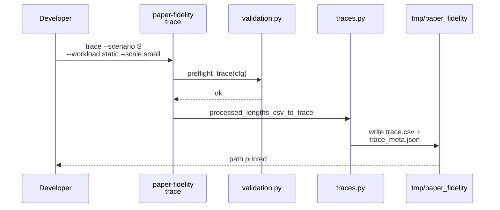
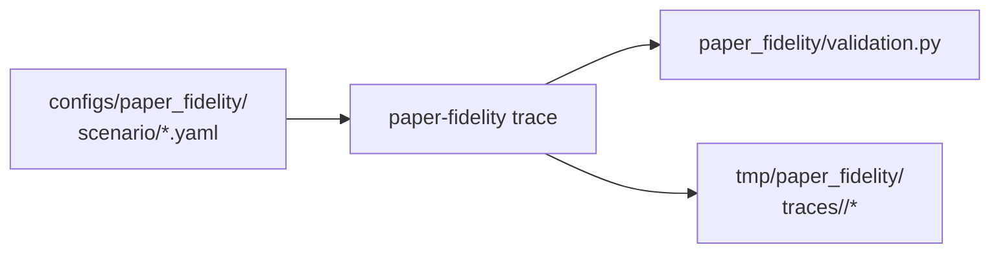

# Implementation Guide: US1 scenarios + trace preflight

**Phase**: 3 | **Feature**: Paper-fidelity more models | **Tasks**: T007–T010

## Goal

Add three paper-model scenarios (excluding Qwen3-0.6B) and ensure `paper-fidelity trace` produces
valid canonical traces for both static and dynamic workloads.

**Path convention**: All repo paths are relative to `<WORKSPACE_ROOT>` (repository root).

## Public APIs

### T007–T009: New scenario configs (`configs/paper_fidelity/scenario/*.yaml`)

Each scenario is selected by config name:

```bash
pixi run paper-fidelity trace --scenario <scenario_key> --workload static|dynamic --scale small
```

Create three new files, using `configs/paper_fidelity/scenario/llama2_7b_arxiv.yaml` as the template:

- `configs/paper_fidelity/scenario/internlm_20b_arxiv.yaml`
- `configs/paper_fidelity/scenario/llama2_70b_arxiv.yaml`
- `configs/paper_fidelity/scenario/qwen_72b_arxiv.yaml`

**Minimum required fields** (match the data model):

```yaml
# configs/paper_fidelity/scenario/internlm_20b_arxiv.yaml

name: internlm_20b_arxiv

model:
  model_id: internlm/internlm-20b
  model_ref: ${paths.repo_root}/models/internlm-20b/source-data

trace_source:
  kind: vidur_processed_lengths_csv
  path: ${paths.repo_root}/extern/tracked/vidur/data/processed_traces/arxiv_summarization_stats_llama2_tokenizer_filtered_v2.csv
  max_tokens: 4096
  seed: 42
  num_requests: null

vidur:
  profiling_root: ${paths.repo_root}/extern/tracked/vidur
  device: a100
  network_device: a100_pairwise_nvlink
  tensor_parallel_size: 1
  num_pipeline_stages: 1
  seed: 42
  skip_cpu_overhead_modeling: true
  cpu_overhead:
    validation: strict
  scheduler:
    type: sarathi
    chunk_size: ${scenario.real.scheduler.chunk_size}
    batch_size_cap: ${scenario.real.scheduler.max_num_seqs}
    block_size: 16
    watermark_blocks_fraction: 0.01

real:
  backend: sarathi
  sampling:
    ignore_eos: true
  scheduler:
    chunk_size: 16
    max_num_seqs: 16
  parallel:
    tensor_parallel_size: 1
    pipeline_parallel_size: 1
  metrics:
    write_metrics: true
    enable_chrome_trace: false

capacity_search:
  enabled: true
  min_qps: 1.0
  max_qps: 20.0
  max_iters: 6
  overload_p99_scheduling_delay_s: 5.0
  qps_operating_point_fraction: 0.85

scoring:
  percentiles: [0.5, 0.95]
  thresholds:
    pass_pct: 0.05
    warn_pct: 0.09
```

Notes:

- Keep defaults at `tp=1`, `pp=1` (per clarifications), but allow overrides via CLI (Hydra).
- Qwen3-0.6B is excluded by not adding a scenario for it and by rejecting it in the matrix runner (US5).

---

### T010: Trace preflight validation (`cli/paper_fidelity.py`)

Ensure `paper-fidelity trace` fails fast with a friendly error when:

- `extern/tracked/vidur` submodule isn’t initialized (trace source CSV missing)
- scenario is misconfigured (bad path)

Implementation approach:

1. Compose Hydra config (already done by CLI wrapper).
2. Call `paper_fidelity.validation.preflight_trace(cfg, repo_root=...)`.
3. If validation fails, raise a clean `ValueError`/`RuntimeError` with a “how to fix” hint.

```python
# src/gpu_simulate_test/cli/paper_fidelity.py

from gpu_simulate_test.paper_fidelity.validation import preflight_trace


def _run_trace(cfg, *, repo_root):
    preflight_trace(cfg, repo_root=repo_root)
    # ... existing trace generation
```

**Usage Flow**:



## Phase Integration



## Testing

### Test Input

- Submodules present (`extern/tracked/vidur` contains the processed lengths CSV).

### Test Procedure

```bash
git submodule update --init --recursive
pixi install

# Trace-only validation (CPU-only)
pixi run paper-fidelity trace --scenario internlm_20b_arxiv --workload static --scale small
pixi run paper-fidelity trace --scenario internlm_20b_arxiv --workload dynamic --scale small

pixi run paper-fidelity trace --scenario llama2_70b_arxiv --workload static --scale small
pixi run paper-fidelity trace --scenario llama2_70b_arxiv --workload dynamic --scale small

pixi run paper-fidelity trace --scenario qwen_72b_arxiv --workload static --scale small
pixi run paper-fidelity trace --scenario qwen_72b_arxiv --workload dynamic --scale small
```

### Test Output

- Traces created under `tmp/paper_fidelity/traces/<scenario.name>/`:
  - `trace.csv`
  - `trace_meta.json`

## References

- Spec: `specs/003-paper-fidelity-more-models/spec.md`
- Plan: `specs/003-paper-fidelity-more-models/plan.md`
- Tasks breakdown (authoritative checklist): `specs/003-paper-fidelity-more-models/tasks.md`
- Data model: `specs/003-paper-fidelity-more-models/data-model.md`
- Quickstart: `specs/003-paper-fidelity-more-models/quickstart.md`

## Implementation Summary

TODO (fill after implementation)

