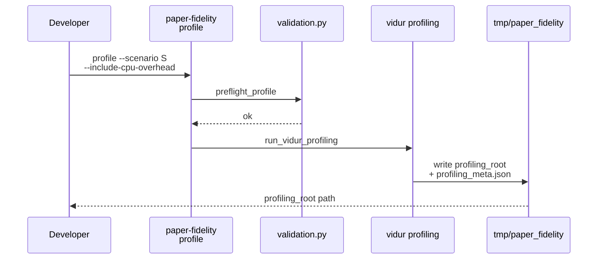
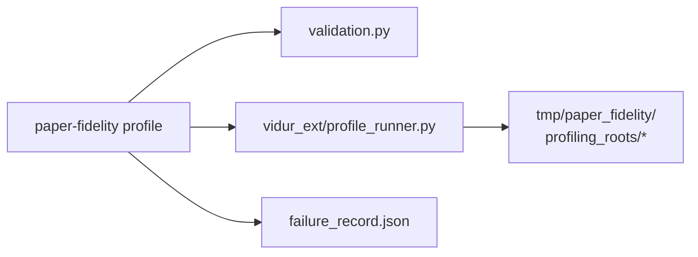

# Implementation Guide: US2 host profiling (with failure records)

**Phase**: 4 | **Feature**: Paper-fidelity more models | **Tasks**: T011–T013

## Goal

For each new scenario, generate a host-matched profiling root and ensure failures are recorded:

- `paper-fidelity profile --include-cpu-overhead` produces a Vidur-compatible profiling root
- if profiling cannot run (missing model assets / insufficient GPUs / OOM), write a structured failure record

**Path convention**: All repo paths are relative to `<WORKSPACE_ROOT>` (repository root).

## Public APIs

### T011: Profiling preflight (`paper_fidelity/profiling.py`)

Add preflight checks before invoking Vidur profiling:

- model assets exist: `scenario.model.model_ref`
- GPU pinning is present (already enforced by `apply_cuda_visible_devices_from_gsim`)
- available GPUs satisfy required parallelism (based on scenario TP/PP or profiling config)

```python
# src/gpu_simulate_test/paper_fidelity/profiling.py

from gpu_simulate_test.env_guard import count_visible_gpus
from gpu_simulate_test.paper_fidelity.validation import preflight_profile


def run_paper_fidelity_profiling(cfg, *, repo_root):
    available = count_visible_gpus()
    preflight_profile(cfg, repo_root=repo_root, available_gpus=available)
    # ... existing profiling implementation
```

**Usage Flow**:



---

### T012: Write `failure_record.json` on profiling failures (`paper_fidelity/profiling.py`)

On exceptions, write a failure record adjacent to the attempted profiling root:

`tmp/paper_fidelity/profiling_roots/<scenario>/<run_id>/failure_record.json`

```python
# src/gpu_simulate_test/paper_fidelity/profiling.py

import traceback as tb

from gpu_simulate_test.paper_fidelity.failure_record import (
    build_failure_record,
    categorize_blocker,
    write_failure_record,
)


try:
    vidur_result = run_vidur_profiling(...)
except Exception as e:
    stack = tb.format_exc()
    category = categorize_blocker(error_message=str(e), traceback=stack)
    record = build_failure_record(
        run_id=run_id,
        action="profile",
        scenario_key=str(cfg.scenario.name),
        scenario_name=str(cfg.scenario.name),
        workload=None,
        scale=None,
        attempted_command=None,
        hydra_overrides=[],
        error_message=f"{type(e).__name__}: {e}",
        traceback=stack,
        blocker_category=category,
    )
    write_failure_record(profiling_root / "failure_record.json", record)
    raise
```

---

### T013: Print failure record path on CLI failure (`cli/paper_fidelity.py`)

Ensure `paper-fidelity profile` prints the failure record path even when exiting non-zero.

Implementation approach:

- wrap `_run_profile(...)` call in `try/except`
- if `run_paper_fidelity_profiling` created a profiling root, print the failure record path as the last line

```python
# src/gpu_simulate_test/cli/paper_fidelity.py

def main(...):
    # ...
    elif args.cmd == "profile":
        # ...
        _profile_main()


@hydra.main(...)
def _profile_main(cfg):
    try:
        out_dir = _run_profile(cfg, repo_root=Path(cfg.paths.repo_root))
    except Exception:
        # Print a best-effort failure record path (defined by profiling.py conventions).
        # The exception should still propagate so the command fails.
        # print(str(failure_record_path))
        raise
    else:
        print(str(out_dir))
```

## Phase Integration



## Testing

### Test Input

- `.env` sets `GSIM_CUDA_VISIBLE_DEVICES` (GPU pinning).
- Model symlinks exist:
  - `models/internlm-20b/source-data`
  - `models/llama2-70b-hf/source-data`
  - `models/qwen-72b/source-data`

### Test Procedure

```bash
# Ensure model references exist (may require GSIM_MODELS_ROOT to point to your model storage)
bash models/internlm-20b/bootstrap.sh
bash models/llama2-70b-hf/bootstrap.sh
bash models/qwen-72b/bootstrap.sh

# Profile (GPU required; include CPU overhead microbenchmarks per spec)
pixi run paper-fidelity profile --scenario internlm_20b_arxiv --include-cpu-overhead
pixi run paper-fidelity profile --scenario llama2_70b_arxiv --include-cpu-overhead
pixi run paper-fidelity profile --scenario qwen_72b_arxiv --include-cpu-overhead
```

### Test Output

- Successful profiling prints a profiling root directory:
  - `tmp/paper_fidelity/profiling_roots/<scenario>/<timestamp>/`
- On failure, a `failure_record.json` exists under the attempted profiling root and the CLI prints its path.

## References

- Spec: `specs/003-paper-fidelity-more-models/spec.md`
- Data model: `specs/003-paper-fidelity-more-models/data-model.md`
- Quickstart: `specs/003-paper-fidelity-more-models/quickstart.md`

## Implementation Summary

TODO (fill after implementation)

