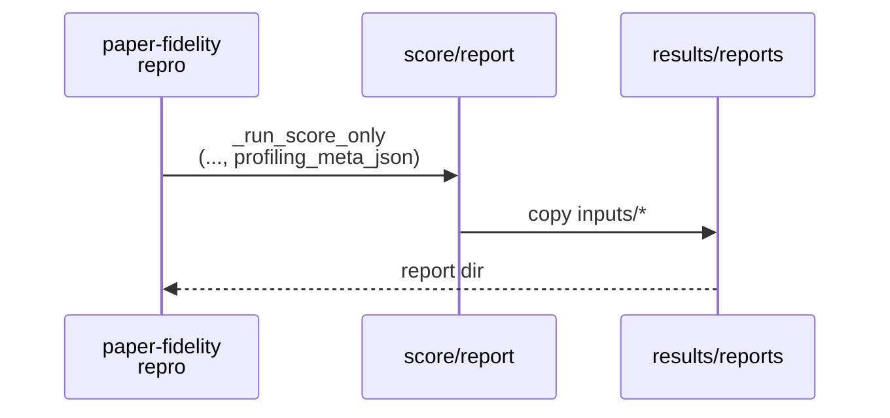
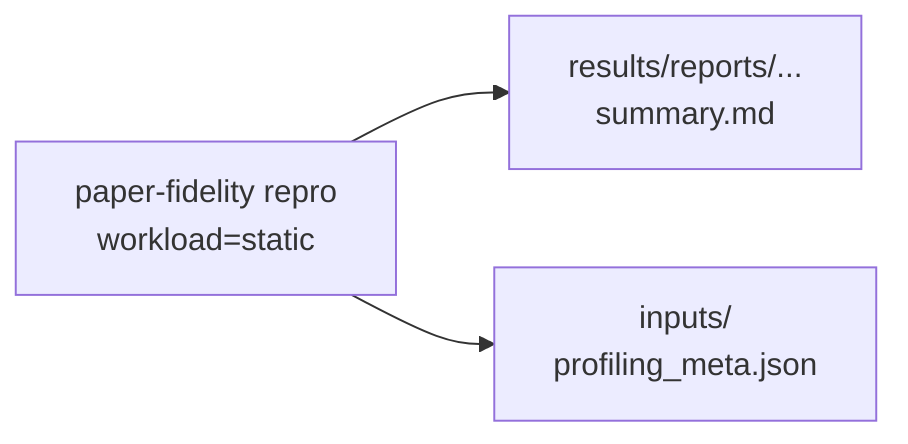

# Implementation Guide: US3 static report portability (profiling meta snapshot)

**Phase**: 5 | **Feature**: Paper-fidelity more models | **Tasks**: T014–T015

## Goal

Make static reports more self-contained for triage:

- snapshot profiling metadata into the report `inputs/` directory (when present)
- update docs to show static repro runs for the new paper-model scenarios

**Path convention**: All repo paths are relative to `<WORKSPACE_ROOT>` (repository root).

## Public APIs

### T014: Snapshot `profiling_meta.json` into report inputs (`cli/paper_fidelity.py`)

When scoring writes a report bundle:

`results/reports/<UTC-YYYY-MM-DD>/paper_fidelity/<scenario>/inputs/`

copy the profiling meta (if present) so the report can be debugged without chasing `tmp/` state:

```text
results/reports/<DATE>/paper_fidelity/<scenario>/inputs/profiling_meta.json
```

Implementation approach:

- `_run_repro` already resolves `profiling_root_resolved`
- `_run_score_only` already copies inputs (`sim_request_metrics.csv`, `real_request_metrics.csv`, `trace.csv`, …)
- extend `_run_score_only` to accept `profiling_meta_json: Path | None` and copy it into `inputs/`

```python
# src/gpu_simulate_test/cli/paper_fidelity.py

def _run_score_only(..., profiling_meta_json: Path | None = None) -> Path:
    inputs_dir = report_dir / "inputs"
    inputs_dir.mkdir(parents=True, exist_ok=True)

    if profiling_meta_json is not None and profiling_meta_json.exists():
        shutil.copy2(profiling_meta_json, inputs_dir / "profiling_meta.json")
```

**Usage Flow**:



---

### T015: Update static repro docs for all paper models

Update:

- `docs/tutorial/howto/tut-paper-fidelity-static-and-dynamic.md`

Add example commands for:

- `internlm_20b_arxiv`
- `llama2_70b_arxiv`
- `qwen_72b_arxiv`

and clarify that static reports are written under `results/reports/<DATE>/paper_fidelity/<scenario_name>/`.

## Phase Integration



## Testing

### Test Input

- A profiling root produced by `paper-fidelity profile` for the same scenario.

### Test Procedure

```bash
profiling_root="$(pixi run paper-fidelity profile --scenario llama2_70b_arxiv --include-cpu-overhead | tail -n 1)"

pixi run paper-fidelity repro --scenario llama2_70b_arxiv --workload static --scale small \
  "scenario.vidur.profiling_root=${profiling_root}"
```

### Test Output

- The printed report directory contains:
  - `summary.md`
  - `scores.json`
  - `run_meta.json`
  - `inputs/profiling_meta.json` (new)

## References

- Spec: `specs/003-paper-fidelity-more-models/spec.md`
- Quickstart: `specs/003-paper-fidelity-more-models/quickstart.md`

## Implementation Summary

TODO (fill after implementation)

