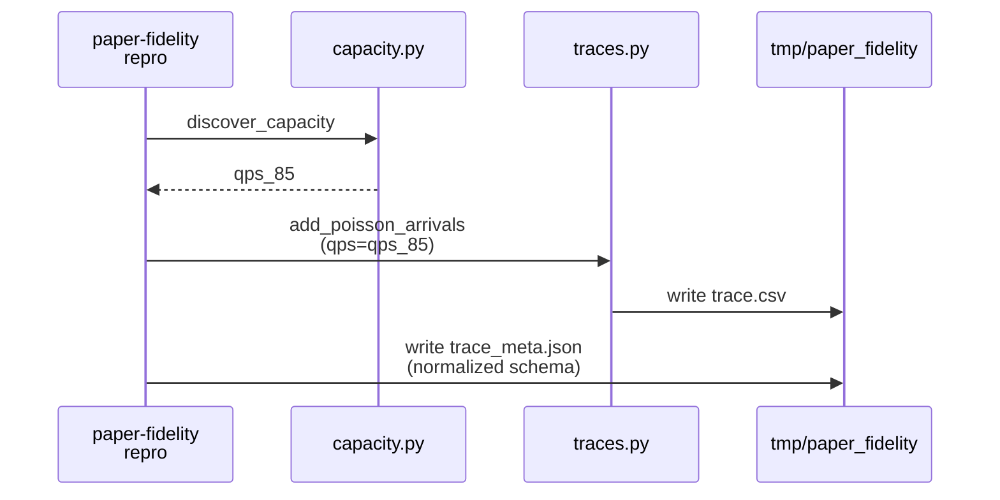
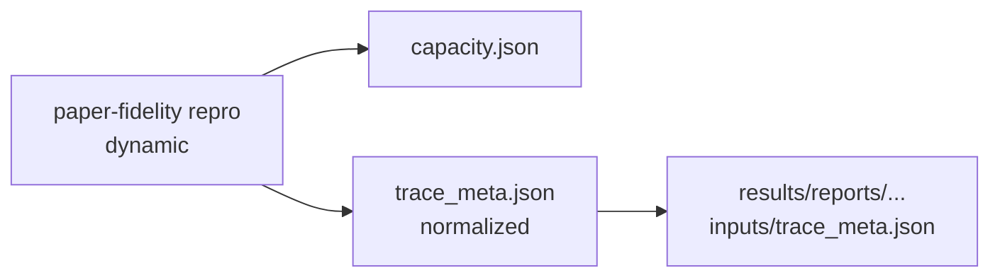

# Implementation Guide: US4 dynamic report trace metadata consistency

**Phase**: 6 | **Feature**: Paper-fidelity more models | **Tasks**: T016–T017

## Goal

Ensure dynamic repro reports include consistent trace metadata and docs cover the new scenarios:

- dynamic `trace_meta.json` matches the schema used by `paper-fidelity trace` (includes `trace_source` + artifact pointers)
- docs show how to run dynamic (`--scale small`) for all paper models

**Path convention**: All repo paths are relative to `<WORKSPACE_ROOT>` (repository root).

## Public APIs

### T016: Normalize dynamic `trace_meta.json` schema (`cli/paper_fidelity.py`)

Today, dynamic repro writes a minimal `trace_meta.json` (missing `trace_source` and artifact pointers).
Align it with the trace command’s meta so triage tools can treat both consistently.

Target shape (subset of `paper-fidelity trace` meta schema):

```json
{
  "schema_version": "v1",
  "scenario_name": "...",
  "workload_mode": "dynamic",
  "scale": "small",
  "qps": 0.85,
  "seed": 42,
  "trace_source": { "kind": "...", "path": "...", "max_tokens": 4096, "seed": 42, "num_requests": null },
  "trace_subset": { "kind": "range", "begin": 0, "end": 50, "indices": null },
  "generated_at": "...",
  "artifacts": { "trace_csv": "/abs/path/to/trace.csv" }
}
```

Implementation approach:

- In the dynamic block of `_run_repro`, re-use the same fields written by `_run_trace`.
- Include `artifacts.trace_csv` with an absolute path.

```python
# src/gpu_simulate_test/cli/paper_fidelity.py

trace_meta = {
    "schema_version": "v1",
    "scenario_name": scenario_name,
    "workload_mode": workload_mode,
    "scale": OmegaConf.select(cfg, "scale"),
    "qps": float(capacity.qps_85),
    "seed": int(cfg.workload.seed),
    "trace_source": {
        "kind": str(cfg.scenario.trace_source.kind),
        "path": str(Path(cfg.scenario.trace_source.path).expanduser().resolve()),
        "max_tokens": int(cfg.scenario.trace_source.max_tokens),
        "seed": int(cfg.scenario.trace_source.seed),
        "num_requests": None if cfg.scenario.trace_source.num_requests in (None, "null") else int(cfg.scenario.trace_source.num_requests),
    },
    "trace_subset": {...},
    "generated_at": utcnow_iso(),
    "artifacts": {"trace_csv": str(trace_csv.resolve())},
}
write_json(trace_dir / "trace_meta.json", trace_meta)
```

**Usage Flow**:



---

### T017: Update dynamic repro docs for all paper models

Update:

- `docs/tutorial/howto/tut-paper-fidelity-static-and-dynamic.md`

Add example commands for dynamic + small scale:

```bash
pixi run paper-fidelity repro --scenario internlm_20b_arxiv --workload dynamic --scale small ...
pixi run paper-fidelity repro --scenario llama2_70b_arxiv --workload dynamic --scale small ...
pixi run paper-fidelity repro --scenario qwen_72b_arxiv --workload dynamic --scale small ...
```

## Phase Integration



## Testing

### Test Input

- A profiling root produced by `paper-fidelity profile` for the same scenario.

### Test Procedure

```bash
profiling_root="$(pixi run paper-fidelity profile --scenario internlm_20b_arxiv --include-cpu-overhead | tail -n 1)"

report_dir="$(pixi run paper-fidelity repro --scenario internlm_20b_arxiv --workload dynamic --scale small \
  \"scenario.vidur.profiling_root=${profiling_root}\" | tail -n 1)"

cat "${report_dir}/inputs/trace_meta.json"
```

### Test Output

- `${report_dir}/inputs/trace_meta.json` includes:
  - `trace_source.*`
  - `trace_subset.*`
  - `artifacts.trace_csv`

## References

- Spec: `specs/003-paper-fidelity-more-models/spec.md`
- Data model: `specs/003-paper-fidelity-more-models/data-model.md`

## Implementation Summary

- **Implemented (T016)**: Dynamic `tmp/paper_fidelity/traces/<scenario>/trace_meta.json` now matches the `paper-fidelity trace` meta schema subset (includes `trace_source` + `artifacts.trace_csv` absolute path) in `src/gpu_simulate_test/cli/paper_fidelity.py`.
- **Docs**: dynamic repro tutorial updated for paper models in Phase 9 (see `docs/tutorial/howto/tut-paper-fidelity-static-and-dynamic.md`).
