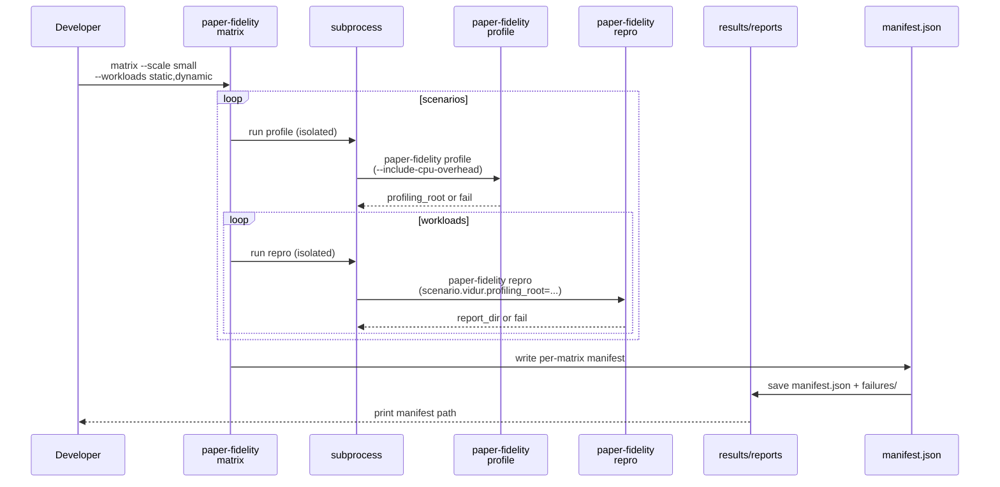
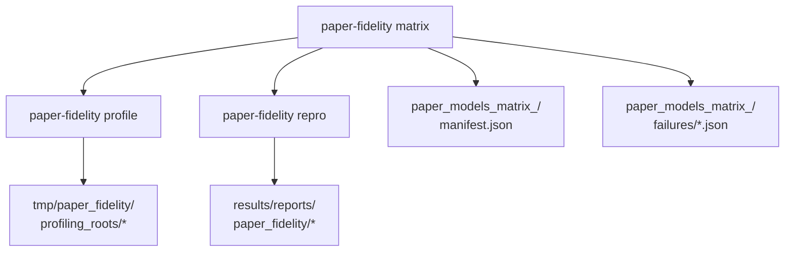

# Implementation Guide: US5 matrix runner (one command, one manifest)

**Phase**: 7 | **Feature**: Paper-fidelity more models | **Tasks**: T018–T022

## Goal

Provide a repeatable, single-command matrix procedure that:

- runs host profiling per scenario (with CPU overhead microbenchmarks)
- runs static + dynamic repro at `--scale small` (50 requests)
- writes one manifest summarizing all attempted runs (successes + failures)
- makes outputs discoverable under a dedicated matrix report directory

**Path convention**: All repo paths are relative to `<WORKSPACE_ROOT>` (repository root).

## Public APIs

### T018: Paper-model scenario constants + exclusion (`paper_fidelity/paper_models.py`)

Centralize the “paper models” set and enforce Qwen3-0.6B exclusion.

```python
# src/gpu_simulate_test/paper_fidelity/paper_models.py

from __future__ import annotations

PAPER_MODEL_SCENARIOS: list[str] = [
    "internlm_20b_arxiv",
    "llama2_70b_arxiv",
    "qwen_72b_arxiv",
]

EXCLUDED_SCENARIOS: set[str] = {
    "qwen3_0.6b_arxiv",
    "qwen3_0_6b_arxiv",
    "qwen3_0.6b",
}


def validate_paper_model_scenarios(scenarios: list[str]) -> None:
    bad = sorted(set(scenarios) & EXCLUDED_SCENARIOS)
    if bad:
        raise ValueError(f"Excluded from paper-model matrix: {bad}")
```

---

### T019: Matrix runner orchestration (`paper_fidelity/matrix.py`)

Implement a library entrypoint that:

1. creates a matrix run directory under `results/reports/<DATE>/paper_fidelity/paper_models_matrix_<run_id>/`
2. profiles each scenario once
3. runs repro for each workload using the profiling root
4. records per-run results and failures for `manifest.json`

Prefer process isolation for Hydra by invoking subcommands in subprocesses.

```python
# src/gpu_simulate_test/paper_fidelity/matrix.py

from __future__ import annotations

from dataclasses import dataclass
from pathlib import Path
from typing import Literal


Workload = Literal["static", "dynamic"]
Scale = Literal["small", "medium", "full"]


@dataclass(frozen=True)
class MatrixArgs:
    run_id: str
    scenarios: list[str]
    workloads: list[Workload]
    scale: Scale
    include_cpu_overhead: bool
    stop_on_failure: bool


def run_matrix(*, repo_root: Path, args: MatrixArgs) -> Path:
    """Run the profile+repro matrix and return the manifest.json path."""
    ...
```

**Pseudocode**:

```python
def run_matrix(repo_root, args):
    pf_paths = PaperFidelityPaths(repo_root=repo_root)
    date = utc_date_str()
    manifest_path = pf_paths.matrix_manifest_path(date=date, run_id=args.run_id)
    failures_dir = pf_paths.matrix_failures_dir(date=date, run_id=args.run_id)

    runs = []

    for scenario_key in args.scenarios:
        profiling_root = run_profile_subprocess(scenario_key)
        if profiling_root failed:
            record failure (action=profile) into failures_dir
            add run entries for static/dynamic as skipped-failure or per-action failure
            continue (unless stop_on_failure)

        for workload in args.workloads:
            report_dir = run_repro_subprocess(scenario_key, workload, args.scale, profiling_root, run_tag=args.run_id)
            if failed:
                write failure record (action=repro) into failures_dir
            else:
                add success entry with report_dir

    write_matrix_manifest(manifest_path, runs)
    return manifest_path
```

**Usage Flow**:



---

### T020: `paper-fidelity matrix` subcommand (`cli/paper_fidelity.py`)

Add a new argparse subcommand that does **not** rely on Hydra (it will invoke Hydra subcommands in subprocesses):

```bash
pixi run paper-fidelity matrix \
  --scale small \
  --scenarios internlm_20b_arxiv,llama2_70b_arxiv,qwen_72b_arxiv \
  --workloads static,dynamic \
  --include-cpu-overhead
```

Proposed CLI flags:

- `--scale small|medium|full` (default: `small` for this feature)
- `--scenarios <csv>` (default: paper-model set from `paper_models.py`)
- `--workloads <csv>` (default: `static,dynamic`)
- `--include-cpu-overhead` (default: true for matrix; flag can force on)
- `--run-id <id>` (default: UTC timestamp)
- `--stop-on-failure` (default: false)

---

### T021: Matrix outputs: manifest + failures directory

Write matrix artifacts under:

```text
results/reports/<UTC-YYYY-MM-DD>/paper_fidelity/paper_models_matrix_<run_id>/
├── manifest.json
└── failures/
    ├── <run_id>_<scenario>_profile.json
    ├── <run_id>_<scenario>_repro_static.json
    └── <run_id>_<scenario>_repro_dynamic.json
```

Use:

- `paper_fidelity.paths.PaperFidelityPaths.matrix_*`
- `paper_fidelity.matrix_manifest.write_matrix_manifest`
- `paper_fidelity.failure_record.write_failure_record`

---

### T022: Update the matrix quickstart (`specs/003-paper-fidelity-more-models/quickstart.md`)

Update the recommended interface and output paths to match the implemented CLI flags.

## Phase Integration



## Testing

### Test Input

- `.env` sets `GSIM_CUDA_VISIBLE_DEVICES` with enough GPUs (or expect `insufficient GPUs` failures).
- Model refs exist (`models/*/source-data`).

### Test Procedure

```bash
pixi run paper-fidelity matrix \
  --scale small \
  --scenarios internlm_20b_arxiv,llama2_70b_arxiv,qwen_72b_arxiv \
  --workloads static,dynamic \
  --include-cpu-overhead
```

### Test Output

- A manifest printed on the last line, e.g.:
  - `results/reports/<DATE>/paper_fidelity/paper_models_matrix_<run_id>/manifest.json`
- For each attempted run:
  - success: manifest entry points at `report_dir`
  - failure: manifest entry points at `failure_record_json` with `blocker_category`

## References

- Spec: `specs/003-paper-fidelity-more-models/spec.md`
- Contracts: `specs/003-paper-fidelity-more-models/contracts/openapi.yaml` (`/paper-fidelity/matrix`)
- Quickstart: `specs/003-paper-fidelity-more-models/quickstart.md`

## Implementation Summary

- **Implemented (T018)**: Paper model scenario list + Qwen3-0.6B exclusion in `src/gpu_simulate_test/paper_fidelity/paper_models.py`.
- **Implemented (T019)**: Matrix runner orchestration in `src/gpu_simulate_test/paper_fidelity/matrix.py`:
  - invokes `paper-fidelity profile` and `paper-fidelity repro` in subprocesses for Hydra isolation
  - writes per-action failures under `results/reports/<DATE>/paper_fidelity/paper_models_matrix_<run_id>/failures/*.json`
  - writes `manifest.json` via `src/gpu_simulate_test/paper_fidelity/matrix_manifest.py`
- **Implemented (T020)**: `paper-fidelity matrix` argparse subcommand in `src/gpu_simulate_test/cli/paper_fidelity.py` (prints manifest path).
- **Implemented (T021)**: Matrix output paths via `PaperFidelityPaths.matrix_*` in `src/gpu_simulate_test/paper_fidelity/paths.py`.
- **Docs (T022)**: Quickstart updated to match the implemented CLI in `specs/003-paper-fidelity-more-models/quickstart.md`.
