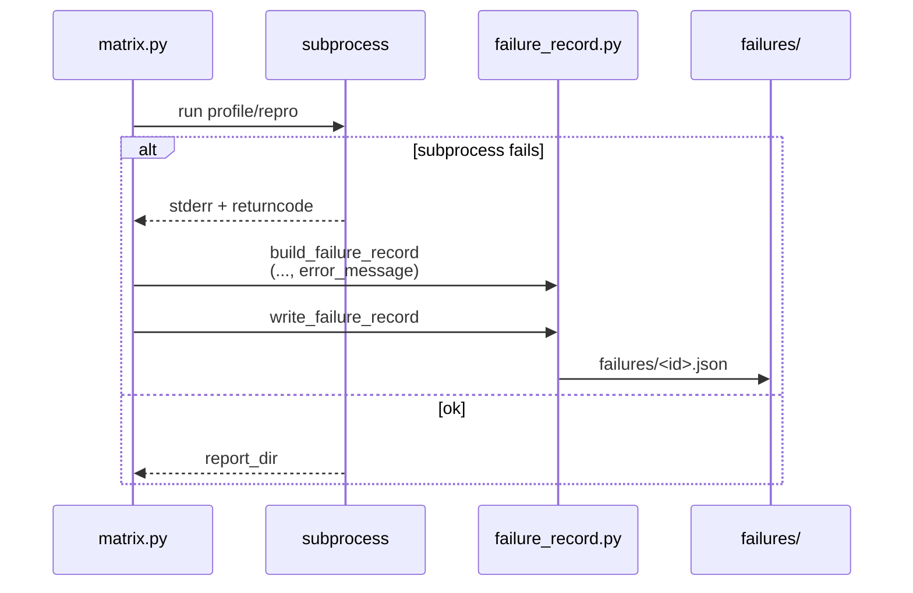
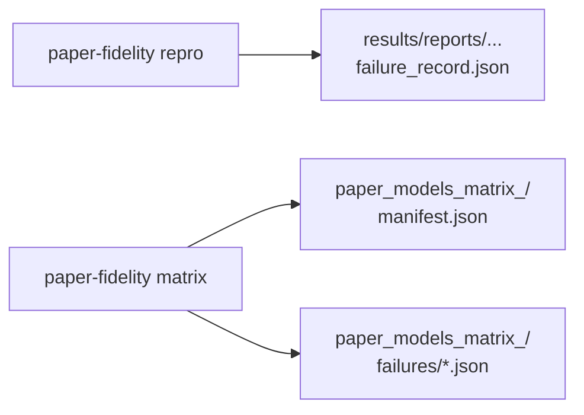

# Implementation Guide: US6 failure records (repro + matrix)

**Phase**: 8 | **Feature**: Paper-fidelity more models | **Tasks**: T023–T025

## Goal

Make failures debuggable without rerunning expensive GPU work:

- any repro failure writes a structured `failure_record.json` (attempted action, error, blocker category)
- the matrix runner writes one failure record per failed action and continues unless `--stop-on-failure`
- quickstart documents the schema and where to find records

**Path convention**: All repo paths are relative to `<WORKSPACE_ROOT>` (repository root).

## Public APIs

### T023: Repro failure record writing (`cli/paper_fidelity.py`)

On exception during `paper-fidelity repro`, write a failure record in the *intended* report directory
so the user can find it in the standard `results/reports/.../paper_fidelity/...` location.

Proposed failure artifact:

```text
results/reports/<DATE>/paper_fidelity/<scenario_name_or_tag>/failure_record.json
```

Implementation approach:

- determine `report_name` early (before running sim/real)
- create the report dir upfront
- wrap the body of `_run_repro` in `try/except`
- on failure:
  - build + write failure record
  - re-raise (so CLI exits non-zero), but still prints the failure record path as last line

```python
# src/gpu_simulate_test/cli/paper_fidelity.py

from gpu_simulate_test.paper_fidelity.failure_record import build_failure_record, categorize_blocker, write_failure_record


def _run_repro(cfg, *, repo_root):
    report_name = ...
    pf_paths = PaperFidelityPaths(repo_root=repo_root)
    report_dir = pf_paths.reports_dir(date=_utc_date_str(), scenario_name=report_name)
    report_dir.mkdir(parents=True, exist_ok=True)

    try:
        # existing repro body (trace -> sim -> real -> score -> report)
        ...
    except Exception as e:
        stack = traceback.format_exc()
        cat = categorize_blocker(error_message=str(e), traceback=stack)
        rec = build_failure_record(
            run_id=stable_id([...], prefix="pf_repro", length=12),
            action="repro",
            scenario_key=str(cfg.scenario.name),
            scenario_name=report_name,
            workload=str(cfg.workload.mode),
            scale=str(OmegaConf.select(cfg, "scale") or "full"),
            attempted_command=None,
            hydra_overrides=[],
            error_message=f"{type(e).__name__}: {e}",
            traceback=stack,
            blocker_category=cat,
        )
        failure_path = write_failure_record(report_dir / "failure_record.json", rec)
        print(str(failure_path))
        raise
```

---

### T024: Matrix runner failure records per action (`paper_fidelity/matrix.py`)

Requirements:

- record failures per action (`profile`, `repro static`, `repro dynamic`)
- continue other scenarios/workloads unless `--stop-on-failure`
- write all failure records under the matrix run dir:
  `results/reports/<DATE>/paper_fidelity/paper_models_matrix_<run_id>/failures/*.json`

**Usage Flow**:



---

### T025: Document the failure schema (`specs/.../quickstart.md`)

Add a short section describing:

- where `manifest.json` and `failure_record.json` live
- `blocker_category` enum values
- what to do for common blockers (`insufficient GPUs` → adjust `GSIM_CUDA_VISIBLE_DEVICES` / TP/PP overrides)

## Phase Integration



## Testing

### Test Input

- A failure you can trigger deterministically (examples):
  - temporarily move `models/<model>/source-data` aside
  - set `scenario.real.parallel.tensor_parallel_size=99` to force `insufficient GPUs`

### Test Procedure

```bash
# Example: force GPU insufficiency without touching model files
profiling_root="$(pixi run paper-fidelity profile --scenario llama2_70b_arxiv --include-cpu-overhead | tail -n 1)"

pixi run paper-fidelity repro --scenario llama2_70b_arxiv --workload static --scale small \
  "scenario.vidur.profiling_root=${profiling_root}" \
  "scenario.real.parallel.tensor_parallel_size=99"
```

### Test Output

- Command exits non-zero.
- Last printed line is a `failure_record.json` path.
- Failure record includes `blocker_category: "insufficient GPUs"`.

## References

- Spec: `specs/003-paper-fidelity-more-models/spec.md`
- Data model: `specs/003-paper-fidelity-more-models/data-model.md`
- Contracts: `specs/003-paper-fidelity-more-models/contracts/openapi.yaml`

## Implementation Summary

TODO (fill after implementation)

